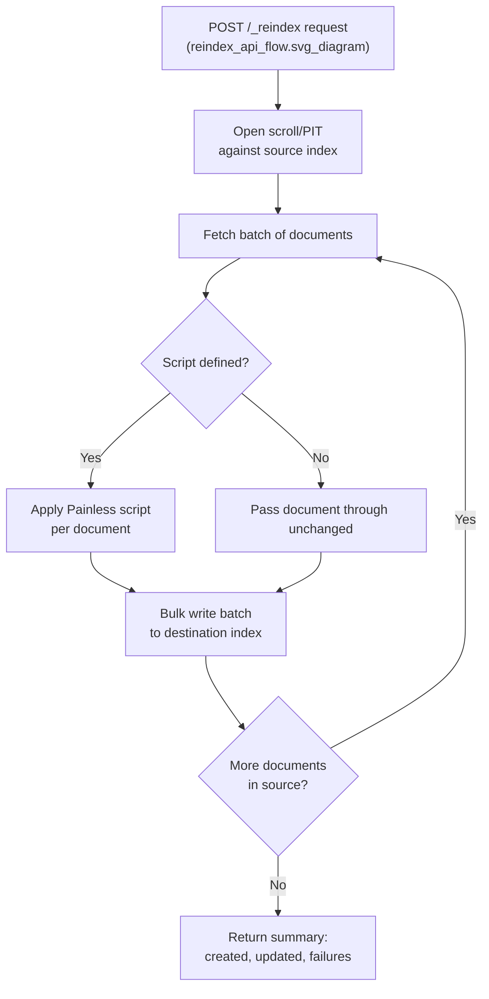

## Reindex API

### Overview

The Reindex API copies documents from a source index (or set of indices) into a destination index, optionally transforming them along the way. It is the primary mechanism for evolving an index's mapping or settings when in-place updates are not supported, for consolidating multiple indices, for restructuring data, and for performing large-scale corrective operations across an existing dataset. Internally, it operates as a scroll-driven bulk copy: Elasticsearch reads batches of documents from the source and writes them to the destination using the Bulk API, without the client needing to manage that scrolling and batching manually.

### Basic Usage

```json
POST /_reindex
{
  "source": {
    "index": "products-v1"
  },
  "dest": {
    "index": "products-v2"
  }
}
```

This copies every document from `products-v1` into `products-v2`, preserving `_id` values by default, so each destination document has the same ID as its corresponding source document.

### Response Structure

```json
{
  "took": 4521,
  "timed_out": false,
  "total": 150000,
  "updated": 0,
  "created": 150000,
  "deleted": 0,
  "batches": 150,
  "version_conflicts": 0,
  "noops": 0,
  "retries": { "bulk": 0, "search": 0 },
  "throttled_millis": 0,
  "requests_per_second": -1,
  "throttled_until_millis": 0,
  "failures": []
}
```

**Key Points**
- `total` — number of documents matched by the source query.
- `created` / `updated` — how many documents were newly created versus updated (overwritten) at the destination.
- `version_conflicts` — count of documents skipped due to version conflicts, relevant when `dest` already contains documents and conflict handling is configured.
- `failures` — an array populated with any individual document failures; an empty array indicates a clean run, though `took` completing does not by itself guarantee zero `version_conflicts` — both fields should be checked.

### Filtering the Source

A `query` block within `source` limits which documents are reindexed, useful for partial migrations, date-range-based splitting, or selectively copying only documents matching certain criteria:

```json
POST /_reindex
{
  "source": {
    "index": "logs-2026",
    "query": {
      "range": {
        "@timestamp": {
          "gte": "2026-06-01",
          "lt": "2026-07-01"
        }
      }
    }
  },
  "dest": {
    "index": "logs-2026.06"
  }
}
```

### Reindexing From Multiple Source Indices

```json
POST /_reindex
{
  "source": {
    "index": ["products-2025", "products-2026"]
  },
  "dest": {
    "index": "products-consolidated"
  }
}
```

Wildcard patterns are also supported in `source.index` (e.g., `"products-*"`), matching all indices fitting the pattern at request time.

### Transforming Documents With a Script

A `script` block allows per-document modification during the copy, executed once per document in Painless:

```json
POST /_reindex
{
  "source": { "index": "products-v1" },
  "dest": { "index": "products-v2" },
  "script": {
    "source": """
      ctx._source.sku = ctx._source.sku.toLowerCase();
      ctx._source.remove('deprecated_field');
      if (ctx._source.price != null) {
        ctx._source.price_cents = (int)(ctx._source.price * 100);
      }
    """,
    "lang": "painless"
  }
}
```

Common transformation patterns:
- Renaming a field (setting the new key, removing the old one)
- Type coercion (string to number, restructuring nested values)
- Dropping deprecated or sensitive fields before they reach the new index
- Conditionally routing documents by setting `ctx._index` inside the script, which overrides the destination index per-document

```json
"script": {
  "source": "ctx._index = ctx._source.region == 'eu' ? 'products-eu' : 'products-global'"
}
```

### Reindex Flow



### Handling Version Conflicts

By default, if a destination document with the same `_id` already exists and its version doesn't align with expectations, the Reindex API stops and reports a conflict. The `conflicts` parameter changes this behavior:

```json
POST /_reindex
{
  "conflicts": "proceed",
  "source": { "index": "products-v1" },
  "dest": { "index": "products-v2" }
}
```

`"conflicts": "proceed"` causes the operation to continue past conflicts, counting them in the `version_conflicts` response field rather than halting the entire reindex.

### Controlling Overwrite Behavior With `op_type`

```json
POST /_reindex
{
  "source": { "index": "products-v1" },
  "dest": {
    "index": "products-v2",
    "op_type": "create"
  }
}
```

`"op_type": "create"` causes the reindex to only create documents that don't already exist at the destination, skipping (and counting as version conflicts) any `_id` that's already present — useful for incremental/resumable reindexing where a prior partial run already wrote some documents.

### Reindexing at Scale: Slicing

For large source indices, `slices` splits the reindex into multiple parallel sub-tasks, each operating on a distinct slice of the source data, reducing overall wall-clock time on multi-shard indices:

```json
POST /_reindex?slices=5&wait_for_completion=false
{
  "source": { "index": "products-v1" },
  "dest": { "index": "products-v2" }
}
```

`"slices": "auto"` lets Elasticsearch choose the slice count automatically based on the source index's shard count, which is generally the simplest starting point rather than hand-tuning a specific number.

### Running Asynchronously

`wait_for_completion=false` returns immediately with a task ID rather than blocking on the full operation, which matters for large reindexes that could otherwise exceed HTTP client or proxy timeout limits:

```json
POST /_reindex?wait_for_completion=false
{
  "source": { "index": "logs-2025" },
  "dest": { "index": "logs-2025-restructured" }
}
```

```json
{
  "task": "oTUltX4IQMOUUVeiohTt8A:12345"
}
```

Progress and completion are checked via the Tasks API:

```json
GET /_tasks/oTUltX4IQMOUUVeiohTt8A:12345
```

Cancelling a running asynchronous reindex task:

```json
POST /_tasks/oTUltX4IQMOUUVeiohTt8A:12345/_cancel
```

### Throttling Reindex Throughput

`requests_per_second` caps the rate of the underlying bulk requests, useful for limiting the resource impact of a large reindex running against a cluster that's simultaneously serving live production traffic:

```json
POST /_reindex?requests_per_second=500
{
  "source": { "index": "products-v1" },
  "dest": { "index": "products-v2" }
}
```

A running task's throttle rate can also be adjusted mid-flight via the Reindex Rethrottle API:

```json
POST /_reindex/oTUltX4IQMOUUVeiohTt8A:12345/_rethrottle?requests_per_second=200
```

### Reindexing From a Remote Cluster

```json
POST /_reindex
{
  "source": {
    "remote": {
      "host": "https://source-cluster.example.com:9200",
      "username": "reindex_user",
      "password": "REDACTED"
    },
    "index": "products-v1",
    "query": {
      "match_all": {}
    }
  },
  "dest": {
    "index": "products-v2"
  }
}
```

[Unverified] Remote reindex generally requires the source host to be present in the destination cluster's `reindex.remote.whitelist` setting, and the source cluster must be running a version within Elasticsearch's supported cross-version compatibility range for remote reindex; exact whitelist configuration keys, TLS requirements, and version compatibility windows should be checked against the specific Elasticsearch versions involved, since these have been refined across releases.

### Combining `source.size` and `max_docs`

`max_docs` limits the total number of documents processed, useful for testing a reindex configuration against a small sample before committing to the full run, or for deliberately bounded incremental migrations:

```json
POST /_reindex
{
  "max_docs": 1000,
  "source": { "index": "products-v1" },
  "dest": { "index": "products-v2" }
}
```

### Reindex From a Remote or Local Source Into a Different Structure

Reindex can also target a different document shape entirely by combining `script` transformations with `ctx._id` manipulation, effectively allowing document splitting, merging keys, or generating new IDs rather than preserving source IDs verbatim:

```json
POST /_reindex
{
  "source": { "index": "orders" },
  "dest": { "index": "orders-normalized" },
  "script": {
    "source": "ctx._id = ctx._source.order_number + '-' + ctx._source.line_item_id"
  }
}
```

### Common Pitfalls

**Key Points**
- Running a synchronous (`wait_for_completion=true`, the default) reindex on a very large index from a script or client with a short HTTP timeout, causing the client to report failure even though the reindex continues server-side — using `wait_for_completion=false` and polling the Tasks API avoids this.
- Forgetting that the destination index's mapping must already exist (or be creatable via dynamic mapping) with the intended field types — Reindex does not automatically apply a "corrected" mapping; the destination index needs the new mapping defined before the reindex runs, or dynamic mapping will simply infer types from the transformed documents, which may not match intent.
- Omitting `conflicts: "proceed"` when re-running a partially completed reindex, causing the operation to halt on the first conflict rather than skipping already-migrated documents.
- Not throttling `requests_per_second` when reindexing a large index on a cluster serving live traffic, causing resource contention and potential latency impact on production search/index operations.
- Assuming reindex updates the source index's alias automatically — the alias swap to point application traffic at the new destination index is a separate, manual step via the Aliases API.

**Related Topics**
- Update By Query API (in-place document updates without changing index)
- Tasks API for monitoring long-running operations
- Aliases API and atomic alias swaps
- Mapping versioning and migration strategies
- Ingest pipelines as an alternative transformation point
- Cross-cluster search and remote cluster configuration