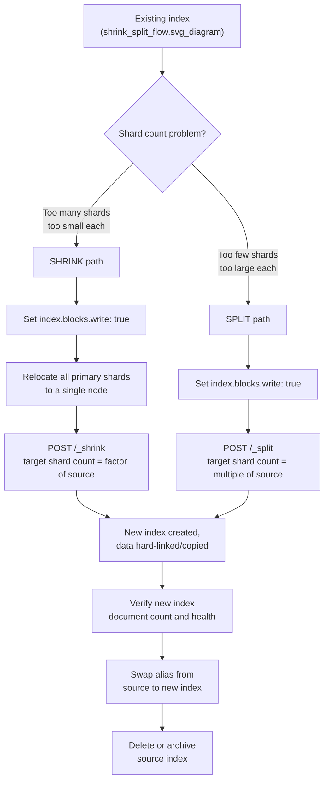

## Shrink and Split Index

### Overview

Shrink and Split are index management operations that change the number of primary shards an index has, without requiring a full external reindex through the Reindex API. **Shrink** reduces the primary shard count (consolidating an over-sharded index into fewer, larger shards), while **Split** increases it (dividing an under-sharded index into more, smaller shards). Both operations work by creating a new index from an existing one and are subject to specific structural prerequisites because shard count in Elasticsearch cannot simply be edited as a setting on a live index.

### Why Shard Count Cannot Be Changed Directly

The number of primary shards (`index.number_of_shards`) is fixed at index creation time. This is a Lucene/Elasticsearch design constraint: documents are routed to a specific shard based on a hash of their `_id` (or a custom routing value) modulo the shard count, so changing the shard count would invalidate the routing of every already-indexed document. Shrink and Split exist specifically to provide supported paths around this constraint, each using different underlying mechanics to redistribute data validly.

### Shrink: Reducing Shard Count

Shrink consolidates an index's primary shards into a smaller number, typically used when an index was created with too many shards for its actual data volume (over-sharding), which wastes cluster overhead per shard (each shard has memory and file-handle cost regardless of size).

**Prerequisites for shrink:**
- The source index must be **read-only** for the operation (`index.blocks.write: true`) at the time of the shrink call.
- All primary shards of the source index must reside on the **same node** at the time of the shrink call — this is a hard mechanical requirement, since shrink physically hard-links existing shard segment files into the new index's shard on that node.
- The target shard count must be a **factor of** the source shard count (e.g., an 8-shard index can shrink to 4, 2, or 1, but not to 3).
- The target index must not already exist.

```json
PUT /products-v1/_settings
{
  "settings": {
    "index.blocks.write": true,
    "index.routing.allocation.require._name": "shrink_node_1"
  }
}
```

The second setting relocates all shards onto a single named node in preparation, since Elasticsearch does not automatically colocate shards for this purpose.

```json
POST /products-v1/_shrink/products-v1-shrunk
{
  "settings": {
    "index.number_of_shards": 2,
    "index.number_of_replicas": 1
  }
}
```

**Key Points**
- Shrink uses hard links where the underlying filesystem supports them, which makes the operation fast and avoids doubling disk usage during the copy — [Inference] this hard-link optimization is documented Elasticsearch behavior contingent on the source and target shard data residing on the same filesystem/node such that hard-linking is possible; if hard-linking isn't possible for some reason, Elasticsearch falls back to copying the segment files instead, which is slower and temporarily uses more disk space, though the exact fallback conditions can vary by version and filesystem.
- After the shrink completes, the write block and allocation-requirement settings applied to the *source* index for staging purposes typically need to be reverted if the source index is going to remain in use, since they were introduced purely to prepare for the shrink.

### Split: Increasing Shard Count

Split divides an index's primary shards into a larger number, typically used when an index was under-sharded relative to its data growth, causing individual shards to become too large for efficient management (oversized shards slow down recovery, relocation, and can hit practical size ceilings for query performance).

**Prerequisites for split:**
- The source index must be **read-only** for the operation.
- The target shard count must be a **multiple of** the source shard count (e.g., a 2-shard index can split into 4, 6, or 8, but not 3).
- `index.number_of_routing_shards` must have been set appropriately on the **source index at creation time** (or default to a value supporting the intended future split factor) — this is the mechanical prerequisite that makes split possible at all, since routing shards determine the hashing space that can later be subdivided.

```json
PUT /products-v1/_settings
{
  "settings": {
    "index.blocks.write": true
  }
}
```

```json
POST /products-v1/_split/products-v1-split
{
  "settings": {
    "index.number_of_shards": 4,
    "index.number_of_replicas": 1
  }
}
```

**Key Points**
- Unlike shrink, split does not require shards to reside on a single node beforehand, since the routing-shards mechanism allows the operation to logically re-hash and redistribute rather than requiring physical colocation.
- If `index.number_of_routing_shards` was not explicitly planned for at index-creation time, splitting later may be limited to specific multiples or may not be possible at all without reindexing instead — this is a common pitfall when an index was created without anticipating future growth.

### Shrink vs Split Comparison

| Aspect | Shrink | Split |
|---|---|---|
| Shard count direction | Decrease | Increase |
| Valid target values | Factor of source shard count | Multiple of source shard count |
| Requires shards on one node | Yes | No |
| Requires pre-planned routing shards | No | Yes (`number_of_routing_shards` at source creation) |
| Typical trigger | Over-sharded index, too much per-shard overhead | Under-sharded index, oversized individual shards |
| Underlying mechanism | Hard-linking existing segments into fewer shards | Re-hashing/redistributing via routing shard space |

### Operation Flow



### Verifying After the Operation

```json
GET /products-v1-shrunk/_count
GET /products-v1/_count
```

Comparing document counts between source and destination is a basic sanity check before cutting application traffic over. Cluster health of the new index should also be confirmed:

```json
GET /_cluster/health/products-v1-shrunk?wait_for_status=green
```

### Cutting Over via Alias

As with reindex-based migrations, the actual application cutover is handled through an atomic alias swap rather than by renaming the index (Elasticsearch does not support renaming an index directly):

```json
POST /_aliases
{
  "actions": [
    { "remove": { "index": "products-v1", "alias": "products" } },
    { "add": { "index": "products-v1-shrunk", "alias": "products" } }
  ]
}
```

### When to Prefer Shrink/Split Over Reindex

**Key Points**
- Shrink is generally faster than a full Reindex API copy for the specific use case of reducing shard count, because of the hard-link optimization avoiding a full document-by-document copy through the Bulk API pipeline.
- Split and Shrink do not support document-level transformation (no `script` equivalent) — they preserve the mapping and document contents as-is; if a mapping or data transformation is also needed at the same time, the Reindex API (or reindexing after the shrink/split) is the appropriate tool instead.
- For time-series/rolling indices under ILM, shrink is commonly automated as an ILM action in the warm phase, consolidating shard count down once an index rolls out of active/hot writing and its write-heavy shard count is no longer needed:

```json
PUT _ilm/policy/logs-lifecycle
{
  "policy": {
    "phases": {
      "warm": {
        "min_age": "7d",
        "actions": {
          "shrink": {
            "number_of_shards": 1
          }
        }
      }
    }
  }
}
```

### Common Pitfalls

**Key Points**
- Attempting to shrink to a shard count that isn't a factor of the source (e.g., 5 shards to 2) — this is rejected outright since the underlying hash redistribution requires an exact factor relationship.
- Forgetting to relocate shards to a single node before calling shrink, causing the operation to fail or wait indefinitely on allocation — the `index.routing.allocation.require._name` (or equivalent allocation filtering) step is not optional for shrink.
- Not setting `index.number_of_routing_shards` appropriately at index-creation time, discovering only later that the desired split factor isn't achievable without a full reindex instead.
- Leaving `index.blocks.write: true` on the source index after completing the operation, if the source index is being kept around temporarily rather than deleted — this can cause confusing write failures if something is still targeting the old index directly.
- Not accounting for the temporary node-storage requirement during shrink — the single node hosting all primary shards needs sufficient disk space to hold the full shrunk copy alongside the original shards during the operation.

**Related Topics**
- Reindex API for transformation-involving migrations
- Index Lifecycle Management (ILM) warm/hot phase actions
- Shard allocation filtering settings
- `index.number_of_routing_shards` planning at index creation
- Aliases API and atomic cutover
- Cluster health and shard recovery monitoring