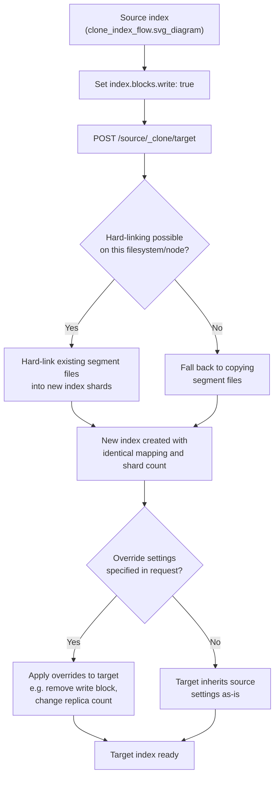

## Clone Index

### Overview

Clone creates an exact copy of an existing index — same mapping, same settings, same shard count, and same data — as a new index under a different name. Unlike Shrink or Split, Clone does not change the primary shard count; it is purely a duplication operation. It uses the same underlying hard-link mechanism as Shrink where possible, making it a fast, low-overhead way to produce a working copy of an index without the cost of a full document-by-document Reindex API copy.

### Prerequisites

- The source index must be **read-only** at the time of the clone call (`index.blocks.write: true`).
- The target index must **not already exist**.
- Unlike Shrink, Clone does **not** require all primary shards to reside on a single node, since the shard count is unchanged and each shard can be hard-linked independently on whichever node currently holds it.
- The cluster health of the source index's shards must be in a state that allows the operation (active primary shards).

### Basic Usage

```json
PUT /products-v1/_settings
{
  "settings": {
    "index.blocks.write": true
  }
}
```

```json
POST /products-v1/_clone/products-v1-copy
```

Response:

```json
{
  "acknowledged": true,
  "shards_acknowledged": true,
  "index": "products-v1-copy"
}
```

The resulting `products-v1-copy` index has identical mapping, identical shard count, and identical document contents to `products-v1` at the moment of cloning.

### Overriding Settings on the Clone

Settings can be adjusted for the target index at clone time, as long as they don't conflict with the structural requirement of matching shard count:

```json
POST /products-v1/_clone/products-v1-copy
{
  "settings": {
    "index.number_of_replicas": 2,
    "index.blocks.write": null
  }
}
```

Setting `"index.blocks.write": null` on the target removes the read-only block that was required on the source, allowing the new clone to immediately accept writes even though the source remains read-only (unless separately reverted).

### Clone Flow



### Why Clone Instead of Reindex

**Key Points**
- Clone is substantially faster than Reindex for producing a full duplicate, because it relies on filesystem-level hard-linking of existing Lucene segments rather than reading and re-writing every document through the Bulk API pipeline.
- Clone does not support document transformation — there is no `script` equivalent. If any transformation is needed, Reindex (potentially applied afterward, against the clone) is the correct tool.
- Clone preserves the shard count exactly; if a different shard count is also desired at the same time, Shrink or Split are the appropriate operations instead, not Clone.

### Common Use Cases

- **Testing mapping or settings changes safely** — cloning production data into a scratch index to experiment with reindex scripts, new analyzers, or query behavior changes without risking the live index.
- **Creating a snapshot-like point-in-time copy** for a specific investigation or audit, without going through the full Snapshot and Restore workflow.
- **Pre-upgrade validation** — cloning an index to test compatibility or behavior under a new Elasticsearch version or plugin configuration before applying changes to the primary index.
- **Branching data for parallel experimentation** — for example, cloning a search-relevance-critical index to A/B test a new analyzer configuration against the original without disrupting live traffic.

### Restoring Write Access to the Source

Since Clone requires the source index to be read-only during the operation, the source's write block is typically reverted afterward if it needs to keep accepting writes:

```json
PUT /products-v1/_settings
{
  "settings": {
    "index.blocks.write": false
  }
}
```

This step is easy to forget, since the read-only requirement is a precondition for the *clone* operation specifically, not necessarily a state the source should remain in afterward.

### Clone vs Shrink vs Split vs Reindex

| Aspect | Clone | Shrink | Split | Reindex |
|---|---|---|---|---|
| Shard count change | None (identical) | Decrease | Increase | Any (destination-defined independently) |
| Requires read-only source | Yes | Yes | Yes | No |
| Requires shards on one node | No | Yes | No | No |
| Supports document transformation | No | No | No | Yes (`script`) |
| Speed relative to full copy | Fast (hard-link) | Fast (hard-link) | Moderate (re-hash) | Slower (document-by-document) |
| Typical purpose | Exact duplicate for testing/branching | Consolidate over-sharded index | Divide under-sharded index | Mapping change, data transformation, migration |

### Verifying the Clone

```json
GET /products-v1-copy/_count
GET /products-v1/_count
```

```json
GET /products-v1-copy/_mapping
```

Comparing document counts and mapping output between source and clone confirms the operation completed as expected before the clone is used for its intended purpose (testing, branching, etc.).

### Common Pitfalls

**Key Points**
- Forgetting to remove the `index.blocks.write` block from the *source* index after cloning, if the source needs to resume accepting writes — this block was only a precondition for the clone call, not a permanent intended state in most workflows.
- Assuming Clone can also change shard count — it cannot; attempting to specify a different `index.number_of_shards` in the clone request's settings is not supported, since Clone preserves shard structure by design (Shrink or Split are needed for that).
- Using Clone when a mapping or data transformation is actually needed — Clone produces an identical copy, so any desired changes must be applied as a separate step afterward (e.g., via Reindex against the clone, or direct mapping updates for additive-only changes).
- Not accounting for the additional disk space the clone consumes — even with hard-linking, subsequent writes to either the source or the clone cause Lucene's copy-on-write segment merging behavior to diverge the two, at which point actual additional disk space is consumed beyond the initial hard-linked state. [Inference] The precise point at which hard-linked segments diverge and consume independent disk space depends on Lucene's merge policy and ongoing write activity on either index; this is a general consequence of how hard links and segment merging interact rather than a fixed, predictable threshold.

**Related Topics**
- Shrink and Split index operations
- Reindex API for transformation-involving migrations
- Snapshot and Restore for full backup/restore workflows
- Index blocks (`index.blocks.write`, `index.blocks.read_only`)
- Aliases API for cutover after validation
- Index Lifecycle Management (ILM) phase actions