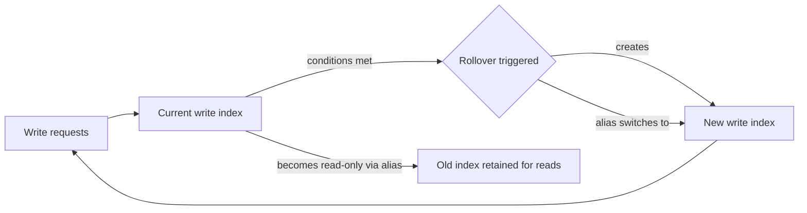

## Rollover API

### Overview

The Rollover API creates a new index for a target alias or data stream when the current index meets one or more configured conditions, such as size, document count, or age. It is a core mechanism for managing time-series and log-style data in Elasticsearch without requiring manual index creation or naming coordination.

Rollover works against two target types:

- **Alias-based rollover**: an alias points to a "write index," and rollover creates a new index, switches the alias to point to it, and removes write access from the old index.
- **Data stream rollover**: rollover creates a new backing index and updates the stream's internal state automatically; this is the default mechanism data streams use under the hood.

### How It Works

1. An alias (or data stream) has a designated write index — the one currently receiving indexing requests.
2. Elasticsearch periodically or manually evaluates the write index against rollover conditions.
3. If any configured condition is met, a new index is created following a naming convention.
4. The alias's write pointer moves to the new index, or the data stream appends the new backing index.
5. The old index remains queryable via the alias/stream but no longer receives new writes.



### Prerequisites for Alias-Based Rollover

For manual alias-based rollover, the index must follow a naming pattern ending in a sequence of digits, optionally with a `-` or `.` separator, so Elasticsearch can auto-increment it:

```
my-index-000001
```

The alias must be marked as the write index:

```json
PUT /my-index-000001
{
  "aliases": {
    "my-alias": {
      "is_write_index": true
    }
  }
}
```

Without `is_write_index: true` explicitly set on exactly one index, rollover on a multi-index alias will fail or behave ambiguously.

### Rollover Conditions

Rollover conditions fall into two categories: **max_*** conditions (trigger rollover when exceeded) and **min_*** conditions (must be satisfied before rollover, used to prevent overly small indices).

**Common max conditions:**

| Condition | Description |
|---|---|
| `max_age` | Time elapsed since index creation (e.g., `"7d"`) |
| `max_docs` | Number of documents indexed (excludes replicas) |
| `max_size` | Primary shard store size, summed (e.g., `"50gb"`) |
| `max_primary_shard_size` | Size of the single largest primary shard |
| `max_primary_shard_docs` | Document count of the single largest primary shard |

**Common min conditions:**

| Condition | Description |
|---|---|
| `min_age` | Minimum time elapsed since creation |
| `min_docs` | Minimum document count |
| `min_size` | Minimum primary shard store size |
| `min_primary_shard_size` | Minimum size of largest primary shard |
| `min_primary_shard_docs` | Minimum doc count of largest primary shard |

When multiple `max_*` conditions are specified, rollover triggers if **any** are met. When `min_*` conditions are specified alongside `max_*` conditions, **all** min conditions must also be satisfied before rollover proceeds — this prevents premature rollover of near-empty indices during low-traffic periods.

### Basic Example — Alias Rollover

```json
POST /my-alias/_rollover
{
  "conditions": {
    "max_age": "7d",
    "max_docs": 1000000,
    "max_primary_shard_size": "50gb"
  }
}
```

If none of the conditions are met, the response returns `"rolled_over": false` and no new index is created. If a condition is met, a new index (e.g., `my-index-000002`) is created and the alias is repointed.

**Example response (rolled over):**

```json
{
  "acknowledged": true,
  "shards_acknowledged": true,
  "old_index": "my-index-000001",
  "new_index": "my-index-000002",
  "rolled_over": true,
  "dry_run": false,
  "conditions": {
    "[max_age: 7d]": true,
    "[max_docs: 1000000]": false,
    "[max_primary_shard_size: 50gb]": false
  }
}
```

### Dry Run

Conditions can be evaluated without performing the rollover using the `dry_run` query parameter:

```json
POST /my-alias/_rollover?dry_run
{
  "conditions": {
    "max_age": "7d"
  }
}
```

This is useful for testing condition logic in automation or monitoring pipelines before enabling actual rollovers.

### Specifying the New Index Name (Alias Rollover Only)

For alias-based rollover, an explicit target name can be provided instead of relying on auto-increment naming:

```json
POST /my-alias/_rollover/my-new-index-name
{
  "conditions": {
    "max_age": "7d"
  }
}
```

This is not supported for data streams, since backing index naming and numbering is managed internally.

### Applying Settings, Mappings, and Aliases at Rollover

The rollover request body may include `settings`, `mappings`, and `aliases` for the new index, similar to index creation:

```json
POST /my-alias/_rollover
{
  "conditions": {
    "max_age": "30d"
  },
  "settings": {
    "number_of_shards": 3,
    "index.number_of_replicas": 1
  },
  "mappings": {
    "properties": {
      "timestamp": { "type": "date" }
    }
  }
}
```

[Inference] In practice, most production setups avoid specifying mappings/settings directly in the rollover call and instead rely on **index templates**, since templates apply consistently to every new index without requiring the caller to repeat configuration on every rollover request.

### Rollover with Data Streams

For data streams, rollover is called against the data stream name directly, and Elasticsearch manages backing index creation and naming (`.ds-<stream>-<generation>`):

```json
POST /my-data-stream/_rollover
{
  "conditions": {
    "max_age": "7d",
    "max_primary_shard_size": "50gb"
  }
}
```

No `is_write_index` configuration is needed — data streams handle write-index designation internally, and only the data stream name (not a backing index name) is ever used as the rollover target.

### Automating Rollover with ILM

Manually calling `_rollover` on a schedule is uncommon in production; instead, **Index Lifecycle Management (ILM)** automates it. An ILM policy's `hot` phase typically defines a `rollover` action with the same condition fields:

```json
PUT _ilm/policy/my-policy
{
  "policy": {
    "phases": {
      "hot": {
        "actions": {
          "rollover": {
            "max_age": "7d",
            "max_primary_shard_size": "50gb"
          }
        }
      }
    }
  }
}
```

ILM periodically checks the rollover conditions in the background (poll interval controlled by `indices.lifecycle.poll_interval`, default `10m`) and triggers rollover automatically once satisfied — no external scheduler or cron job is required.

### Rollover and Index Naming Increment Behavior

When auto-incrementing, Elasticsearch parses the trailing numeric suffix and zero-pads according to the original index's digit count:

- `logs-000001` → `logs-000002`
- `logs-1` → `logs-2`

[Unverified] Mixed or inconsistent digit padding across manually created indices in the same alias chain can produce unexpected naming results; using a consistent template-driven naming convention from the start avoids this.

### Common Pitfalls

- **Missing `is_write_index`**: rollover on an alias with multiple indices and no explicit write index fails with an error.
- **Conflating min and max conditions**: forgetting that `min_*` conditions must ALL be true (AND logic) while `max_*` conditions need only ONE to be true (OR logic) leads to unexpected rollover timing.
- **Manual rollover without templates**: new indices created by rollover, when not covered by a matching index template, may not inherit the intended mappings/settings, silently defaulting to dynamic mapping.
- **Confusing rollover with reindex**: rollover does not move or copy existing documents; it only starts routing new writes to a fresh index.

### Related Topics

- Index Lifecycle Management (ILM) — Policies and Phases
- Data Streams — Architecture and Backing Indices
- Index Templates — Component and Composable Templates
- Index Aliases — Read vs Write Aliases
- Shrink and Force Merge APIs (post-rollover optimization)