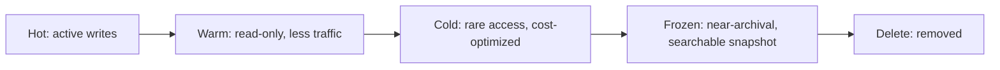
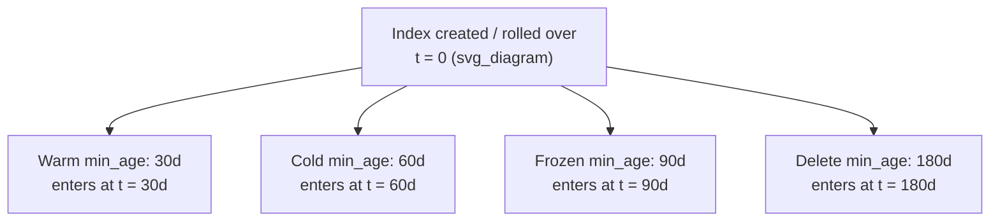

## ILM Phases

### Overview

An ILM policy is organized into five possible phases, each representing a stage in an index's lifecycle from active ingestion through eventual deletion. Phases execute in a fixed order — `hot` → `warm` → `cold` → `frozen` → `delete` — and an index can skip any phase that isn't defined in its policy, but it cannot move backward or out of order.



### Hot Phase

The hot phase represents the period during which an index is actively receiving writes and serving the majority of query traffic. It is the most resource-intensive phase and is typically backed by the fastest available storage and highest-spec nodes.

**Primary purpose:** support high-throughput indexing and low-latency search on current data.

**Common actions:**

```json
"hot": {
  "min_age": "0ms",
  "actions": {
    "rollover": {
      "max_age": "7d",
      "max_primary_shard_size": "50gb"
    },
    "set_priority": {
      "priority": 100
    }
  }
}
```

- `rollover` is almost always the defining action of the hot phase; without it, ILM has no trigger to create a new write index, and manual rollover management would be required instead.
- `set_priority` controls the order in which indices recover shards after a cluster restart — hot indices are typically given the highest priority value since they're the most operationally important.
- `min_age` for the hot phase is normally `0ms`, since the index enters this phase immediately upon creation.

[Inference] Some deployments apply `forcemerge` within the hot phase for indices that stop receiving writes quickly after rollover, but this is less common than reserving `forcemerge` for the warm phase, since force merging is I/O-intensive and can compete with active indexing if applied too early.

### Warm Phase

The warm phase represents indices that are no longer being written to but are still queried, generally less frequently than hot data. The primary goal is reducing resource footprint while retaining full query capability.

**Primary purpose:** cost and resource optimization for read-only, moderately-accessed data.

**Common actions:**

```json
"warm": {
  "min_age": "30d",
  "actions": {
    "set_priority": {
      "priority": 50
    },
    "allocate": {
      "number_of_replicas": 1
    },
    "readonly": {},
    "shrink": {
      "number_of_shards": 1
    },
    "forcemerge": {
      "max_num_segments": 1
    }
  }
}
```

- `readonly` explicitly blocks further writes to the index, formalizing what is usually already true by this stage.
- `shrink` reduces the primary shard count, useful because rolled-over indices are often over-sharded relative to their now-static size.
- `forcemerge` (commonly `max_num_segments: 1`) merges Lucene segments to reduce overhead and improve search speed on largely static data.
- `allocate` can adjust replica counts (often reduced to save resources) and/or move the index to warm-tier nodes via node attributes or data tier roles.

**Order matters:** `shrink` requires the index to be read-only first (either via the `readonly` action or because it's implied by prior steps), and ILM sequences the internal steps accordingly even when actions are listed in a different order in the policy JSON.

### Cold Phase

The cold phase is for data that is rarely queried but still needs to remain searchable, typically for compliance, historical analysis, or infrequent audits.

**Primary purpose:** minimize storage cost while preserving searchability, at the expense of query performance.

**Common actions:**

```json
"cold": {
  "min_age": "60d",
  "actions": {
    "set_priority": {
      "priority": 0
    },
    "allocate": {
      "number_of_replicas": 0
    },
    "readonly": {},
    "searchable_snapshot": {
      "snapshot_repository": "my-repo"
    }
  }
}
```

- `searchable_snapshot` is central to the cold phase in modern Elasticsearch versions — it converts the index into a searchable snapshot, which can dramatically reduce local storage requirements since data is served from a snapshot repository (e.g., object storage) rather than fully replicated on local disk.
- `allocate` with `number_of_replicas: 0` is common here, since replica safety is instead handled by the underlying snapshot repository once `searchable_snapshot` is applied.
- [Unverified] The standalone `freeze` action existed in earlier versions for a similar cost-reduction purpose but has been deprecated/removed in favor of `searchable_snapshot` and the dedicated frozen phase in more recent releases; exact deprecation version should be confirmed against current documentation for any specific cluster version.

### Frozen Phase

The frozen phase is designed for data that is almost never queried, representing the most storage-cost-optimized tier while still technically remaining searchable (with higher query latency expected).

**Primary purpose:** long-term retention of rarely-accessed data at minimal cost.

**Common actions:**

```json
"frozen": {
  "min_age": "90d",
  "actions": {
    "searchable_snapshot": {
      "snapshot_repository": "my-repo"
    }
  }
}
```

- The frozen tier is built around **partially mounted searchable snapshots**, which cache only a small portion of data locally and fetch the rest from the snapshot repository on demand, trading query latency for a minimal on-disk footprint.
- Frozen-tier nodes are typically provisioned with far less local storage than hot/warm/cold nodes, since they are not expected to hold full copies of the underlying data.
- [Inference] Query latency in the frozen tier can vary substantially depending on repository type (e.g., object storage vs. network-attached storage) and whether data has been recently cached, though specific latency figures are workload- and infrastructure-dependent.

### Delete Phase

The delete phase permanently removes the index from the cluster.

**Primary purpose:** enforce data retention limits and reclaim resources.

**Common actions:**

```json
"delete": {
  "min_age": "180d",
  "actions": {
    "wait_for_snapshot": {
      "policy": "daily-snapshots"
    },
    "delete": {}
  }
}
```

- `delete` is the terminal action; once executed, the index (and its data) is unrecoverable through Elasticsearch itself.
- `wait_for_snapshot` is a safety mechanism ensuring a named SLM (Snapshot Lifecycle Management) policy has successfully run before deletion proceeds, reducing the risk of deleting data that hasn't yet been backed up.
- If the underlying data is a searchable snapshot (from cold/frozen phase), deletion here removes the mounted index; the underlying snapshot in the repository is not automatically deleted unless separately managed by SLM retention settings.

### Phase Comparison

| Phase | Writable | Query Frequency | Storage Cost | Typical Action Focus |
|---|---|---|---|---|
| Hot | Yes | High | Highest | rollover, set_priority |
| Warm | No | Moderate | Reduced | shrink, forcemerge, allocate |
| Cold | No | Low | Low | searchable_snapshot, allocate |
| Frozen | No | Very low | Lowest (searchable) | searchable_snapshot (partial) |
| Delete | N/A | N/A | None | delete |

### min_age Semantics Across Phases

A critical, frequently misunderstood detail: `min_age` for every phase (warm, cold, frozen, delete) is measured from the **rollover time** of the index (or its creation time, if the index was never rolled over) — **not** from the time the index entered the previous phase.



This means phase durations in a policy are effectively cumulative offsets from a single origin point, not sequential deltas — a `min_age: 60d` on cold does not mean "60 days after entering warm," it means "60 days after rollover."

### Skipping Phases

Any phase can be omitted from a policy entirely. For example, a policy with only `hot` and `delete` phases will roll over in hot and then delete once the delete phase's `min_age` is reached, skipping warm/cold/frozen entirely. This is common for short-lived data (e.g., high-volume debug logs) where intermediate cost-optimization stages aren't worth the operational complexity.

### Common Pitfalls

- **Assuming `min_age` is relative to the previous phase**: leads to indices reaching cold/frozen/delete far earlier or later than expected, since all `min_age` values share the same origin (rollover/creation time).
- **Setting `searchable_snapshot` in both cold and frozen**: the frozen phase typically expects the index to already be a searchable snapshot from cold, or configures its own; duplicating logic incorrectly can cause step failures.
- **Omitting `readonly` before `shrink`**: while ILM generally sequences this correctly internally, manually constructed policies that misunderstand action ordering can cause confusion when reading `_ilm/explain` output.
- **No frozen-tier nodes provisioned**: a policy referencing the frozen phase without frozen-tier-labeled nodes in the cluster will stall at the migrate/allocate step indefinitely.

### Related Topics

- Index Lifecycle Management — Policies and Automation
- Data Tiers — Node Roles and Shard Allocation
- Searchable Snapshots — Fully Mounted vs Partially Mounted
- Snapshot Lifecycle Management (SLM)
- Rollover API — Conditions and Naming