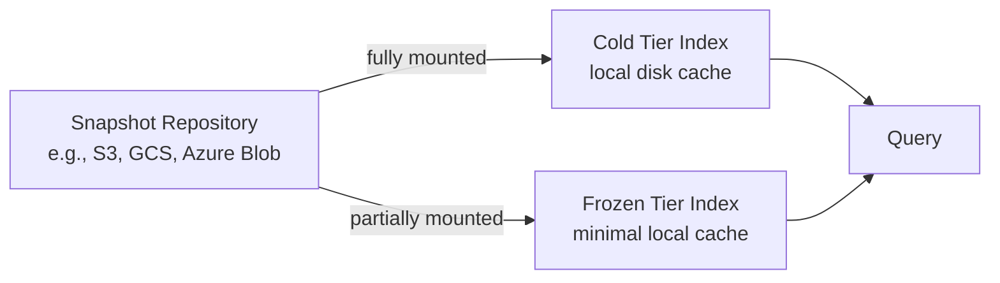
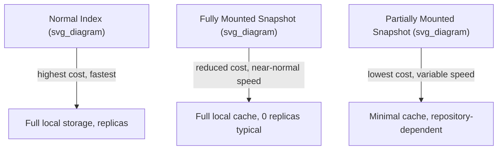

## Searchable Snapshots

### Overview

Searchable snapshots let Elasticsearch query data directly from a snapshot stored in a repository (such as object storage) without first restoring it to a fully allocated, locally-held index. This dramatically reduces local disk and resource requirements for older, less-frequently-accessed data while keeping it queryable, making it the backbone of the cold and frozen data tiers.

Instead of holding a complete copy of shard data on local disk (as a normal index does), a searchable snapshot index either caches data locally on demand or fetches it from the repository at query time, depending on the mount type.

### Why Searchable Snapshots Exist

Traditional index storage requires every replica and primary shard to hold a full copy of its data on local disk. For long-term retention of historical data — logs, metrics, audit trails — this becomes expensive at scale, since storage costs scale linearly with retention period even though query frequency typically drops sharply as data ages.

Searchable snapshots decouple **durability** (handled by the snapshot repository) from **local resource usage** (handled by the mount type), allowing the same underlying data to be queried without the full local storage footprint traditionally required.



### Mount Types

There are two ways to mount a searchable snapshot, corresponding to the cold and frozen tiers respectively.

**Fully mounted (cold tier):**
- The entire dataset is copied to local disk as a local cache when first mounted.
- Query performance is comparable to a normal index once the local cache is populated, since reads are served from disk rather than the repository.
- Still requires meaningful local storage, though replicas can typically be eliminated since the repository itself provides durability.

**Partially mounted (frozen tier):**
- Only a small subset of data is cached locally at any time; most data remains in the repository and is fetched on demand.
- Local storage footprint is minimal — a small local cache (sized via node configuration) serves as a working set.
- Query latency is higher and more variable, especially for data not currently in the local cache, since it requires a round trip to the repository.

| Aspect | Fully Mounted (Cold) | Partially Mounted (Frozen) |
|---|---|---|
| Local disk usage | Full dataset cached | Minimal, on-demand cache |
| Query latency | Near-normal | Higher, variable |
| Typical tier | Cold | Frozen |
| Replica requirement | Often reduced to 0 | Typically 0 |
| Best for | Occasional queries needing consistent speed | Rare, exploratory, or compliance queries |

### Creating a Searchable Snapshot Manually

Outside of ILM automation, a searchable snapshot can be mounted directly from an existing snapshot in a repository:

```json
POST /_snapshot/my-repo/my-snapshot/_mount?wait_for_completion=true
{
  "index": "my-index",
  "renamed_index": "my-index-searchable",
  "index_settings": {
    "index.number_of_replicas": 0
  }
}
```

- `storage` parameter (not shown above) controls mount type: `"full_copy"` for fully mounted, or `"shared_cache"` for partially mounted — the latter requires nodes configured with a frozen-tier shared cache.
- `renamed_index` avoids naming collisions if the original index name is still in use elsewhere in the cluster.

### Searchable Snapshots via ILM

In practice, searchable snapshots are most commonly created automatically through ILM's `searchable_snapshot` action within the cold or frozen phase:

```json
"cold": {
  "min_age": "60d",
  "actions": {
    "searchable_snapshot": {
      "snapshot_repository": "my-repo"
    }
  }
}
```

```json
"frozen": {
  "min_age": "90d",
  "actions": {
    "searchable_snapshot": {
      "snapshot_repository": "my-repo"
    }
  }
}
```

When ILM executes this action, it:
1. Takes a snapshot of the index (if one hasn't already been taken, e.g., via `wait_for_snapshot` in an earlier phase, or takes a fresh one).
2. Deletes the original, fully-allocated index.
3. Mounts the snapshot as a searchable snapshot index, replacing the original in the alias/data stream.

This transition is typically transparent to queries against the alias or data stream, aside from the shift in expected latency characteristics.

### Prerequisites

- A registered **snapshot repository** (e.g., backed by S3, GCS, Azure Blob Storage, or a shared filesystem) must exist before searchable snapshots can be created or mounted.
- For the frozen tier specifically, nodes must be configured with the `data_frozen` role and a shared cache setting (`xpack.searchable.snapshot.shared_cache.size` or equivalent, depending on version) to serve as the local on-demand cache.

```json
PUT _snapshot/my-repo
{
  "type": "s3",
  "settings": {
    "bucket": "my-elasticsearch-snapshots",
    "region": "us-east-1"
  }
}
```

[Unverified] Exact repository plugin configuration (credentials, IAM roles, endpoint settings) varies by cloud provider and Elasticsearch version, and should be verified against current documentation for the specific repository type in use.

### Read-Only Nature

Searchable snapshot indices are inherently **read-only**. Write operations (indexing, updating, deleting documents) are not supported against them — this is a fundamental constraint, not a configurable setting, since the underlying data lives in an immutable snapshot. Any workflow relying on searchable snapshots must ensure the transition happens only after an index has stopped receiving writes (typically already true by the cold/frozen phase in a standard ILM policy).

### Querying Searchable Snapshot Indices

From a query API perspective, searching a searchable snapshot index looks identical to searching a normal index — the same `_search` endpoint, query DSL, and aggregations apply. The difference is entirely in underlying performance characteristics and resource usage, not in the query interface itself.

```json
GET /my-index-searchable/_search
{
  "query": {
    "range": {
      "timestamp": {
        "gte": "2026-01-01",
        "lte": "2026-01-31"
      }
    }
  }
}
```

[Inference] For partially mounted (frozen) indices, queries touching data not currently cached locally will typically experience noticeably higher latency than the equivalent query against a fully mounted or normal index, though the magnitude depends on repository type and network characteristics.

### Cost and Performance Trade-offs



The general trade-off curve: as local resource footprint decreases (moving toward partially mounted/frozen), storage cost decreases proportionally, but query latency becomes higher and less predictable, particularly for "cold" data not recently accessed and therefore not present in any local cache.

### Common Pitfalls

- **Attempting writes against a searchable snapshot index**: fails, since these indices are read-only by design; any pipeline expecting to write to an index must do so before it transitions via ILM.
- **Missing shared cache configuration on frozen-tier nodes**: partially mounted snapshots require `data_frozen` nodes with shared cache storage configured; without it, mounting or querying frozen indices will fail or behave unexpectedly.
- **No snapshot repository registered**: the `searchable_snapshot` ILM action fails at that step if no valid, reachable repository is configured, which will typically surface as a stalled step in `_ilm/explain`.
</br>- **Assuming deletion of the searchable snapshot index deletes the source snapshot**: it does not by default; the underlying snapshot in the repository persists unless explicitly deleted or managed via SLM retention.
- **Underestimating frozen-tier query latency for exploratory workloads**: frequent ad hoc querying of frozen data can be significantly slower than expected if used as though it were hot/warm data.

### Related Topics

- ILM Phases — Cold and Frozen Tier Actions
- Snapshot and Restore — Repository Configuration
- Snapshot Lifecycle Management (SLM)
- Data Tiers — Node Roles for Hot, Warm, Cold, Frozen
- Index Lifecycle Management — Policies and Automation