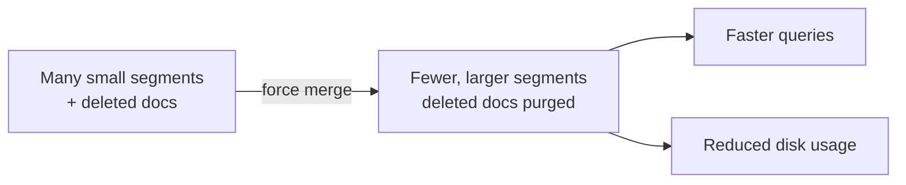
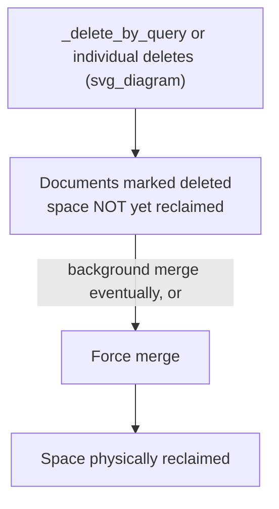

## Force Merge

### Overview

Force merge is an API operation that manually triggers segment merging within an index's shards, reducing the number of Lucene segments (down to a target count) and reclaiming disk space from deleted documents. It is primarily used on read-only or infrequently-written indices to improve query performance and reduce storage footprint, since normal background merging is optimized for ongoing write throughput rather than achieving an optimal segment count.

### Background: Segments and Merging

Elasticsearch indices are built on Lucene, which stores data in immutable **segments**. As documents are indexed, updated, or deleted:

- New documents create new segments.
- Updates are implemented internally as a delete of the old document plus indexing of a new one.
- Deletes mark documents as deleted within their segment without immediately removing them physically.

Lucene automatically merges smaller segments into larger ones in the background to control segment count, but this automatic process is tuned for balancing indexing throughput against merge overhead — not for producing the minimal possible segment count. Over time, especially on actively written indices, segment count and deleted-but-unreclaimed document space can accumulate.



### Basic Usage

```json
POST /my-index/_forcemerge
```

With no parameters, this merges segments down to the default target (historically 1 segment per shard in many configurations, though behavior can depend on version and current segment state).

**Targeting a specific segment count:**

```json
POST /my-index/_forcemerge?max_num_segments=1
```

`max_num_segments=1` is the most common setting for fully static indices (e.g., after rollover, in the warm phase), since a single segment per shard minimizes per-segment overhead for search.

### Key Parameters

| Parameter | Description |
|---|---|
| `max_num_segments` | Target number of segments per shard after the merge |
| `only_expunge_deletes` | Merges only segments containing deleted documents, without necessarily reducing to `max_num_segments` |
| `flush` | Whether to flush the index after the merge completes (default `true`) |

**Expunging deletes without full merge:**

```json
POST /my-index/_forcemerge?only_expunge_deletes=true
```

This is useful when the primary goal is reclaiming space from deleted/updated documents without the full cost of merging down to a small segment count — [Inference] typically a lighter-weight operation than a full force merge to `max_num_segments=1`, though actual cost depends on the volume of deleted documents present.

### Performance Impact

Force merge is a **resource-intensive** operation:

- It is I/O and CPU intensive, since it physically rewrites segment data.
- It can temporarily increase disk usage during the merge, since old segments aren't removed until the new merged segment is fully written.
- Running it against an index still receiving active writes competes with ongoing indexing operations and is generally discouraged.

For this reason, force merge is almost always applied to indices that are **read-only** or no longer receiving writes — commonly as part of the ILM warm phase, after `rollover` has moved write traffic to a new index and `readonly` has been applied (explicitly or implicitly).

```json
"warm": {
  "min_age": "30d",
  "actions": {
    "readonly": {},
    "forcemerge": {
      "max_num_segments": 1
    }
  }
}
```

### Disk Space Considerations

[Inference] Because force merge can require additional temporary disk space equal to roughly the size of the segments being merged (since old and new segments coexist briefly during the operation), clusters with tight disk headroom should account for this before triggering force merge on large indices, though the exact overhead depends on segment sizes and merge policy specifics.

### Force Merge and Deleted Documents

A common misconception is that deleting documents immediately frees disk space. In Lucene's architecture, deleted documents are only marked as deleted and excluded from search results — the physical space isn't reclaimed until the containing segment is merged (either through normal background merging or explicitly via force merge).



This is particularly relevant after large `_delete_by_query` operations, where force merge (often with `only_expunge_deletes=true`) can be used to reclaim space more promptly than waiting for background merging.

### Monitoring Force Merge Progress

Force merge can be run asynchronously (the default HTTP call blocks until completion, but very large merges can take a long time). Progress and segment state can be inspected via:

```json
GET /my-index/_segments
```

or at a higher level:

```json
GET /_cat/segments/my-index?v
```

These show current segment count, size, and deleted document counts per shard, useful for confirming whether a force merge is needed or has completed as expected.

### Force Merge vs Shrink

Force merge and shrink are often used together in the warm phase but solve different problems:

| Aspect | Force Merge | Shrink |
|---|---|---|
| What it changes | Number of Lucene segments within existing shards | Number of primary shards in the index |
| Primary goal | Query speed, reclaiming deleted-doc space | Reducing shard count/overhead for oversharded indices |
| Requires read-only | Not strictly required, but strongly recommended | Yes, required |
| Typical order | Often after shrink | Often before force merge |

[Inference] Because shrink creates an entirely new index with fewer primary shards by copying data from the original, it's common to shrink first and then force merge the resulting (smaller-shard-count) index, since force merging before shrinking would merge segments that are about to be copied and re-segmented anyway.

### Common Pitfalls

- **Running force merge on actively-written indices**: causes resource contention with ongoing indexing and is generally discouraged outside of specific, carefully considered cases.
- **Merging to `max_num_segments=1` on very large indices**: can be extremely slow and I/O-intensive; [Unverified] some practitioners prefer a slightly higher segment count target for very large shards to reduce single-merge duration and temporary disk overhead, though this trades off some query performance.
- **Ignoring temporary disk space requirements**: force merging large indices without sufficient free disk headroom can cause the operation to fail or exhaust disk space.
- **Expecting immediate space reclamation from deletes**: deleted document space is not freed until a merge (background or forced) actually occurs.
- **Force merging before shrink**: generally wasted effort, since shrink creates a new index from the original data regardless of the original's segment count.

### Related Topics

- ILM Phases — Warm Phase Actions
- Shrink API — Reducing Primary Shard Count
- Segments and Lucene Internals
- Delete By Query API
- Index Lifecycle Management — Policies and Automation