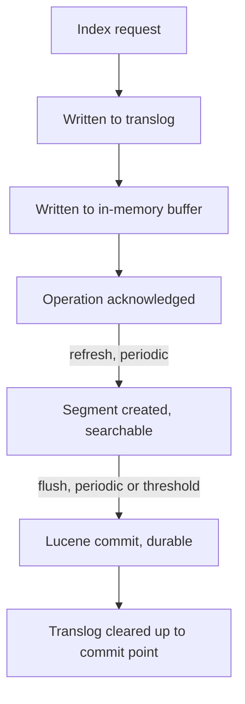

## Refresh and Flush

### Overview

Refresh and flush are two distinct Elasticsearch operations that are frequently confused but serve different purposes in the indexing pipeline. **Refresh** makes recently indexed documents searchable by opening a new, searchable segment view. **Flush** persists data to disk (via Lucene commit) and clears the transaction log, ensuring durability. Understanding the distinction is essential for reasoning about indexing latency, search visibility, and data durability.


### Refresh

Refresh takes the documents currently held in the in-memory indexing buffer and writes them into a new Lucene segment, making that segment part of the searchable index. It does **not** guarantee durability on its own — the new segment is typically written to the filesystem cache and becomes searchable, but a flush (Lucene commit) is what ensures it's durably persisted to disk.

**Manual refresh:**

```json
POST /my-index/_refresh
```

**Refresh on a specific index or all indices:**

```json
POST /my-index-1,my-index-2/_refresh
POST /_refresh
```

**Refresh interval setting:**

By default, indices refresh automatically on an interval (default `1s`), controlled per-index:

```json
PUT /my-index/_settings
{
  "index": {
    "refresh_interval": "30s"
  }
}
```

Setting `refresh_interval` to `-1` disables automatic refreshing entirely, which is commonly done during large bulk-loading operations to reduce overhead, then re-enabled afterward.

### Near Real-Time Search

Elasticsearch is described as "near real-time" specifically because of the refresh cycle: a document is not searchable the instant it's indexed — it becomes searchable only after the next refresh occurs (by default, within roughly one second under default settings, though this is not a strict guarantee under load).

**Forcing immediate visibility on a single request:**

```json
POST /my-index/_doc?refresh=true
{
  "field": "value"
}
```

Using `refresh=true` (or `refresh=wait_for`) on an individual indexing request forces or waits for a refresh so the document is immediately searchable, but this comes at a performance cost if used on every request in a high-throughput scenario, since it can force many small, inefficient refreshes.

| `refresh` value | Behavior |
|---|---|
| `false` (default) | Document becomes searchable at the next scheduled refresh |
| `true` | Forces an immediate refresh after the operation |
| `wait_for` | Waits for the next scheduled or forced refresh before responding, without forcing an extra one |

### Why Refresh Interval Matters for Performance

Each refresh creates a new segment, and more frequent refreshes mean more (initially smaller) segments, which increases merge overhead over time. Widening the refresh interval during high-volume indexing (e.g., initial data loads, reindexing) reduces segment creation frequency and can meaningfully improve indexing throughput, at the cost of documents taking longer to become searchable.

```json
PUT /my-index/_settings
{
  "index": {
    "refresh_interval": "-1"
  }
}
```

[Inference] It's common practice to disable refresh during bulk loads and re-enable (or explicitly trigger) it afterward, since search visibility usually isn't needed mid-load, though the appropriate refresh interval for any given workload depends on the balance between search latency requirements and indexing throughput.

### Flush

Flush performs a Lucene commit, which:
1. Persists all segments currently in the filesystem cache durably to disk.
2. Clears the transaction log (translog) up to that point, since the data is now durably committed via the Lucene commit itself.

```json
POST /my-index/_flush
```

**Flush is triggered automatically** when:
- The translog reaches a configured size threshold (`index.translog.flush_threshold_size`, default `512mb`).
- [Unverified] Certain internal events occur, such as before certain administrative operations; exact automatic flush triggers can vary by version and should be verified against current documentation for specific behavior guarantees.

**Manual flush is rarely necessary** in normal operation, since Elasticsearch manages flush timing automatically to balance durability and performance. It's occasionally used before maintenance operations or when explicitly ensuring data is committed to disk before a controlled shutdown.

### The Translog's Role

Between flushes, durability is provided by the **transaction log (translog)** — every indexing operation is written to the translog before being acknowledged, so that in the event of a node failure or restart, uncommitted operations since the last flush can be replayed from the translog rather than lost.



This means refresh and flush serve complementary but distinct roles: refresh affects **when data becomes searchable**, while flush (backed by the translog in between) affects **durability and recovery**.

### Refresh vs Flush — Summary Comparison

| Aspect | Refresh | Flush |
|---|---|---|
| Purpose | Make documents searchable | Persist data durably, clear translog |
| Frequency (default) | Every 1s (configurable) | Triggered by translog size threshold or events |
| Creates new segment | Yes | No (commits existing segments) |
| Guarantees durability | No | Yes |
| Performance cost | Moderate, scales with frequency | Higher, but less frequent by default |
| Manual trigger use case | Immediate search visibility needed | Rare; pre-maintenance or explicit durability need |

### Synced Flush (Historical Context)

[Unverified] Earlier Elasticsearch versions included a "synced flush" mechanism intended to speed up recovery of idle shards by marking them with a sync ID when no operations had occurred since the last flush. This feature's presence, naming, and exact behavior have changed across major versions, and current documentation should be consulted to confirm whether and how it applies to any specific version in use.

### Practical Implications for Bulk Indexing

A common performance pattern when loading large volumes of data:

```json
PUT /my-index/_settings
{
  "index": {
    "refresh_interval": "-1",
    "number_of_replicas": 0
  }
}
```

1. Disable refresh (`-1`) and optionally set replicas to `0` before the bulk load.
2. Perform the bulk indexing operations.
3. Re-enable refresh interval and restore replica count afterward:

```json
PUT /my-index/_settings
{
  "index": {
    "refresh_interval": "1s",
    "number_of_replicas": 1
  }
}
```

4. Optionally trigger a manual refresh (and/or force merge, if the index is now static) to ensure the data is immediately searchable and well-organized.

[Inference] This pattern is widely used for initial data loads and large reindexing operations, since it removes per-refresh and per-replication overhead during the highest-throughput phase of the operation, though the specific throughput improvement depends on cluster hardware, document size, and mapping complexity.

### Common Pitfalls

- **Expecting documents to be searchable immediately after indexing**: without `refresh=true`/`wait_for`, or waiting for the next scheduled refresh, freshly indexed documents won't appear in search results yet.
- **Overusing `refresh=true` on every indexing request**: significantly degrades indexing throughput under load by forcing excessive segment creation.
- **Forgetting to re-enable `refresh_interval` after bulk loading**: leaves the index effectively non-searchable for new data until manually corrected.
- **Confusing flush with refresh**: assuming a flush is needed for search visibility (it isn't — refresh handles that) or that refresh guarantees durability (it doesn't — flush and the translog handle that).
- **Manually flushing unnecessarily**: adds I/O overhead with little benefit in most workflows, since Elasticsearch's automatic flush behavior generally handles durability appropriately.

### Related Topics

- Translog — Durability and Recovery
- Force Merge — Segment Consolidation
- Bulk API — High-Throughput Indexing Patterns
- Segments and Lucene Internals
- Index Settings — Dynamic vs Static Settings