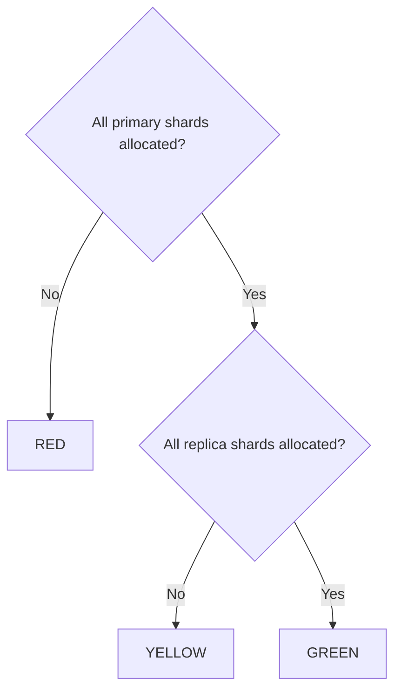
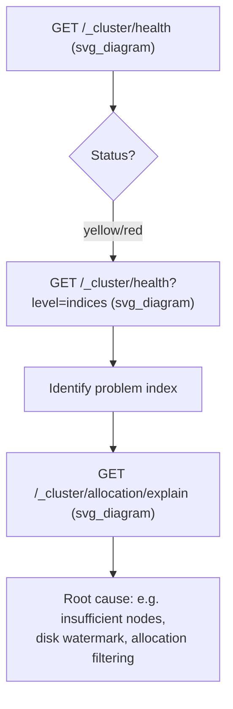

## Cluster Health API

### Overview

The Cluster Health API reports a high-level summary of the overall state of an Elasticsearch cluster, most notably its color-coded status (`green`, `yellow`, `red`), along with node counts, shard allocation statistics, and pending task information. It is typically the first endpoint checked when diagnosing cluster problems or monitoring overall cluster wellbeing.

```json
GET /_cluster/health
```

### Basic Response

```json
{
  "cluster_name": "my-cluster",
  "status": "green",
  "timed_out": false,
  "number_of_nodes": 3,
  "number_of_data_nodes": 3,
  "active_primary_shards": 20,
  "active_shards": 40,
  "relocating_shards": 0,
  "initializing_shards": 0,
  "unassigned_shards": 0,
  "delayed_unassigned_shards": 0,
  "number_of_pending_tasks": 0,
  "number_of_in_flight_fetch": 0,
  "task_max_waiting_in_queue_millis": 0,
  "active_shards_percent_as_number": 100.0
}
```

### Cluster Status Colors

The `status` field is the most commonly referenced value, summarizing shard allocation health across the entire cluster (or a specific index/indices, when scoped).

| Status | Meaning |
|---|---|
| `green` | All primary and replica shards are allocated |
| `yellow` | All primary shards are allocated, but at least one replica shard is not |
| `red` | At least one primary shard is not allocated |



**Important nuance:** a `red` cluster status does not necessarily mean data loss has occurred — it means at least one primary shard is currently unassigned, which could be temporary (e.g., during node restart or recovery) or indicate a genuine problem (e.g., insufficient nodes to host the shard, corrupted data, disk issues). Similarly, `yellow` is common and often benign in single-node development clusters, where no additional nodes exist to host replica shards.

### Key Response Fields

| Field | Meaning |
|---|---|
| `number_of_nodes` | Total nodes in the cluster (all roles) |
| `number_of_data_nodes` | Nodes capable of holding shard data |
| `active_primary_shards` | Primary shards currently active |
| `active_shards` | Total active shards (primaries + replicas) |
| `relocating_shards` | Shards currently moving between nodes |
| `initializing_shards` | Shards currently being allocated/recovered |
| `unassigned_shards` | Shards with no assigned node |
| `delayed_unassigned_shards` | Unassigned shards intentionally delayed before reallocation |
| `number_of_pending_tasks` | Cluster state update tasks queued but not yet processed |
| `active_shards_percent_as_number` | Percentage of total expected shards currently active |

### Scoping Health to Specific Indices

Cluster health can be scoped to one or more indices, which is often more actionable than cluster-wide status when troubleshooting a specific problem:

```json
GET /_cluster/health/my-index-1,my-index-2
```

This returns the same structure but calculated only across the specified indices' shards, useful for isolating whether a `yellow`/`red` cluster status stems from a single problematic index versus a broader cluster-wide issue.

### Level Parameter — Drilling Into Detail

The `level` query parameter controls the granularity of the response, useful for identifying exactly which shards or indices are contributing to a non-green status:

```json
GET /_cluster/health?level=indices
```

```json
GET /_cluster/health?level=shards
```

| Level | Detail Included |
|---|---|
| `cluster` (default) | Cluster-wide summary only |
| `indices` | Per-index status breakdown added |
| `shards` | Per-shard status breakdown added (most verbose) |

**Example with `level=indices`:**

```json
{
  "status": "yellow",
  "indices": {
    "my-index": {
      "status": "yellow",
      "number_of_shards": 1,
      "number_of_replicas": 1,
      "active_primary_shards": 1,
      "active_shards": 1,
      "unassigned_shards": 1
    }
  }
}
```

### Waiting for a Specific Status

The API supports blocking until a desired status is reached, which is commonly used in scripts, deployment pipelines, or automated tests that need to wait for the cluster (or an index) to become healthy before proceeding:

```json
GET /_cluster/health?wait_for_status=green&timeout=30s
```

If the target status isn't reached within `timeout`, the API returns with `"timed_out": true` rather than hanging indefinitely.

**Other wait conditions:**

```json
GET /_cluster/health?wait_for_nodes=3&timeout=60s
```

```json
GET /_cluster/health?wait_for_no_relocating_shards=true
```

| Parameter | Waits for |
|---|---|
| `wait_for_status` | Cluster/index to reach at least the specified status |
| `wait_for_nodes` | A specified number of nodes to be present (supports `>=N`, `<=N`, `N` syntax) |
| `wait_for_no_relocating_shards` | No shards currently relocating |
| `wait_for_no_initializing_shards` | No shards currently initializing |
| `wait_for_active_shards` | A specified number/percentage of active shards |
| `wait_for_events` | Pending cluster state tasks at or below a specified priority |

### Diagnosing a Yellow or Red Cluster

A typical troubleshooting flow starts broad and narrows down:



While the Cluster Health API identifies **that** a problem exists and roughly **where** (via index/shard-level detail), it does not explain **why** a shard is unassigned. For root-cause diagnosis, the `_cluster/allocation/explain` API is the natural next step:

```json
GET /_cluster/allocation/explain
```

### Common Causes of Non-Green Status

- **Single-node clusters with `number_of_replicas > 0`**: replicas can never be allocated to the same node as their primary, so a single-node cluster with default replica settings will persist at `yellow` — this is expected behavior, not a fault.
- **Insufficient nodes for shard allocation**: e.g., requesting 2 replicas across only 2 total data nodes.
- **Disk watermark thresholds exceeded**: nodes nearing configured disk usage thresholds may have shard allocation blocked, contributing to unassigned shards.
- **Allocation filtering or awareness settings**: misconfigured shard allocation awareness or filtering rules can leave shards unable to find an eligible node.
- **Node failure or network partition**: temporarily or permanently removes nodes hosting shards, often producing `red` if primaries were affected and no replica was promotable.

[Inference] In managed or cloud-hosted single-node development/testing environments, a persistent `yellow` status is common and often intentionally accepted, since replica allocation isn't possible without additional nodes and the operational cost of adding one may not be justified for non-production use.

### Cluster Health vs Other Diagnostic APIs

| API | Primary Use |
|---|---|
| `_cluster/health` | High-level status summary, waiting for conditions |
| `_cluster/allocation/explain` | Root-cause explanation for unassigned/unallocated shards |
| `_cat/indices` | Per-index summary including status, doc counts, sizes |
| `_cat/shards` | Per-shard state and location detail |
| `_nodes/stats` | Detailed per-node resource and performance statistics |
| `_cluster/stats` | Cluster-wide aggregate statistics (not health-focused) |

### Common Pitfalls

- **Treating `yellow` as always urgent**: in single-node or intentionally replica-less setups, `yellow` may be permanent and expected rather than indicative of a problem requiring action.
- **Assuming `red` always means data loss**: it means at least one primary is currently unassigned, which is sometimes transient (e.g., during a rolling restart) rather than permanent.
- **Polling cluster health too aggressively in automation**: using `wait_for_status` with an appropriate `timeout` is generally preferable to tight polling loops, since it lets Elasticsearch block efficiently until the condition is met or the timeout elapses.
- **Not scoping to specific indices when troubleshooting a known problem area**: cluster-wide health can mask which specific index or shard is actually responsible for a non-green status.
- **Relying solely on cluster health for root cause**: it identifies symptoms; `_cluster/allocation/explain` and node/disk-level stats are typically needed to identify the underlying cause.

### Related Topics

- Cluster Allocation Explain API
- Shard Allocation — Awareness and Filtering
- Disk-Based Shard Allocation and Watermarks
- Cat APIs — Indices, Shards, Nodes
- Node Roles and Cluster Topology