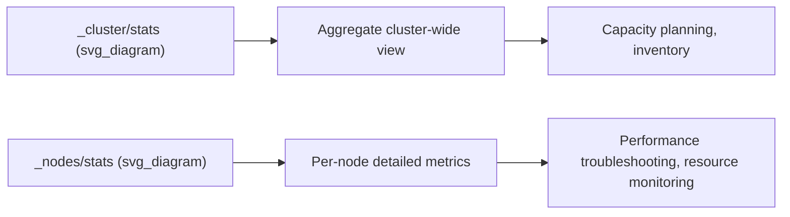
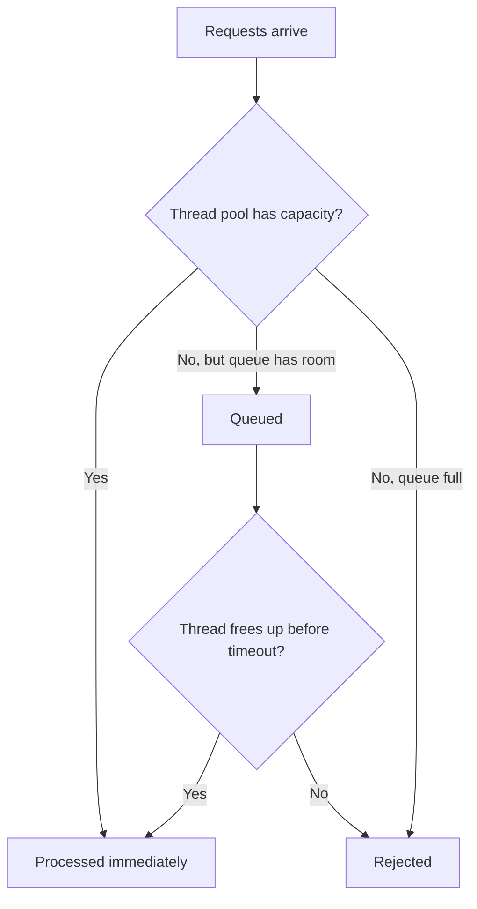

## Cluster Stats and Node Stats

### Overview

Cluster Stats and Node Stats are two related but distinct monitoring APIs. **Cluster Stats** provides aggregate, cluster-wide statistics summarizing the entire deployment as a single unit. **Node Stats** provides detailed, per-node metrics covering resource usage, indexing/search performance, and internal subsystem behavior. Where the Cluster Health API answers "is the cluster okay?", these two APIs answer "what does the cluster look like?" and "what is each node actually doing?"



### Cluster Stats API

```json
GET /_cluster/stats
```

Returns a single aggregated snapshot of cluster-wide characteristics: node counts by role, total index/shard/document counts, aggregate storage size, and version/OS/JVM information across the fleet.

**Key sections in the response:**

```json
{
  "cluster_name": "my-cluster",
  "cluster_uuid": "abc123",
  "status": "green",
  "indices": {
    "count": 42,
    "shards": {
      "total": 84,
      "primaries": 42,
      "replication": 1.0
    },
    "docs": {
      "count": 15000000,
      "deleted": 12000
    },
    "store": {
      "size_in_bytes": 53687091200
    }
  },
  "nodes": {
    "count": {
      "total": 3,
      "data": 3,
      "master": 3,
      "ingest": 3
    },
    "versions": ["8.15.0"],
    "os": {
      "available_processors": 24,
      "allocated_processors": 24
    },
    "jvm": {
      "max_uptime_in_millis": 8640000,
      "mem": {
        "heap_used_in_bytes": 4294967296,
        "heap_max_in_bytes": 8589934592
      }
    }
  }
}
```

**Common uses:**
- Capacity planning and inventory reporting (total docs, storage, shard count across the entire cluster).
- Confirming version consistency across nodes (`versions` array — ideally a single version in a healthy, fully-upgraded cluster).
- Quick aggregate resource snapshot (heap usage, processor counts) without needing per-node granularity.

Cluster Stats is intentionally coarse-grained — it's suited to answering "how big/busy is this cluster overall," not "which specific node is struggling."

### Node Stats API

```json
GET /_nodes/stats
```

Returns comprehensive per-node statistics, broken out by node ID, covering a wide range of subsystems. This is typically the primary API used for performance troubleshooting and detailed resource monitoring.

**Scoping to specific nodes:**

```json
GET /_nodes/node1,node2/stats
```

**Scoping to specific metric categories** (recommended in production to reduce response size and overhead):

```json
GET /_nodes/stats/jvm,os,fs
```

### Key Metric Categories

| Category | Contains |
|---|---|
| `os` | Operating system-level CPU, memory, load average |
| `process` | Process-level CPU, memory, open file descriptors |
| `jvm` | Heap/non-heap memory usage, garbage collection stats, thread counts |
| `fs` | Filesystem/disk usage, available space, I/O stats |
| `indices` | Per-node indexing, search, merge, refresh, flush, and cache statistics |
| `thread_pool` | Queue sizes, rejection counts, active threads per thread pool |
| `transport` | Network transport layer statistics (bytes sent/received, connections) |
| `http` | HTTP layer statistics (open connections, requests) |
| `breakers` | Circuit breaker statistics (trip counts, estimated vs limit memory) |

### JVM and Heap Monitoring

```json
GET /_nodes/stats/jvm
```

```json
{
  "nodes": {
    "node-id-1": {
      "jvm": {
        "mem": {
          "heap_used_percent": 45,
          "heap_used_in_bytes": 3865470976,
          "heap_max_in_bytes": 8589934592
        },
        "gc": {
          "collectors": {
            "young": {
              "collection_count": 15234,
              "collection_time_in_millis": 45200
            },
            "old": {
              "collection_count": 12,
              "collection_time_in_millis": 3400
            }
          }
        }
      }
    }
  }
}
```

`heap_used_percent` is one of the most commonly monitored values — sustained high heap usage (frequently cited around 75-85%+ as a concerning range, though thresholds are workload-dependent) combined with frequent or long old-generation GC pauses can indicate memory pressure affecting node stability and query latency.

### Indexing and Search Performance Metrics

```json
GET /_nodes/stats/indices
```

Returns per-node aggregated statistics across all indices/shards hosted on that node, including:

```json
{
  "indices": {
    "indexing": {
      "index_total": 500000,
      "index_time_in_millis": 125000,
      "index_current": 3
    },
    "search": {
      "query_total": 200000,
      "query_time_in_millis": 890000,
      "query_current": 5,
      "fetch_total": 195000,
      "fetch_time_in_millis": 45000
    },
    "merges": {
      "total": 340,
      "total_time_in_millis": 560000
    },
    "refresh": {
      "total": 8500,
      "total_time_in_millis": 42000
    }
  }
}
```

Dividing `_time_in_millis` by the corresponding `_total` count for a given metric yields an approximate average operation latency for that node over its uptime, useful as a rough performance baseline, though it reflects a cumulative average rather than current/recent latency.

### Thread Pool Stats — Diagnosing Rejections

```json
GET /_nodes/stats/thread_pool
```

```json
{
  "thread_pool": {
    "search": {
      "threads": 13,
      "queue": 0,
      "active": 2,
      "rejected": 0,
      "completed": 450000
    },
    "write": {
      "threads": 8,
      "queue": 15,
      "active": 8,
      "rejected": 42,
      "completed": 890000
    }
  }
}
```

A non-zero and growing `rejected` count on a thread pool (commonly `write` or `search`) is a strong signal of a node being overwhelmed for that operation type — requests are being actively refused rather than queued indefinitely, which typically manifests as client-visible errors (e.g., `EsRejectedExecutionException`).



### Circuit Breaker Stats

```json
GET /_nodes/stats/breakers
```

Circuit breakers prevent operations from causing out-of-memory errors by estimating memory usage in advance and rejecting operations that would exceed configured limits. A rising `tripped` count on any breaker (e.g., `fielddata`, `request`, `parent`) indicates operations are being proactively blocked to protect node stability, which — while preventing an OOM crash — signals that queries or aggregations are approaching memory limits and may need optimization or resource scaling.

### Filesystem Stats — Disk Monitoring

```json
GET /_nodes/stats/fs
```

```json
{
  "fs": {
    "total": {
      "total_in_bytes": 500107862016,
      "free_in_bytes": 123456789012,
      "available_in_bytes": 118456789012
    }
  }
}
```

Disk space monitoring here ties directly into **disk-based shard allocation watermarks** — nodes approaching configured low/high watermark thresholds will have shard allocation restricted or existing shards relocated away, which often first surfaces as unexpected `unassigned_shards` in cluster health output.

### Cluster Stats vs Node Stats — When to Use Which

| Scenario | Preferred API |
|---|---|
| "How big is our cluster overall?" | Cluster Stats |
| "Which specific node is running hot on CPU/heap?" | Node Stats |
| Capacity planning / executive reporting | Cluster Stats |
| Diagnosing slow queries on a specific node | Node Stats (`indices`, `thread_pool`) |
| Confirming all nodes are on the same version | Cluster Stats |
| Investigating rejected requests | Node Stats (`thread_pool`) |
| Checking for memory pressure causing instability | Node Stats (`jvm`, `breakers`) |

### Common Pitfalls

- **Requesting all node stats categories on every polling interval in production monitoring**: `GET /_nodes/stats` without scoping returns a very large payload; scoping to needed categories (`jvm`, `os`, `fs`, `thread_pool`, etc.) reduces overhead for frequent polling.
- **Treating cluster stats as real-time per-node troubleshooting data**: cluster stats aggregates across the whole cluster and cannot identify which individual node is the source of a problem.
- **Ignoring cumulative nature of `_time_in_millis` and `_total` fields**: these accumulate since node start (or since stats reset), so a sudden spike is easier to detect via repeated polling and delta calculation than from a single snapshot.
- **Not correlating thread pool rejections with client-side errors**: rejected counts in node stats are the server-side confirmation of what clients may be experiencing as failed requests, and are often the fastest way to confirm a capacity problem rather than a bug.
- **Overlooking circuit breaker trips as a "soft" issue**: a tripped breaker prevented a crash, but it also means a request failed — recurring trips warrant investigation into query patterns or resource sizing, not just relief that a crash was avoided.

### Related Topics

- Cluster Health API — Status and Shard Allocation
- Thread Pools — Types and Sizing
- Circuit Breakers — Memory Protection
- Disk-Based Shard Allocation and Watermarks
- JVM Heap Sizing and Garbage Collection Tuning