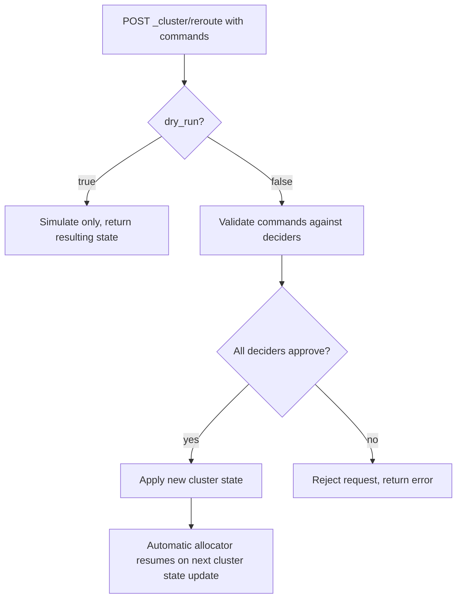

## Cluster Reroute API

### Overview

The cluster reroute API allows explicit, manual control over shard allocation, overriding the normal automatic decisions made by the master node's allocator. It's primarily a diagnostic and recovery tool — used to manually move shards, force allocation of otherwise-unassigned shards, or cancel in-progress shard relocations — rather than something used in routine cluster operation.

### Basic Syntax

```
POST _cluster/reroute
{
  "commands": [
    {
      "move": {
        "index": "logs-2026.08",
        "shard": 0,
        "from_node": "node-1",
        "to_node": "node-2"
      }
    }
  ]
}
```

Multiple commands can be included in a single request; they are applied as a batch, and the API validates the resulting cluster state before committing.

### Available Commands

- **move** — relocates a started shard from one node to another
- **cancel** — cancels allocation of a shard (in-progress relocation or unassigned shard); supports an `allow_primary` flag to permit canceling a primary, which effectively deletes the shard's data unless a copy exists elsewhere
- **allocate_replica** — allocates an unassigned replica shard to a specified node
- **allocate_stale_primary** — forces allocation of a primary shard using a stale copy (one that may be missing recent writes), used in data-loss recovery scenarios
- **allocate_empty_primary** — forces allocation of a primary shard as a brand-new empty shard, discarding all existing data for that shard

`allocate_stale_primary` and `allocate_empty_primary` are destructive or data-loss-accepting operations and require `accept_data_loss: true` in the command body.

### Example: Forcing Allocation of an Unassigned Shard

```
POST _cluster/reroute
{
  "commands": [
    {
      "allocate_empty_primary": {
        "index": "logs-2026.08",
        "shard": 3,
        "node": "node-2",
        "accept_data_loss": true
      }
    }
  ]
}
```

This is typically a last-resort action, used when a primary shard is unassigned and no viable copy exists anywhere in the cluster (e.g., after permanent loss of the nodes holding its data), and the operator has decided that having an empty, functioning shard is preferable to leaving the index red indefinitely.

### Query Parameters

- `dry_run` — when `true`, returns the resulting cluster state without actually applying the commands, useful for validating a reroute plan before committing
- `explain` — when `true`, includes decider-level explanations for why a command would or wouldn't be accepted
- `retry_failed` — when `true`, retries allocation of shards that failed allocation too many times and were left unassigned with `allocation_status: no_attempt` due to hitting `index.allocation.max_retries`

### Example: Dry Run with Explanation

```
POST _cluster/reroute?dry_run=true&explain=true
{
  "commands": [
    {
      "move": {
        "index": "logs-2026.08",
        "shard": 1,
        "from_node": "node-1",
        "to_node": "node-3"
      }
    }
  ]
}
```

The response includes a `yes_decisions` and `no_decisions` breakdown per decider, showing exactly which allocation deciders (e.g., `disk_threshold`, `same_shard`, `awareness`) would allow or block the move.

### Relationship to Automatic Allocation

Manual reroute commands don't disable the automatic allocator permanently — after a manual command is applied, normal automatic allocation resumes and may itself move shards again in subsequent cluster state updates, unless the underlying condition that necessitated intervention (e.g., a disabled allocation setting) is also addressed. For sustained manual control, it's common to pair reroute commands with `cluster.routing.allocation.enable` settings that restrict automatic allocation:

```
PUT _cluster/settings
{
  "persistent": {
    "cluster.routing.allocation.enable": "none"
  }
}
```

Valid values are `all` (default), `primaries`, `new_primaries`, and `none`.

### Reroute Decision Flow



### When Reroute Is Typically Used

- Manually rebalancing shards when automatic balancing hasn't converged to a desired distribution within an acceptable time
- Recovering from a red cluster status where shards are unassigned and automatic retries have been exhausted
- Forcing allocation after intentionally taking nodes offline for maintenance, when automatic allocation delay settings haven't yet kicked in
- Diagnosing allocation blocks via `explain=true` without a plan to actually reroute anything

[Inference] Because `allocate_stale_primary` and `allocate_empty_primary` can result in permanent data loss, most operational guidance treats manual reroute as a tool for experienced operators responding to a specific incident rather than something to script into routine automation — though the appropriateness of any automation depends heavily on the specific failure scenario and an organization's own recovery procedures, which are outside what the API itself can determine.

### Common Pitfalls

- Using `move` on a shard that hasn't finished initializing — only `STARTED` shards can be moved this way; relocating an initializing shard requires canceling it first.
- Forgetting that `cluster.routing.allocation.enable: none` blocks all allocation, including replica allocation needed for normal resilience, if left set for an extended period.
- Running `allocate_empty_primary` without confirming no other copy of the data exists anywhere (including in a snapshot repository, which could instead be used for a non-destructive restore).
- Assuming a successful reroute response means the shard has finished relocating — reroute only initiates the state change; actual data copying happens asynchronously and should be monitored via `_cat/recovery` or `_cluster/health`.
- Omitting `explain=true` during troubleshooting and missing the specific decider responsible for a rejected allocation.

**Related Topics**
- Cluster Allocation Explain API
- Shard Allocation and Awareness
- Cluster Health API
- Snapshot and Restore
- Disk-Based Shard Allocation (Watermarks)