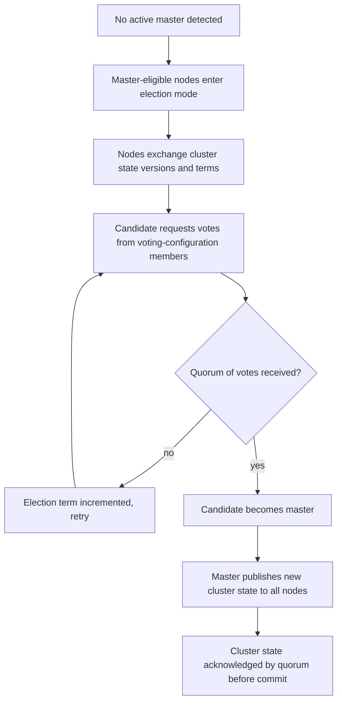

## Master Node Election

### Overview

Master node election is the process by which nodes eligible to act as master coordinate to select a single active master for the cluster. The master node is responsible for cluster-wide, non-data-plane actions: creating and deleting indices, tracking which nodes are part of the cluster, deciding shard allocation, and maintaining the authoritative cluster state that every other node replicates. Elasticsearch uses a Raft-inspired consensus protocol for this, rather than a fixed or manually assigned master.

### Master-Eligible Nodes

Any node can be configured to be master-eligible via its `node.roles` setting:

```yaml
node.roles: [ master, data, ingest ]
```

A node with only `master` in its roles (no `data`) is a **dedicated master node** — it participates in cluster state management but doesn't hold shard data or serve search/index requests. In production clusters of meaningful size, dedicated master-eligible nodes are commonly used to isolate cluster coordination from the resource demands of indexing and search.

### The Election Process

Elasticsearch's cluster coordination layer (based on a protocol influenced by Raft) requires a majority (quorum) of master-eligible nodes to agree before a master can be elected or before cluster state updates can be committed. This is expressed through **voting configurations** — the set of master-eligible node IDs that participate in quorum-based decisions.

$$
\text{quorum} = \left\lfloor \frac{n}{2} \right\rfloor + 1
$$

where $n$ is the number of master-eligible nodes in the voting configuration. For a 3-master-eligible-node cluster, quorum is 2; for 5, quorum is 3.

**Why odd numbers matter**

Clusters are conventionally configured with an odd number of master-eligible nodes (commonly 3 or 5). An even number doesn't provide additional fault tolerance over the next-lowest odd number and increases the risk of an unresolvable tie during network partition scenarios — a 4-node voting configuration tolerates the same single-node loss as a 3-node one, but requires one more node to be available for quorum.

### Election Sequence



Each election attempt is associated with a **term**, a monotonically increasing counter that prevents stale election results from being applied — a node that was partitioned away and comes back cannot override a more recent election with outdated information, since its term will be lower.

### Cluster State Publication

Once elected, the master doesn't unilaterally impose cluster state changes. Each cluster state update is published to all nodes, and the master waits for acknowledgment from a quorum of master-eligible nodes before considering the update committed. This ensures that a cluster state change (e.g., an index creation) survives even if the master immediately fails afterward, since a quorum of nodes already has the update.

### Diagnosing Master Status

```
GET _cat/master?v
```

Returns the current elected master's node ID, IP, and name.

```
GET _cluster/state/master_node
```

Returns the master node information as part of the broader cluster state document.

```
GET _cluster/health?v
```

The `status` field (`green`/`yellow`/`red`) reflects shard-level health, not master election directly, but a cluster without an elected master will typically report as unavailable for most operations, and dedicated master election issues often surface first as request timeouts rather than a health color change.

### Voting Configuration Exclusions

When permanently removing a master-eligible node from a cluster (e.g., during planned downscaling), the voting configuration should be updated explicitly rather than left to detect the node's absence implicitly:

```
POST _cluster/voting_config_exclusions?node_names=node-3
```

This tells the cluster to exclude the specified node from future voting configurations, allowing quorum calculations to adjust immediately rather than waiting for a timeout-based determination that the node is gone. Exclusions should be cleared after the node is fully removed:

```
DELETE _cluster/voting_config_exclusions
```

### Split-Brain Prevention

[Inference] Prior to Elasticsearch's adoption of the Raft-based coordination layer (introduced as the default in 6.x and refined in subsequent versions), clusters relied on a manually configured `minimum_master_nodes` setting to prevent split-brain scenarios — where a network partition results in two separate groups of nodes each electing their own master. The modern coordination subsystem removes the need for that manual setting by managing quorum requirements automatically based on the voting configuration, though clusters upgraded from very old versions may still reference the legacy setting in historical documentation, which is no longer applicable to current versions.

### Practical Notes

- A cluster with only a single master-eligible node has no quorum protection — losing that node (even temporarily) makes the cluster unable to process cluster-state-changing operations until it returns, though existing indices generally remain readable/writable for data operations already routed.
- `cluster.election.max_timeout` and related low-level election settings exist for tuning election behavior under high-latency network conditions but are rarely adjusted from defaults.
- Dedicated master nodes are typically provisioned with modest CPU/memory relative to data nodes, since their workload is coordination rather than search/indexing, but they benefit from stable, low-latency network connectivity to the rest of the cluster.
- Master election time contributes to cluster unavailability windows during master node restarts or failures; minimizing unnecessary master-eligible node restarts reduces the frequency of election events.

### Common Pitfalls

- Running an even number of master-eligible nodes, under the mistaken assumption that more nodes always means more resilience.
- Failing to use voting configuration exclusions when decommissioning a master-eligible node, leading to a cluster that still expects votes from a node that will never respond.
- Conflating master-eligible with master-only — assuming a node with `master` in its roles is a dedicated master node, when it may also hold data and ingest roles.
- Assuming a `green` cluster health status guarantees master stability — health status reflects shard allocation, not the frequency or stability of master elections.
- Deploying master-eligible nodes across unreliable or high-latency network links between them, which can cause spurious elections due to missed heartbeats even without an actual node failure.

**Related Topics**
- Cluster Health API
- Node Roles (master, data, ingest, coordinating)
- Cluster Settings API
- Cat APIs (`_cat/master`, `_cat/nodes`)
- Split-Brain and Quorum-Based Consensus