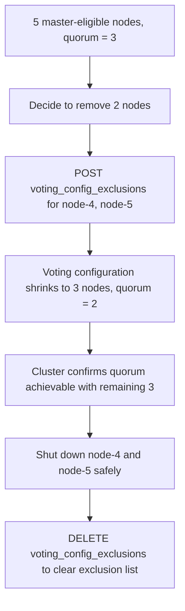

## Voting Configuration

### Overview

The voting configuration is the specific set of master-eligible nodes whose votes count toward quorum decisions in cluster coordination — electing a master and committing cluster state updates. It's a distinct concept from "all master-eligible nodes currently in the cluster": the voting configuration is a deliberately managed subset (or full set) used specifically for quorum arithmetic, and Elasticsearch adjusts it automatically under most circumstances.

### Relationship to Master-Eligible Nodes

Every master-eligible node is a candidate to be part of the voting configuration, but the voting configuration itself is what determines quorum:

$$
\text{quorum} = \left\lfloor \frac{|V|}{2} \right\rfloor + 1
$$

where $V$ is the voting configuration (not necessarily every master-eligible node currently online). Under normal operation, Elasticsearch keeps the voting configuration equal to the set of currently known master-eligible nodes, automatically adding newly joined master-eligible nodes and removing ones that have been cleanly excluded.

### Automatic Adjustment

When a master-eligible node joins the cluster, it's automatically added to the voting configuration. When a master-eligible node leaves gracefully or is excluded (see below), it's automatically removed. This automatic reconciliation is what allows most cluster scaling operations to proceed without manual quorum management.

The important distinction is between:

- **Node leaves and comes back** — the voting configuration doesn't need adjustment; quorum arithmetic continues to include the node once it's confirmed unreachable is treated only as a temporary condition, not a permanent removal
- **Node is permanently removed** — the voting configuration should be explicitly updated via exclusions, otherwise quorum calculations continue to account for a node that will never return, potentially making quorum harder or impossible to reach

### Voting-Only Nodes

A master-eligible node can be configured as **voting-only**, meaning it participates in voting for quorum purposes but can never itself be elected master:

```yaml
node.roles: [ master, voting_only, data, ingest ]
```

Voting-only nodes are used to make up quorum numbers (e.g., turning a 2-master-eligible-node setup into a 3-vote quorum-safe configuration) without dedicating additional nodes purely to mastership, allowing an existing data node to also contribute a vote.

### Voting Configuration Exclusions

To permanently remove a master-eligible node — such as during a planned downscale — the voting configuration should be updated explicitly, using the exclusions API:

```
POST _cluster/voting_config_exclusions?node_names=node-3
```

Or by persistent node ID rather than name, which is more robust if node names could be reused:

```
POST _cluster/voting_config_exclusions?node_ids=abc123xyz
```

This instructs the cluster to shrink the voting configuration to exclude the specified node(s) once it's safe to do so — typically once quorum can still be achieved with the smaller set. The node can then be shut down without the cluster continuing to wait on its votes.

**Checking current exclusions**

```
GET _cluster/state/metadata?filter_path=metadata.cluster_coordination.voting_config_exclusions
```

**Clearing exclusions**

```
DELETE _cluster/voting_config_exclusions
```

Exclusions should be cleared once the excluded node has actually been removed from the cluster (or if the removal is abandoned), since stale exclusions can accumulate and complicate future coordination if the same node name or ID is reused.

### Example Scenario: Downscaling from 5 to 3 Master-Eligible Nodes



Attempting to shut down node-4 and node-5 without first applying exclusions risks a period where the voting configuration still expects 5 votes while only 3 nodes are reachable — which is below quorum (3 needed) only if both removed nodes are counted as still-required voters, and could result in the cluster being unable to elect a master or commit state changes.

### Practical Notes

- Voting configuration exclusions are a one-time operational action, not a persistent setting meant to be maintained indefinitely — bloated exclusion lists from nodes removed long ago should be cleared.
- Voting-only master-eligible nodes are commonly combined with the `data` role in smaller clusters where dedicating a node purely to voting isn't justified by cluster size.
- A cluster cannot have zero nodes in its voting configuration; at least one master-eligible node must always remain votable, or the cluster cannot make coordination decisions at all.
- Exclusions apply by node name or persistent node ID; using ephemeral identifiers that change on restart would defeat the purpose of tracking a specific physical/logical node for removal.

[Inference] Because automatic voting configuration management handles the vast majority of day-to-day scaling operations (adding nodes, rolling restarts, temporary node loss), explicit interaction with the voting configuration exclusions API is generally only necessary for permanent, deliberate node removal — routine autoscaling or rolling upgrade tooling built around current Elasticsearch versions typically doesn't need to call this API directly, though this can depend on how a given orchestration platform (e.g., ECK, a custom Kubernetes operator) manages master-eligible node lifecycle.

### Common Pitfalls

- Shutting down multiple master-eligible nodes simultaneously without first excluding them, risking a temporary or permanent loss of quorum.
- Forgetting to clear exclusions after a node removal is complete, leading to a stale exclusion list that can cause confusion if a new node reuses the same name.
- Assuming voting-only nodes reduce quorum requirements — they still count toward the quorum denominator; they only change which nodes are eligible to become master.
- Manually editing `elasticsearch.yml` role settings to remove `master` from a running node's roles as a way to "remove" it from the voting configuration, instead of using the exclusions API — role changes require a restart and don't safely handle in-flight quorum accounting on their own.
- Excluding a node and then never actually removing it, leaving the cluster running indefinitely with a voting configuration smaller than the actual set of master-eligible nodes present.

**Related Topics**
- Master Node Election
- Node Roles (master, data, ingest, voting_only, coordinating)
- Cluster Health API
- Rolling Upgrades and Cluster Restart Procedures
- Cluster Settings API