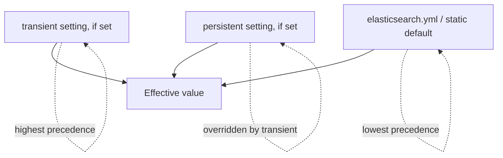

## Cluster Settings (Transient vs. Persistent)

### Overview

Elasticsearch cluster settings can be updated dynamically at runtime via the `_cluster/settings` API, without restarting nodes. Historically, these dynamic updates could be applied in one of two scopes — **transient** (cleared on cluster restart) or **persistent** (retained across restarts) — a distinction that has been deprecated in newer versions in favor of persistent-only dynamic settings.

### Basic Syntax

```
PUT _cluster/settings
{
  "persistent": {
    "cluster.routing.allocation.enable": "all"
  },
  "transient": {
    "indices.recovery.max_bytes_per_sec": "100mb"
  }
}
```

Both blocks can be included in the same request, applying different settings to each scope.

### Persistent Settings

Persistent settings survive a full cluster restart. They're stored as part of the cluster state and are the appropriate choice for any setting intended as a long-term operational configuration — allocation awareness attributes, watermark thresholds, or similar settings meant to remain in effect indefinitely.

```
PUT _cluster/settings
{
  "persistent": {
    "cluster.routing.allocation.disk.watermark.low": "85%",
    "cluster.routing.allocation.disk.watermark.high": "90%"
  }
}
```

### Transient Settings (Deprecated)

Transient settings apply immediately but are cleared automatically whenever the cluster fully restarts (i.e., loses and re-establishes its cluster state from scratch). They were historically used for temporary operational adjustments — for example, throttling recovery bandwidth during a known maintenance window, without leaving that throttle in place permanently by accident.

[Unverified] The exact Elastic Stack version in which transient settings were formally deprecated in favor of persistent-only settings should be confirmed against current documentation, since this deviates from a well-established, stable API detail and reflects a specific version-dependent deprecation timeline; deployments on older versions may still rely on transient settings as documented for that version.

Because of the deprecation, most current guidance recommends using `persistent` for all dynamic cluster settings and instead explicitly resetting a setting to `null` when a temporary change should be undone, rather than relying on a restart to clear it:

```
PUT _cluster/settings
{
  "persistent": {
    "indices.recovery.max_bytes_per_sec": null
  }
}
```

Setting a value to `null` resets it to its default.

### Viewing Current Settings

```
GET _cluster/settings
```

By default, this returns only settings that have been explicitly set (transient and persistent blocks), omitting defaults. To include default values for context:

```
GET _cluster/settings?include_defaults=true&flat_settings=true
```

The `flat_settings` parameter renders dotted setting names as flat keys (e.g., `"cluster.routing.allocation.enable": "all"`) rather than as nested JSON objects, which is often easier to scan for a specific setting.

### Precedence

When the same setting is specified in multiple places, Elasticsearch applies a defined precedence order:



Transient settings (where still supported) take precedence over persistent settings, which in turn take precedence over the static value in `elasticsearch.yml` or the built-in default. In versions where transient settings are deprecated or removed, persistent settings become the highest-precedence dynamic override.

### Dynamic vs. Static Settings

Not all cluster settings can be changed via this API at all. Settings fall into three categories:

- **Dynamic** — can be changed at runtime via `_cluster/settings`, on any node, without a restart
- **Static** — can only be set in `elasticsearch.yml` (or via startup parameters) and require a node restart to change; typically settings tied to node identity or low-level resource allocation (e.g., `node.name`, `path.data`)
- **Index-level dynamic/static** — a parallel distinction exists for index settings, updated via `_settings` on a specific index rather than cluster-wide

Attempting to set a static setting via the cluster settings API returns an error indicating the setting is not dynamically updatable.

### Example: Common Persistent Settings

```
PUT _cluster/settings
{
  "persistent": {
    "cluster.routing.allocation.awareness.attributes": "zone",
    "cluster.routing.allocation.disk.watermark.low": "85%",
    "cluster.routing.allocation.disk.watermark.high": "90%",
    "cluster.max_shards_per_node": 1000,
    "action.destructive_requires_name": true
  }
}
```

`action.destructive_requires_name` is a commonly set safety setting that requires wildcard-free, explicit index names for destructive operations like delete, preventing an accidental `DELETE *` or similarly broad wildcard match.

### Practical Notes

- Settings changed via the cluster settings API apply cluster-wide and take effect immediately for dynamic settings — no rolling restart is needed.
- `GET _cluster/settings` without `include_defaults=true` can appear to return an "empty" cluster if no settings have ever been explicitly overridden, which is expected — defaults are still in effect, just not shown.
- Some settings accept both a persistent and transient value simultaneously; if unsure which is currently in effect, `flat_settings=true` combined with checking both blocks in the response clarifies the active override.
- Resetting with `null` is the recommended way to remove an explicit override in versions without transient settings, rather than relying on a restart-based clearing mechanism that transient settings provided.

### Common Pitfalls

- Relying on transient settings for a change intended to be permanent, only to have it silently disappear on the next full cluster restart, in versions/configurations where transient settings are still honored.
- Assuming setting a value to an empty string clears an override — the correct way to reset a dynamic setting to default is `null`, not `""`.
- Attempting to change a static setting through the API and being confused by the resulting validation error, rather than editing `elasticsearch.yml` and restarting the affected node.
- Not using `flat_settings=true` when troubleshooting, making it harder to visually scan deeply nested setting paths in the JSON response.
- Forgetting `action.destructive_requires_name` is set to `true` in a given cluster, causing scripted deletion logic that relies on wildcard index patterns to fail unexpectedly.

**Related Topics**
- Cluster Health API
- Disk-Based Shard Allocation (Watermarks)
- Index-Level Settings (dynamic vs. static)
- Master Node Election
- Shard Allocation and Awareness