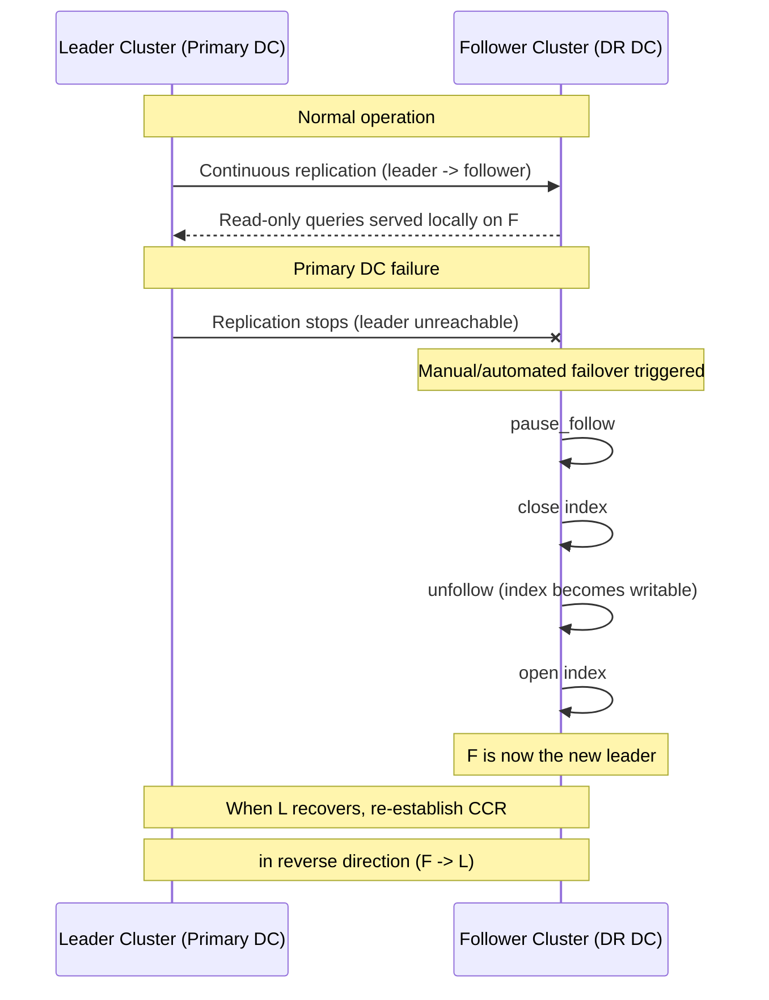

## Cross-Cluster Replication (CCR)

### Overview

Cross-cluster replication is a mechanism that continuously copies indices from a leader cluster to one or more follower clusters. Replication happens at the shard level: each follower shard pulls operations from its corresponding leader shard's transaction log (translog) and replays them locally. This differs fundamentally from cross-cluster search (CCS), which queries remote clusters live without duplicating data. CCR physically duplicates data, so queries against the follower index run entirely locally, with no network hop to the leader at query time.

CCR requires the appropriate license tier (a subscription/platinum-equivalent feature in the Elastic Stack licensing model), and both leader and follower clusters must run compatible Elasticsearch versions.

### Core Use Cases

- **Disaster recovery**: Maintain a warm/hot standby cluster in a separate data center or region that can be promoted if the primary cluster fails.
- **Geo-proximity**: Replicate data closer to users in different geographic regions to reduce query latency, since reads against a follower index are served entirely from local data.
- **Centralized reporting/analytics**: Aggregate data from multiple regional clusters into a central cluster for cross-region analysis.
- **Load distribution**: Offload read-heavy workloads to follower clusters, isolating them from the leader cluster's indexing load.

### Architecture and Replication Model

CCR operates as **active-passive** at the index level: the follower index is read-only and cannot accept direct writes. All writes must occur on the leader index. Internally, a follower shard task runs on the follower cluster, periodically polling the leader shard for new operations via a lightweight, persistent connection using the shared transport layer.

Key architectural points:

- Replication is **near-real-time**, not synchronous. There is a lag between an operation completing on the leader and appearing on the follower, though this lag is typically low (often sub-second to a few seconds under normal load) [Unverified — actual lag depends on network conditions, cluster load, and operation volume].
- Each follower shard maps to exactly one leader shard; shard counts between leader and follower indices must match.
- CCR uses **remote clusters** configured via `cluster.remote.<cluster_alias>.seeds` (or API-based remote cluster settings), establishing the connection over which replication traffic flows.

<svg xmlns="http://www.w3.org/2000/svg" viewBox="0 0 820 420">
  <title>CCR Replication Architecture (svg_diagram)</title>
  <text x="410" y="30" font-size="18" font-weight="bold" text-anchor="middle" fill="#222">CCR Replication Architecture (svg_diagram)</text>

  
  <rect x="40" y="70" width="320" height="300" rx="10" fill="#eef4ff" stroke="#3b6fc9" stroke-width="2" />
  <text x="200" y="95" font-size="15" font-weight="bold" text-anchor="middle" fill="#1a3d7c">Leader Cluster</text>

  <rect x="70" y="120" width="260" height="60" rx="6" fill="#ffffff" stroke="#3b6fc9" />
  <text x="200" y="145" font-size="13" text-anchor="middle" fill="#222">Leader Index</text>
  <text x="200" y="163" font-size="11" text-anchor="middle" fill="#555">(accepts writes)</text>

  <rect x="70" y="200" width="115" height="50" rx="6" fill="#ffffff" stroke="#3b6fc9" />
  <text x="127" y="230" font-size="12" text-anchor="middle" fill="#222">Shard 0</text>

  <rect x="215" y="200" width="115" height="50" rx="6" fill="#ffffff" stroke="#3b6fc9" />
  <text x="272" y="230" font-size="12" text-anchor="middle" fill="#222">Shard 1</text>

  <rect x="70" y="280" width="260" height="60" rx="6" fill="#fff7e6" stroke="#c98b1a" />
  <text x="200" y="305" font-size="12" text-anchor="middle" fill="#222">Translog</text>
  <text x="200" y="323" font-size="11" text-anchor="middle" fill="#555">(operation history)</text>

  
  <rect x="460" y="70" width="320" height="300" rx="10" fill="#eefaf0" stroke="#2f9e52" stroke-width="2" />
  <text x="620" y="95" font-size="15" font-weight="bold" text-anchor="middle" fill="#1c6b36">Follower Cluster</text>

  <rect x="490" y="120" width="260" height="60" rx="6" fill="#ffffff" stroke="#2f9e52" />
  <text x="620" y="145" font-size="13" text-anchor="middle" fill="#222">Follower Index</text>
  <text x="620" y="163" font-size="11" text-anchor="middle" fill="#555">(read-only)</text>

  <rect x="490" y="200" width="115" height="50" rx="6" fill="#ffffff" stroke="#2f9e52" />
  <text x="547" y="230" font-size="12" text-anchor="middle" fill="#222">Shard 0</text>

  <rect x="635" y="200" width="115" height="50" rx="6" fill="#ffffff" stroke="#2f9e52" />
  <text x="692" y="230" font-size="12" text-anchor="middle" fill="#222">Shard 1</text>

  <rect x="490" y="280" width="260" height="60" rx="6" fill="#f1f1f1" stroke="#666" />
  <text x="620" y="305" font-size="12" text-anchor="middle" fill="#222">Follower Shard Task</text>
  <text x="620" y="323" font-size="11" text-anchor="middle" fill="#555">(polls leader translog)</text>

  
  <line x1="360" y1="230" x2="460" y2="230" stroke="#555" stroke-width="2" marker-end="url(#arrow)" />
  <text x="410" y="220" font-size="11" text-anchor="middle" fill="#333">pull ops</text>

  <line x1="200" y1="180" x2="200" y2="200" stroke="#3b6fc9" stroke-width="1.5" marker-end="url(#arrow)" />
  <line x1="200" y1="250" x2="200" y2="280" stroke="#c98b1a" stroke-width="1.5" marker-end="url(#arrow)" />

  <line x1="620" y1="250" x2="620" y2="280" stroke="#2f9e52" stroke-width="1.5" />
  <line x1="620" y1="280" x2="620" y2="180" stroke="#2f9e52" stroke-width="1.5" marker-end="url(#arrow)" />

  <text x="410" y="400" font-size="11" text-anchor="middle" fill="#777">Remote cluster connection (transport layer)</text>
  <line x1="80" y1="390" x2="740" y2="390" stroke="#999" stroke-dasharray="4,3" />
</svg>

### Prerequisites and Setup

**1. Configure the remote cluster** on the follower cluster, pointing to the leader:

```
PUT _cluster/settings
{
  "persistent": {
    "cluster": {
      "remote": {
        "leader_cluster": {
          "seeds": ["10.0.1.10:9300", "10.0.1.11:9300"]
        }
      }
    }
  }
}
```

For cloud-hosted deployments, remote clusters can alternatively be configured using cross-cluster API keys, which avoid exchanging full node lists and instead use a lightweight API key–based trust model.

**2. Enable soft deletes on the leader index** (required for CCR; this is the default for newly created indices in modern Elasticsearch versions):

```
PUT /my-leader-index
{
  "settings": {
    "index.soft_deletes.enabled": true
  }
}
```

Soft deletes retain a history of delete operations in Lucene so the follower can replay them correctly rather than simply losing track of deleted documents.

**3. Create the follower index**, referencing the leader:

```
PUT /my-follower-index/_ccr/follow
{
  "remote_cluster": "leader_cluster",
  "leader_index": "my-leader-index",
  "max_read_request_operation_count": 5120,
  "max_outstanding_read_requests": 12,
  "max_read_request_size": "32mb",
  "max_write_request_operation_count": 5120,
  "max_write_request_size": "9223372036854775807b",
  "max_outstanding_write_requests": 9,
  "max_write_buffer_count": 2147483647,
  "max_write_buffer_size": "512mb",
  "max_retry_delay": "500ms",
  "read_poll_timeout": "1m"
}
```

This call creates the follower index (with the same mappings and settings as the leader) and begins the replication process immediately.

### Auto-Follow Patterns

For scenarios where new indices are periodically created on the leader (e.g., daily/rolling indices, common with logs or time-series data), manually creating a follow relationship for each new index is impractical. **Auto-follow patterns** solve this by automatically converting newly created leader indices matching a pattern into followers.

```
PUT /_ccr/auto_follow/logs-pattern
{
  "remote_cluster": "leader_cluster",
  "leader_index_patterns": ["logs-*"],
  "leader_index_exclusion_patterns": ["logs-internal-*"],
  "follow_index_pattern": "{{leader_index}}-copy"
}
```

- `leader_index_patterns` — indices on the leader matching this pattern are auto-followed.
- `follow_index_pattern` — template for naming the resulting follower index, with `{{leader_index}}` substituted.
- Auto-follow patterns are commonly paired with **Index Lifecycle Management (ILM)** on the follower side, using a distinct ILM policy that doesn't attempt to manage a still-actively-replicating index the same way as a standalone index.

### Monitoring Replication Status

**Follower stats** — per-shard replication progress and error state:

```
GET /my-follower-index/_ccr/stats
```

Key fields returned include:
- `leader_global_checkpoint` / `follower_global_checkpoint` — used to gauge replication lag between leader and follower.
- `operations_read` / `operations_written` — cumulative operation counts.
- `fatal_exception` — populated if replication for that shard has halted due to an unrecoverable error (e.g., a mapping conflict).

**Auto-follow stats**:

```
GET /_ccr/auto_follow/stats
```

Surfaces counts of successfully and unsuccessfully auto-followed indices, along with recent errors.

### Pausing, Resuming, and Unfollowing

Replication can be paused without discarding the relationship, which is useful for maintenance windows:

```
POST /my-follower-index/_ccr/pause_follow
POST /my-follower-index/_ccr/resume_follow
```

To permanently sever the relationship and convert the follower into a normal, standalone, writable index:

```
POST /my-follower-index/_ccr/pause_follow
POST /my-follower-index/_close
POST /my-follower-index/_ccr/unfollow
POST /my-follower-index/_open
```

The index must be closed before unfollowing and reopened afterward. Once unfollowed, the index accepts direct writes like any regular index, but it permanently loses its link back to the leader.

### Failover and Disaster Recovery Workflow

A common CCR pattern uses **bidirectional configuration** so either cluster can serve as leader after a failover, though only one direction is active at any given time.



**Key Points**

- Failover to the follower cluster is **not automatic** — it requires deliberate operational action (pause → close → unfollow → open) to make the follower writable.
- After failover, applications must be redirected (e.g., via DNS, load balancer, or client configuration) to the newly promoted cluster.
- Re-establishing replication in the reverse direction after the original leader recovers requires setting up a fresh follow relationship; CCR does not automatically reconcile divergent write histories if both clusters accepted writes independently. [Inference — this follows from CCR's single-writer model, though exact reconciliation behavior for edge cases should be verified against current documentation for the deployed version.]

### Bi-Directional Replication

Elasticsearch supports configuring CCR in both directions between two clusters — Cluster A follows some indices from Cluster B, while Cluster B follows different indices from Cluster A. This enables an active-active-like topology at the *index* level, though any single index is still only writable in one cluster at a time. This is typically used to give each region a local, low-latency copy of the other region's data while retaining a single source of truth per index.

### Handling Mapping and Setting Changes

When mappings or settings change on the leader index, CCR automatically propagates compatible changes (e.g., adding a new field mapping) to the follower. However:

- **Non-additive mapping changes** (e.g., changing a field's type) are not supported and can cause replication to fail with a `fatal_exception` on the affected shard.
- **Index settings** that are replicated include most dynamic settings; static settings fixed at index creation (like shard count) cannot diverge between leader and follower by definition, since follower shard count must match the leader.

### Performance Tuning Parameters

The follow request parameters shown earlier directly control replication throughput and resource usage:

| Parameter | Purpose |
|---|---|
| `max_read_request_operation_count` | Max operations fetched per read from the leader |
| `max_outstanding_read_requests` | Concurrent in-flight read requests to the leader |
| `max_write_request_operation_count` | Max operations applied per write batch on the follower |
| `max_outstanding_write_requests` | Concurrent in-flight write batches on the follower |
| `read_poll_timeout` | How long a read request waits for new operations before returning empty |

Tuning these upward can increase replication throughput at the cost of higher memory and network usage on both clusters; tuning them downward reduces resource pressure but increases replication lag. [Inference — general throughput/resource tradeoff pattern common to batched pull-based replication systems; precise numeric impact depends on workload and hardware.]

### CCR vs. Cross-Cluster Search (CCS)

| Aspect | CCR | CCS |
|---|---|---|
| Data location | Physically duplicated on follower | Remains only on remote cluster |
| Query-time network hop | None (local read) | Required (remote query) |
| Write capability on copy | Read-only follower | N/A — no copy exists |
| Primary use case | DR, geo-locality, load isolation | Federated search without duplication |
| Storage cost | Doubles (or multiplies) storage | No additional storage |

The two are complementary and can be combined: CCS can query across a mix of local indices, CCR follower indices, and other remote clusters simultaneously.

**Conclusion**

Cross-cluster replication provides shard-level, near-real-time, pull-based replication from a leader to one or more follower clusters, enabling disaster recovery, geo-distributed reads, and workload isolation. It requires soft deletes on the leader, a configured remote cluster connection, and — for dynamic index sets — auto-follow patterns tied to ILM. Failover is a manual, multi-step process (pause, close, unfollow, open) rather than an automatic switch, and mapping changes must remain additive to avoid halting replication.

**Related Topics**

- Index Lifecycle Management (ILM) integration with CCR auto-follow
- Cross-cluster search (CCS) and federated querying patterns
- Remote cluster configuration models (seed-based vs. API key–based)
- Soft deletes and Lucene history retention (`index.soft_deletes.retention_lease.period`)
- Security model for CCR (cross-cluster API keys, roles, and privileges)
- Snapshot and restore as a complementary or alternative DR strategy
- Shard allocation and rebalancing considerations for follower indices