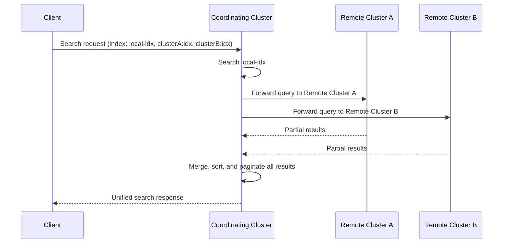

## Cross-Cluster Search (CCS)

### Overview

Cross-cluster search allows a single query to be executed across multiple Elasticsearch clusters without copying or moving data. Unlike cross-cluster replication (CCR), which physically duplicates indices onto a follower cluster, CCS federates the query itself: the coordinating cluster forwards the search request to each remote cluster, collects results, and merges them into a unified response. Data remains in place on its origin cluster at all times.

This makes CCS suitable for scenarios where duplicating data is undesirable or infeasible — due to storage cost, data sovereignty/residency constraints, or simply because the data changes too frequently to justify replication overhead.

### Core Use Cases

- **Federated search across regions**: Query data held in geographically distributed clusters (e.g., separate clusters per region for data residency compliance) from a single entry point.
- **Multi-tenant architectures**: Search across per-tenant or per-team clusters without consolidating them into one massive cluster.
- **Querying without replication overhead**: Avoid the storage duplication and operational complexity of CCR when live-query latency is acceptable and local-read performance isn't required.
- **Gradual migration**: Search across an old cluster and a new cluster simultaneously during a migration window.

### Architecture

CCS operates by having the **coordinating node** (the node on the cluster that receives the client's search request) fan the request out to each configured remote cluster. Each remote cluster executes the search locally against its own indices and returns results back to the coordinating node, which merges, sorts, and paginates the combined result set before returning it to the client.



Two execution modes exist:

- **Minimize round-trips (default for most transport)**: The coordinating node sends one request per remote cluster and lets that cluster's own coordinating node handle scatter-gather internally across its own shards, reducing cross-network round trips.
- **CCS with the `_search` API using remote cluster prefixes**: Standard mode where index names are prefixed with the remote cluster alias.

### Setup: Configuring Remote Clusters

Remote clusters must be registered before they can be queried, using the same `cluster.remote` settings mechanism used by CCR:

```
PUT _cluster/settings
{
  "persistent": {
    "cluster": {
      "remote": {
        "cluster_two": {
          "seeds": ["10.0.2.10:9300"],
          "skip_unavailable": true
        },
        "cluster_three": {
          "mode": "proxy",
          "proxy_address": "proxy.example.com:9400"
        }
      }
    }
  }
}
```

- **`sniff` mode** (default): The local cluster periodically connects to seed nodes and discovers other eligible remote nodes, maintaining a pool of connections.
- **`proxy` mode**: All traffic routes through a single configured proxy address, useful when direct node-to-node connectivity between clusters isn't possible (e.g., across strict network boundaries or NAT).
- **`skip_unavailable`**: When `true`, a search silently excludes results from that remote cluster if it's unreachable rather than failing the entire query.

Cloud environments commonly use **cross-cluster API keys** as an alternative trust model, avoiding full seed-node exchange and instead scoping access via API key permissions.

### Executing a Cross-Cluster Search

Indices on remote clusters are referenced using the `cluster_alias:index_name` syntax:

```
GET /cluster_two:my-index,cluster_three:my-index,local-index/_search
{
  "query": {
    "match": {
      "message": "error"
    }
  }
}
```

- Wildcards are supported on both the cluster alias and index name: `cluster_*:logs-*`.
- Omitting a cluster prefix searches only local indices.
- To search *all* configured remote clusters plus local indices: `*:my-index,my-index`.

**Example**

Searching for recent error logs across a local cluster and two remote regional clusters:

```
GET /local-logs,eu-cluster:logs-*,us-cluster:logs-*/_search
{
  "query": {
    "bool": {
      "must": [
        { "match": { "level": "ERROR" } }
      ],
      "filter": [
        { "range": { "@timestamp": { "gte": "now-1h" } } }
      ]
    }
  },
  "sort": [{ "@timestamp": "desc" }],
  "size": 50
}
```

**Output**

The response includes a `_clusters` metadata section summarizing per-cluster execution status alongside the merged `hits`:

```
{
  "took": 142,
  "_clusters": {
    "total": 3,
    "successful": 3,
    "skipped": 0,
    "details": {
      "(local)": { "status": "successful", "took": 12 },
      "eu-cluster": { "status": "successful", "took": 98 },
      "us-cluster": { "status": "successful", "took": 130 }
    }
  },
  "hits": {
    "total": { "value": 214, "relation": "eq" },
    "hits": [ /* merged, sorted results */ ]
  }
}
```

### Async Search for CCS

Because CCS latency is bounded by the slowest remote cluster, long-running federated searches are often executed asynchronously to avoid holding open a client connection:

```
POST /eu-cluster:logs-*,us-cluster:logs-*/_async_search
{
  "query": { "match_all": {} }
}
```

This returns an `id` immediately along with any results gathered so far (if the search completes quickly enough), and the client polls `GET /_async_search/<id>` for final results. This is the recommended pattern for CCS queries expected to take longer than a few seconds, particularly aggregations over large time ranges spanning multiple remote clusters.

### Aggregations Across Clusters

CCS supports aggregations spanning local and remote indices, with the coordinating node responsible for the final reduce phase:

```
GET /cluster_two:sales-*,sales-*/_search
{
  "size": 0,
  "aggs": {
    "by_region": {
      "terms": { "field": "region.keyword" },
      "aggs": {
        "total_revenue": { "sum": { "field": "revenue" } }
      }
    }
  }
}
```

**Key Points**

- Multi-bucket aggregations (e.g., `terms`) involve an inherent accuracy tradeoff across distributed shards/clusters, governed by `shard_size`, similar to standard distributed aggregation behavior within a single cluster.
- High-cardinality aggregations across many remote clusters can be significantly slower than local-only equivalents, since the reduce phase must wait on the slowest contributing cluster. [Inference — follows from the fan-out/reduce architecture; actual latency impact depends on network conditions and remote cluster load.]

### Security Considerations

- CCS respects **role-based access control** independently on each cluster: a user's permissions on the coordinating cluster do not automatically grant equivalent permissions on remote clusters.
- **Remote cluster privileges** can be configured so that a role grants access to specific indices on specific remote clusters, enforced via the security model on the remote side when using API key–based trust.
- Field- and document-level security defined on a remote cluster's indices are respected when that cluster executes the forwarded query — the coordinating cluster cannot bypass restrictions enforced remotely.

### Limitations

- **No cross-cluster joins**: CCS cannot join documents across clusters the way relational systems join tables; each remote cluster independently searches its own data and results are simply merged, not correlated.
- **Version compatibility**: Remote clusters generally must be on compatible versions with the coordinating cluster; querying across clusters on significantly different major versions may not be supported or may lose feature parity. [Unverified — exact compatibility matrix depends on the specific versions involved and should be checked against current documentation.]
- **Scripted fields and certain query types**: Some advanced features may behave differently or be unsupported when spanning clusters, particularly those relying on cluster-local state (e.g., certain terms lookup patterns referencing a specific index).
- **`skip_unavailable: false`** (the default for some configurations) causes the entire search to fail if any single remote cluster is unreachable, which can make CCS queries more fragile than local-only searches unless explicitly tuned.

### CCS vs. Cross-Cluster Replication (CCR)

| Aspect | CCS | CCR |
|---|---|---|
| Data location | Stays on origin cluster | Physically duplicated to follower |
| Query latency | Bound by slowest remote cluster at query time | Local read, no remote dependency at query time |
| Storage cost | No additional storage | Duplicated storage per follower |
| Data freshness | Always current (queried live) | Near-real-time but with replication lag |
| Availability if remote is down | Query fails or partial results (per `skip_unavailable`) | Follower continues serving last-replicated data |
| Best for | Ad hoc federation, compliance-bound data | DR, geo-local reads, read isolation |

The two mechanisms are complementary rather than mutually exclusive: CCS can query across a mix of purely local indices, CCR follower indices, and other purely remote (non-replicated) clusters in a single request.

**Conclusion**

Cross-cluster search enables federated querying across multiple independently-managed Elasticsearch clusters without data duplication, trading query-time latency and remote-dependency risk for storage efficiency and data locality/sovereignty compliance. It relies on the same remote cluster connection infrastructure as CCR but operates in a fundamentally different mode — live fan-out and merge rather than continuous background replication — making `skip_unavailable`, async search, and remote-side security configuration key operational considerations.

**Related Topics**

- Remote cluster connection modes (sniff vs. proxy) and cross-cluster API keys
- Async search API and its interaction with long-running federated aggregations
- Cross-cluster replication (CCR) as a complementary local-read strategy
- Security model for remote clusters (role mapping, remote indices privileges)
- Distributed aggregation accuracy (`shard_size`, `terms` aggregation approximation)
- Designing cluster topology for data residency and compliance requirements