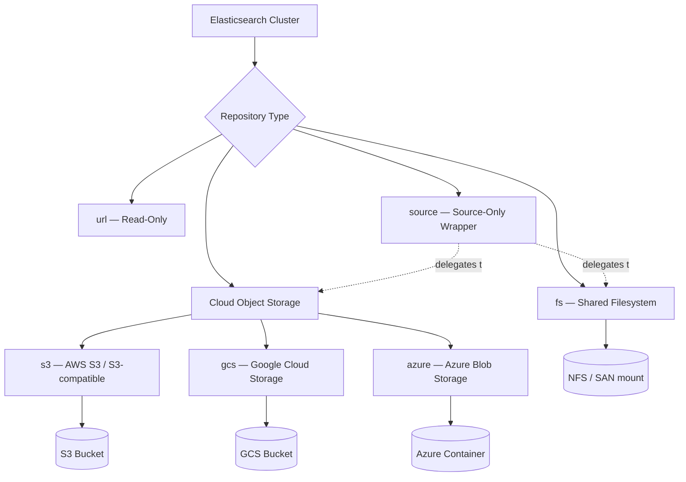

## Snapshot Repository Types

### Overview

A snapshot repository is a storage location, registered with an Elasticsearch cluster, where snapshots (point-in-time backups of indices, cluster state, and optionally other metadata) are stored. Before any snapshot can be taken, a repository must be registered via the `_snapshot` API, specifying a **type** that determines the underlying storage backend and the plugin (if any) required to communicate with it.

Repository types fall broadly into two categories: those built into Elasticsearch core (filesystem-based) and those requiring a repository plugin (cloud object storage backends). The choice of repository type affects durability, scalability, cost, and operational complexity.

### Shared Filesystem Repository (`fs`)

The `fs` type uses a filesystem path accessible to all master and data nodes in the cluster — typically an NFS mount or similar shared network storage.

```
PUT _snapshot/my_fs_backup
{
  "type": "fs",
  "settings": {
    "location": "/mnt/backups/es-snapshots",
    "compress": true,
    "chunk_size": "1gb"
  }
}
```

**Key Points**

- The path specified in `location` must be mounted at the **same path on every master-eligible and data node**, and must be explicitly allowlisted via the `path.repo` setting in `elasticsearch.yml` on each node.
- `compress` enables compression of metadata files (mappings, settings) — this does not meaningfully compress the underlying Lucene segment data, which is already compressed.
- This type is straightforward for on-premises deployments with existing shared storage infrastructure (NFS, SAN-backed mounts) but introduces the shared filesystem itself as a dependency and potential single point of failure unless that storage is independently made highly available.
- Performance is bound by the shared filesystem's throughput, which can become a bottleneck for large clusters or large snapshots. [Inference — general characteristic of network-filesystem-backed I/O; actual throughput depends on the specific NFS/SAN implementation and network.]

### Read-Only URL Repository (`url`)

The `url` type provides read-only access to a repository, typically used to restore from a repository without also granting write/snapshot-creation permissions on that node.

```
PUT _snapshot/my_url_repo
{
  "type": "url",
  "settings": {
    "url": "https://backups.example.com/es-snapshots/"
  }
}
```

Supported URL schemes are restricted by default (`http`, `https`, `ftp`, `file`, `jar`) and can be extended via `repositories.url.allowed_urls` in cluster settings. This type is primarily useful for restore-only scenarios, such as distributing a snapshot for other teams or environments to consume without exposing write access.

### Cloud Object Storage Repositories

Modern deployments predominantly use cloud object storage as the snapshot backend, since it offers durable, highly available, effectively unlimited-capacity storage without the shared-filesystem dependency of `fs`. Each requires its corresponding plugin to be installed on all nodes (these plugins are officially maintained and bundled/available for most standard distributions).

#### AWS S3 (`s3`)

```
PUT _snapshot/my_s3_repository
{
  "type": "s3",
  "settings": {
    "bucket": "my-es-snapshots",
    "region": "us-east-1",
    "base_path": "production/snapshots",
    "server_side_encryption": true,
    "storage_class": "standard"
  }
}
```

- Requires the `repository-s3` plugin.
- Credentials are typically supplied via the Elasticsearch keystore (`s3.client.default.access_key` / `s3.client.default.secret_key`) rather than in the repository settings body, or via an IAM instance role when running on EC2.
- `storage_class` supports tiers like `standard`, `reduced_redundancy`, `standard_ia`, and others, allowing cost/durability tradeoffs for infrequently-accessed snapshot data.
- `base_path` scopes the repository to a subdirectory (prefix) within the bucket, useful for sharing one bucket across multiple clusters or environments.

#### Google Cloud Storage (`gcs`)

```
PUT _snapshot/my_gcs_repository
{
  "type": "gcs",
  "settings": {
    "bucket": "my-es-snapshots",
    "base_path": "production/snapshots"
  }
}
```

- Requires the `repository-gcs` plugin.
- Authentication is configured via a service account JSON credential file registered in the keystore (`gcs.client.default.credentials_file`).

#### Azure Blob Storage (`azure`)

```
PUT _snapshot/my_azure_repository
{
  "type": "azure",
  "settings": {
    "container": "es-snapshots",
    "base_path": "production/snapshots"
  }
}
```

- Requires the `repository-azure` plugin.
- Supports both primary and secondary (read-only failover) storage account credentials for enhanced availability.
- Storage account credentials are configured via the keystore (`azure.client.default.account` / `azure.client.default.key`).

#### Other S3-Compatible Object Storage

Many self-hosted or third-party object storage systems (e.g., MinIO) implement the S3 API and can be used with the `s3` repository type by overriding the `endpoint` setting to point at the alternate service, rather than AWS's default endpoints. [Inference — this follows from S3 API compatibility being the design goal of such systems, though specific feature parity (multipart upload behavior, consistency guarantees) can vary by implementation and should be validated per vendor.]

### Source-Only Repositories

A repository can be wrapped as a **source-only** repository, which stores a minimal, source-document-only representation of indices rather than full Lucene segment data — significantly reducing snapshot size at the cost of losing the ability to restore indices in their exact original form (e.g., index sorting or certain internal structures are not preserved on restore).

```
PUT _snapshot/my_source_only_repo
{
  "type": "source",
  "settings": {
    "delegate_type": "s3",
    "bucket": "my-es-snapshots",
    "base_path": "source-only-snapshots"
  }
}
```

This wraps an underlying delegate repository type (`s3` in this example) and is primarily intended for archival or compliance retention of document content rather than operational disaster recovery, since restored indices are rebuilt from `_source` and reindexed rather than restored bit-for-bit.

### Repository Architecture



### Registering and Verifying a Repository

After registration, Elasticsearch automatically runs a verification step (unless disabled with `verify=false`) that checks all nodes can read/write to the repository:

```
POST _snapshot/my_s3_repository/_verify
```

**Output**

```
{
  "nodes": {
    "node-id-1": { "name": "es-node-1" },
    "node-id-2": { "name": "es-node-2" },
    "node-id-3": { "name": "es-node-3" }
  }
}
```

A successful response lists every node that confirmed read/write access; failures raise an exception identifying which node(s) could not reach the repository, which is useful for diagnosing missing plugins or misconfigured credentials before relying on the repository in production.

### Choosing a Repository Type

| Factor | `fs` | Cloud Object Storage (`s3`/`gcs`/`azure`) |
|---|---|---|
| Infrastructure dependency | Requires shared network filesystem | Requires only outbound connectivity to the cloud API |
| Scalability | Bound by filesystem capacity/throughput | Effectively unlimited, provider-managed |
| Setup complexity | Simple if shared storage already exists | Requires plugin install + credential management |
| Durability | Depends on underlying storage's own redundancy | Provider-managed multi-zone/multi-region durability (varies by storage class) |
| Typical use | On-premises, air-gapped, or small deployments | Cloud-native or hybrid deployments at any scale |

**Conclusion**

Elasticsearch supports a range of snapshot repository types spanning simple shared-filesystem storage (`fs`), read-only distribution (`url`), and plugin-based cloud object storage backends (`s3`, `gcs`, `azure`), with a `source`-only wrapper available for compact, document-level archival. The right choice depends on existing infrastructure, scalability needs, and whether full-fidelity restore or lighter-weight archival is the goal — cloud object storage is the predominant choice for production deployments due to its durability and operational simplicity relative to managing shared filesystem availability.

**Related Topics**

- Snapshot lifecycle management (SLM) for automated, scheduled snapshots
- Searchable snapshots and cold/frozen data tiers
- Restore operations and partial/selective index restore
- Repository security (encryption at rest, credential rotation, IAM scoping)
- Snapshot repository verification and troubleshooting node connectivity
- Cross-cluster restore scenarios and version compatibility during restore