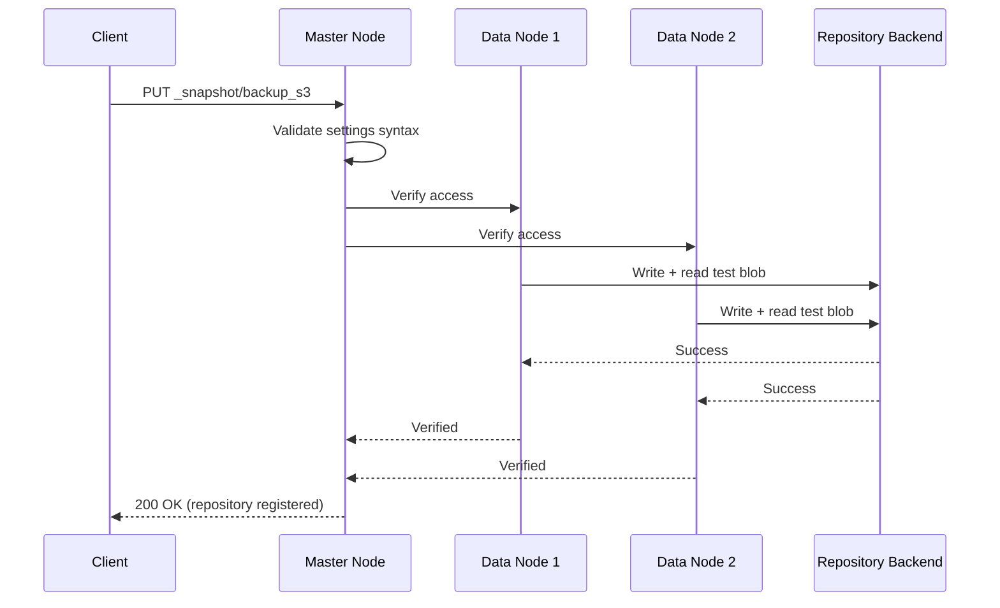

## Registering a Repository

### Overview

Before Elasticsearch can create or restore snapshots, a repository must be explicitly registered with the cluster via the `_snapshot` API. Registration tells the cluster where snapshot data lives (a path or cloud storage location), which repository plugin/type handles reading and writing to it, and any backend-specific settings such as compression, chunking, or storage class. Registration itself does not create a snapshot — it only establishes the connection and configuration that subsequent snapshot and restore operations will use.

### Basic Registration Syntax

The general form of the registration request is:

```
PUT _snapshot/<repository_name>
{
  "type": "<repository_type>",
  "settings": {
    "...": "..."
  }
}
```

- `<repository_name>` is an arbitrary identifier used in all subsequent snapshot/restore API calls.
- `type` determines the backend (`fs`, `s3`, `gcs`, `azure`, `url`, `source`, etc.).
- `settings` is backend-specific — its required and optional fields vary by repository type.

### Prerequisites Before Registration

**1. Install required plugins (cloud repositories only)**

Cloud object storage types require their corresponding plugin installed on every node in the cluster:

```
bin/elasticsearch-plugin install repository-s3
bin/elasticsearch-plugin install repository-gcs
bin/elasticsearch-plugin install repository-azure
```

The `fs` and `url` types are built into Elasticsearch core and require no plugin.

**2. Configure `path.repo` (filesystem repositories only)**

For `fs` type repositories, every master-eligible and data node must allowlist the filesystem path in `elasticsearch.yml` before registration will succeed:

```
path:
  repo: ["/mnt/backups/es-snapshots"]
```

This is a security measure — without an explicit allowlist entry, Elasticsearch refuses to register a filesystem repository pointing at an arbitrary path, preventing a `PUT _snapshot` call from writing to arbitrary locations on disk.

**3. Configure credentials (cloud repositories only)**

Cloud repository credentials are generally supplied via the **Elasticsearch keystore** on each node rather than inline in the registration request body, keeping secrets out of cluster state and API request bodies:

```
bin/elasticsearch-keystore add s3.client.default.access_key
bin/elasticsearch-keystore add s3.client.default.secret_key
```

After adding keystore values, a reload is typically required for the running nodes to pick them up:

```
POST _nodes/reload_secure_settings
```

### Registration Examples by Type

**Filesystem repository:**

```
PUT _snapshot/backup_fs
{
  "type": "fs",
  "settings": {
    "location": "/mnt/backups/es-snapshots",
    "compress": true
  }
}
```

**S3 repository:**

```
PUT _snapshot/backup_s3
{
  "type": "s3",
  "settings": {
    "bucket": "my-es-snapshots",
    "region": "us-east-1",
    "base_path": "prod/snapshots"
  }
}
```

**Google Cloud Storage repository:**

```
PUT _snapshot/backup_gcs
{
  "type": "gcs",
  "settings": {
    "bucket": "my-es-snapshots",
    "base_path": "prod/snapshots"
  }
}
```

**Azure repository:**

```
PUT _snapshot/backup_azure
{
  "type": "azure",
  "settings": {
    "container": "es-snapshots",
    "base_path": "prod/snapshots"
  }
}
```

### Verification

By default, registering a repository triggers an automatic **verification step**: Elasticsearch has every master and data node attempt to write and then read a small test file to confirm the repository is reachable and usable cluster-wide.



Verification can be explicitly re-run at any time without re-registering:

```
POST _snapshot/backup_s3/_verify
```

**Output**

```
{
  "nodes": {
    "aVLDkFRnQL2VbFm1LrsYSA": { "name": "es-node-1" },
    "bK9jNqRsTZ8pWx3YvUmHwQ": { "name": "es-node-2" }
  }
}
```

Each entry represents a node that successfully confirmed access. If any node cannot reach the repository — due to missing plugin, bad credentials, network restrictions, or an unmounted filesystem path — the request fails with an exception identifying the problem, which should be resolved before relying on the repository for production backups.

To register without automatic verification (for example, if verification is expected to be run manually afterward, or if not all nodes are expected to have access yet):

```
PUT _snapshot/backup_s3?verify=false
{
  "type": "s3",
  "settings": {
    "bucket": "my-es-snapshots",
    "region": "us-east-1"
  }
}
```

### Inspecting Registered Repositories

**List all repositories:**

```
GET _snapshot
```

**Get a specific repository's configuration:**

```
GET _snapshot/backup_s3
```

**Output**

```
{
  "backup_s3": {
    "type": "s3",
    "settings": {
      "bucket": "my-es-snapshots",
      "region": "us-east-1",
      "base_path": "prod/snapshots"
    }
  }
}
```

Note that this output does not expose credentials, since those are stored separately in each node's keystore rather than in cluster state.

### Updating a Repository

Repositories are updated by re-issuing the same `PUT _snapshot/<name>` call with new settings. There is no separate "update" endpoint — registration is idempotent in the sense that a `PUT` to an existing repository name overwrites its configuration.

**Key Points**

- Changing repository settings (e.g., `base_path`, credentials, `chunk_size`) does not modify or migrate existing snapshots already stored under the old configuration — it only affects how the cluster connects going forward.
- Renaming a repository is not directly supported; a new repository must be registered under a new name, though it can point at the same underlying storage location/bucket to continue seeing existing snapshots there. [Inference — follows from repository name being purely a cluster-side identifier rather than something encoded into the stored data itself, though behavior should be confirmed for the specific version in use.]
- It's advisable to avoid changing settings on a repository that has active snapshot or restore operations in progress, since mid-operation changes to connectivity/credentials can cause those operations to fail.

### Deregistering a Repository

```
DELETE _snapshot/backup_s3
```

**Key Points**

- Deregistering a repository **only removes the cluster's reference to it** — it does not delete the underlying stored snapshot data in the bucket, container, or filesystem path.
- This makes deregistration safe to use when decommissioning a cluster's *awareness* of a repository while preserving the actual backup data, which can later be re-registered (under the same or a different repository name) to restore access to those existing snapshots.
- Actually deleting stored snapshot data requires explicitly deleting individual snapshots (`DELETE _snapshot/<repo>/<snapshot_name>`) before or instead of deregistering, or manually removing objects from the underlying cloud storage.

### Common Registration Errors

| Symptom | Likely Cause |
|---|---|
| `repository_exception` mentioning path not allowlisted | `path.repo` not configured on one or more nodes |
| Plugin-related class-not-found error | Repository plugin not installed on all nodes |
| Authentication/access-denied error from cloud provider | Missing or incorrect keystore credentials, or credentials not reloaded via `_nodes/reload_secure_settings` |
| Verification fails on a subset of nodes only | Inconsistent node configuration — path mounted or plugin installed on some nodes but not others |
| Timeout during verification | Network/firewall restrictions preventing outbound access to the cloud storage endpoint |

**Conclusion**

Registering a snapshot repository is a prerequisite step that establishes where and how Elasticsearch stores backups, requiring type-specific settings, and — for cloud backends — plugin installation and keystore-based credentials on every node. The automatic verification step is a valuable safeguard that catches misconfiguration (unmounted paths, missing plugins, bad credentials) at registration time rather than during an actual snapshot or, worse, during a restore attempt when data loss risk is highest.

**Related Topics**

- Snapshot repository types (`fs`, `s3`, `gcs`, `azure`, `url`, `source`)
- Creating and managing snapshots (`_snapshot/<repo>/<snapshot>`)
- Snapshot Lifecycle Management (SLM) for automated snapshot scheduling
- Restoring snapshots and selective/partial restore options
- Elasticsearch keystore and secure settings management
- Repository cleanup and stale data removal (`_cleanup` API)