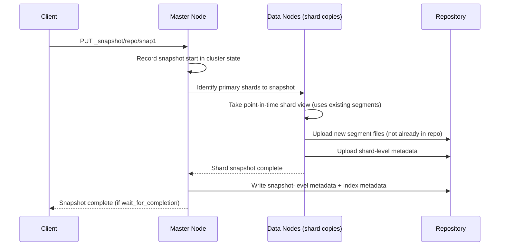

## Creating Snapshots

### Overview

A snapshot is a point-in-time backup of one or more indices (and optionally cluster state and metadata) stored in a previously registered repository. Snapshots in Elasticsearch are **incremental at the segment level**: each new snapshot only copies Lucene segment files that don't already exist in the repository from prior snapshots, making subsequent snapshots of the same indices substantially faster and cheaper in storage than a full copy each time, even though each snapshot represents a complete, independently restorable point-in-time view.

### Basic Snapshot Creation

```
PUT _snapshot/backup_s3/snapshot_2026_08_24
{
  "indices": "logs-*,products",
  "ignore_unavailable": true,
  "include_global_state": true
}
```

- `backup_s3` — the previously registered repository name.
- `snapshot_2026_08_24` — an arbitrary, unique snapshot name within that repository.
- `indices` — comma-separated list or pattern of indices to include; omitting this parameter snapshots all indices in the cluster (excluding system indices unless explicitly included).
- `ignore_unavailable` — if `true`, missing or closed indices matching the pattern are silently skipped rather than causing the request to fail.
- `include_global_state` — if `true`, cluster-level metadata (index templates, ingest pipelines, persistent settings, and other cluster state) is captured alongside the index data.

### Synchronous vs. Asynchronous Execution

By default, the `PUT _snapshot` call returns immediately once the snapshot process has started, without waiting for completion (asynchronous). To block until the snapshot finishes:

```
PUT _snapshot/backup_s3/snapshot_2026_08_24?wait_for_completion=true
{
  "indices": "logs-*"
}
```

**Key Points**

- `wait_for_completion=true` is convenient for scripting and testing but holds the HTTP connection open for the full snapshot duration, which can be lengthy for large datasets — this makes it unsuitable for very large production snapshots where the request could time out client-side.
- The default asynchronous mode is generally preferred for production use; snapshot progress is instead polled via the status APIs described below.

### Snapshot Process Internals



Because snapshots operate against existing on-disk Lucene segments rather than requiring indexing to pause, ongoing writes to an index being snapshotted do not block; new segments created during the snapshot are simply not included in that particular snapshot's view, similar in spirit to Lucene's own point-in-time reader consistency.

### Partial Snapshots and Shard Failures

If one or more shards being snapshotted are unavailable (e.g., relocating, unassigned, or on a node that fails mid-snapshot), the default behavior is for the entire snapshot request to fail rather than complete an incomplete backup silently.

```
PUT _snapshot/backup_s3/snapshot_partial_ok
{
  "indices": "logs-*",
  "partial": true
}
```

Setting `partial: true` allows the snapshot to succeed even if some shards could not be included, which is generally discouraged for anything intended as a reliable restore point, since a "successful" partial snapshot may silently be missing data for the affected shards.

### Checking Snapshot Status

**Get status of a specific in-progress or completed snapshot:**

```
GET _snapshot/backup_s3/snapshot_2026_08_24/_status
```

**Output** (abridged)

```
{
  "snapshots": [
    {
      "snapshot": "snapshot_2026_08_24",
      "repository": "backup_s3",
      "state": "IN_PROGRESS",
      "shards_stats": {
        "initializing": 0,
        "started": 3,
        "finalizing": 0,
        "done": 9,
        "failed": 0,
        "total": 12
      },
      "stats": {
        "total": { "size_in_bytes": 45812223104 },
        "processed": { "size_in_bytes": 31004552192 }
      }
    }
  ]
}
```

**List all snapshots in a repository with summary info:**

```
GET _snapshot/backup_s3/_all
```

**Check currently running snapshots cluster-wide (lighter-weight than `_status`):**

```
GET _snapshot/_status
```

### Snapshot States

| State | Meaning |
|---|---|
| `IN_PROGRESS` | Snapshot is actively running |
| `SUCCESS` | Completed successfully with all requested shards included |
| `PARTIAL` | Completed, but one or more shards failed and `partial: true` was set |
| `FAILED` | Snapshot did not complete; no usable data was persisted for the failed shards |
| `INCOMPATIBLE` | Snapshot exists but was created with a version no longer compatible with this cluster's restore logic |

### Cloning a Snapshot

An existing snapshot can be cloned to create a new snapshot referencing a subset of indices from the source, without re-reading data from the live cluster — useful for splitting a broad snapshot into more targeted ones for retention or restore purposes:

```
PUT _snapshot/backup_s3/snapshot_2026_08_24/_clone/snapshot_2026_08_24_logs_only
{
  "indices": "logs-*"
}
```

### Deleting Snapshots

```
DELETE _snapshot/backup_s3/snapshot_2026_08_24
```

**Key Points**

- Deleting a snapshot removes only the segment files uniquely referenced by that snapshot; segments shared with other, still-existing snapshots (due to the incremental storage model) are preserved.
- Multiple snapshots can be deleted in a single request using a comma-separated list or pattern: `DELETE _snapshot/backup_s3/snapshot_2026_08*`.
- Deleting a snapshot that's currently `IN_PROGRESS` cancels it rather than removing a completed backup.

### Automating Snapshots with Snapshot Lifecycle Management (SLM)

Manually issuing `PUT _snapshot/<repo>/<name>` on a schedule is impractical for production; **Snapshot Lifecycle Management** automates this:

```
PUT _slm/policy/nightly-snapshots
{
  "schedule": "0 30 1 * * ?",
  "name": "<nightly-snap-{now/d}>",
  "repository": "backup_s3",
  "config": {
    "indices": ["*"],
    "include_global_state": true
  },
  "retention": {
    "expire_after": "30d",
    "min_count": 5,
    "max_count": 50
  }
}
```

- `schedule` — a cron expression (here, 1:30 AM daily).
- `name` — supports **date math** expressions like `<nightly-snap-{now/d}>`, which resolves to a name incorporating the current date, automatically producing unique, sortable snapshot names.
- `retention` — defines automatic pruning of old snapshots, balancing storage cost against how far back restores need to reach.

SLM policies can be manually triggered outside their schedule for testing or on-demand backups:

```
POST _slm/policy/nightly-snapshots/_execute
```

### Naming and Organization Considerations

**Example**

A common convention combines a purpose label with date math for traceability:

```
PUT _snapshot/backup_s3/<prod-full-{now/d{yyyy.MM.dd}}>
{
  "indices": "*",
  "include_global_state": true
}
```

This produces a snapshot literally named something like `prod-full-2026.08.24`, making it straightforward to identify and sort snapshots chronologically when listing a repository, without needing to inspect timestamps in metadata separately.

### What Gets Included Beyond Index Data

Depending on `include_global_state` and related feature-state options, a snapshot can capture more than raw index documents:

- Index mappings and settings (always included per-index)
- Index templates and component templates (via global state)
- Ingest pipelines (via global state)
- ILM/SLM policies themselves (via global state, subject to version-specific behavior)
- **Feature states** — internal system indices belonging to stack features (e.g., security, Kibana saved objects), controllable via the `feature_states` parameter, allowing selective inclusion/exclusion of system index data separate from the general global state flag.

```
PUT _snapshot/backup_s3/snapshot_with_features
{
  "indices": "*",
  "include_global_state": true,
  "feature_states": ["kibana", "security"]
}
```

**Conclusion**

Creating snapshots in Elasticsearch relies on an incremental, segment-level backup model against a previously registered repository, executed asynchronously by default and monitored via status APIs rather than blocking requests. Production use generally pairs manual snapshot creation knowledge with Snapshot Lifecycle Management for scheduling and retention, while careful attention to `partial`, `include_global_state`, and `feature_states` ensures a snapshot actually captures everything needed for a complete, reliable restore rather than an incomplete point-in-time copy.

**Related Topics**

- Restoring snapshots and selective/partial restore
- Snapshot Lifecycle Management (SLM) policies and retention tuning
- Searchable snapshots for cold/frozen tier storage
- Snapshot repository types and registration
- Monitoring long-running snapshot/restore operations
- Cluster state and feature-state snapshot behavior across version upgrades