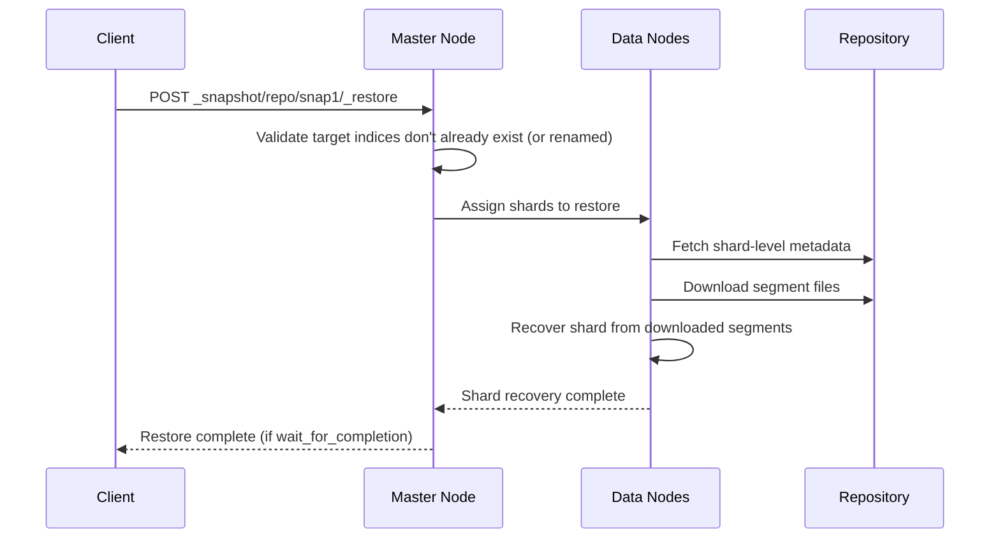
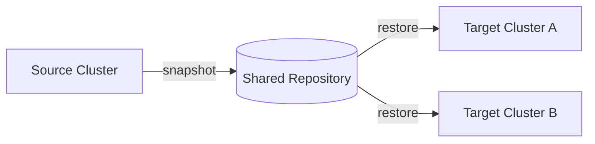

## Restoring Snapshots

### Overview

Restoring a snapshot recreates indices — and optionally cluster-level metadata — from a previously stored point-in-time backup back into a running cluster. A restore can target the same cluster the snapshot was taken from, or an entirely different cluster (commonly used for disaster recovery, environment cloning, or migrating data to a new cluster). Because the underlying Lucene segments are copied back largely as-is, restore is generally faster than a full reindex from source data, though it still involves transferring the snapshot's data volume from the repository to the cluster's data nodes.

### Basic Restore

```
POST _snapshot/backup_s3/snapshot_2026_08_24/_restore
{
  "indices": "logs-*,products",
  "ignore_unavailable": true,
  "include_global_state": false
}
```

- `backup_s3` / `snapshot_2026_08_24` — the repository and snapshot to restore from.
- `indices` — which indices within the snapshot to restore; omitting this restores everything the snapshot contains.
- `include_global_state` — whether to also restore cluster-level metadata (templates, ingest pipelines, persistent cluster settings) captured in the snapshot; this defaults to `false` for restore even when it was `true` at snapshot time, requiring explicit opt-in to avoid unintentionally overwriting the target cluster's existing global configuration.

### Restore Process Internals



Restore is tracked internally as a form of shard **recovery**, appearing alongside other recovery types (e.g., peer recovery after node restart) in recovery-monitoring APIs, since both processes fundamentally involve reconstructing a shard from stored segment data.

### Restoring Into a Different Name

A common requirement is restoring an index without overwriting an existing index of the same name — for example, restoring an older snapshot alongside the current live index for comparison, or restoring into a staging index before cutting over.

```
POST _snapshot/backup_s3/snapshot_2026_08_24/_restore
{
  "indices": "products",
  "rename_pattern": "(.+)",
  "rename_replacement": "restored_$1"
}
```

- `rename_pattern` / `rename_replacement` use Java regular expression syntax; the example above prefixes every restored index name with `restored_`, so `products` becomes `restored_products`.
- If a target index name (renamed or not) already exists as an **open** index in the cluster, the restore request fails for that index — an existing index must first be deleted or closed before a same-named restore can proceed.

### Restore Options and Index Settings Overrides

Restore supports overriding certain index settings at restore time without modifying the original snapshot:

```
POST _snapshot/backup_s3/snapshot_2026_08_24/_restore
{
  "indices": "logs-2026.08.20",
  "index_settings": {
    "index.number_of_replicas": 0,
    "index.refresh_interval": "30s"
  },
  "ignore_index_settings": ["index.lifecycle.name"]
}
```

- `index_settings` — applies or overrides settings on the restored index (commonly used to temporarily reduce replicas for faster restore, then scale back up afterward).
- `ignore_index_settings` — strips specified settings from the restored index entirely, useful for detaching a restored index from an ILM policy it was previously managed by, so it doesn't unexpectedly resume lifecycle transitions immediately after restore.

**Key Points**

- Static settings fixed at index creation (e.g., `index.number_of_shards`) **cannot** be changed via restore-time overrides — shard count on restore always matches what the snapshot recorded.
- Reducing `index.number_of_replicas` to `0` during restore and increasing it afterward is a common technique to speed up the restore itself, since replica shards would otherwise also need to be recovered (either from the repository directly or by copying from the restored primary) as part of the same operation.

### Partial Restore

By default, if the snapshot itself is missing data for certain shards (e.g., it was taken with `partial: true` and some shards failed), restore of the affected indices fails unless explicitly allowed:

```
POST _snapshot/backup_s3/snapshot_partial_ok/_restore
{
  "indices": "logs-*",
  "partial": true
}
```

This should be used deliberately and cautiously, since it can produce a restored index with genuinely missing data rather than merely an operation that failed loudly.

### Monitoring Restore Progress

Restore status is queried through the **recovery API**, not the snapshot status API, since restore is implemented as a recovery operation on the target indices:

```
GET /logs-2026.08.20/_recovery?human
```

**Output** (abridged)

```
{
  "logs-2026.08.20": {
    "shards": [
      {
        "id": 0,
        "type": "SNAPSHOT",
        "stage": "INDEX",
        "primary": true,
        "index": {
          "size": {
            "total": "4.1gb",
            "reused": "0b",
            "recovered": "2.6gb",
            "percent": "63.4%"
          }
        }
      }
    ]
  }
}
```

- `type: "SNAPSHOT"` distinguishes this recovery as a restore-from-snapshot operation rather than peer recovery or a local store recovery.
- `stage` progresses through phases such as `INIT`, `INDEX` (transferring segment data), `VERIFY_INDEX`, `TRANSLOG`, and `DONE`.
- `percent` under `index` gives a rough completion estimate for the data transfer phase specifically.

### Cross-Cluster Restore

A snapshot taken on one cluster can be restored into a different cluster, provided that cluster has the same repository registered (pointing at the same underlying storage location) and the snapshot's Elasticsearch version is compatible with the target cluster's version.



**Key Points**

- Both source and target clusters must have the repository registered with matching settings (bucket/path, credentials with appropriate access).
- Version compatibility rules generally allow restoring a snapshot into a cluster running the same or a newer compatible version; restoring into an older version than the snapshot was created on is typically not supported. [Unverified — the exact version compatibility matrix (e.g., how many major versions back restore is supported) should be checked against current documentation for the specific versions involved.]
- This pattern is the operational basis for many disaster-recovery strategies as an alternative or complement to CCR, particularly for cold/rarely-accessed data where continuous replication isn't justified.

### Restoring System Indices and Feature States

If a snapshot was taken with specific `feature_states` included (e.g., Kibana saved objects, security configuration), those can be selectively restored:

```
POST _snapshot/backup_s3/snapshot_with_features/_restore
{
  "indices": "*",
  "feature_states": ["kibana"]
}
```

Restoring feature states such as the security feature state should be approached cautiously in a live cluster, since it can overwrite existing roles, role mappings, or API keys with the snapshot's versions.

### Handling Restore Conflicts and Failures

| Symptom | Likely Cause / Resolution |
|---|---|
| `resource_already_exists_exception` | Target index name already exists and is open — delete/close it or use `rename_pattern` |
| Restore hangs at low completion percentage | Large snapshot with limited network/disk throughput between repository and data nodes; verify with the recovery API rather than assuming failure |
| Shards stuck `UNASSIGNED` after restore | Insufficient data nodes/disk space to allocate all restored shards; check allocation explain API |
| `snapshot_restore_exception` citing incompatible version | Snapshot was created on a version not supported for restore into the current cluster version |

### Cancelling a Restore

An in-progress restore can be effectively cancelled by deleting the target index while the restore is still running:

```
DELETE /logs-2026.08.20
```

This halts the ongoing recovery for that index; there is no separate dedicated "cancel restore" endpoint distinct from removing the index being restored into.

**Conclusion**

Restoring snapshots reconstructs indices from repository-stored segment data via the shard recovery mechanism, with fine-grained control over renaming, settings overrides, replica counts, and selective feature-state inclusion. Because restore surfaces through the recovery API rather than the snapshot status API, and because `include_global_state` defaults to `false` on restore regardless of snapshot-time settings, careful attention to these defaults is necessary to avoid either an incomplete restore or an unintended overwrite of the target cluster's existing configuration.

**Related Topics**

- Creating snapshots and the incremental segment-level backup model
- Snapshot repository types and cross-cluster repository access
- Shard recovery internals and the recovery API
- Snapshot Lifecycle Management (SLM) for scheduled backup/retention
- Searchable snapshots as a restore-avoidant cold-tier alternative
- Index lifecycle management interaction with restored indices