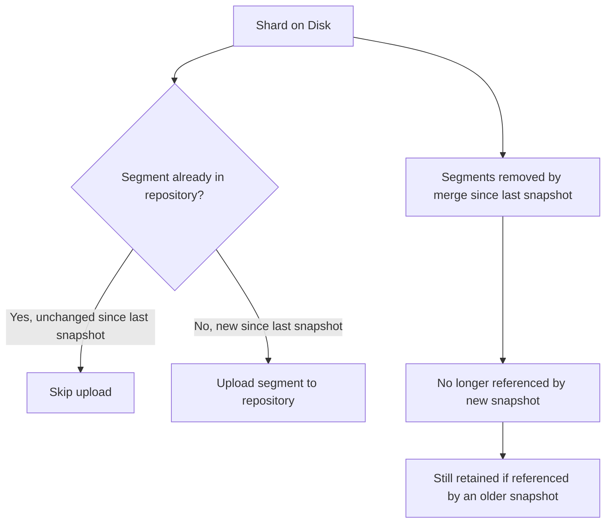
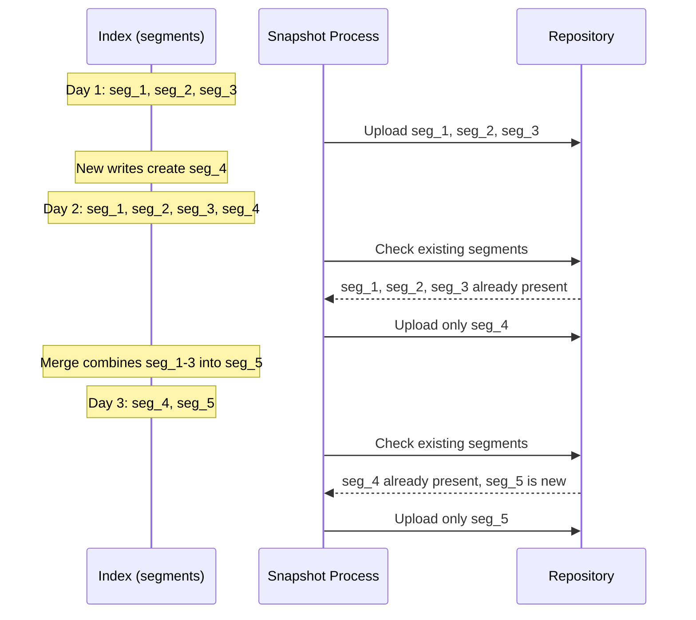

## Incremental Snapshots

### Overview

Incremental snapshots are the default and only snapshot behavior in Elasticsearch's snapshot mechanism: rather than copying every Lucene segment file for every index on every snapshot run, each new snapshot compares the current state of each shard against what already exists in the repository from prior snapshots and only uploads segment files that aren't already stored there. This applies transparently to every snapshot taken via the standard `_snapshot` API — there is no separate "full" vs. "incremental" mode to choose between; incrementality is simply how the underlying storage model works.

### Why Incrementality Is Possible

Elasticsearch's storage engine (Lucene) writes data in **immutable segments**. Once a segment is written to disk, it is never modified in place — updates and deletes are handled by writing new segments and marking old documents as deleted (or, with soft deletes, retaining tombstone records), with periodic **merges** combining smaller segments into larger ones and physically removing deleted documents at that point.

This immutability is what makes incremental snapshotting straightforward and reliable: a segment file that existed in a previous snapshot and still exists on disk is, by definition, byte-for-byte identical to what's already stored in the repository, so re-uploading it would be redundant.



### What Triggers New Segment Uploads

A snapshot needs to upload new data when the shard's on-disk segment set has changed since the last snapshot that included it. This happens due to:

- **New documents indexed** — new segments are created to hold newly indexed data.
- **Updates and deletes** — under the hood, an update in Elasticsearch/Lucene is effectively a delete-then-reindex; the old segment's document is marked deleted (or tombstoned via soft deletes) and a new segment (or an update to an existing open segment) captures the new version, both of which can produce new segment content to snapshot.
- **Segment merges** — when Lucene merges several smaller segments into a larger one, the resulting merged segment is a genuinely new file, even if none of the underlying documents actually changed content. This means a merge alone can cause a subsequent snapshot to re-upload data that was previously already fully backed up, purely because the physical file representing it changed.

**Key Points**

- Merges are a normal, ongoing background process and not something to disable or avoid for the sake of snapshot efficiency — the incremental snapshot cost from merges is a normal operating characteristic rather than a misconfiguration to fix.
- Because of merge-driven re-upload, snapshot size/time is not purely proportional to *new* data written since the last snapshot — it also reflects however much existing data happened to be reorganized by merges in that interval. [Inference — general consequence of segment-merge behavior interacting with content-addressed incremental backup, though exact magnitude varies with merge policy activity and indexing pattern.]

### Repository-Level Deduplication

Because incrementality operates at the level of individual segment files rather than whole snapshots or whole indices, storage savings compound across:

- **Multiple snapshots of the same index over time** — a nightly snapshot policy typically re-uploads only the fraction of data that changed (via new writes or merges) since the previous night.
- **Snapshot clones** (`_clone` API) — cloning a snapshot to produce a differently-scoped snapshot doesn't re-read data from the live cluster at all; it operates entirely within the repository against already-stored segment references.

### Deletion and Reference Counting

Because multiple snapshots can reference the same underlying segment file in the repository, deleting one snapshot must not simply delete every file it references — only files not referenced by any *remaining* snapshot should actually be removed from storage.

```
DELETE _snapshot/backup_s3/snapshot_2026_08_20
```

**Key Points**

- Elasticsearch tracks which segment files are referenced by which snapshots via repository-internal metadata, effectively a reference-counting mechanism at the file level.
- Deleting an older snapshot while a newer snapshot still references some of the same underlying segments (because those segments haven't been superseded by a merge) leaves those shared segments intact — only files exclusively referenced by the deleted snapshot are actually removed.
- This is what allows retention policies (e.g., via SLM) to prune old snapshots for storage cost management without needing to worry about accidentally corrupting a still-retained snapshot that happens to share underlying data.

### Illustrative Example

**Example**

Consider an index with three segments, snapshotted twice:

| Time | Shard segments on disk | Action |
|---|---|---|
| Day 1 | `seg_1`, `seg_2`, `seg_3` | Snapshot A uploads all three segments |
| Day 2 (after new writes) | `seg_1`, `seg_2`, `seg_3`, `seg_4` | Snapshot B uploads only `seg_4` (1, 2, 3 already present) |
| Day 3 (after a merge combines seg_1–seg_3 into seg_5) | `seg_4`, `seg_5` | Snapshot C uploads only `seg_5` (`seg_4` already present); `seg_1`–`seg_3` are no longer on disk but remain in the repository because Snapshot A and B still reference them |

If Snapshot A is deleted at this point, `seg_1`, `seg_2`, `seg_3` become eligible for removal from the repository only if Snapshot B is also deleted or doesn't reference them — in this example Snapshot B does still reference them, so they remain until Snapshot B is also removed.

### Operational Implications

**Faster subsequent snapshots**: After an initial full-cost first snapshot, subsequent snapshots of a lightly-changing index are typically much faster and cheaper in both time and storage/network cost, since they transfer only the delta.

**Predictable cost growth pattern**: Repository storage cost roughly tracks the union of all unique segment content ever referenced by any retained snapshot, rather than growing linearly with `(snapshot count) × (full index size)` — retention policies that expire old snapshots directly bound this growth.

**Interaction with `force_merge`**: Running a manual `_forcemerge` (e.g., to reduce segment count on a read-heavy, no-longer-written-to index) produces new merged segment files, meaning the *next* snapshot after a force-merge will need to re-upload that data even though the documents themselves are unchanged — a one-time snapshot cost worth accounting for when scheduling force-merges relative to snapshot windows.



### Verifying Incremental Behavior

Snapshot status output includes byte-level statistics distinguishing what was actually transferred versus what was already present, useful for confirming incremental behavior in practice:

```
GET _snapshot/backup_s3/snapshot_2026_08_24/_status
```

**Output** (abridged, `stats` section)

```
{
  "stats": {
    "incremental": {
      "file_count": 42,
      "size_in_bytes": 1073741824
    },
    "total": {
      "file_count": 310,
      "size_in_bytes": 45812223104
    }
  }
}
```

- `incremental` — files/bytes actually uploaded for this specific snapshot operation.
- `total` — files/bytes that make up the complete logical snapshot, including segments already present in the repository from earlier snapshots and simply referenced rather than re-uploaded.

A large gap between `incremental` and `total` confirms that most of the snapshot's data was already stored and reused rather than freshly transferred.

**Conclusion**

Incremental snapshotting is an intrinsic property of how Elasticsearch snapshots work, made possible by Lucene's immutable-segment storage model: unchanged segment files are referenced rather than re-uploaded, while new writes, updates/deletes, and — notably — segment merges all produce new segment files that must be transferred. Repository-level reference counting ensures that deleting an older snapshot never removes data still needed by a retained newer one, making incrementality both storage-efficient and safe under normal retention/pruning policies.

**Related Topics**

- Lucene segment architecture and merge policies
- Creating snapshots and monitoring snapshot status
- Snapshot Lifecycle Management (SLM) retention and storage cost planning
- Force merge operations and their interaction with snapshot timing
- Repository cleanup (`_cleanup` API) for reclaiming orphaned/unreferenced data
- Searchable snapshots and cold/frozen tier storage economics