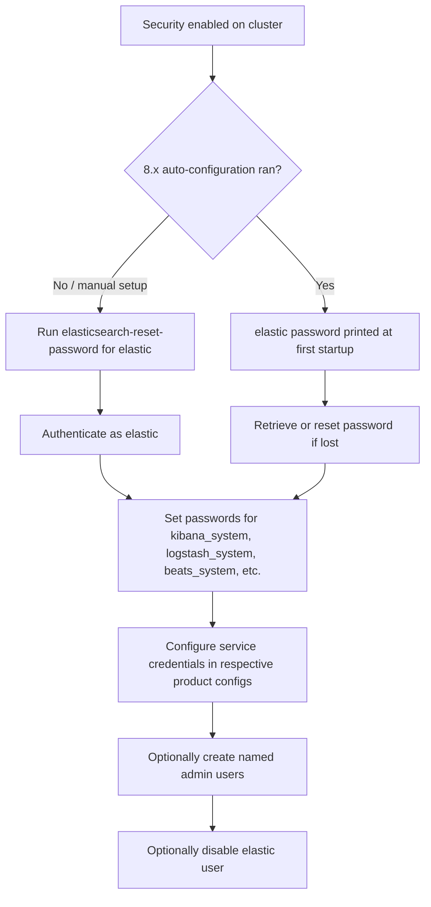

## Built-in Users and Password Setup

### Overview

Elasticsearch ships with several built-in, reserved user accounts that are used internally by the Elastic Stack and for initial cluster administration. These accounts exist automatically once security is enabled and cannot be deleted, though their passwords must be set before most of them can be used.

### List of Built-in Users

**Key Points**

| User | Purpose |
|---|---|
| `elastic` | Superuser with full access to the cluster; intended for initial setup and administrative tasks. |
| `kibana_system` | Used internally by Kibana to communicate with Elasticsearch. Not intended for interactive login. |
| `logstash_system` | Used internally by Logstash for monitoring purposes. |
| `beats_system` | Used internally by Beats for monitoring purposes. |
| `apm_system` | Used internally by APM Server for monitoring purposes. |
| `remote_monitoring_user` | Used by Metricbeat to collect and ship monitoring data. |

[Inference] The exact set of built-in users present can vary slightly by version and by which stack components are installed, since some accounts (e.g., `apm_system`) are only relevant when the corresponding product is in use.

### Reserved vs. Native Users

Built-in users are **reserved users**, distinct from **native users** created manually via the Security API or Kibana. Reserved users:

- Are created automatically and cannot be removed.
- Can be disabled but not deleted.
- Have fixed usernames.
- Require an explicit password-setting step before they can authenticate (in versions where auto-configuration doesn't handle this already).

### Setting Passwords: elasticsearch-setup-passwords (Legacy)

In versions prior to 8.0, the dedicated tool for setting built-in user passwords was:

```bash
bin/elasticsearch-setup-passwords auto
```

This generates random passwords for all built-in users and displays them once. Alternatively:

```bash
bin/elasticsearch-setup-passwords interactive
```

This prompts for a password for each built-in user individually.

[Unverified] `elasticsearch-setup-passwords` has been deprecated in favor of `elasticsearch-reset-password` in more recent versions; whether it remains available at all should be checked against the specific version in use, as its presence and behavior have changed across major releases.

### Setting Passwords: elasticsearch-reset-password (Current)

The current recommended tool resets the password for a single specified user:

```bash
bin/elasticsearch-reset-password -u elastic
```

This generates a random password and prints it to the terminal.

**Interactive mode**, allowing the operator to choose the password:

```bash
bin/elasticsearch-reset-password -u elastic -i
```

**Resetting other built-in users:**

```bash
bin/elasticsearch-reset-password -u kibana_system
```

### Setting Passwords via API

Once at least the `elastic` user's password is known, other built-in user passwords can be changed via the Security API:

```
POST /_security/user/kibana_system/_password
{
  "password": "new-strong-password"
}
```

This requires authenticating the request as a user with sufficient privileges (typically `elastic` or another superuser).

### Retrieving the Auto-Generated elastic Password

In Elasticsearch 8.x, when auto-configuration runs on first startup, the `elastic` password is printed once to the console output. If this output was missed or lost, the password can be regenerated:

```bash
bin/elasticsearch-reset-password -u elastic -i
```

**Example** terminal output during first startup:

```
✅ Elasticsearch security features have been automatically configured!
✅ Authentication is enabled and cluster connections are encrypted.

ℹ️  Password for the elastic user (reset with `bin/elasticsearch-reset-password -u elastic`):
  a1B2c3D4e5F6

ℹ️  HTTP CA certificate SHA-256 fingerprint:
  8f3c...d21a
```

### Configuring kibana_system for Kibana

Kibana needs credentials to communicate with Elasticsearch, configured in `kibana.yml`:

```yaml
elasticsearch.username: "kibana_system"
elasticsearch.password: "<password-set-via-reset-password>"
```

Alternatively, in 8.x, Kibana can use an **enrollment token** generated during Elasticsearch's first startup, which handles both credential exchange and TLS trust setup automatically:

```bash
bin/elasticsearch-create-enrollment-token -s kibana
```

The resulting token is entered into Kibana during its own first-run setup, avoiding manual password configuration.

### Disabling the elastic User (Optional Hardening)

**Key Points**

- After creating named administrative accounts with equivalent privileges, the `elastic` superuser can be disabled to reduce the attack surface of a well-known, predictable username.
- Disabling is done via the Security API rather than deletion, since reserved users cannot be deleted:

```
PUT /_security/user/elastic/_disable
```

[Speculation] Some organizations may choose not to disable `elastic` at all, keeping it available strictly as an emergency break-glass account with a highly restricted, vaulted password — this is a policy decision rather than a technical requirement.

### Password Setup Workflow



### Password Requirements and Storage

- Elasticsearch does not enforce a specific password complexity policy by default at the built-in-user level; strength is left to the operator or external policy.
- Passwords for built-in users should be treated as secrets and stored in a secrets manager or the Elasticsearch/Kibana keystore rather than committed to configuration files in plaintext where avoidable.
- Service credentials (e.g., `kibana_system`) configured in YAML files can instead reference the Kibana keystore:

```bash
bin/kibana-keystore add elasticsearch.password
```

### Common Pitfalls

**Key Points**

- Forgetting that `kibana_system` and similar service accounts are not meant for interactive dashboard login — attempting to log into Kibana's UI with `kibana_system` will not provide the expected user experience.
- Losing the auto-generated `elastic` password without saving it before the terminal output scrolls away or the session closes.
- Running `elasticsearch-reset-password` before the cluster has fully started, which will fail since the tool requires an active, reachable node.
- Assuming built-in users can be deleted like native users, when in fact only disabling is supported.
- Hardcoding service account passwords in version-controlled configuration files instead of using keystore-backed secure settings.

### Related Topics

- Creating and managing native users and roles
- Role-Based Access Control (RBAC) fundamentals
- Using the Elasticsearch and Kibana keystores for secrets management
- Enrollment tokens and secure cluster bootstrapping
- Service accounts vs. built-in users vs. API keys