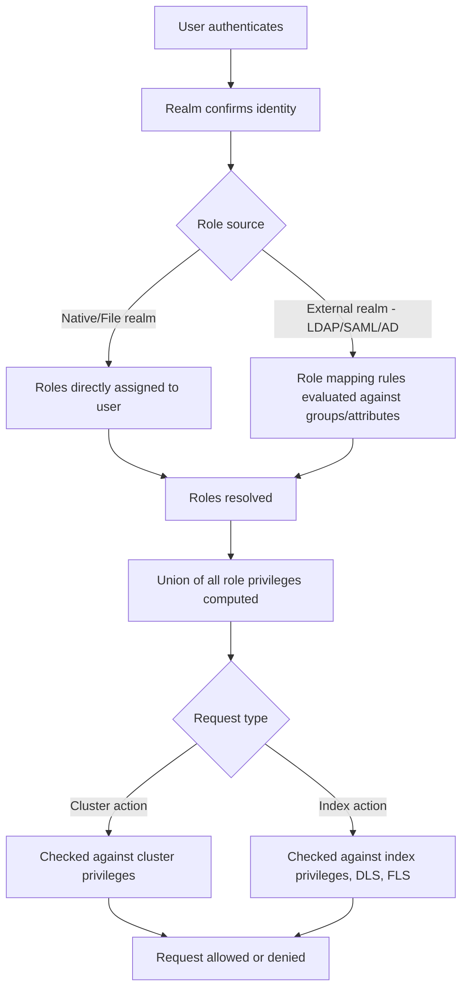

## Role-Based Access Control (RBAC)

### Overview

Role-Based Access Control governs what authenticated users are permitted to do within an Elasticsearch cluster. Rather than assigning permissions directly to individual users, permissions are grouped into **roles**, and roles are then assigned to users. This indirection allows permissions to be managed centrally and consistently across many users.

### Core Concepts

**Key Points**

- **Privilege**: A specific permission to perform an action (e.g., `read`, `write`, `create_index`).
- **Role**: A named collection of privileges, scoped to cluster-level actions, specific indices, or applications.
- **Role mapping**: Associates users (or groups from an external realm like LDAP) with one or more roles.
- **User**: An authenticated identity that is assigned one or more roles, with effective permissions being the union of all assigned roles' privileges.

### Privilege Categories

Privileges are organized into distinct scopes, each governing a different layer of the cluster.

| Scope | Description | Examples |
|---|---|---|
| Cluster privileges | Actions affecting the cluster as a whole. | `monitor`, `manage`, `manage_security`, `manage_ilm` |
| Index privileges | Actions on specific indices or index patterns. | `read`, `write`, `create_index`, `delete_index`, `view_index_metadata` |
| Application privileges | Custom privileges defined for use by external applications (e.g., Kibana feature access), not directly enforced by Elasticsearch itself. | Defined per-application, e.g., Kibana's `feature_discover.all` |
| Run-as privilege | Allows a user to impersonate another user for the purposes of executing requests. | Used by service accounts making requests on behalf of end users |

### Creating a Role

Roles can be created via the Security API or through Kibana's Role Management UI.

```
POST /_security/role/logs_reader
{
  "cluster": ["monitor"],
  "indices": [
    {
      "names": ["logs-*"],
      "privileges": ["read", "view_index_metadata"]
    }
  ]
}
```

This role grants read-only access to any index matching the `logs-*` pattern, plus the ability to view index metadata and basic cluster monitoring information.

### Field- and Document-Level Security

Roles can restrict access at a more granular level than whole indices, controlling which fields or documents a user can see.

**Document-level security (DLS)**, using a query to filter visible documents:

```
POST /_security/role/regional_manager
{
  "indices": [
    {
      "names": ["sales-*"],
      "privileges": ["read"],
      "query": {
        "match": { "region": "apac" }
      }
    }
  ]
}
```

**Field-level security (FLS)**, restricting visible fields:

```
POST /_security/role/limited_fields
{
  "indices": [
    {
      "names": ["employees"],
      "privileges": ["read"],
      "field_security": {
        "grant": ["name", "department"],
        "except": ["salary"]
      }
    }
  ]
}
```

In this example, all fields under `grant` are visible except those explicitly listed under `except`.

### Assigning Roles to Users

Roles can be assigned when creating a native user:

```
POST /_security/user/jsmith
{
  "password": "strong-password",
  "roles": ["logs_reader", "regional_manager"],
  "full_name": "J. Smith"
}
```

A user's effective permissions are the **union** of all privileges granted by every role assigned to them; roles are additive and cannot be used to explicitly deny an action that another assigned role grants.

### Built-in Roles

Elasticsearch includes several predefined roles covering common use cases, which cannot be modified but can be used as-is or as a reference when designing custom roles.

**Example**

| Role | Description |
|---|---|
| `superuser` | Full access to all cluster and index actions. |
| `kibana_admin` | Grants administrative access to Kibana features. |
| `monitoring_user` | Read access to monitoring data. |
| `ingest_admin` | Manage index templates and ingest pipelines. |
| `viewer` | Broad read-only access across the stack. |
| `editor` | Broad read-write access, excluding security management. |

[Inference] The precise list and definitions of built-in roles can change between versions as new stack features are introduced, so the current set should be checked against the running version's documentation.

### Role Mapping for External Realms

When users authenticate via an external realm (LDAP, SAML, Active Directory), roles are typically assigned based on group membership rather than per-user configuration, using role mapping rules.

```
POST /_security/role_mapping/ldap_admins
{
  "roles": ["superuser"],
  "rules": {
    "field": { "groups": "cn=admins,dc=example,dc=com" }
  },
  "enabled": true
}
```

This maps any user authenticated via LDAP who belongs to the `admins` group to the `superuser` role automatically.

### RBAC Structure



### Privilege Evaluation Diagram

<svg xmlns="http://www.w3.org/2000/svg" viewBox="0 0 700 320">
  <text x="350" y="30" text-anchor="middle" font-size="16" font-weight="bold" fill="#1a1a1a">RBAC Privilege Resolution (svg_diagram)</text>

  <rect x="30" y="70" width="160" height="60" rx="6" fill="#e8f0fe" stroke="#4a86e8" stroke-width="1.5" />
  <text x="110" y="95" text-anchor="middle" font-size="12" fill="#1a1a1a">Role A</text>
  <text x="110" y="112" text-anchor="middle" font-size="11" fill="#444">read: logs-*</text>

  <rect x="30" y="160" width="160" height="60" rx="6" fill="#e8f0fe" stroke="#4a86e8" stroke-width="1.5" />
  <text x="110" y="185" text-anchor="middle" font-size="12" fill="#1a1a1a">Role B</text>
  <text x="110" y="202" text-anchor="middle" font-size="11" fill="#444">write: metrics-*</text>

  <rect x="30" y="250" width="160" height="60" rx="6" fill="#e8f0fe" stroke="#4a86e8" stroke-width="1.5" />
  <text x="110" y="275" text-anchor="middle" font-size="12" fill="#1a1a1a">Role C</text>
  <text x="110" y="292" text-anchor="middle" font-size="11" fill="#444">monitor cluster</text>

  <line x1="190" y1="100" x2="330" y2="160" stroke="#999" stroke-width="1.5" />
  <line x1="190" y1="190" x2="330" y2="170" stroke="#999" stroke-width="1.5" />
  <line x1="190" y1="280" x2="330" y2="180" stroke="#999" stroke-width="1.5" />

  <rect x="330" y="130" width="180" height="70" rx="6" fill="#fef7e0" stroke="#e8a33d" stroke-width="1.5" />
  <text x="420" y="160" text-anchor="middle" font-size="12" font-weight="bold" fill="#1a1a1a">Union of Privileges</text>
  <text x="420" y="178" text-anchor="middle" font-size="11" fill="#444">(assigned to user)</text>

  <line x1="510" y1="165" x2="560" y2="165" stroke="#999" stroke-width="1.5" />

  <rect x="560" y="130" width="110" height="70" rx="6" fill="#e6f4ea" stroke="#34a853" stroke-width="1.5" />
  <text x="615" y="160" text-anchor="middle" font-size="12" font-weight="bold" fill="#1a1a1a">Effective</text>
  <text x="615" y="178" text-anchor="middle" font-size="12" font-weight="bold" fill="#1a1a1a">Access</text>
</svg>

### Common Pitfalls

**Key Points**

- Assuming roles can deny permissions; RBAC in Elasticsearch is purely additive, so overlapping roles can never be used to restrict access granted elsewhere.
- Forgetting that `field_security` requires at least one field pattern under `grant` (even `["*"]` for all fields) when using `except` to exclude specific fields.
- Misconfiguring role mapping rules for external realms, resulting in authenticated users having no roles and effectively no access.
- Modifying built-in roles directly, which is not permitted; custom roles should be created instead, even if closely mirroring a built-in role.
- Overlooking that document-level and field-level security apply only to index privileges and do not restrict cluster-level actions.

### Related Topics

- Application privileges and Kibana feature-level access control
- Service accounts and their fixed privilege sets
- Auditing role and privilege changes
- Combining RBAC with API key privilege restriction
- Role templates using Mustache scripting for dynamic DLS queries