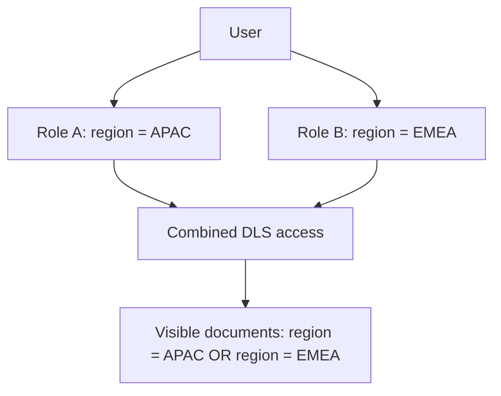

## Index-Level and Document-Level Security

### Overview

Elasticsearch security controls access at multiple granularities. Index-level security restricts which indices a user or role can access and which actions they can perform on them. Document-level security (DLS) and field-level security (FLS) go further, restricting *which documents* within an index a user can see and *which fields* within a document are visible. These features are part of Elasticsearch's security features, available under specific license tiers, and are configured through roles.

### Prerequisites

- [Unverified] Exact licensing tier requirements (e.g., whether a feature requires Gold, Platinum, or is included in Basic) change over time and across Elastic's licensing model revisions, so current documentation should be checked for the deployment's specific version.
- Security features must be enabled (`xpack.security.enabled: true` in `elasticsearch.yml`, though this is enabled by default in recent versions).
- A security realm (native, LDAP, Active Directory, SAML, etc.) must be configured to authenticate users.

### Index-Level Security

#### Concept

Index-level security governs whether a role grants access to an index (or set of indices, via patterns) and what privileges are granted — such as `read`, `write`, `create_index`, `delete`, `manage`, or `all`.

#### Role Definition Structure

Roles are defined with an `indices` array, where each entry specifies index name patterns and the privileges granted on them.

```json
POST /_security/role/logs_reader
{
  "indices": [
    {
      "names": ["logs-*"],
      "privileges": ["read", "view_index_metadata"]
    }
  ]
}
```

**Key Points**
- `names` accepts wildcards, exact names, or index aliases.
- `privileges` can be a mix of built-in privilege names (`read`, `write`, `index`, `delete`, `manage`) or fine-grained action patterns.
- Multiple entries in the `indices` array allow different privilege sets for different index patterns within a single role.
- A role with no matching `indices` entry for a given index denies access to it entirely — access is deny-by-default.

#### Common Index Privileges

| Privilege | Description |
|---|---|
| `read` | Search and retrieve documents |
| `write` | Index, update, and delete individual documents |
| `create` | Index new documents, but not update existing ones |
| `create_index` | Create new indices |
| `delete` | Delete documents |
| `delete_index` | Delete entire indices |
| `manage` | Full administrative control over the index (settings, mappings, aliases) |
| `view_index_metadata` | View index settings and mappings without accessing data |
| `all` | All privileges, including index-level and document-level |

### Document-Level Security (DLS)

#### Concept

DLS restricts which individual documents a role can retrieve or search, using a query. The query is evaluated per request, filtering the result set as though a `bool` filter were transparently applied to every search against that index.

#### Role Definition with `query`

```json
POST /_security/role/regional_manager
{
  "indices": [
    {
      "names": ["sales"],
      "privileges": ["read"],
      "query": {
        "term": {
          "region": "APAC"
        }
      }
    }
  ]
}
```

With this role, a user can only ever see documents where `region` equals `"APAC"`, regardless of what query they issue.

#### Templated Queries

DLS queries can reference the authenticated user's metadata dynamically, avoiding the need for one role per value.

```json
POST /_security/role/regional_manager_templated
{
  "indices": [
    {
      "names": ["sales"],
      "privileges": ["read"],
      "query": {
        "template": {
          "source": {
            "term": {
              "region": "{{_user.metadata.region}}"
            }
          }
        }
      }
    }
  ]
}
```

**Key Points**
- `{{_user.username}}`, `{{_user.roles}}`, and `{{_user.metadata.FIELD}}` are available template variables.
- DLS queries support the same query DSL as regular searches, including `bool`, `term`, `range`, and `terms` queries.
- DLS is applied at the shard level during query execution, so it affects search hits, aggregations that touch document content indirectly, and `_count` results.
- [Inference] Because filtering happens per shard rather than as a strict post-filter, aggregation results are consistent with the restricted document set rather than leaking counts from excluded documents, though exact internal mechanics may vary by query type.

#### DLS and Aggregations Caveat

Certain aggregations that rely on global ordinals or document frequencies can behave differently under DLS restriction. [Unverified] Whether a specific aggregation type fully respects DLS boundaries without any edge-case leakage (e.g., in terms of statistical approximations) can depend on the Elasticsearch version and aggregation type, so testing against the actual deployed version is recommended for security-sensitive use cases.

### Field-Level Security (FLS)

Though the topic specifies document-level, FLS is typically configured alongside DLS in the same role and is worth noting for completeness.

```json
POST /_security/role/limited_fields
{
  "indices": [
    {
      "names": ["employees"],
      "privileges": ["read"],
      "field_security": {
        "grant": ["name", "department", "title"],
        "except": ["salary"]
      }
    }
  ]
}
```

**Key Points**
- `grant` specifies an allowlist of visible fields; `*` grants all fields.
- `except` excludes specific fields from an otherwise granted set — commonly used with `grant: ["*"]`.
- Fields not granted are omitted from `_source`, search hits, and highlighting.
- Metadata fields like `_id`, `_index`, and `_type` are always accessible regardless of FLS settings.

### Combining DLS and FLS

A single role can define both restrictions simultaneously for defense in depth.

```json
POST /_security/role/hr_analyst
{
  "indices": [
    {
      "names": ["employees"],
      "privileges": ["read"],
      "query": {
        "term": {
          "department": "engineering"
        }
      },
      "field_security": {
        "grant": ["*"],
        "except": ["salary", "ssn"]
      }
    }
  ]
}
```

This role limits an HR analyst to only engineering department documents (DLS) while also hiding sensitive `salary` and `ssn` fields (FLS) even within those visible documents.

### Role Composition and Multiple Roles

When a user is assigned multiple roles that grant access to the same index with different DLS queries, Elasticsearch combines the queries with a logical **OR** — the union of documents visible under any assigned role.



**Key Points**
- If any assigned role grants access to an index **without** a DLS query, that unrestricted access takes precedence, and the user sees all documents in that index.
- For FLS, the combination is a **union of granted fields** minus the **intersection of excluded fields** — [Inference] this follows from Elasticsearch's documented rule that the most permissive combination across roles wins, though exact edge cases with overlapping `grant`/`except` sets are worth validating against the target version.
- This "most permissive wins" behavior means role design should avoid accidentally granting broad access through a secondary role.

### Testing Roles

The `_security/user/_has_privileges` and role simulation APIs help validate configuration before deployment.

```json
GET /_security/user/_has_privileges
{
  "index": [
    {
      "names": ["sales"],
      "privileges": ["read"]
    }
  ]
}
```

To simulate what a specific role can see, Elasticsearch also supports running searches as another user via the `run_as` privilege (typically used by service accounts) or by directly authenticating as a test user with the target role assigned.

### Performance Considerations

- DLS queries are executed on every search request against the protected index, adding query overhead proportional to the complexity of the DLS query.
- [Inference] Simple `term` or `terms` queries used for DLS impose minimal overhead relative to `script` based DLS queries, since scripted queries require per-document script execution, though actual impact depends on cluster load and document volume.
- Caching behavior for DLS-filtered queries may differ from unrestricted queries; the shard-level request cache is keyed in a way that accounts for the applied security filters, so cache hit rates for identical raw queries can vary by user role. [Unverified] The precise caching implementation details are version-dependent.

### Illustration: Access Flow

<svg xmlns="http://www.w3.org/2000/svg" viewBox="0 0 800 420">
  <text x="400" y="30" text-anchor="middle" font-size="18" font-weight="bold" fill="#1a1a1a">Index/Document/Field Security Flow (svg_diagram)</text>

  <rect x="40" y="70" width="160" height="60" rx="8" fill="#e3f2fd" stroke="#1565c0" stroke-width="2" />
  <text x="120" y="105" text-anchor="middle" font-size="14" fill="#0d47a1">User Request</text>

  <rect x="260" y="70" width="180" height="60" rx="8" fill="#fff3e0" stroke="#ef6c00" stroke-width="2" />
  <text x="350" y="95" text-anchor="middle" font-size="13" fill="#e65100">Index-Level Check</text>
  <text x="350" y="113" text-anchor="middle" font-size="11" fill="#e65100">Can access index?</text>

  <rect x="500" y="70" width="180" height="60" rx="8" fill="#f3e5f5" stroke="#6a1b9a" stroke-width="2" />
  <text x="590" y="95" text-anchor="middle" font-size="13" fill="#4a148c">DLS Filter Applied</text>
  <text x="590" y="113" text-anchor="middle" font-size="11" fill="#4a148c">Restrict documents</text>

  <rect x="500" y="180" width="180" height="60" rx="8" fill="#e8f5e9" stroke="#2e7d32" stroke-width="2" />
  <text x="590" y="205" text-anchor="middle" font-size="13" fill="#1b5e20">FLS Filter Applied</text>
  <text x="590" y="223" text-anchor="middle" font-size="11" fill="#1b5e20">Restrict fields</text>

  <rect x="260" y="290" width="180" height="60" rx="8" fill="#ffebee" stroke="#c62828" stroke-width="2" />
  <text x="350" y="315" text-anchor="middle" font-size="13" fill="#b71c1c">Denied</text>
  <text x="350" y="333" text-anchor="middle" font-size="11" fill="#b71c1c">No matching privilege</text>

  <rect x="500" y="290" width="180" height="60" rx="8" fill="#e0f7fa" stroke="#00838f" stroke-width="2" />
  <text x="590" y="315" text-anchor="middle" font-size="13" fill="#006064">Response Returned</text>
  <text x="590" y="333" text-anchor="middle" font-size="11" fill="#006064">Filtered hits + fields</text>

  <line x1="200" y1="100" x2="260" y2="100" stroke="#555" stroke-width="2" marker-end="url(#arrow)" />
  <line x1="440" y1="100" x2="500" y2="100" stroke="#555" stroke-width="2" marker-end="url(#arrow)" />
  <line x1="590" y1="130" x2="590" y2="180" stroke="#555" stroke-width="2" marker-end="url(#arrow)" />
  <line x1="590" y1="240" x2="590" y2="290" stroke="#555" stroke-width="2" marker-end="url(#arrow)" />
  <line x1="350" y1="130" x2="350" y2="290" stroke="#c62828" stroke-width="2" stroke-dasharray="4,3" marker-end="url(#arrowred)" />

  </svg>

### Common Pitfalls

- Assigning a role without a DLS `query` clause to a user who also has a DLS-restricted role — this grants unrestricted access due to the "most permissive wins" merge behavior.
- Applying FLS `except` on a field that is also used inside a DLS `query` — the document filtering still evaluates against the full indexed field even if that field is hidden from the response. [Inference] This follows because DLS filtering occurs at the query/shard level against indexed data, prior to the FLS field-visibility step applied to the response.
- Forgetting that `_source` filtering via FLS does not remove data from the underlying Lucene index — FLS is a response-time visibility control, not an encryption or physical removal mechanism.
- Relying solely on DLS/FLS for highly sensitive data without also considering encryption at rest and transport-layer security, since DLS/FLS operate at the query-response layer.

### Related Topics

- Role Mappings and External Identity Providers (LDAP, SAML, OIDC)
- API Key Authentication and Scoped API Keys
- Attribute-Based Access Control (ABAC) patterns using metadata templating
- Audit Logging for Security Events
- Transport and HTTP Layer TLS Configuration
- Cross-Cluster Search Security Considerations