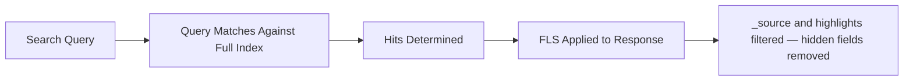
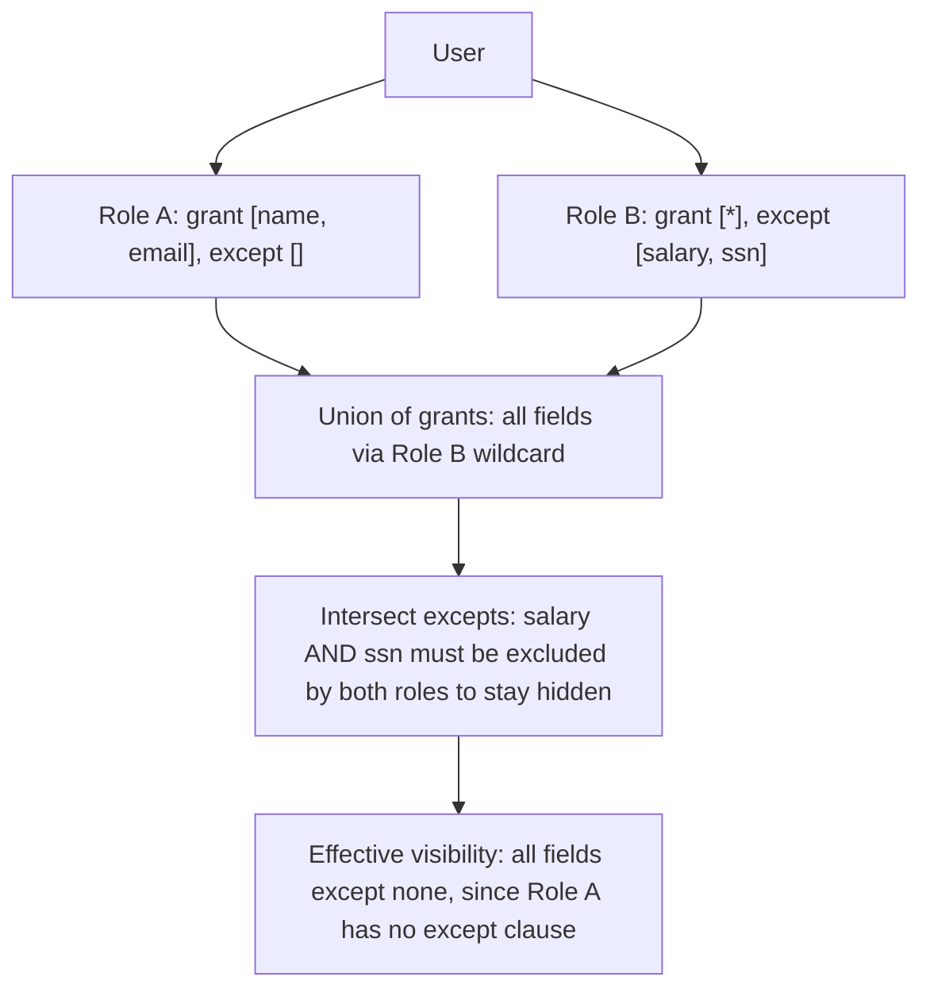

## Field-Level Security

### Overview

Field-level security (FLS) restricts which fields within a document are visible to a user when a role grants access to an index. Rather than hiding entire documents (which is the role of document-level security), FLS controls visibility at the field granularity — allowing, for example, a support agent to see a customer's name and order history while a `credit_card_number` or `ssn` field remains hidden from search results, `_source`, highlighting, and other response bodies.

### Concept

FLS is defined per role, per index pattern, using a `field_security` object with two possible keys: `grant` and `except`. It operates as a response-time filter — restricted fields are removed from what is returned to the client, without altering how the document is indexed or stored internally.

### Role Definition Structure

```json
POST /_security/role/support_agent
{
  "indices": [
    {
      "names": ["customers"],
      "privileges": ["read"],
      "field_security": {
        "grant": ["name", "email", "order_history.*"],
        "except": ["order_history.payment_token"]
      }
    }
  ]
}
```

**Key Points**
- `grant` is an allowlist — only listed fields (and their sub-fields, if using wildcards) are visible. Omitting `grant` or using `["*"]` grants all fields by default.
- `except` is a denylist applied **after** `grant`, carving out specific fields from an otherwise granted set. `except` fields must be a subset of what `grant` allows.
- Wildcards (`*`) are supported in both `grant` and `except`, allowing patterns like `metadata.*` or `*.internal_notes`.
- Multi-fields (e.g., a `.keyword` sub-field) are treated as part of their parent field for FLS purposes in most configurations. [Inference] This follows from how Elasticsearch treats multi-fields as facets of a single mapped field rather than independent fields, though exact wildcard-matching edge cases should be verified against the deployed version.

### Grant-Only Configuration

The simplest FLS configuration grants access to an explicit allowlist without an `except` clause.

```json
POST /_security/role/analytics_viewer
{
  "indices": [
    {
      "names": ["events"],
      "privileges": ["read"],
      "field_security": {
        "grant": ["event_type", "timestamp", "user_id", "region"]
      }
    }
  ]
}
```

Any field not in this list — such as a hypothetical `raw_payload` field — is excluded from all responses for users with this role.

### Grant-All with Exceptions

A common pattern is to grant all fields, then explicitly exclude sensitive ones. This is more maintainable when new non-sensitive fields are added to the mapping over time, since they're visible by default.

```json
POST /_security/role/employee_directory_viewer
{
  "indices": [
    {
      "names": ["employees"],
      "privileges": ["read"],
      "field_security": {
        "grant": ["*"],
        "except": ["salary", "ssn", "home_address", "performance_reviews.*"]
      }
    }
  ]
}
```

**Key Points**
- This pattern shifts the maintenance burden: new sensitive fields must be actively added to `except`, or they become visible by default.
- The inverse (`grant`-only) pattern is generally considered the more conservative default, since newly added fields are hidden until explicitly granted. [Inference] This is a security design tradeoff commonly recommended in least-privilege access models generally, applied here to field visibility.

### Always-Accessible Metadata Fields

Certain document metadata fields are not subject to FLS restriction, since they are not part of `_source` in the same sense as mapped document fields.

| Field | Notes |
|---|---|
| `_id` | Document identifier, always visible |
| `_index` | Source index name, always visible |
| `_routing` | Routing value, if used, generally always visible |
| `_ignored` | Reflects field-level ignore state during indexing |

[Unverified] The exact and complete list of metadata fields exempt from FLS can vary slightly by Elasticsearch version; the current version's documentation should be consulted for a definitive list before relying on this for compliance-sensitive designs.

### FLS and Query Behavior

A critical nuance: **FLS restricts what is returned in the response, not what can be matched during search.** If a `grant`/`except` clause hides a field, a query that explicitly targets that field in the request may still error, be silently ignored, or behave inconsistently depending on privilege configuration and query type — the restriction is enforced at the data-return layer.



**Key Points**
- Highlighting on an excluded field will not surface excerpts from that field's content, since highlighting draws from `_source` or stored fields, which are already filtered.
- Aggregations that bucket on a hidden field can still execute successfully and return bucket keys/counts, since aggregations often operate on doc values rather than `_source`. [Inference] Whether a specific aggregation is blocked or permitted on an excluded field depends on the underlying data structure it reads from (doc values vs. stored `_source`) and the exact version's enforcement scope, so this should be tested directly for security-sensitive deployments rather than assumed.
- Sorting on an excluded field follows similar considerations to aggregations, as sort typically relies on doc values.

### Combining FLS with Document-Level Security

FLS and DLS are frequently defined together in the same role entry for layered protection — restricting both which documents are visible and which fields within those documents are shown.

```json
POST /_security/role/regional_hr_viewer
{
  "indices": [
    {
      "names": ["employees"],
      "privileges": ["read"],
      "query": {
        "term": { "region": "APAC" }
      },
      "field_security": {
        "grant": ["*"],
        "except": ["salary", "ssn"]
      }
    }
  ]
}
```

**Key Points**
- DLS and FLS are independent mechanisms evaluated separately: DLS narrows the document set; FLS narrows the field set within whatever documents pass the DLS filter.
- A field referenced in a DLS `query` clause is still evaluated against its full indexed value during filtering, even if that same field is excluded via FLS from the response — DLS filtering happens against indexed data, prior to FLS response shaping.

### Role Composition with Multiple FLS-Bearing Roles

When a user holds multiple roles that grant access to the same index with different FLS configurations, Elasticsearch merges the field visibility using a "most permissive" rule: the union of all `grant` sets, minus the intersection of all `except` sets.



**Key Points**
- If any one role grants a field without excepting it, that field becomes visible to the user — even if another assigned role excepts it. [Inference] This follows the documented general principle that the most permissive combination of roles wins in Elasticsearch's security model, extended here to per-field grant/except merging; exact resolution order for complex overlapping wildcard patterns is worth validating directly.
- This makes FLS role design sensitive to accidental privilege escalation through role accumulation — a broadly scoped secondary role (e.g., an "all fields" analytics role) can silently undo a carefully scoped `except` clause from a primary role.
- Auditing effective privileges via the `_has_privileges` or role-simulation tooling is recommended whenever users hold multiple roles on the same index.

### Testing FLS Configuration

```json
GET /_security/user/_has_privileges
{
  "index": [
    {
      "names": ["employees"],
      "privileges": ["read"]
    }
  ]
}
```

For more targeted verification, authenticating as a test user with the target role and issuing a live search against the index confirms actual field visibility in `_source`, since `_has_privileges` reports privilege grants rather than the resolved field set itself. [Unverified] Whether a dedicated API for directly resolving "effective FLS field list" per role exists depends on the Elasticsearch version; this should be checked in current documentation.

### Illustration: Grant vs. Except Resolution

<svg xmlns="http://www.w3.org/2000/svg" viewBox="0 0 800 380">
  <text x="400" y="30" text-anchor="middle" font-size="18" font-weight="bold" fill="#1a1a1a">Field-Level Security: Grant/Except Resolution (svg_diagram)</text>

  <rect x="40" y="70" width="220" height="90" rx="8" fill="#e8eaf6" stroke="#3f51b5" stroke-width="2" />
  <text x="150" y="95" text-anchor="middle" font-size="13" font-weight="bold" fill="#283593">All Mapped Fields</text>
  <text x="150" y="115" text-anchor="middle" font-size="11" fill="#283593">name, email, ssn,</text>
  <text x="150" y="132" text-anchor="middle" font-size="11" fill="#283593">salary, department</text>

  <rect x="320" y="70" width="220" height="90" rx="8" fill="#fff3e0" stroke="#ef6c00" stroke-width="2" />
  <text x="430" y="95" text-anchor="middle" font-size="13" font-weight="bold" fill="#e65100">Apply grant: ["*"]</text>
  <text x="430" y="115" text-anchor="middle" font-size="11" fill="#e65100">All fields pass through</text>
  <text x="430" y="132" text-anchor="middle" font-size="11" fill="#e65100">(wildcard grant)</text>

  <rect x="600" y="70" width="180" height="90" rx="8" fill="#ffebee" stroke="#c62828" stroke-width="2" />
  <text x="690" y="95" text-anchor="middle" font-size="13" font-weight="bold" fill="#b71c1c">Apply except:</text>
  <text x="690" y="115" text-anchor="middle" font-size="11" fill="#b71c1c">ssn, salary</text>
  <text x="690" y="132" text-anchor="middle" font-size="11" fill="#b71c1c">removed</text>

  <rect x="270" y="230" width="260" height="90" rx="8" fill="#e8f5e9" stroke="#2e7d32" stroke-width="2" />
  <text x="400" y="255" text-anchor="middle" font-size="13" font-weight="bold" fill="#1b5e20">Visible in Response</text>
  <text x="400" y="278" text-anchor="middle" font-size="12" fill="#1b5e20">name, email, department</text>
  <text x="400" y="296" text-anchor="middle" font-size="11" fill="#1b5e20">(ssn, salary hidden)</text>

  <line x1="260" y1="115" x2="320" y2="115" stroke="#555" stroke-width="2" marker-end="url(#arrow2)" />
  <line x1="540" y1="115" x2="600" y2="115" stroke="#555" stroke-width="2" marker-end="url(#arrow2)" />
  <line x1="690" y1="160" x2="450" y2="230" stroke="#555" stroke-width="2" marker-end="url(#arrow2)" />

  </svg>

### Common Pitfalls

- Assuming FLS prevents matching on hidden fields — it does not; it only filters what is returned, so hidden field content can still influence relevance scoring, filtering, and existence in search internals unless separately restricted via other means.
- Over-relying on `except` without periodically auditing newly added mapping fields, since grant-all patterns expose new fields by default.
- Granting a broad secondary role (e.g., `["*"]` with no `except`) to a user who also holds a narrowly scoped primary role, inadvertently exposing everything due to most-permissive-wins merging.
- Treating FLS as equivalent to encryption or data masking — the underlying field value still exists unmodified in the index; FLS only governs API-level response visibility.
- Forgetting that scripted fields, `script_fields`, and runtime fields computed from an excepted field's value may still leak the underlying data if the script output is not itself covered by FLS restrictions. [Inference] This follows because FLS is documented as governing the declared field itself, and a runtime or scripted field that derives from — but is technically distinct from — the restricted field may fall outside that restriction depending on version and configuration, warranting explicit verification.

### Related Topics

- Document-Level Security (DLS) Deep Dive
- Role Mappings and External Identity Providers
- API Key Authentication and Scoped API Keys
- Runtime Fields and Scripted Fields Security Implications
- Audit Logging for Security Events
- Attribute-Based Access Control (ABAC) Patterns Using Metadata Templating