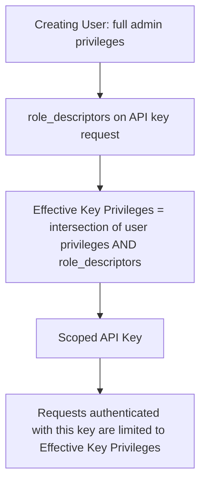

## API Keys

### Overview

API keys are a credential type in Elasticsearch's security model used primarily for programmatic access — service-to-service authentication, scripts, and applications — as an alternative to embedding a username and password. Each API key carries its own privileges, which can be equal to or a subset of the creating user's privileges, and can be individually created, retrieved, invalidated, and audited without affecting the underlying user account.

### Concept

An API key is a named credential, generated on demand, consisting of an `id` and a `secret` (referred to as `api_key`), which together form a token used in the `Authorization: ApiKey <base64(id:api_key)>` header on requests. Unlike native realm passwords, API keys are designed to be scoped, short- or long-lived, and revocable independently of the user who created them.

### Creating an API Key

```json
POST /_security/api_key
{
  "name": "monitoring-service-key",
  "expiration": "30d",
  "role_descriptors": {
    "monitoring_role": {
      "indices": [
        {
          "names": ["metrics-*"],
          "privileges": ["read", "view_index_metadata"]
        }
      ]
    }
  }
}
```

**Key Points**
- `name` is a human-readable identifier for later lookup and auditing; it does not need to be unique.
- `expiration` is optional — omitting it creates a key with no expiration, which should generally be avoided for long-lived automation unless paired with an active rotation policy.
- `role_descriptors` defines the privileges granted to the key. If omitted, the key inherits the full privileges of the creating user at the time of use (evaluated dynamically, not frozen at creation). [Inference] This follows from Elasticsearch's documented behavior that an API key's effective permissions are the intersection of the key's own role descriptors (if any) and the creating user's current privileges, meaning a later reduction in the creating user's privileges also reduces the key's effective access.
- The response includes the `id` and `api_key` secret exactly once — the raw secret is not retrievable again after creation and must be stored securely by the caller at that time.

### Response Structure

```json
{
  "id": "VuaCfGcBCdbkQm-e5aOx",
  "name": "monitoring-service-key",
  "api_key": "ui2lp2axTNmsyakw9tvNnw",
  "encoded": "VuaCfGcBCdbkQm-e5aOx..."
}
```

**Key Points**
- `encoded` is the ready-to-use base64-encoded `id:api_key` string suitable for direct use in the `Authorization` header.
- Losing the `api_key` secret means the key cannot be recovered — a new key must be created and the old one invalidated.

### Using an API Key

```plaintext
GET /metrics-2024.01.01/_search
Authorization: ApiKey VuaCfGcBCdbkQm-e5aOx...
```

Requests authenticated via API key are subject to the same privilege evaluation as any other authenticated request — index-level, document-level, and field-level security restrictions defined in the key's effective role apply identically.

### Granting a Subset of Privileges

Because `role_descriptors` can only narrow, never widen, a creating user's own privileges, API keys are naturally suited to the principle of least privilege: a broadly privileged user can mint a narrowly scoped key for a specific automated task.

```json
POST /_security/api_key
{
  "name": "readonly-dashboard-key",
  "role_descriptors": {
    "readonly": {
      "indices": [
        {
          "names": ["dashboard-data"],
          "privileges": ["read"],
          "field_security": {
            "grant": ["*"],
            "except": ["internal_notes"]
          }
        }
      ]
    }
  }
}
```

This key, even if created by an administrator with cluster-wide access, is restricted to read-only access on a single index pattern with FLS applied — the effective privilege is the intersection of what's declared here and what the creating user could do.



### Retrieving API Key Information

```json
GET /_security/api_key?name=monitoring-service-key
```

```json
GET /_security/api_key?id=VuaCfGcBCdbkQm-e5aOx
```

**Key Points**
- Retrieval endpoints return metadata (`name`, `id`, `creation`, `expiration`, `invalidated` status, `role_descriptors`) but never the raw secret.
- Queries can filter by `id`, `name`, `username` (creating user), `realm_name`, or use `owner=true` to restrict results to keys owned by the currently authenticated user.

### Invalidating API Keys

```json
DELETE /_security/api_key
{
  "ids": ["VuaCfGcBCdbkQm-e5aOx"]
}
```

```json
DELETE /_security/api_key
{
  "name": "monitoring-service-key"
}
```

**Key Points**
- Invalidation is immediate and irreversible — an invalidated key cannot be reactivated; a new key must be created.
- Bulk invalidation is supported by matching on `username`, `realm_name`, or other filters, useful for revoking all keys tied to a compromised or decommissioned service account.
- [Unverified] The exact retention period for invalidated key metadata before it is purged from the security index can vary by version and cluster configuration.

### Granting Roles at Creation vs. Inheriting

| Approach | Behavior |
|---|---|
| `role_descriptors` provided | Key's effective privileges = intersection of provided descriptors and creating user's current privileges |
| `role_descriptors` omitted | Key inherits creating user's current privileges dynamically, re-evaluated on each use |

**Key Points**
- Because privileges under the "omitted" approach are re-evaluated dynamically rather than fixed at creation time, changes to the creating user's roles after key creation propagate to the key's effective access. [Inference] This follows from Elasticsearch's documented model where API key authorization is computed at request time against current role state, not a snapshot; exact caching behavior around this evaluation may vary by version.
- This makes explicit `role_descriptors` the safer choice for automation where privilege drift on the creating user's account should not silently change what the key can do.

### Grant API Key (On Behalf of Another User)

A privileged user can create an API key on behalf of another authenticated user via the grant API, typically used for token exchange flows (e.g., issuing a key after validating credentials or an OAuth token in a custom application layer).

```json
POST /_security/api_key/grant
{
  "grant_type": "password",
  "username": "service_user",
  "password": "changeme",
  "api_key": {
    "name": "granted-service-key",
    "role_descriptors": {}
  }
}
```

[Unverified] The specific supported `grant_type` values (e.g., `password`, `access_token`) and their exact behavior can differ across Elasticsearch versions, so the deployed version's documentation should be checked before implementing this flow.

### Cross-Cluster API Keys

For cross-cluster search and replication scenarios, Elasticsearch supports a distinct API key type scoped specifically to cross-cluster operations, separate from standard API keys used for local cluster access.

```json
POST /_security/cross_cluster/api_key
{
  "name": "cross-cluster-search-key",
  "access": {
    "search": [
      {
        "names": ["logs-*"]
      }
    ]
  }
}
```

**Key Points**
- Cross-cluster API keys are designed to be used by a remote cluster to authenticate into the local cluster for cross-cluster search or replication, rather than by an end-user client application.
- Their `access` structure differs from standard `role_descriptors`, using dedicated `search` and `replication` sections. [Unverified] Exact structure and available fields depend on the Elasticsearch version, given this is a comparatively newer feature relative to standard API keys.

### API Keys vs. Other Authentication Methods

| Method | Typical Use Case | Revocation Granularity |
|---|---|---|
| Native realm username/password | Interactive human users | Per-user (password reset/disable) |
| API keys | Service accounts, automation, scripts | Per-key |
| Service account tokens | Elastic Stack internal services (e.g., Kibana, Fleet) | Per-token |
| OIDC/SAML tokens | SSO-integrated human users | Per-session, via IdP |

**Key Points**
- API keys offer finer revocation granularity than shared service-account passwords, since compromising or rotating one key does not require changing credentials shared across multiple integrations.
- [Inference] This granularity makes API keys generally preferable to shared credentials for multi-integration environments, following standard least-privilege and blast-radius-reduction reasoning applied to credential management generally.

### Auditing API Key Usage

Security audit logging, when enabled, records API key authentication events, including the key `id` used, though not the secret itself. This allows tracing specific automated actions back to a specific key even when multiple keys share a similar name or role.

**Key Points**
- Audit logs paired with a clear `name` convention (e.g., embedding the service and environment in the name, such as `billing-service-prod`) materially ease incident investigation.
- [Unverified] The specific fields captured in audit logs for API key events, and default audit logging configuration, vary by version and by whether audit logging is a licensed feature in the deployed tier.

### Illustration: API Key Lifecycle

<svg xmlns="http://www.w3.org/2000/svg" viewBox="0 0 820 380">
  <text x="410" y="30" text-anchor="middle" font-size="18" font-weight="bold" fill="#1a1a1a">API Key Lifecycle (svg_diagram)</text>

  <rect x="30" y="70" width="160" height="70" rx="8" fill="#e3f2fd" stroke="#1565c0" stroke-width="2" />
  <text x="110" y="100" text-anchor="middle" font-size="13" fill="#0d47a1">Create Key</text>
  <text x="110" y="118" text-anchor="middle" font-size="11" fill="#0d47a1">POST /_security/api_key</text>

  <rect x="240" y="70" width="160" height="70" rx="8" fill="#fff3e0" stroke="#ef6c00" stroke-width="2" />
  <text x="320" y="100" text-anchor="middle" font-size="13" fill="#e65100">Store Secret</text>
  <text x="320" y="118" text-anchor="middle" font-size="11" fill="#e65100">Shown once only</text>

  <rect x="450" y="70" width="160" height="70" rx="8" fill="#e8f5e9" stroke="#2e7d32" stroke-width="2" />
  <text x="530" y="100" text-anchor="middle" font-size="13" fill="#1b5e20">Authenticate</text>
  <text x="530" y="118" text-anchor="middle" font-size="11" fill="#1b5e20">Authorization: ApiKey ...</text>

  <rect x="660" y="70" width="130" height="70" rx="8" fill="#f3e5f5" stroke="#6a1b9a" stroke-width="2" />
  <text x="725" y="100" text-anchor="middle" font-size="13" fill="#4a148c">Access Granted</text>
  <text x="725" y="118" text-anchor="middle" font-size="11" fill="#4a148c">Per effective privileges</text>

  <rect x="240" y="220" width="160" height="70" rx="8" fill="#ffebee" stroke="#c62828" stroke-width="2" />
  <text x="320" y="250" text-anchor="middle" font-size="13" fill="#b71c1c">Expiration Reached</text>
  <text x="320" y="268" text-anchor="middle" font-size="11" fill="#b71c1c">Auto-invalidated</text>

  <rect x="450" y="220" width="160" height="70" rx="8" fill="#ffebee" stroke="#c62828" stroke-width="2" />
  <text x="530" y="250" text-anchor="middle" font-size="13" fill="#b71c1c">Manual Invalidation</text>
  <text x="530" y="268" text-anchor="middle" font-size="11" fill="#b71c1c">DELETE /_security/api_key</text>

  <rect x="350" y="320" width="200" height="50" rx="8" fill="#eceff1" stroke="#455a64" stroke-width="2" />
  <text x="450" y="350" text-anchor="middle" font-size="13" fill="#263238">Key Permanently Unusable</text>

  <line x1="190" y1="105" x2="240" y2="105" stroke="#555" stroke-width="2" marker-end="url(#arrow3)" />
  <line x1="400" y1="105" x2="450" y2="105" stroke="#555" stroke-width="2" marker-end="url(#arrow3)" />
  <line x1="610" y1="105" x2="660" y2="105" stroke="#555" stroke-width="2" marker-end="url(#arrow3)" />
  <line x1="530" y1="140" x2="320" y2="220" stroke="#555" stroke-width="2" marker-end="url(#arrow3)" />
  <line x1="530" y1="140" x2="530" y2="220" stroke="#555" stroke-width="2" marker-end="url(#arrow3)" />
  <line x1="320" y1="290" x2="420" y2="320" stroke="#555" stroke-width="2" marker-end="url(#arrow3)" />
  <line x1="530" y1="290" x2="480" y2="320" stroke="#555" stroke-width="2" marker-end="url(#arrow3)" />

  </svg>

### Common Pitfalls

- Omitting `role_descriptors`, which causes the key to silently inherit the creating user's full current privileges — a common source of over-privileged automation credentials.
- Creating keys with no `expiration` for long-lived services without a corresponding rotation or expiry review process, leaving stale, potentially forgotten credentials active indefinitely.
- Losing the raw `api_key` secret immediately after creation, requiring a new key to be generated since the secret cannot be retrieved again.
- Confusing standard API keys with cross-cluster API keys — the two serve different authentication contexts and are not interchangeable.
- Embedding API keys directly in application source code or version control rather than a secrets manager, which undermines the granular revocation benefit API keys are meant to provide.

### Related Topics

- Service Account Tokens for Elastic Stack Components
- Cross-Cluster Search and Replication Security
- Role Mappings and External Identity Providers (LDAP, SAML, OIDC)
- Audit Logging Configuration and Event Types
- Token-Based Authentication and OAuth2 Token Service
- Secrets Management Integration Patterns for Elasticsearch Credentials