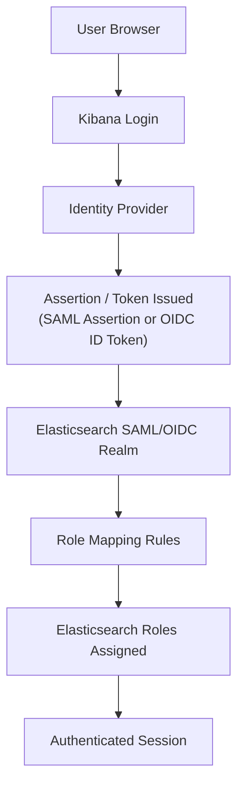

## SAML and OIDC Integration

### Overview

SAML (Security Assertion Markup Language) and OIDC (OpenID Connect) are federated authentication protocols that allow Elasticsearch and Kibana to delegate user authentication to an external Identity Provider (IdP), such as Okta, Azure AD, Keycloak, or ADFS. Rather than managing passwords directly, Elasticsearch trusts assertions or tokens issued by the IdP and maps the authenticated identity to internal roles via role mapping rules.

### Concept

Both protocols solve the same core problem — single sign-on (SSO) against a centralized identity source — but differ in transport and token format. SAML exchanges signed XML assertions over browser redirects, while OIDC is built on OAuth2 and exchanges JSON Web Tokens (JWTs). Elasticsearch implements each as a distinct realm type (`saml` and `oidc`) configured in `elasticsearch.yml`, paired with corresponding realm configuration in Kibana for the browser-based login flow.



### SAML Realm Configuration

#### elasticsearch.yml Setup

```yaml
xpack.security.authc.realms.saml.saml1:
  order: 2
  idp.metadata.path: saml/idp-metadata.xml
  idp.entity_id: "https://idp.example.com/saml"
  sp.entity_id: "https://kibana.example.com"
  sp.acs: "https://kibana.example.com/api/security/saml/callback"
  sp.logout: "https://kibana.example.com/logout"
  attributes.principal: "urn:oid:0.9.2342.19200300.100.1.1"
  attributes.groups: "urn:oid:1.3.6.1.4.1.5923.1.5.1.1"
```

**Key Points**
- `idp.metadata.path` (or `idp.metadata.url` for dynamic fetching) points to the IdP's metadata, which contains its signing certificate and endpoint URLs.
- `sp.entity_id` and `sp.acs` (Assertion Consumer Service URL) define how the IdP identifies and communicates back to this Elasticsearch/Kibana deployment as the Service Provider (SP).
- `attributes.principal` maps a SAML attribute (often expressed as an OID or URI, depending on the IdP's attribute naming convention) to the Elasticsearch username.
- `attributes.groups` maps a SAML attribute carrying group membership, which is typically the attribute used downstream in role mapping rules.
- [Unverified] The exact required and optional settings, along with their default values, vary somewhat across Elasticsearch versions, so the deployed version's SAML realm reference should be consulted when configuring a production setup.

#### Kibana-Side Configuration

```yaml
xpack.security.authc.providers:
  saml.saml1:
    order: 0
    realm: saml1
    description: "Log in with SSO"
```

Kibana requires a corresponding provider entry that references the realm name defined in Elasticsearch, since Kibana orchestrates the browser redirect flow while Elasticsearch performs the actual assertion validation.

### OIDC Realm Configuration

#### elasticsearch.yml Setup

```yaml
xpack.security.authc.realms.oidc.oidc1:
  order: 2
  rp.client_id: "elasticsearch-client"
  rp.response_type: "code"
  rp.redirect_uri: "https://kibana.example.com/api/security/oidc/callback"
  op.issuer: "https://idp.example.com"
  op.authorization_endpoint: "https://idp.example.com/oauth2/authorize"
  op.token_endpoint: "https://idp.example.com/oauth2/token"
  op.userinfo_endpoint: "https://idp.example.com/oauth2/userinfo"
  op.jwks_path: "oidc/jwks.json"
  claims.principal: "sub"
  claims.groups: "groups"
```

**Key Points**
- `rp.*` settings describe the Relying Party (Elasticsearch/Kibana, in OIDC terminology); `op.*` settings describe the OpenID Provider (the IdP).
- `rp.response_type: "code"` selects the Authorization Code flow, which is generally the recommended flow for confidential clients since the token exchange happens server-to-server rather than via the browser URL. [Inference] This follows standard OAuth2/OIDC security guidance that the Authorization Code flow avoids exposing tokens directly in browser redirects, unlike the Implicit flow; whether Elasticsearch supports flows beyond Authorization Code depends on version.
- `claims.principal` and `claims.groups` map JWT claims to the Elasticsearch username and group-equivalent attribute, analogous to SAML's `attributes.principal`/`attributes.groups`.
- The client secret (`rp.client_secret`) is typically stored in the Elasticsearch keystore rather than directly in `elasticsearch.yml`, following the general pattern for sensitive configuration values.

### Role Mapping

Neither SAML nor OIDC realms assign Elasticsearch roles directly — authentication only establishes *who* the user is. A separate role mapping step determines *what* the authenticated user can do, based on attributes/claims returned by the IdP.

```json
POST /_security/role_mapping/saml_admins
{
  "roles": ["superuser"],
  "rules": {
    "all": [
      { "field": { "realm.name": "saml1" } },
      { "field": { "groups": "elasticsearch-admins" } }
    ]
  },
  "enabled": true
}
```

```json
POST /_security/role_mapping/oidc_analysts
{
  "roles": ["analytics_viewer"],
  "rules": {
    "all": [
      { "field": { "realm.name": "oidc1" } },
      { "field": { "groups": "data-team" } }
    ]
  },
  "enabled": true
}
```

**Key Points**
- `rules` support boolean composition via `all`, `any`, and `except`, allowing precise conditions based on realm, username, groups, or arbitrary metadata returned by the IdP.
- Role mapping rules are evaluated on every authentication, meaning a change in group membership at the IdP is reflected in Elasticsearch access on the user's next login without needing to touch Elasticsearch configuration directly.
- Role mapping can alternatively be delegated to the IdP itself in some configurations, where the IdP embeds Elasticsearch role names directly as a claim/attribute, and a templated role mapping rule reads that value dynamically. [Unverified] Support and exact configuration for IdP-driven role assignment versus rule-based mapping can differ by version and by whether this is done via role mapping rules or role templates.

### SAML vs. OIDC: Comparison

| Aspect | SAML | OIDC |
|---|---|---|
| Token format | XML assertions | JSON Web Tokens (JWT) |
| Transport | Browser redirects/POST bindings | OAuth2 flows (typically Authorization Code) |
| Typical use case | Enterprise IdPs (ADFS, older Okta/Azure AD deployments) | Modern IdPs, mobile/native app friendly |
| Elasticsearch realm type | `saml` | `oidc` |
| Metadata exchange | IdP metadata XML | OIDC discovery document (`.well-known/openid-configuration`) |
| Logout support | Single Logout (SLO) via IdP-initiated or SP-initiated flows | RP-initiated logout via `end_session_endpoint`, where supported |

**Key Points**
- [Inference] Neither protocol is strictly "better" in general; the choice is typically driven by what the organization's existing IdP supports and organizational standardization, rather than an inherent technical advantage of one over the other for this use case.
- Both protocols require Kibana to be configured as the browser-facing entry point for the SSO flow, since Elasticsearch itself does not serve a login UI.

### Attribute and Claim Mapping Nuances

- SAML attribute names are frequently expressed as OIDs (e.g., `urn:oid:0.9.2342.19200300.100.1.1` for `uid`) rather than friendly names, depending on the IdP's SAML metadata configuration, which can make initial configuration error-prone without inspecting actual assertion payloads.
- OIDC claims are typically friendlier JSON keys (`sub`, `email`, `groups`) but exact claim names for group membership are IdP-specific and not standardized beyond a small set of core OIDC claims (`sub`, `name`, `email`, etc.).
- [Unverified] Whether a given IdP includes group membership as a claim by default, or requires additional scope/API configuration to include it, is specific to each IdP product and its configuration, not something Elasticsearch controls.

### Testing and Debugging

- `GET /_security/saml/metadata` returns Elasticsearch's own SP metadata XML, useful for configuring the IdP side of a SAML integration without hand-authoring metadata.
- Elasticsearch and Kibana logs at increased verbosity (`debug` or `trace` level for the relevant realm) surface assertion/token parsing failures, signature validation errors, and clock-skew issues, which are common sources of integration failures.
- [Inference] Clock skew between the IdP and Elasticsearch cluster nodes is a common source of intermittent SAML/OIDC failures, since both protocols rely on time-bounded assertions/tokens (e.g., `NotBefore`/`NotOnOrAfter` in SAML, `exp`/`iat` in JWTs); this follows from the protocols' documented reliance on timestamp validation, though the specific tolerance window is version/configuration dependent.

### Illustration: SAML vs. OIDC Token Flow

<svg xmlns="http://www.w3.org/2000/svg" viewBox="0 0 820 420">
  <text x="410" y="30" text-anchor="middle" font-size="18" font-weight="bold" fill="#1a1a1a">SAML vs. OIDC Flow Comparison (svg_diagram)</text>

  <text x="200" y="60" text-anchor="middle" font-size="15" font-weight="bold" fill="#1565c0">SAML</text>
  <rect x="40" y="80" width="150" height="55" rx="8" fill="#e3f2fd" stroke="#1565c0" stroke-width="2" />
  <text x="115" y="112" text-anchor="middle" font-size="12" fill="#0d47a1">Browser redirect to IdP</text>

  <rect x="40" y="160" width="150" height="55" rx="8" fill="#e3f2fd" stroke="#1565c0" stroke-width="2" />
  <text x="115" y="188" text-anchor="middle" font-size="12" fill="#0d47a1">IdP login + consent</text>

  <rect x="40" y="240" width="150" height="55" rx="8" fill="#e3f2fd" stroke="#1565c0" stroke-width="2" />
  <text x="115" y="262" text-anchor="middle" font-size="11" fill="#0d47a1">Signed XML assertion</text>
  <text x="115" y="278" text-anchor="middle" font-size="11" fill="#0d47a1">POSTed to ACS URL</text>

  <rect x="40" y="320" width="150" height="55" rx="8" fill="#e3f2fd" stroke="#1565c0" stroke-width="2" />
  <text x="115" y="352" text-anchor="middle" font-size="12" fill="#0d47a1">ES validates signature</text>

  <line x1="115" y1="135" x2="115" y2="160" stroke="#1565c0" stroke-width="2" marker-end="url(#arrow4)" />
  <line x1="115" y1="215" x2="115" y2="240" stroke="#1565c0" stroke-width="2" marker-end="url(#arrow4)" />
  <line x1="115" y1="295" x2="115" y2="320" stroke="#1565c0" stroke-width="2" marker-end="url(#arrow4)" />

  <line x1="410" y1="80" x2="410" y2="375" stroke="#ccc" stroke-width="1" stroke-dasharray="3,3" />

  <text x="620" y="60" text-anchor="middle" font-size="15" font-weight="bold" fill="#2e7d32">OIDC</text>
  <rect x="540" y="80" width="160" height="55" rx="8" fill="#e8f5e9" stroke="#2e7d32" stroke-width="2" />
  <text x="620" y="112" text-anchor="middle" font-size="12" fill="#1b5e20">Redirect to authorize endpoint</text>

  <rect x="540" y="160" width="160" height="55" rx="8" fill="#e8f5e9" stroke="#2e7d32" stroke-width="2" />
  <text x="620" y="188" text-anchor="middle" font-size="12" fill="#1b5e20">IdP login + consent</text>

  <rect x="540" y="240" width="160" height="55" rx="8" fill="#e8f5e9" stroke="#2e7d32" stroke-width="2" />
  <text x="620" y="262" text-anchor="middle" font-size="11" fill="#1b5e20">Authorization code returned,</text>
  <text x="620" y="278" text-anchor="middle" font-size="11" fill="#1b5e20">exchanged for ID token (JWT)</text>

  <rect x="540" y="320" width="160" height="55" rx="8" fill="#e8f5e9" stroke="#2e7d32" stroke-width="2" />
  <text x="620" y="352" text-anchor="middle" font-size="12" fill="#1b5e20">ES validates JWT signature</text>

  <line x1="620" y1="135" x2="620" y2="160" stroke="#2e7d32" stroke-width="2" marker-end="url(#arrow4)" />
  <line x1="620" y1="215" x2="620" y2="240" stroke="#2e7d32" stroke-width="2" marker-end="url(#arrow4)" />
  <line x1="620" y1="295" x2="620" y2="320" stroke="#2e7d32" stroke-width="2" marker-end="url(#arrow4)" />

  </svg>

### Common Pitfalls

- Misconfiguring `sp.acs` (SAML) or `rp.redirect_uri` (OIDC) so it doesn't exactly match what's registered at the IdP — most IdPs enforce exact-match validation on these callback URLs and will reject the flow otherwise.
- Forgetting that role mapping is a separate, required step — a successfully authenticated SAML/OIDC user with no matching role mapping rule has no privileges and effectively cannot do anything in the cluster.
- Clock skew between servers causing intermittent, hard-to-reproduce assertion/token validation failures.
- Relying on default group claim names without verifying what the specific IdP actually emits, since claim/attribute naming for groups is not strictly standardized across IdPs.
- Not rotating or monitoring the expiration of IdP signing certificates referenced in SAML metadata, which causes a hard authentication outage when the certificate expires unexpectedly.
- Assuming HTTP-level realm configuration alone secures the deployment — TLS should still be enforced on all endpoints involved in the redirect and token exchange flow, since assertions and tokens are sensitive credentials in transit.

### Related Topics

- Role Mappings and Role Templates in Depth
- API Key Authentication and Scoped API Keys
- Service Account Tokens for Elastic Stack Components
- Kibana Space-Level Security and Feature Privileges
- Audit Logging for Security and Authentication Events
- Anonymous Access and Realm Chaining Configuration