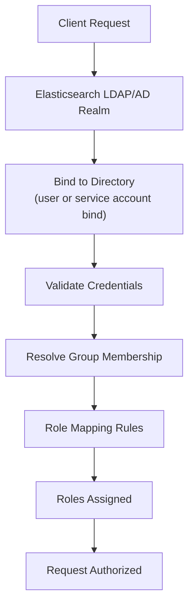

## LDAP and Active Directory Integration

### Overview

LDAP (Lightweight Directory Access Protocol) and Active Directory (AD, Microsoft's LDAP-based directory service) realms allow Elasticsearch to authenticate users directly against an existing enterprise directory, rather than a federated browser-redirect flow like SAML/OIDC. These realms are commonly used for API clients, backend services, and non-browser authentication contexts, as well as for organizations that prefer direct-bind authentication over SSO federation.

### Concept

Elasticsearch supports two related but distinct realm types: `ldap` and `active_directory`. Both authenticate a user by validating credentials against the directory server and then resolving group membership, which is subsequently used in role mapping rules — the same role mapping mechanism used by native, SAML, and OIDC realms. The `active_directory` realm type exists as a distinct, more opinionated realm because AD has specific conventions (e.g., `userPrincipalName`, `sAMAccountName`, nested group structures) that a generic LDAP realm handles less conveniently out of the box.



### LDAP Realm Configuration

```yaml
xpack.security.authc.realms.ldap.ldap1:
  order: 1
  url: "ldaps://ldap.example.com:636"
  bind_dn: "cn=elasticsearch,ou=service-accounts,dc=example,dc=com"
  user_search:
    base_dn: "ou=users,dc=example,dc=com"
    filter: "(uid={0})"
  group_search:
    base_dn: "ou=groups,dc=example,dc=com"
  unmapped_groups_as_roles: false
```

**Key Points**
- `url` should use `ldaps://` (LDAP over TLS) rather than plain `ldap://` in production, since credentials and directory data are otherwise transmitted unencrypted.
- `bind_dn` (paired with a bind password stored in the Elasticsearch keystore) is the service account Elasticsearch uses to search the directory before attempting to authenticate the end user — this is the "search and bind" mode, one of two supported LDAP authentication modes.
- `user_search.filter` uses `{0}` as a placeholder substituted with the submitted username at authentication time.
- `group_search.base_dn` scopes where Elasticsearch looks for group entries when resolving the authenticated user's group memberships.
- `unmapped_groups_as_roles`, when `true`, would directly use LDAP group names as Elasticsearch role names without requiring explicit role mapping rules; this is generally discouraged in favor of explicit role mapping for clarity and control. [Inference] This recommendation follows the general least-privilege principle that implicit, naming-convention-based privilege assignment is more error-prone and harder to audit than explicit mapping rules, applied here to this specific setting.

### Alternative LDAP Mode: User DN Template

For directories with a predictable DN structure, a simpler "user DN template" mode avoids the search-and-bind round trip.

```yaml
xpack.security.authc.realms.ldap.ldap2:
  order: 1
  url: "ldaps://ldap.example.com:636"
  user_dn_templates:
    - "cn={0},ou=users,dc=example,dc=com"
  group_search:
    base_dn: "ou=groups,dc=example,dc=com"
```

**Key Points**
- This mode directly constructs the bind DN from the username using the template, binding as the end user immediately rather than first searching with a service account.
- It requires a predictable, uniform DN pattern across all users; directories with inconsistent OU structures are generally better served by search-and-bind mode. [Inference] This follows directly from how the template substitution works — a single fixed template cannot account for users distributed across multiple differently structured OUs.

### Active Directory Realm Configuration

```yaml
xpack.security.authc.realms.active_directory.ad1:
  order: 1
  domain_name: "example.com"
  url: "ldaps://ad.example.com:636"
  user_search:
    base_dn: "ou=users,dc=example,dc=com"
  group_search:
    base_dn: "ou=groups,dc=example,dc=com"
  unmapped_groups_as_roles: false
```

**Key Points**
- `domain_name` allows Elasticsearch to construct `userPrincipalName`-style logins (`user@example.com`) automatically and, in many configurations, to resolve domain controllers via DNS SRV records rather than requiring a hardcoded `url`. [Unverified] Whether DNS SRV-based domain controller discovery is enabled by default or requires explicit configuration depends on the Elasticsearch version.
- AD's nested group structure (groups containing other groups) is generally resolved automatically by the `active_directory` realm's group search, unlike a plain `ldap` realm, which may require additional configuration to traverse nested memberships depending on the directory's schema. [Inference] This distinction follows from the `active_directory` realm being purpose-built around AD's specific `memberOf`/nested-group conventions, whereas the generic `ldap` realm treats group resolution more generically; exact nested-group traversal behavior should be verified in the target version's documentation.

### Role Mapping for LDAP/AD

Identical in mechanism to SAML/OIDC role mapping — LDAP and AD realms only authenticate; role mapping rules determine authorization.

```json
POST /_security/role_mapping/ldap_engineers
{
  "roles": ["engineering_role"],
  "rules": {
    "field": {
      "groups": "cn=engineering,ou=groups,dc=example,dc=com"
    }
  },
  "enabled": true
}
```

```json
POST /_security/role_mapping/ad_admins
{
  "roles": ["superuser"],
  "rules": {
    "all": [
      { "field": { "realm.name": "ad1" } },
      { "field": { "groups": "CN=Domain Admins,CN=Users,DC=example,DC=com" } }
    ]
  },
  "enabled": true
}
```

**Key Points**
- The `groups` field in role mapping rules for LDAP/AD is typically matched against the full distinguished name (DN) of the group, not just its common name (CN) — a frequent source of rule-matching mistakes when the DN is copied incorrectly.
- Rules support the same `all`/`any`/`except` boolean composition as SAML/OIDC role mapping, allowing conditions combining realm name, username, DN, and group DN.

### LDAP vs. Active Directory: When to Use Which

| Aspect | `ldap` realm | `active_directory` realm |
|---|---|---|
| Target directory | Generic LDAP-compliant directories (OpenLDAP, 389 DS, etc.) | Microsoft Active Directory specifically |
| Nested group resolution | May require more explicit configuration | Generally handled natively |
| Login format | Typically `uid` or `cn`-based | Often `userPrincipalName` (`user@domain`) or `sAMAccountName` |
| Domain controller discovery | Not applicable | Can leverage DNS SRV records via `domain_name` |

**Key Points**
- [Inference] Using the `active_directory` realm type against an actual AD deployment is generally preferable to the generic `ldap` realm even though AD is LDAP-compliant, because the AD-specific realm handles AD's particular conventions with less manual configuration; this is a practical recommendation rather than an absolute technical requirement, since a generic `ldap` realm can often be made to work against AD with additional explicit configuration.

### Multiple Realms and Realm Chaining

Elasticsearch supports configuring multiple realms simultaneously (native, LDAP, AD, SAML, OIDC, etc.), each with an `order` value that determines the sequence in which Elasticsearch attempts authentication.

```yaml
xpack.security.authc.realms:
  native.native1:
    order: 0
  active_directory.ad1:
    order: 1
  ldap.ldap1:
    order: 2
```

**Key Points**
- Lower `order` values are attempted first; Elasticsearch tries each realm in sequence until one successfully authenticates the credentials or all realms are exhausted.
- This chaining allows a fallback pattern — for instance, built-in native realm accounts for break-glass administrative access, with AD as the primary realm for regular users.
- A username that fails authentication in one realm does not automatically fail overall — Elasticsearch continues to the next realm in `order`, unless a realm is configured to be authoritative for that user in a way that halts the chain. [Unverified] Precise behavior around realm chaining short-circuiting (e.g., whether a realm that recognizes but rejects a user halts the chain versus falling through) can vary by version and realm type, so this should be validated against the deployed version if fallback behavior is security-relevant.

### TLS and Certificate Configuration

```yaml
xpack.security.authc.realms.ldap.ldap1:
  ssl.certificate_authorities: ["certs/ldap-ca.pem"]
  ssl.verification_mode: full
```

**Key Points**
- `ssl.verification_mode: full` validates both the certificate chain and hostname match; weaker modes (e.g., `certificate` only) exist but reduce protection against man-in-the-middle scenarios and are generally not recommended for production.
- Certificate authority configuration is required whenever the directory server's TLS certificate is not issued by a CA already trusted by the JVM's default trust store, which is common for internal enterprise directory servers using internal CAs.

### Testing and Debugging

- The `_security/_authenticate` API, called by a user after login, returns the resolved username, roles, and realm — useful for confirming that group resolution and role mapping produced the expected result.
- Enabling `trace`-level logging on the specific realm during initial setup surfaces bind failures, search filter mismatches, and group resolution issues, which are the most common sources of "authentication succeeds but user has no roles" problems.
- [Inference] "Authentication succeeds but no roles assigned" is typically a role-mapping configuration issue rather than a realm/directory connectivity issue, since successful authentication confirms the bind and credential validation already worked; this follows from the two steps (authentication vs. authorization/role mapping) being architecturally separate in Elasticsearch's security model.

### Illustration: Realm Chain Resolution

<svg xmlns="http://www.w3.org/2000/svg" viewBox="0 0 800 340">
  <text x="400" y="30" text-anchor="middle" font-size="18" font-weight="bold" fill="#1a1a1a">Realm Chain Resolution Order (svg_diagram)</text>

  <rect x="40" y="70" width="180" height="60" rx="8" fill="#e3f2fd" stroke="#1565c0" stroke-width="2" />
  <text x="130" y="95" text-anchor="middle" font-size="13" fill="#0d47a1">native1 (order: 0)</text>
  <text x="130" y="113" text-anchor="middle" font-size="11" fill="#0d47a1">Tried first</text>

  <rect x="310" y="70" width="180" height="60" rx="8" fill="#fff3e0" stroke="#ef6c00" stroke-width="2" />
  <text x="400" y="95" text-anchor="middle" font-size="13" fill="#e65100">ad1 (order: 1)</text>
  <text x="400" y="113" text-anchor="middle" font-size="11" fill="#e65100">Tried second</text>

  <rect x="580" y="70" width="180" height="60" rx="8" fill="#e8f5e9" stroke="#2e7d32" stroke-width="2" />
  <text x="670" y="95" text-anchor="middle" font-size="13" fill="#1b5e20">ldap1 (order: 2)</text>
  <text x="670" y="113" text-anchor="middle" font-size="11" fill="#1b5e20">Tried last</text>

  <line x1="220" y1="100" x2="310" y2="100" stroke="#555" stroke-width="2" marker-end="url(#arrow5)" />
  <line x1="490" y1="100" x2="580" y2="100" stroke="#555" stroke-width="2" marker-end="url(#arrow5)" />

  <rect x="200" y="200" width="400" height="90" rx="8" fill="#f3e5f5" stroke="#6a1b9a" stroke-width="2" />
  <text x="400" y="230" text-anchor="middle" font-size="13" fill="#4a148c">First realm to successfully</text>
  <text x="400" y="250" text-anchor="middle" font-size="13" fill="#4a148c">authenticate the credentials wins;</text>
  <text x="400" y="270" text-anchor="middle" font-size="13" fill="#4a148c">its resolved groups feed role mapping</text>

  <line x1="130" y1="130" x2="300" y2="200" stroke="#999" stroke-width="1.5" stroke-dasharray="4,3" marker-end="url(#arrow5)" />
  <line x1="400" y1="130" x2="400" y2="200" stroke="#999" stroke-width="1.5" stroke-dasharray="4,3" marker-end="url(#arrow5)" />
  <line x1="670" y1="130" x2="500" y2="200" stroke="#999" stroke-width="1.5" stroke-dasharray="4,3" marker-end="url(#arrow5)" />

  </svg>

### Common Pitfalls

- Using plain `ldap://` instead of `ldaps://` (or StartTLS) in production, transmitting bind credentials and directory data unencrypted.
- Matching role mapping rules against a group's CN instead of its full DN, causing rules to silently never match.
- Assuming a generic `ldap` realm against Active Directory will transparently resolve nested group membership the same way the dedicated `active_directory` realm does, without verifying this against the actual directory schema in use.
- Misordering realms such that a slower or less critical realm is attempted before a primary one, adding unnecessary latency or unexpected fallback behavior to every login attempt.
- Forgetting that `bind_dn` service account credentials themselves require periodic rotation and monitoring, since a locked-out or expired bind account causes a full authentication outage for that realm.
- Not setting `ssl.verification_mode: full`, weakening protection against man-in-the-middle interception of directory traffic.

### Related Topics

- Role Mappings and Role Templates in Depth
- SAML and OIDC Integration
- Kerberos Realm Authentication
- Audit Logging for Authentication Events
- Service Account Tokens for Elastic Stack Components
- Anonymous Access Configuration