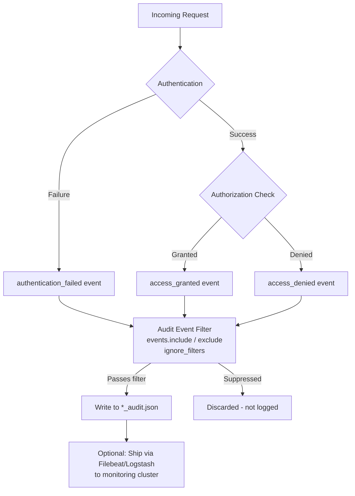

## Audit Logging

### Overview

Elasticsearch audit logging records security-relevant events occurring on a cluster — authentication attempts, authorization decisions, connection events, and data access patterns. It is distinct from standard application logging: audit logs exist specifically to answer "who did what, when, and was it allowed" for compliance, forensic investigation, and intrusion detection purposes.

Audit logging is a feature gated behind a paid subscription tier (Gold/Platinum/Enterprise, depending on version naming). It is disabled by default and must be explicitly enabled on every node where audit events should be captured.

### Enabling Audit Logging

Audit logging is controlled via `elasticsearch.yml` and requires a node restart to take effect:

```yaml
xpack.security.audit.enabled: true
```

This setting alone activates logging with default event types and default output. Additional settings refine what gets logged and how.

**Key Points**

- Must be set per-node; there is no cluster-wide dynamic toggle for enabling/disabling audit logging itself
- Requires a restart — it is not a dynamically updatable setting
- Once enabled, audit events are written continuously; disk usage and I/O should be capacity-planned for, especially on busy clusters

### Audit Event Types

Elasticsearch categorizes audit events into distinct types, each representing a different class of security occurrence:

| Event Type | Description |
| --- | --- |
| `anonymous_access_denied` | A request was made without credentials and anonymous access is not permitted for that action |
| `authentication_failed` | Credentials were supplied but authentication failed |
| `authentication_success` | Credentials were supplied and authentication succeeded |
| `access_denied` | An authenticated user attempted an action they are not authorized for |
| `access_granted` | An authenticated user's action was authorized and permitted |
| `connection_denied` | A connection was rejected, typically due to IP filtering |
| `connection_granted` | A connection was accepted |
| `tampered_request` | A request appeared to have been modified in transit (integrity check failure) |
| `run_as_denied` | A "run as" impersonation attempt was denied |
| `run_as_granted` | A "run as" impersonation attempt succeeded |
| `security_config_change` | A change was made to security configuration (roles, users, role mappings, API keys, etc.) |

By default, only a subset of these are logged (typically the access/authentication denial and grant events, along with `security_config_change` in newer versions). The full set can be configured explicitly.

### Configuring Which Events Are Logged

The `xpack.security.audit.logfile.events.include` and `.exclude` settings control the event type filter:

```yaml
xpack.security.audit.logfile.events.include: >
  access_denied, access_granted, anonymous_access_denied,
  authentication_failed, authentication_success,
  connection_denied, connection_granted, tampered_request,
  run_as_denied, run_as_granted, security_config_change
xpack.security.audit.logfile.events.exclude: []
```

**Example**

To capture only authentication-related failures and configuration changes, minimizing log volume:

```yaml
xpack.security.audit.logfile.events.include: >
  authentication_failed, anonymous_access_denied,
  security_config_change
```

`exclude` is applied after `include`, so it can be used to carve out specific noisy subtypes from a broader inclusion pattern.

### Output Format and Location

Audit events are written to a dedicated log file, separate from the standard Elasticsearch application log, typically named `<clustername>_audit.json` inside the node's log directory. Each event is a single JSON object per line (newline-delimited JSON), which makes the output directly ingestible by another Elasticsearch cluster, Logstash, or Filebeat for centralized analysis.

A representative `access_granted` event looks like:

```json
{
  "type": "audit",
  "timestamp": "2026-08-24T09:14:22,101+0800",
  "event.type": "access_granted",
  "event.action": "indices:data/read/search",
  "user.name": "app_service_account",
  "user.realm": "native",
  "origin.type": "rest",
  "origin.address": "10.0.1.15",
  "request.id": "WzL8fk2QSia9F0d1x0N2Vw",
  "action": "indices:data/read/search",
  "indices": ["orders-2026"],
  "request.name": "SearchRequest"
}
```

**Key Points**

- `event.action` / `action` identifies the specific internal API action invoked (e.g., `indices:data/read/search`, `cluster:admin/xpack/security/user/put`)
- `origin.address` captures the source IP, essential for forensic tracing
- `request.id` allows correlating multiple audit log lines belonging to the same originating request (useful since a single REST call can trigger several internal actions, each producing its own event)
- `user.realm` shows which authentication realm validated the user, useful when multiple realms (native, LDAP, SAML, etc.) are chained

### Filtering by User, Realm, Role, and Index

Beyond event type, audit logging supports fine-grained filters to exclude specific principals or resources from being logged — useful for suppressing noise from known high-volume service accounts:

```yaml
xpack.security.audit.logfile.events.ignore_filters:
  ignore_superusers:
    users: [ "kibana_system", "logstash_system" ]
  ignore_realms:
    realms: [ "reserved" ]
  ignore_index_actions:
    indices: [ ".monitoring-*", ".kibana*" ]
  ignore_roles:
    roles: [ "superuser" ]
```

Each named filter under `ignore_filters` can combine `users`, `realms`, `roles`, `actions`, and `indices` criteria; an event matching **all** specified criteria within a single filter block is suppressed. Multiple filter blocks are evaluated independently (an event matching any one block is excluded).

[Inference] Overuse of ignore filters — particularly filtering out `access_denied` or `authentication_failed` events for broad user/role patterns — can undermine the forensic value of the audit trail, since attackers often specifically target or impersonate high-privilege or service accounts.

### Including Request Bodies

By default, the audit log does not include the full request body of search or index operations, only metadata. This can be enabled for deeper forensic detail:

```yaml
xpack.security.audit.logfile.events.emit_request_body: true
```

**Key Points**

- This setting significantly increases log volume and can capture sensitive data (query contents, potentially PII embedded in search terms) directly into the audit log
- It applies to all logged events with a request body, not a filtered subset — there is no per-index or per-user toggle for this specific setting
- Should be paired with appropriate access controls and retention policies on the audit log output itself, since the audit log becomes a potential data exposure surface

### Node Info in Audit Events

Audit log entries can optionally include the local node's name and address, useful in multi-node clusters when correlating which node handled a given request:

```yaml
xpack.security.audit.logfile.emit_node_name: true
xpack.security.audit.logfile.emit_node_host_address: true
xpack.security.audit.logfile.emit_node_host_name: true
xpack.security.audit.logfile.emit_node_id: true
```

### Audit Log Flow



### Shipping Audit Logs to a Monitoring Cluster

Because audit logs are newline-delimited JSON files on disk, the standard pattern is to ship them off-node using Filebeat, pointed at the audit log file path, into a separate monitoring or SIEM cluster — never the same cluster being audited, since a compromised cluster's own audit trail is not trustworthy evidence of activity against itself.

**Example** Filebeat input configuration for audit log shipping:

```yaml
filebeat.inputs:
  - type: log
    paths:
      - /var/log/elasticsearch/*_audit.json
    json.keys_under_root: true
    json.add_error_key: true

output.elasticsearch:
  hosts: ["https://siem-cluster:9200"]
  index: "audit-logs-%{+yyyy.MM.dd}"
```

[Inference] Retention and rotation of the raw audit log files on the source node should still be configured independently (e.g., via `log4j2.properties` rolling file appender settings) so that local disk usage doesn't grow unbounded even after events are shipped elsewhere.

### Log Rotation Configuration

Audit logging uses the same Log4j2-based rolling file appender mechanism as the rest of Elasticsearch's logging, configured in `log4j2.properties`:

```properties
appender.audit_rolling.type = RollingFile
appender.audit_rolling.name = audit_rolling
appender.audit_rolling.fileName = ${sys:es.logs.base_path}/${sys:es.logs.cluster_name}_audit.json
appender.audit_rolling.filePattern = ${sys:es.logs.base_path}/${sys:es.logs.cluster_name}_audit-%d{yyyy-MM-dd}.json.gz
appender.audit_rolling.policies.type = Policies
appender.audit_rolling.policies.time.type = TimeBasedTriggeringPolicy
appender.audit_rolling.policies.time.interval = 1
appender.audit_rolling.strategy.type = DefaultRolloverStrategy
appender.audit_rolling.strategy.max = 30
```

**Key Points**

- `strategy.max` controls how many rotated files are retained before deletion — this is the primary local retention control
- Rotated files are gzip-compressed (`.gz` suffix in the pattern), reducing long-term local disk footprint
- Compliance requirements (e.g., retention periods mandated by regulation) typically demand shipping to durable, longer-retention storage rather than relying solely on local rotation limits

### Common Use Cases

- **Compliance evidence**: Demonstrating access controls are enforced, for frameworks requiring documented access trails (e.g., financial or healthcare data regulations)
- **Intrusion detection**: Repeated `authentication_failed` events from a single `origin.address` can indicate a brute-force attempt; correlating with SIEM alerting rules
- **Privilege escalation detection**: Monitoring `security_config_change` events for unexpected role or user modifications
- **Data exfiltration investigation**: Using `emit_request_body` combined with `origin.address` and `user.name` to reconstruct what data a specific account queried and when

### Performance Considerations

[Inference] Enabling audit logging, particularly with `emit_request_body: true` and a broad `events.include` list, adds I/O overhead proportional to cluster request volume, since every matching event is serialized to JSON and written to disk synchronously with request processing in most configurations. On high-throughput clusters, this can be a meaningful contributor to node I/O load and should be benchmarked in a staging environment before enabling broadly in production, particularly before enabling request body capture.

Mitigations include:

- Restricting `events.include` to only the event types actually needed
- Using `ignore_filters` to suppress high-volume, low-value service account traffic
- Writing audit logs to a separate physical disk/volume from data paths, to avoid contending with indexing/search I/O
- Avoiding `emit_request_body` unless specifically required for a compliance or investigative need

### Related Topics

- Security — Role-Based Access Control (RBAC) fundamentals
- Security — API key authentication and management
- Security — Realm chains (native, LDAP, SAML, OIDC, Kerberos)
- Security — Field- and document-level security
- Security — TLS/SSL configuration for transport and HTTP layers
- Security — IP filtering and connection-level access control
- Monitoring — Shipping cluster logs with Filebeat
- Stack — Integrating with SIEM tooling (Elastic Security app)