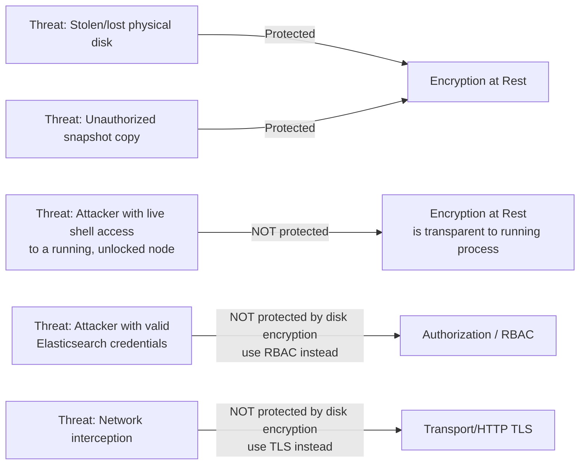

## Encryption at Rest

### Overview

Encryption at rest protects data stored on disk from unauthorized access if the physical storage medium, disk image, or backup file is obtained outside the running cluster process — for example, a stolen hard drive, an improperly decommissioned volume, or an unauthorized snapshot copy. This is distinct from TLS/transport encryption, which protects data in motion between nodes or between clients and the cluster.

**Key Points**

- Elasticsearch itself does not provide native, built-in encryption of index data on disk as a core feature
- Encryption at rest is typically achieved at the infrastructure layer — filesystem, disk, or cloud provider level — rather than through an Elasticsearch-specific setting
- This differs from Elasticsearch's transport/HTTP TLS encryption, which is a native, directly configurable Elasticsearch feature

### Why Elasticsearch Delegates This to Infrastructure

Elasticsearch's data files (Lucene segments, translog, cluster state) are written and read directly by the JVM process using standard filesystem I/O. Implementing encryption inside Elasticsearch itself would require intercepting and encrypting/decrypting every read and write at the storage layer, adding CPU overhead and architectural complexity to every I/O path.

[Inference] The design choice to rely on OS- or infrastructure-level encryption instead allows Elasticsearch to remain agnostic to the underlying storage mechanism while still achieving the security objective, since disk encryption operates transparently below the application layer and does not require Elasticsearch-side logic changes.

### Common Approaches

#### Full-Disk Encryption (FDE)

Operating-system-level encryption of the entire disk or volume, transparent to any application running on top of it.

- **Linux**: LUKS (Linux Unified Key Setup) via `dm-crypt`
- **Windows**: BitLocker
- Data is decrypted transparently by the OS when read by any process, including Elasticsearch, and re-encrypted on write

**Example** Setting up a LUKS-encrypted volume for an Elasticsearch data path on Linux:

```bash
# Create an encrypted volume
cryptsetup luksFormat /dev/sdb1

# Open it, mapping to a device name
cryptsetup luksOpen /dev/sdb1 es_data

# Create a filesystem and mount it
mkfs.ext4 /dev/mapper/es_data
mount /dev/mapper/es_data /var/lib/elasticsearch
```

The `path.data` setting in `elasticsearch.yml` would then point to a directory under this mounted, encrypted volume.

#### Cloud Provider-Managed Encryption

Major cloud providers offer volume-level encryption for block storage that backs Elasticsearch nodes, typically enabled at volume provisioning time:

| Provider | Mechanism |
| --- | --- |
| AWS | EBS encryption (AES-256, via AWS KMS-managed or customer-managed keys) |
| Google Cloud | Persistent Disk encryption (enabled by default; supports customer-managed encryption keys, CMEK) |
| Azure | Azure Disk Encryption (BitLocker for Windows VMs, DM-Crypt for Linux VMs) |

**Key Points**

- These are typically enabled with no application-level changes required — the disk is encrypted before Elasticsearch ever writes to it
- Key management (rotation, access policy) is handled through the cloud provider's KMS, separate from Elasticsearch configuration
- [Inference] Performance overhead from cloud-managed disk encryption is generally minimal in practice because encryption/decryption is often offloaded to dedicated hardware, though this depends on the specific provider and instance/volume type

#### Elastic Cloud

On Elastic's own managed service (Elastic Cloud), encryption at rest is provided automatically as part of the underlying cloud infrastructure (AWS, GCP, or Azure, depending on the chosen region/provider), without requiring separate configuration by the user.

### What Encryption at Rest Does and Does Not Protect Against



**Key Points**

- Encryption at rest protects against threats involving the physical or logical extraction of storage media outside the running, authenticated process
- It does **not** protect against an attacker who gains shell access to a running node — at that point, the OS has already decrypted the volume for legitimate processes, and the attacker inherits that access
- It does **not** substitute for RBAC/authentication (protecting against misuse by valid or compromised credentials) or TLS (protecting data in transit)
- A comprehensive security posture layers encryption at rest alongside transport encryption, strong authentication, RBAC, and audit logging — none of these individually is sufficient

### Snapshots and Encryption at Rest

Snapshots stored in a repository (e.g., S3, GCS, Azure Blob Storage, or a shared filesystem) represent another data-at-rest surface that needs consideration separately from the live data nodes' disks.

- **S3 repository**: can leverage S3 server-side encryption (SSE-S3, SSE-KMS, or SSE-C), configured at the bucket or repository-settings level, independent of Elasticsearch's own configuration
- **Azure repository**: can use Azure Storage Service Encryption
- **GCS repository**: benefits from Google Cloud Storage's default encryption at rest
- **Shared filesystem repository**: relies entirely on the underlying filesystem/disk encryption of the host(s) exposing that shared path

**Example** Registering an S3 snapshot repository — the encryption itself is configured on the S3 bucket, not in this repository registration call:

```json
PUT _snapshot/encrypted_backup_repo
{
  "type": "s3",
  "settings": {
    "bucket": "es-snapshots-prod",
    "region": "ap-southeast-1",
    "server_side_encryption": true
  }
}
```

[Unverified] The exact parameter name and default behavior for server-side encryption on the S3 repository plugin can vary between Elasticsearch versions; the specific bucket-level KMS key policy should be confirmed against the version in use and current AWS documentation.

### Keystore for Sensitive Configuration Values

While not "encryption at rest" for index data itself, the Elasticsearch keystore (`elasticsearch-keystore`) is the mechanism for storing sensitive configuration values — such as S3 repository credentials, LDAP bind passwords, or SMTP credentials — in an obfuscated, access-controlled file rather than in plaintext `elasticsearch.yml`.

```bash
# Create a keystore for the node
bin/elasticsearch-keystore create

# Add a sensitive value
bin/elasticsearch-keystore add s3.client.default.access_key
```

**Key Points**

- The keystore file itself is protected by filesystem permissions, not full encryption by default in older versions; a keystore password can be added in newer versions for additional protection
- This is a complementary mechanism to disk/volume encryption — it protects specific secrets even if `elasticsearch.yml` is exposed, whereas disk encryption protects the entire data path

### Considerations for Regulated Environments

For environments under compliance mandates (HIPAA, PCI-DSS, GDPR data residency and protection clauses, etc.), encryption at rest is frequently a stated or implied requirement. Since Elasticsearch does not natively enforce this, compliance documentation for such deployments typically needs to reference the infrastructure-level control (e.g., "all EBS volumes backing the Elasticsearch cluster are encrypted using AWS KMS with customer-managed keys, rotated annually") rather than an Elasticsearch-internal setting.

[Inference] Auditors evaluating compliance are likely to ask specifically how data-at-rest encryption is implemented given that it is not visible as an Elasticsearch cluster setting, so documenting the infrastructure control explicitly (disk/volume encryption method, key management practice, key rotation policy) is typically necessary as part of an audit trail, separate from anything queryable via the Elasticsearch API itself.

### Related Topics

- Security — Audit logging
- Security — TLS/SSL configuration for transport and HTTP layers
- Security — Keystore and secure settings management
- Snapshot and Restore — Repository types and configuration
- Snapshot and Restore — Backup and disaster recovery strategy
- Security — Role-Based Access Control (RBAC) fundamentals
- Operations — Node hardening and OS-level security baselines