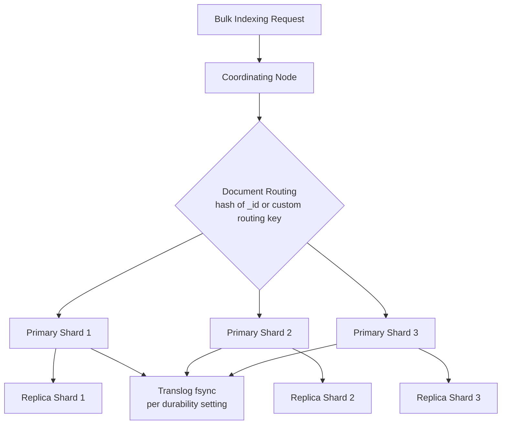

## Indexing Performance Optimization

### Overview

Indexing performance in Elasticsearch is governed by how efficiently documents move from a client request through parsing, analysis, Lucene segment creation, replication, and refresh/flush cycles. Optimization typically involves trade-offs against search latency, durability guarantees, and near-real-time visibility — improving indexing throughput usually means deliberately relaxing one or more of these.

### Bulk Indexing

Individual document indexing requests carry per-request overhead (network round-trip, parsing, coordination). The `_bulk` API batches many operations into a single request, amortizing this overhead across many documents.

```json
POST _bulk
{ "index": { "_index": "orders", "_id": "1" } }
{ "product": "widget", "qty": 4 }
{ "index": { "_index": "orders", "_id": "2" } }
{ "product": "gadget", "qty": 1 }
```

**Key Points**

- Bulk request bodies use newline-delimited JSON (NDJSON), alternating an action/metadata line with a source document line
- There is no universally correct bulk size; it depends on document size, cluster hardware, and network conditions
- [Inference] A commonly cited starting point is testing bulk sizes in the 5–15 MB range per request and adjusting based on observed throughput and node resource utilization, since optimal size varies by document structure and node specs
- Oversized bulk requests risk hitting `circuit_breaking_exception` (memory circuit breaker) or increasing GC pressure; undersized requests fail to amortize overhead effectively

**Example** A practical bulk-tuning loop: start with a batch size, measure indexing throughput (docs/sec) and node CPU/memory, then increase or decrease batch size incrementally while monitoring for rejected requests (`TOO_MANY_REQUESTS`, HTTP 429) from the bulk thread pool queue filling up.

### Refresh Interval

By default, Elasticsearch refreshes each shard every second, making newly indexed documents searchable. This refresh operation involves creating a new, small in-memory Lucene segment — a relatively expensive operation when done frequently under heavy indexing load.

```json
PUT my_index/_settings
{
  "index": {
    "refresh_interval": "30s"
  }
}
```

Setting `refresh_interval` to `-1` disables automatic refreshing entirely.

**Key Points**

- Increasing the refresh interval (or disabling it) during heavy bulk-loading operations — such as an initial data migration or reindex — reduces segment creation frequency, directly improving indexing throughput
- This trades off near-real-time search visibility: documents will not appear in search results until the next refresh occurs (manual `_refresh` call or the interval elapsing)
- A common pattern: set `refresh_interval: -1` before a large bulk load, then restore it to a normal value (e.g., `1s` or `30s`) once loading completes, followed by a manual `_refresh` if immediate visibility is needed

### Replica Count During Bulk Load

Each replica shard duplicates the indexing work of its primary — the same documents must be indexed again on every replica. Temporarily reducing replica count during a large initial load reduces this duplicated work.

```json
PUT my_index/_settings
{
  "index": {
    "number_of_replicas": 0
  }
}
```

After the bulk load completes, replicas are restored:

```json
PUT my_index/_settings
{
  "index": {
    "number_of_replicas": 1
  }
}
```

**Key Points**

- Restoring replicas after load triggers a peer recovery process, copying segment data to new replica shards — this itself is I/O and network intensive, so the trade-off should be considered for very large datasets
- Running with zero replicas during load means zero redundancy — a node failure during that window results in data loss for that shard, so this approach is typically reserved for scenarios where the source data can be safely re-indexed if something goes wrong (e.g., loading from a durable external source)

### Translog Durability Settings

The translog is Elasticsearch's write-ahead log, ensuring durability of operations between Lucene commits (flushes). By default, the translog is `fsync`'d and committed after every request, guaranteeing durability at the cost of I/O overhead.

```json
PUT my_index/_settings
{
  "index": {
    "translog.durability": "async",
    "translog.sync_interval": "30s"
  }
}
```

**Key Points**

- `translog.durability: request` (the default) fsyncs after every indexing, delete, update, or bulk request — safest, but higher I/O cost per request
- `translog.durability: async` fsyncs on the interval defined by `translog.sync_interval` instead of every request, significantly reducing I/O overhead during heavy indexing
- The trade-off: with `async` durability, up to `sync_interval` worth of acknowledged writes could be lost in the event of an unexpected node failure or power loss before the next fsync, since the operating system page cache holds unflushed writes during that window

### Segment Merge Throttling

Lucene periodically merges smaller segments into larger ones to maintain search efficiency. Merge operations compete with indexing for I/O and CPU resources.

```json
PUT _cluster/settings
{
  "transient": {
    "indices.store.throttle.max_bytes_per_sec": "200mb"
  }
}
```

[Inference] On nodes backed by SSDs rather than spinning disks, merge throttling is often less necessary or can be set to a higher threshold, since SSDs handle concurrent random I/O for merges and indexing substantially better than HDDs — but the correct value is workload- and hardware-specific and should be validated through monitoring rather than assumed.

The `index.merge.scheduler.max_thread_count` setting controls how many threads can perform merges concurrently:

```json
PUT my_index/_settings
{
  "index": {
    "merge.scheduler.max_thread_count": 1
  }
}
```

[Unverified] The optimal `max_thread_count` value is commonly tied to available CPU cores on the host and disk type in community guidance, but the specific formula or default calculation should be checked against current documentation for the Elasticsearch version in use, as internals here have changed across major versions.

### Mapping and Field Design

How fields are mapped directly affects indexing cost, since each field type invokes different analysis and indexing logic per document.

**Key Points**

- Disabling `_source` is possible but rarely recommended — it removes the ability to reindex, use update-by-query, or highlight, and the storage savings are usually not worth the loss of functionality
- Setting `index: false` on fields that are stored only for retrieval (not searched or aggregated on) skips the inverted index construction for those fields, reducing indexing work
- Avoiding dynamic mapping explosion — allowing unbounded dynamic field creation (e.g., from highly variable JSON keys) causes mapping bloat, which increases cluster state size and can degrade both indexing and cluster stability over time
- Disabling `norms` on fields where relevance scoring by length normalization is unnecessary (e.g., filter-only keyword fields) saves a small amount of per-field overhead
- Using `keyword` instead of `text` for fields that don't need full-text analysis avoids the tokenization/analysis pipeline entirely for those fields

**Example** A field mapped purely for filtering, with indexing overhead reduced:

```json
PUT my_index
{
  "mappings": {
    "properties": {
      "internal_notes": {
        "type": "text",
        "index": false
      },
      "status_code": {
        "type": "keyword",
        "doc_values": true,
        "norms": false
      }
    }
  }
}
```

### Indexing Buffer Size

The indexing buffer holds documents in memory before they're written as Lucene segments. This is a node-level (not index-level) setting.

```yaml
indices.memory.index_buffer_size: 20%
```

**Key Points**

- Default is 10% of JVM heap, shared across all shards on the node
- Increasing this allows more in-memory buffering before a segment must be flushed to disk, potentially reducing the frequency of small-segment writes during heavy concurrent indexing across many shards
- This is a static setting requiring a node restart to change

### Disabling Unneeded Replication During Peak Load vs. Document Routing

Ensuring documents are evenly distributed across primary shards avoids hot-spotting a single shard/node with disproportionate indexing load. Custom routing, if used, should be chosen carefully — routing many documents to the same shard for query-time colocation benefits can create indexing hot spots.



### Hardware and JVM Considerations

- **Heap sizing**: Following the standard guidance of allocating no more than ~50% of available RAM to JVM heap (leaving the remainder for the OS filesystem cache, which Lucene relies on heavily) remains relevant to indexing throughput, since insufficient off-heap memory for file system caching increases disk I/O during segment writes and merges
- **Disk type**: SSD-backed storage substantially outperforms spinning disks for indexing-heavy workloads due to better random I/O characteristics, which segment merging relies on heavily
- [Inference] Dedicated, unshared disks (as opposed to network-attached storage with variable/throttled IOPS) tend to produce more predictable indexing throughput, though cloud-provisioned IOPS (e.g., AWS io2, GCP SSD persistent disk with provisioned throughput) can approach dedicated-disk performance depending on the specific tier purchased

### Coordinating Node Considerations

In larger clusters with dedicated node roles, routing bulk indexing traffic through dedicated coordinating-only nodes (or directly to data nodes holding relevant primary shards, avoiding an extra network hop) can reduce coordination overhead, though this is typically only a meaningful optimization at larger scale (many nodes, high request volume) rather than smaller clusters.

### Monitoring Indexing Performance

Key metrics to observe while tuning:

| Metric | Source | Indicates |
| --- | --- | --- |
| Indexing rate (docs/sec) | `_stats` API, `indices.indexing` | Overall throughput |
| Bulk thread pool queue/rejections | `_cat/thread_pool?v` | Whether bulk requests are being throttled/rejected |
| Refresh time | `_stats` API, `indices.refresh` | Cost of refresh operations |
| Merge time and count | `_stats` API, `indices.merges` | Merge overhead competing with indexing |
| JVM GC frequency/duration | `_nodes/stats/jvm` | Memory pressure affecting throughput |

**Example** Checking indexing stats for a specific index:



```
GET my_index/_stats/indexing,merge,refresh
```

### A Typical Bulk-Load Optimization Sequence

1. Set `refresh_interval: -1` and `number_of_replicas: 0` on the target index
2. Set `translog.durability: async` if the source data can be safely re-ingested on failure
3. Perform bulk indexing with a tuned batch size, monitoring thread pool rejections
4. Once loading completes, restore `number_of_replicas` to the desired value and wait for recovery
5. Restore `refresh_interval` to its normal operational value
6. Optionally issue a manual `_forcemerge` to consolidate segments for subsequent search performance (noting this is a search-optimization step, and is I/O-intensive, best run during low-traffic windows)

[Inference] This sequence is a widely used pattern for large one-time loads (e.g., initial migrations or reindexing operations) rather than for continuously indexed, steady-state workloads, where more conservative, sustained settings are typically preferable to avoid extended windows of reduced durability or search visibility.

### Related Topics

- Indexing — Bulk API deep dive and error handling
- Indexing — Mapping design and dynamic mapping controls
- Search Performance — Force merge and segment optimization
- Cluster — Shard sizing and allocation strategy
- Cluster — Node roles (data, coordinating, master) in larger deployments
- Monitoring — Node stats and cluster health APIs
- Reindexing — Reindex API and zero-downtime reindexing patterns