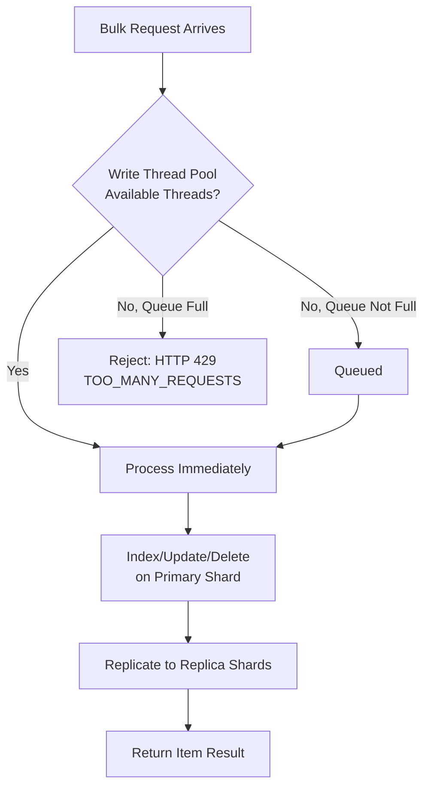

## Bulk Indexing Best Practices

### Overview

The `_bulk` API is the primary mechanism for high-throughput document ingestion in Elasticsearch, allowing multiple index, create, update, and delete operations to be submitted in a single HTTP request. This topic focuses specifically on the mechanics, request construction, error handling, and operational best practices around bulk indexing, building on the batching concepts introduced under indexing performance optimization.

### Request Format

The bulk API uses newline-delimited JSON (NDJSON), where each action is represented by a metadata line followed by an optional source line, and the entire payload must end with a trailing newline.

```json
POST _bulk
{ "index": { "_index": "products", "_id": "101" } }
{ "name": "Widget A", "price": 19.99 }
{ "update": { "_index": "products", "_id": "102" } }
{ "doc": { "price": 24.99 } }
{ "delete": { "_index": "products", "_id": "103" } }
{ "create": { "_index": "products", "_id": "104" } }
{ "name": "Widget D", "price": 9.99 }
```

**Key Points**

- `index`: indexes the document, overwriting if it already exists
- `create`: indexes the document only if it does not already exist; fails with a version conflict if the `_id` is already present
- `update`: performs a partial update using the provided `doc` (or a `script`)
- `delete`: removes the document; this action has no accompanying source line
- Each line must be valid, compact JSON — pretty-printed JSON with embedded newlines inside a single logical bulk line will break parsing
- The final line of the request body must be terminated with a newline character, or the last action may fail to parse correctly on some clients

### Response Structure and Per-Item Error Handling

A bulk response returns an `items` array with one entry per submitted action, each carrying its own status — a single bulk request can partially succeed, with some items failing while others succeed.

```json
{
  "took": 30,
  "errors": true,
  "items": [
    { "index": { "_id": "101", "status": 201, "result": "created" } },
    { "update": { "_id": "102", "status": 200, "result": "updated" } },
    { "delete": { "_id": "103", "status": 200, "result": "deleted" } },
    {
      "create": {
        "_id": "104",
        "status": 409,
        "error": {
          "type": "version_conflict_engine_exception",
          "reason": "[104]: version conflict, document already exists"
        }
      }
    }
  ]
}
```

**Key Points**

- The top-level `errors` boolean should always be checked first — a `200 OK` HTTP status on the overall bulk request does **not** mean every individual action succeeded
- Client code must iterate `items` and inspect each entry's `status`/`error` field to determine which specific documents failed and why
- Common per-item failures include `version_conflict_engine_exception` (optimistic concurrency or `create` on existing ID), `mapper_parsing_exception` (document doesn't match existing field type mappings), and `document_missing_exception` (update targeting a non-existent document without `doc_as_upsert`)

[Inference] A common integration bug is treating a bulk request as fully successful based solely on the HTTP status code, silently dropping documents that failed at the per-item level — this is a frequent source of "missing data" issues that are only caught much later during data reconciliation.

### Sizing Bulk Requests

There is no fixed universally correct bulk batch size; the right size depends on average document size, available node memory, and network characteristics between client and cluster.

**Key Points**

- [Inference] A commonly used starting heuristic is targeting request payloads in the 5–15 MB range, then adjusting up or down based on observed throughput, node CPU, and whether requests are being rejected — but this is a starting point for experimentation, not a fixed rule for all workloads
- Very large documents (e.g., large text blobs) may require a smaller document count per batch even to stay within a reasonable payload size, while workloads with many small documents can batch far more per request
- Extremely large bulk requests risk tripping the memory circuit breaker (`circuit_breaking_exception`) or causing latency spikes as the cluster processes one very large request rather than several smaller, pipelined ones

### Client-Side Bulk Helpers

Most official Elasticsearch clients provide a bulk helper abstraction that manages batching, retries, and backpressure automatically, rather than requiring manual NDJSON construction and batch-size bookkeeping.

**Example** Using the Python client's `helpers.bulk` (or `helpers.streaming_bulk`) function:

```python
from elasticsearch import Elasticsearch, helpers

es = Elasticsearch("https://localhost:9200")

def generate_actions():
    for doc in source_documents:
        yield {
            "_index": "products",
            "_id": doc["id"],
            "_source": doc
        }

success, errors = helpers.bulk(
    es,
    generate_actions(),
    chunk_size=2000,
    request_timeout=60
)
```

**Key Points**

- `helpers.bulk` collects the full result and raises on errors by default; `helpers.streaming_bulk` yields per-item results incrementally, useful for very large datasets where holding all results in memory is undesirable
- `chunk_size` controls document count per request, distinct from the `max_chunk_bytes` parameter that caps payload size — both should generally be tuned together
- Similar helper abstractions exist in the Java, Node.js (`@elastic/elasticsearch`'s `client.helpers.bulk`), and other official clients, each with client-specific parameter names for equivalent concepts

### Retrying Failed Items

Because bulk responses can contain partial failures, retry logic needs to operate at the per-item level, not the whole-request level — resubmitting an entire successful-except-one-item batch would create duplicate work or version conflicts for the already-succeeded items.

**Example** A basic retry pattern isolating only failed items:

```python
def bulk_with_retry(es, actions, max_retries=3):
    to_process = list(actions)
    for attempt in range(max_retries):
        success, errors = helpers.bulk(
            es, to_process, raise_on_error=False, stats_only=False
        )
        if not errors:
            return
        # Retain only items that failed for retry
        to_process = [
            e["index"]["data"] for e in errors
            if e.get("index", {}).get("status") == 429
        ]
        if not to_process:
            break
    if to_process:
        raise RuntimeError(f"{len(to_process)} documents failed after retries")
```

**Key Points**

- HTTP 429 (`TOO_MANY_REQUESTS`, from the bulk thread pool queue being full) is typically retryable with backoff, since it indicates transient capacity pressure rather than a data problem
- Errors like `mapper_parsing_exception` or `version_conflict_engine_exception` are generally not resolved by retrying the identical request unchanged — they require either fixing the document or reconsidering the operation logic (e.g., using `index` instead of `create`, or reconciling the conflicting version)
- Implementing exponential backoff between retries reduces the likelihood of compounding an already-saturated thread pool queue with immediate retries

### Bulk Thread Pool and Backpressure

Each node has a dedicated thread pool for handling bulk (write) operations, with a bounded queue. When the queue is full, additional bulk requests are rejected with HTTP 429 rather than queued indefinitely.



**Key Points**

- Checking `_cat/thread_pool/write?v&h=name,active,queue,rejected` (naming varies by version; older versions used a separate `bulk` pool name) surfaces whether rejections are occurring
- Sustained rejections indicate the cluster is receiving bulk requests faster than it can process them — the fix is typically reducing concurrent client-side bulk request parallelism, increasing batch size to reduce request count, or scaling the cluster, rather than increasing the queue size itself
- [Inference] Increasing the thread pool queue size is generally discouraged as a primary fix, since a larger queue mainly delays rejection rather than addressing the underlying throughput mismatch, and can increase memory pressure from queued pending requests

### Concurrent Bulk Requests

Throughput can often be improved by issuing multiple bulk requests concurrently (from multiple client threads/processes) rather than strictly serially, up to the point where the cluster's write thread pool becomes saturated.

**Key Points**

- The optimal level of concurrency is tied to the number of write threads available across the cluster's data nodes, which is itself typically tied to CPU core count
- [Inference] A reasonable empirical approach is to start with a small number of concurrent bulk streams (e.g., matching the number of data nodes, or a small multiple), then increase while monitoring the write thread pool's rejection rate — once rejections begin appearing consistently, concurrency has exceeded the cluster's absorption capacity
- Client-side connection pool size must be sufficient to support the desired concurrency; an undersized HTTP connection pool can bottleneck throughput independent of Elasticsearch's own capacity

### Document ID Strategy

Whether IDs are auto-generated or explicitly assigned affects both indexing performance and semantics.

| Approach | Behavior |
| --- | --- |
| Auto-generated ID (omit `_id`) | Elasticsearch generates a UUID-based ID; avoids version-conflict checks since IDs are guaranteed unique |
| Explicit ID, `index` action | Overwrites any existing document with that ID; requires an internal existence check |
| Explicit ID, `create` action | Fails if the ID already exists; also requires an existence check |

[Inference] Auto-generated IDs can offer a modest indexing performance advantage over explicitly assigned IDs in some scenarios, because Elasticsearch does not need to check whether a document with that ID already exists before indexing — though this is only relevant when idempotent upserts or update-by-natural-key semantics are not required by the use case, since most real-world scenarios do need deterministic IDs for correctness.

### Handling Mapping Errors at Scale

A single malformed document (e.g., a string value submitted for a field mapped as `date` or `long`) causes that specific bulk item to fail with `mapper_parsing_exception` without affecting other items in the same request, assuming the field is not using dynamic strict mapping that rejects the whole document differently.

**Key Points**

- Setting `"dynamic": "false"` or `"dynamic": "strict"` at the mapping level changes how unexpected fields are handled — `strict` causes a full rejection of documents with unmapped fields, rather than silently ignoring or dynamically creating them
- Pre-validating document shape client-side before submission (e.g., against a JSON schema matching the index mapping) can reduce the frequency of runtime mapping errors discovered only at bulk-response-parsing time
- Persistent, systematic mapping errors across many documents in a batch often indicate a source data quality issue or a mapping definition mismatch, and are usually better addressed by fixing the mapping or source pipeline rather than by retry logic

### Ingest Pipelines and Bulk Performance

If documents are processed through an ingest pipeline (e.g., using `pipeline` on the bulk index action, or an index-level default pipeline) before being indexed, this adds per-document processing overhead on the ingest node.

```json
POST _bulk
{ "index": { "_index": "logs", "pipeline": "log_enrichment" } }
{ "message": "raw log line", "@timestamp": "2026-08-24T01:00:00Z" }
```

[Inference] Complex ingest pipelines with many processors (especially `grok`, `script`, or `enrich` processors that perform lookups) can meaningfully reduce effective bulk indexing throughput compared to indexing without a pipeline, since each document must pass through the full processor chain before reaching the indexing stage — the magnitude of this impact depends heavily on which processors are used and should be measured directly rather than assumed.

### Summary Checklist

- Use the bulk API rather than individual index requests for any non-trivial document volume
- Always check the `errors` field and iterate `items` — do not rely on the overall HTTP status alone
- Tune batch size empirically (starting around 5–15 MB as a baseline) rather than using a fixed default
- Use client-provided bulk helpers where available rather than hand-constructing NDJSON and retry logic
- Retry only failed items, with backoff, distinguishing transient (429) from non-transient (mapping/version) errors
- Monitor the write thread pool for queue depth and rejections as the primary signal of saturation
- Tune concurrent bulk stream count empirically against thread pool rejection rate
- Consider `refresh_interval`, replica count, and translog durability adjustments (see Indexing Performance Optimization) in conjunction with bulk tuning for large one-time loads

### Related Topics

- Indexing — Performance optimization (refresh interval, replicas, translog durability)
- Indexing — Ingest pipelines and processor reference
- Indexing — Mapping design and dynamic mapping controls
- Client Libraries — Official client bulk helper APIs (Python, Java, Node.js)
- Cluster — Thread pool configuration and monitoring
- Reindexing — Reindex API as an alternative to client-driven bulk reindexing