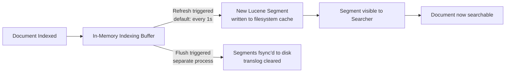
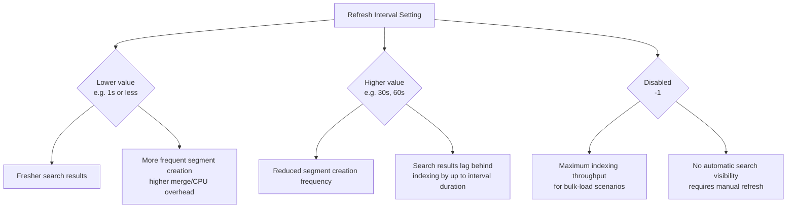

## Refresh Interval Tuning

### Overview

The refresh interval controls how frequently Elasticsearch makes newly indexed documents visible to search, by governing how often an in-memory Lucene segment is created from buffered documents. This setting sits at the center of the near-real-time (NRT) search trade-off: lower intervals mean fresher search results at the cost of indexing throughput and resource overhead; higher intervals favor throughput and efficiency at the cost of search latency for new data.

### What a Refresh Actually Does

A refresh does not write data durably to disk in the sense of an `fsync`'d commit — it creates a new, small Lucene segment from documents currently held in the in-memory indexing buffer, and makes that segment available to the shard's searcher.



**Key Points**

- Refresh ≠ flush: a flush is the separate, less frequent operation that fsyncs segments to durable disk storage and clears the translog — durability is governed by the translog and flush process, not by refresh
- A refresh operation, even though it doesn't guarantee disk durability, is still computationally non-trivial: it involves creating a new segment, opening new segment readers, and updating the shard's point-in-time view for search
- Every refresh, regardless of how few documents were buffered, creates at least one new small segment — frequent refreshing under sustained indexing load produces many small segments, increasing the burden on the background merge process

### Default Behavior

By default, `index.refresh_interval` is `1s`, meaning Elasticsearch automatically refreshes each shard roughly once per second if that shard has received indexing activity since its last refresh.

```json
GET my_index/_settings
```

```json
{
  "my_index": {
    "settings": {
      "index": {
        "refresh_interval": "1s"
      }
    }
  }
}
```

**Key Points**

- If a shard receives no writes, Elasticsearch does not perform unnecessary refreshes on it — the 1-second cadence applies to actively-written shards
- [Inference] This adaptive behavior means idle indices generally do not incur ongoing refresh overhead simply by existing, which is relevant when reasoning about total cluster refresh load across many indices with uneven write patterns

### Adjusting the Refresh Interval

```json
PUT my_index/_settings
{
  "index": {
    "refresh_interval": "30s"
  }
}
```

Disabling automatic refresh entirely:

```json
PUT my_index/_settings
{
  "index": {
    "refresh_interval": "-1"
  }
}
```

**Key Points**

- This is a dynamic setting — it can be changed at any time without a node restart or reindex
- Setting `-1` does not prevent refreshes entirely under all circumstances; a manual `_refresh` call still works, and certain internal operations (like a flush) can still make data visible
- Values are typically expressed with a time unit suffix (`s`, `m`, etc.); omitting a unit is generally rejected or interpreted per default time unit rules depending on version — using explicit units avoids ambiguity

### Manual Refresh

A refresh can be triggered explicitly, independent of the automatic interval:



```
POST my_index/_refresh
```

Or a refresh can be requested as part of a write operation itself:

```json
POST my_index/_doc?refresh=true
{
  "field": "value"
}
```

**Key Points**

- `refresh=true` on a write request forces an immediate refresh of the specific shard affected, making that document (and any others buffered on that shard) immediately searchable — but this defeats much of the batching efficiency benefit and is generally discouraged for high-volume writes
- `refresh=wait_for` blocks the request until the next scheduled refresh occurs (rather than forcing an immediate one), giving visibility guarantees without forcing an off-cycle refresh — this is a middle-ground option when a client needs to know a document is searchable before proceeding, without the overhead of `refresh=true` on every write
- Using `refresh=true` or `refresh=wait_for` on a per-request basis in a high-throughput loop is a common anti-pattern, since it effectively reintroduces near-synchronous refresh behavior per request, defeating the purpose of batching and interval-based refresh control

### Trade-off: Search Latency vs. Indexing Throughput



**Key Points**

- Applications requiring true near-real-time visibility (e.g., a live dashboard reflecting just-indexed events) generally need to keep the interval at or near the default
- Applications tolerant of eventual visibility — log ingestion pipelines, batch analytics, large one-time data loads — benefit from increasing or disabling the interval during heavy write phases
- The appropriate value is workload-specific; there is no single correct setting across all use cases, only a spectrum of trade-offs to select from based on actual freshness requirements

### Refresh Interval and Bulk Loading

As covered in indexing performance optimization, a standard practice for large one-time bulk loads (initial migrations, reindex operations) is to disable refresh entirely during the load and restore it afterward.

**Example** A typical sequence:

```json
PUT my_index/_settings
{ "index": { "refresh_interval": "-1" } }
```



```
# ... bulk indexing operations occur here ...
```

```json
PUT my_index/_settings
{ "index": { "refresh_interval": "1s" } }
```



```
POST my_index/_refresh
```

**Key Points**

- The final manual `_refresh` ensures all documents indexed during the disabled-refresh window become immediately searchable once the load completes, rather than waiting for the restored interval's next natural cycle
- [Inference] For very large bulk loads spanning many hours, some teams choose an intermediate approach — a longer interval like `30s` or `60s` rather than full disablement — to get partial visibility during the load without paying the full per-second refresh cost, though this is a judgment call based on how important interim visibility is for that specific workload

### Interaction with Force Merge

After a bulk load with refresh disabled, many small unmerged segments may accumulate depending on how the indexing buffer flushed internally. A `_forcemerge` is sometimes used afterward to consolidate segments for better subsequent search performance, though this is a distinct operation from refresh and carries its own significant I/O cost.



```
POST my_index/_forcemerge?max_num_segments=1
```

[Inference] Running `_forcemerge` immediately after a large bulk load is a common pattern specifically for indices that will become read-only or rarely-updated afterward (e.g., a completed time-based index in a logging use case), since force-merging a still-actively-written index is generally discouraged and can be counterproductive as new writes will simply create new unmerged segments again.

### Monitoring Refresh Behavior



```
GET my_index/_stats/refresh
```

```json
{
  "indices": {
    "my_index": {
      "primaries": {
        "refresh": {
          "total": 1523,
          "total_time_in_millis": 48210,
          "external_total": 1523,
          "external_total_time_in_millis": 48210,
          "listeners": 0
        }
      }
    }
  }
}
```

**Key Points**

- `total_time_in_millis` divided by `total` gives an approximate average refresh duration — a rising trend over time can indicate growing segment complexity or resource contention warranting investigation
- Elevated refresh counts relative to expected interval cadence (e.g., far more refreshes than the wall-clock time divided by the configured interval would suggest) may indicate `refresh=true` or `refresh=wait_for` being used unexpectedly frequently by client code

### Refresh Interval Across Multiple Indices (Time-Based Data)

For time-based indices (daily/weekly logs or metrics indices), it's common to apply different refresh strategies depending on an index's lifecycle stage — actively-written "hot" indices might use the default or a slightly relaxed interval, while older, no-longer-written indices gain nothing from any refresh interval setting at all since they receive no new writes.

**Key Points**

- Index Lifecycle Management (ILM) policies can be used to adjust settings like `refresh_interval` as an index transitions between hot, warm, and cold phases, though the refresh interval itself becomes largely irrelevant once an index stops receiving writes
- [Inference] For a hot-warm architecture, tuning refresh interval specifically matters most for the hot tier where active indexing occurs; applying custom refresh settings to warm/cold indices provides little to no benefit since those indices are not being actively refreshed against new data

### Common Pitfalls

- Assuming a lower refresh interval improves data durability — it does not; durability is a translog/flush concern, not a refresh concern
- Using `refresh=true` per-document in high-throughput ingestion code, unintentionally serializing what should be a batched, interval-driven process
- Forgetting to restore the refresh interval to its normal value after a bulk load, leaving an index without near-real-time visibility indefinitely
- Assuming a single "best" refresh interval value applies universally, rather than deriving it from the specific application's freshness requirements

### Related Topics

- Indexing — Performance optimization (bulk loading, replicas, translog durability)
- Indexing — Bulk API best practices
- Search — Near-real-time search concepts and consistency
- Index Lifecycle Management — Hot-warm-cold architecture and phase transitions
- Cluster — Force merge and segment management
- Monitoring — Index stats API reference