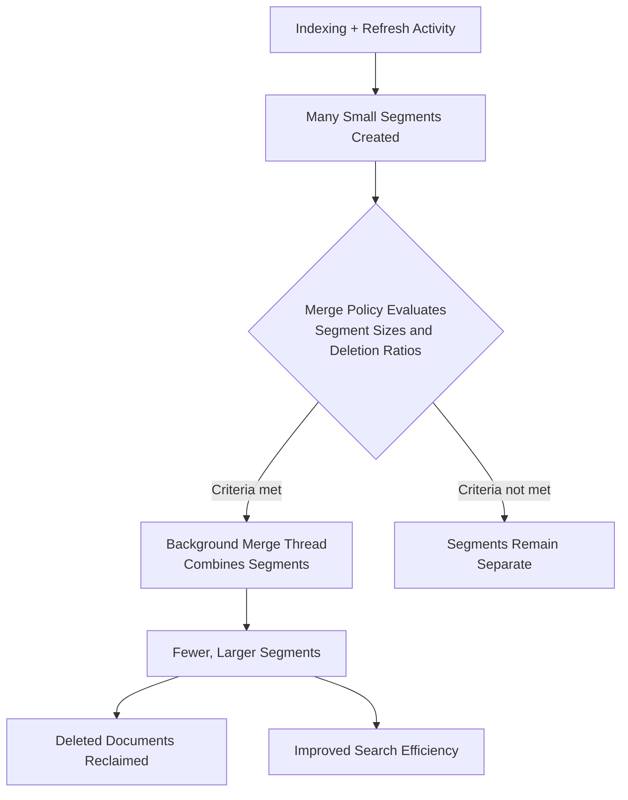

## Merge Policy Tuning

### Overview

Elasticsearch relies on Lucene's segment merging mechanism to consolidate the many small, immutable segments produced by ongoing indexing and refresh activity into fewer, larger segments. Merging is essential for maintaining search performance over time, since searching across fewer, larger segments is more efficient than searching across many small ones. Merge policy tuning governs when and how aggressively this consolidation happens, balancing background I/O/CPU cost against search efficiency and reclaimed disk space.

### Why Segments Accumulate

Every refresh operation creates a new, immutable Lucene segment. Documents are never updated or deleted in place within a segment — an update is internally a delete of the old document plus an index of a new one, and a delete simply marks a document as deleted within its segment without immediately reclaiming space.



**Key Points**

- Segments marked with deleted documents still consume disk space and are still scanned (with deletions filtered) during search, until they are merged away
- The merge process is what physically reclaims space from deleted/updated documents — without merging, disk usage would grow indefinitely relative to actual live document count
- Merging runs as a background process, competing with concurrent indexing and search for I/O, CPU, and (to a lesser extent) heap resources

### The Default Merge Policy: TieredMergePolicy

Elasticsearch uses Lucene's `TieredMergePolicy` by default, which selects merge candidates based on segment size tiers rather than strictly by segment age or a fixed segment count, aiming to keep segment sizes within a reasonably narrow band relative to each other.

**Key Points**

- The policy attempts to merge segments of similar size together, avoiding pathological cases like repeatedly merging a huge segment with tiny ones
- It considers both segment size and the proportion of deleted documents within a segment when selecting merge candidates — segments with a high deletion ratio are prioritized for merging even if not the smallest, since merging them reclaims the most space
- [Unverified] The precise internal scoring formula used by `TieredMergePolicy` to select merge candidates is Lucene-internal and has evolved across versions; the exact heuristic should be treated as an implementation detail rather than something to design application logic around

### Key Tunable Settings

```json
PUT my_index/_settings
{
  "index": {
    "merge.policy.max_merged_segment": "5gb",
    "merge.policy.segments_per_tier": 10,
    "merge.policy.floor_segment": "2mb",
    "merge.scheduler.max_thread_count": 2,
    "merge.scheduler.max_merge_count": 5
  }
}
```

| Setting | Purpose |
| --- | --- |
| `merge.policy.max_merged_segment` | Soft upper bound on the size of a single merged segment; segments approaching this size are excluded from further merge consideration |
| `merge.policy.segments_per_tier` | Target number of segments per tier; lower values push toward more aggressive merging (fewer total segments), higher values allow more segments to accumulate before merging |
| `merge.policy.floor_segment` | Segments smaller than this are treated as this size for merge-selection purposes, preventing excessive merging of very small segments |
| `merge.scheduler.max_thread_count` | Maximum number of threads that can perform merges concurrently on a node |
| `merge.scheduler.max_merge_count` | Maximum number of merges that can be queued/in-progress before indexing threads are throttled to let merging catch up |

**Key Points**

- `max_merged_segment` is a soft, not hard, limit — under certain conditions (e.g., a `_forcemerge` with an explicit `max_num_segments`), Lucene can produce segments larger than this value
- Lowering `segments_per_tier` increases merge frequency and I/O overhead during steady-state indexing, but keeps segment count lower and search performance more consistent
- `max_merge_count` acts as a backpressure valve: once the number of pending merges exceeds this threshold, Elasticsearch throttles incoming indexing operations on that shard to let merging catch up, preventing unbounded segment accumulation under sustained heavy write load

### Merge Scheduler Thread Count

```json
PUT my_index/_settings
{
  "index": {
    "merge.scheduler.max_thread_count": 1
  }
}
```

**Key Points**

- On spinning-disk (HDD) hardware, limiting concurrent merge threads (often to 1) is traditionally recommended, since concurrent random I/O for multiple simultaneous merges degrades poorly on HDDs compared to sequential I/O patterns
- [Inference] On SSD-backed nodes, a higher thread count is often reasonable given SSDs' substantially better handling of concurrent random I/O, though the specific optimal value depends on core count, SSD model, and concurrent indexing/search load, and should be validated through monitoring rather than assumed from hardware type alone
- The default calculation for `max_thread_count` is derived from available processor count in recent versions; [Unverified] the exact default formula should be checked against current documentation for the specific version in use, as this has been adjusted across releases

### Store-Level Merge Throttling

A cluster-wide (or node-level) setting can cap the aggregate I/O bandwidth consumed by merge operations across all shards on a node:

```json
PUT _cluster/settings
{
  "persistent": {
    "indices.store.throttle.max_bytes_per_sec": "100mb"
  }
}
```

**Key Points**

- [Inference] This setting is less commonly needed in modern Elasticsearch versions than in older ones, since newer default merge scheduling behavior already attempts to adaptively balance merge I/O against indexing throughput without requiring an explicit hard cap — but it remains available for environments where merge I/O contention is observed to be a persistent problem
- Setting this too low can cause merges to fall behind indexing rate, leading to segment count growth and the `max_merge_count` throttling mechanism kicking in to slow indexing instead — effectively moving the bottleneck rather than eliminating it

### Force Merge

`_forcemerge` triggers an explicit, immediate merge down to a specified number of segments, bypassing the normal tiered merge policy's gradual, background approach.



```
POST my_index/_forcemerge?max_num_segments=1
```

**Key Points**

- Force merging to a single segment is a common practice for indices that have become read-only or are no longer actively written to (e.g., a completed daily log index in a hot-warm-cold architecture), since a single, fully optimized segment offers the best search performance for that data
- Force merging an actively-written index is generally discouraged: new documents will immediately begin creating new small segments again, meaning the expensive force-merge work provides only a transient benefit while consuming significant I/O
- Force merge is one of the more I/O-intensive operations available; it should typically be scheduled during low-traffic windows, and `max_num_segments=1` in particular can take a substantial amount of time and disk I/O on large indices
- Force merge also reclaims space from deleted documents more aggressively than normal background merging, which is useful specifically after a large delete-by-query or update-heavy operation on an index that will not receive further heavy writes

**Example** A typical ILM-integrated pattern: an index rolls over from "hot" to "warm" phase once it reaches a size or age threshold, and the ILM policy automatically triggers a force merge as part of the warm-phase transition, since the index is expected to receive no further writes at that point.

### Merge and the `index.number_of_replicas` Relationship

Each replica shard independently manages and merges its own copy of the segments — replicas do not share merged segment output with their primary or with each other via merge operations; they perform their own indexing and merging of the same logical document set (or in some cluster configurations, receive segment copies via recovery rather than replaying every operation, depending on the replication mechanism in use).

[Unverified] Whether replica shards perform fully independent merge operations versus receiving merged segment files directly during certain replication paths depends on Elasticsearch's specific replication implementation details for the version in use; this nuance should be confirmed against current documentation rather than assumed, as it affects how much aggregate merge I/O a cluster with many replicas actually performs.

### Monitoring Merge Activity



```
GET my_index/_stats/merge
```

```json
{
  "indices": {
    "my_index": {
      "primaries": {
        "merges": {
          "current": 1,
          "current_docs": 45210,
          "current_size_in_bytes": 89400213,
          "total": 342,
          "total_time_in_millis": 1204500,
          "total_docs": 8213402,
          "total_size_in_bytes": 15234098213
        }
      }
    }
  }
}
```

**Key Points**

- `current` shows in-progress merges at the moment of the request; a persistently high value alongside indexing slowdown suggests merge activity may be a bottleneck
- `total_time_in_millis` accumulated over time, compared against indexing volume, gives a sense of how much aggregate time is being spent merging relative to actual document throughput
- The `_cat/segments?v` API provides a per-segment breakdown (size, document count, deleted document count) useful for diagnosing whether a specific shard has an unusually high segment count or deletion ratio warranting investigation

### Common Symptoms of Merge Policy Misconfiguration

| Symptom | Likely Cause |
| --- | --- |
| Indexing throughput degrades over time during sustained writes | Merge falling behind, triggering `max_merge_count` throttling |
| High segment count per shard (`_cat/segments`) | `segments_per_tier` too high, or merge threads insufficient for indexing rate |
| High disk usage relative to document count | High deletion ratio in unmerged segments, common after heavy update/delete workloads without subsequent merge |
| Search latency degrading over time on a growing index | Segment count growing faster than merges can consolidate |
| Node I/O saturation correlating with merge activity | Merge scheduler thread count too high for the underlying disk's concurrent I/O capability |

### Practical Tuning Approach

1. Establish a baseline using `_stats/merge` and `_cat/segments?v` during normal operation
2. If indexing throughput degrades under sustained load, check whether `max_merge_count` throttling is being triggered (visible via indexing rate drops correlating with merge queue depth) rather than assuming it's purely a hardware capacity issue
3. Adjust `merge.scheduler.max_thread_count` based on observed disk I/O headroom, particularly relevant when the underlying storage type is known (HDD vs. SSD vs. network-attached)
4. For indices with a defined "no longer written" lifecycle stage, use `_forcemerge` (ideally via ILM automation) rather than tuning the background policy to be more aggressive for that stage
5. Avoid tuning merge policy settings preemptively without observed symptoms — [Inference] default settings are generally well-suited to typical workloads, and most merge-related tuning is corrective (in response to an observed problem) rather than a standard step for every new index

### Related Topics

- Indexing — Performance optimization (refresh interval, replicas, translog durability)
- Indexing — Refresh interval tuning
- Index Lifecycle Management — Hot-warm-cold architecture and phase actions
- Cluster — Force merge scheduling and operational considerations
- Monitoring — Segment and merge stats APIs
- Cluster — Disk I/O and node hardware sizing considerations