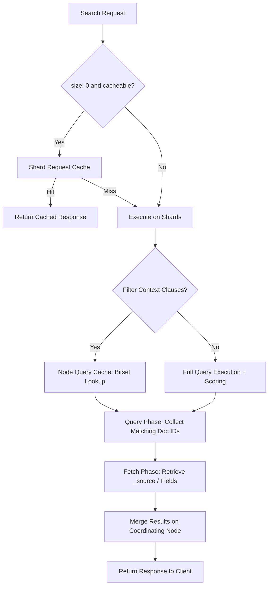

## Search Performance Optimization

### Overview

Search performance optimization in Elasticsearch focuses on reducing query latency and increasing throughput by controlling how much work a query forces the cluster to do — how many shards it touches, how much data it scans, how many fields it evaluates, and how much scoring computation it performs. The core principle is minimizing the search space and computational cost per query while maximizing the effectiveness of caching layers.

### Query Latency Fundamentals

#### Where Time Is Spent

A search request's latency is the sum of several phases:

- **Query phase**: each shard executes the query locally and returns matching document IDs and scores (or partial aggregation results).
- **Fetch phase**: the coordinating node requests the actual `_source` (or specific fields) for the top-N results from the relevant shards.
- **Network/coordination overhead**: scatter-gather across shards, plus result merging on the coordinating node.

Because query phase work happens on every shard involved in the search, the number of shards a query touches is often the single largest lever on latency.

#### Shard Count and Search Concurrency

Each shard is a full Lucene index and every shard queried costs CPU and I/O independently, even if it returns zero hits. Over-sharding — many small shards — multiplies per-shard overhead (query parsing, segment merging checks, result collection) without a proportional benefit. Under-sharding limits parallelism across nodes.

[Inference] A commonly cited target is keeping shard sizes in the tens-of-GB range (often 10–50GB depending on hardware and use case), though the ideal size depends heavily on document structure, query pattern, and hardware — this is not a fixed rule and requires benchmarking per deployment.

Use `_cat/shards` and `_cat/indices` to audit shard count and size distribution:



```
GET _cat/shards?v&h=index,shard,prirep,docs,store&s=store:desc
GET _cat/indices?v&h=index,pri,rep,docs.count,store.size
```

### Filter Context vs Query Context

Elasticsearch queries executed in **filter context** (e.g., inside a `bool` query's `filter` or `must_not` clauses) skip relevance scoring entirely and are cacheable. Queries in **query context** (`must`, `should` at the top level) compute a relevance score (`_score`) for every matching document, which is more expensive.

**Key Points**

- Move any yes/no condition (date ranges, term equality, status flags) into `filter` instead of `must`.
- Filter clauses benefit from the filter cache, which stores frequently-used filters as bitsets, so repeated identical filters become near-free on subsequent queries.
- Scoring should be reserved for clauses that genuinely affect relevance ranking.

**Example**

```json
GET /orders/_search
{
  "query": {
    "bool": {
      "must": [
        { "match": { "description": "wireless headphones" } }
      ],
      "filter": [
        { "term": { "status": "completed" } },
        { "range": { "order_date": { "gte": "2025-01-01" } } }
      ]
    }
  }
}
```

Here, `description` matching drives relevance scoring, while `status` and `order_date` are pure filters — cached and unscored.

### Caching Layers

#### Node Query Cache

Caches the results of filter-context queries (as bitsets) at the shard level. It only caches queries that are used frequently enough and only applies to segments with sufficiently large document counts, so it primarily benefits repeated filter usage across many searches.

#### Shard Request Cache

Caches the entire response of search requests where `size: 0` (typically aggregation-only requests) at the shard level, keyed by the request body. This is invalidated on any write to the shard's underlying data (specifically, on refresh if changes occurred).



```
GET /orders/_search?request_cache=true
{
  "size": 0,
  "aggs": {
    "orders_per_day": {
      "date_histogram": { "field": "order_date", "interval": "day" }
    }
  }
}
```

**Key Points**

- Most beneficial for dashboards or repeated analytical queries against relatively static or slow-changing indices.
- Less useful on indices with frequent writes, since cache entries are invalidated on refresh when the underlying data changed.

#### Field Data Cache

Used for operations requiring uninverted access to field values — sorting, aggregating, or scripting on analyzed text fields. [Inference] This cache can grow large and cause heap pressure, which is why `doc_values` (see below) is the default and preferred mechanism for most sortable/aggregatable field types rather than relying on field data.

### doc_values

For most field types (keyword, numeric, date, geo_point), Elasticsearch builds `doc_values` — an on-disk, column-oriented data structure — at index time. This is enabled by default for these types and is what powers efficient sorting, aggregations, and scripting without loading data into the JVM heap.

```json
PUT /products
{
  "mappings": {
    "properties": {
      "price": { "type": "double", "doc_values": true },
      "description": { "type": "text", "doc_values": false }
    }
  }
}
```

`text` fields do not support `doc_values` by default because they are analyzed (tokenized), which doesn't map cleanly to a per-document single value. Aggregating on text requires either a `keyword` sub-field (via multi-fields) or enabling `fielddata` (generally discouraged due to heap cost).

### Reducing the Search Space

#### Field Selection

Requesting only the fields actually needed avoids unnecessary fetch-phase overhead, especially for documents with large `_source` payloads.

```json
GET /products/_search
{
  "_source": ["name", "price"],
  "query": { "match": { "name": "laptop" } }
}
```

Alternatively, `stored_fields` or `docvalue_fields` can retrieve specific fields without loading the full `_source`.

#### Avoiding Deep Pagination

`from`/`size` pagination becomes increasingly expensive as `from` grows, because each shard must compute and sort `from + size` results before the coordinating node discards the skipped ones. Elasticsearch enforces a default `index.max_result_window` of 10,000 to guard against this.

**Next Steps** for deep pagination alternatives:

- `search_after`: stateless, cursor-based pagination using sort values from the previous page — efficient for sequential access (e.g., infinite scroll).
- Point in Time (PIT) combined with `search_after`: provides a consistent view across paginated requests even as the underlying index changes.
- `scroll`: intended for large, non-real-time exports rather than user-facing pagination; [Inference] it is generally discouraged for interactive use cases due to resource retention on the cluster while a scroll context is open.

```json
GET /products/_search
{
  "size": 20,
  "query": { "match_all": {} },
  "sort": [{ "_id": "asc" }],
  "search_after": ["product_998"]
}
```

#### Index Sorting

Setting `index.sort.field` at index creation time physically orders segments on disk by the specified field(s). Queries and aggregations that align with this sort order (e.g., a `sort` matching the index sort, or early termination scenarios) can skip scanning documents outside the required range.

```json
PUT /events
{
  "settings": {
    "index": {
      "sort.field": ["timestamp"],
      "sort.order": ["desc"]
    }
  },
  "mappings": {
    "properties": {
      "timestamp": { "type": "date" }
    }
  }
}
```

**Key Points**

- Index sorting trades slightly slower indexing throughput for faster sorted queries.
- Most effective for time-series-style data where queries commonly sort or filter by the same field the index is sorted on.

### Query Structure Optimization

#### Avoid Wildcard and Regex Queries on Large Fields

Leading-wildcard queries (`*term`) and broad regex patterns cannot use the term dictionary's prefix structure efficiently and often require scanning large portions of the inverted index.

**Next Steps** for alternatives:

- Use `keyword` fields with `ngram` or `edge_ngram` tokenizers at index time to support prefix/substring search patterns without runtime wildcard scans.
- Use the `wildcard` field type (purpose-built for wildcard/regex-heavy use cases) when substring search is a core requirement.

#### Constant Score for Non-Scored Queries

Wrapping a query in `constant_score` when relevance scoring is irrelevant avoids scoring computation entirely while still benefiting from filter caching.

```json
GET /products/_search
{
  "query": {
    "constant_score": {
      "filter": { "term": { "category": "electronics" } }
    }
  }
}
```

#### Limiting Aggregation Cardinality

High-cardinality aggregations (e.g., `terms` aggregation on a field with millions of unique values) are memory- and CPU-intensive because each shard must compute and return its own top-N buckets before the coordinating node merges them.

**Key Points**

- Set a reasonable `size` on `terms` aggregations rather than defaulting to very large values.
- Be aware that per-shard top-N merging can produce approximate counts (`doc_count_error_upper_bound`) when cardinality is high and data is unevenly distributed across shards — this is a known, documented tradeoff of distributed terms aggregation, not a bug.
- Consider `composite` aggregations for paginating over high-cardinality terms rather than requesting a huge `size`.

### Routing to Reduce Shard Fan-Out

Custom routing directs documents with a shared routing key to the same shard at index time, allowing searches that specify the same routing value to query only that shard instead of fanning out to all shards in the index.

```json
PUT /orders/_doc/1?routing=customer_123
{
  "customer_id": "customer_123",
  "amount": 250.00
}

GET /orders/_search?routing=customer_123
{
  "query": { "match_all": {} }
}
```

**Key Points**

- Most effective when queries are naturally scoped to a single tenant/customer/entity known at query time.
- Risk of shard imbalance ("hot spotting") if routing key cardinality is low or unevenly distributed — a small number of routing values receiving disproportionate traffic or data volume can overload specific shards. [Inference] This risk should be weighed against the fan-out reduction benefit based on actual data distribution.

### Search Flow With Caching Layers



### Force Merge for Read-Heavy, Static Indices

For indices that are no longer being written to (e.g., closed time-based indices in an ILM cold/frozen phase), force-merging segments down to fewer, larger segments reduces the number of segments a query must check, improving query speed.



```
POST /logs-2025.01/_forcemerge?max_num_segments=1
```

**Key Points**

- Force merge is I/O- and CPU-intensive and should only be run on indices that will no longer receive writes — running it on actively indexed data provides little lasting benefit and adds unnecessary load.
- Reducing to `max_num_segments=1` is common for archival/read-only indices but is not appropriate for actively updated data.

### Profiling and Diagnosing Slow Queries

#### Profile API

The `_search` endpoint accepts `"profile": true`, returning a detailed breakdown of time spent in each query component (per-shard, per-clause, per-collector) — useful for identifying which part of a `bool` query or which aggregation is the bottleneck.

```json
GET /products/_search
{
  "profile": true,
  "query": {
    "match": { "name": "laptop" }
  }
}
```

**Key Points**

- Profile API output is verbose and intended for diagnostic investigation, not for production monitoring on every request, since profiling itself adds overhead.
- Useful for distinguishing whether latency originates in query execution, aggregation computation, or fetch phase.

#### Slow Log

Index-level slow logs record queries and fetches exceeding configurable time thresholds, letting operators identify problematic query patterns over time without manually profiling every request.

```json
PUT /products/_settings
{
  "index.search.slowlog.threshold.query.warn": "10s",
  "index.search.slowlog.threshold.query.info": "5s",
  "index.search.slowlog.threshold.fetch.warn": "1s"
}
```

### Illustrative SVG: Query vs Filter Context Cost

<svg xmlns="http://www.w3.org/2000/svg" viewBox="0 0 640 260">
<text x="320" y="24" font-size="16" font-weight="bold" text-anchor="middle" fill="#222">Query Context vs Filter Context (svg_diagram)</text>
<rect x="30" y="50" width="260" height="170" rx="8" fill="#fdeeee" stroke="#c0392b" stroke-width="1.5" />
<text x="160" y="75" font-size="14" font-weight="bold" text-anchor="middle" fill="#c0392b">Query Context (must)</text>
<text x="160" y="100" font-size="12" text-anchor="middle" fill="#333">Computes relevance score</text>
<text x="160" y="118" font-size="12" text-anchor="middle" fill="#333">per matching document</text>
<text x="160" y="146" font-size="12" text-anchor="middle" fill="#333">Not cached as bitset</text>
<text x="160" y="164" font-size="12" text-anchor="middle" fill="#333">Higher CPU cost</text>
<text x="160" y="192" font-size="12" text-anchor="middle" fill="#333">Use for: relevance-driving</text>
<text x="160" y="208" font-size="12" text-anchor="middle" fill="#333">match/full-text clauses</text>
<rect x="350" y="50" width="260" height="170" rx="8" fill="#eafaf1" stroke="#27ae60" stroke-width="1.5" />
<text x="480" y="75" font-size="14" font-weight="bold" text-anchor="middle" fill="#27ae60">Filter Context (filter)</text>
<text x="480" y="100" font-size="12" text-anchor="middle" fill="#333">Yes/no match, no scoring</text>
<text x="480" y="118" font-size="12" text-anchor="middle" fill="#333">(_score not computed)</text>
<text x="480" y="146" font-size="12" text-anchor="middle" fill="#333">Cacheable as bitset</text>
<text x="480" y="164" font-size="12" text-anchor="middle" fill="#333">Lower CPU on repeat use</text>
<text x="480" y="192" font-size="12" text-anchor="middle" fill="#333">Use for: term/range/status</text>
<text x="480" y="208" font-size="12" text-anchor="middle" fill="#333">exact-match conditions</text>
<line x1="290" y1="135" x2="350" y2="135" stroke="#888" stroke-width="2" marker-end="url(#arrow)" />
</svg>

### Common Anti-Patterns

**Key Points**

- Using `must` for pure filtering conditions that don't affect relevance, incurring unnecessary scoring cost.
- Requesting the full `_source` when only a few fields are needed for display.
- Deep `from`/`size` pagination for user-facing "load more" or infinite scroll instead of `search_after`.
- Leading wildcard queries (`*suffix`) on large text or keyword fields.
- Running high-cardinality `terms` aggregations with an unbounded or excessively large `size`.
- Over-sharding small indices, multiplying per-shard overhead without parallelism benefit.
- Leaving `refresh_interval` at aggressive (very short) values on write-heavy indices where near-real-time visibility isn't actually required, adding unnecessary segment creation and merge overhead. [Inference] The appropriate interval depends on how quickly the use case genuinely requires new documents to become searchable.

### Related Topics

- Indexing performance optimization (bulk sizing, refresh interval tuning, translog settings)
- Mapping design for performance (keyword vs text tradeoffs, disabling unnecessary indexing/norms)
- Aggregation performance deep dive (composite aggregations, cardinality aggregation with HyperLogLog++)
- Cluster-level performance (shard allocation, hot-warm-cold architecture, ILM)
- JVM heap and circuit breaker tuning
- Search relevance tuning (function_score, rank features) as distinct from raw performance
- Vector/kNN search performance considerations