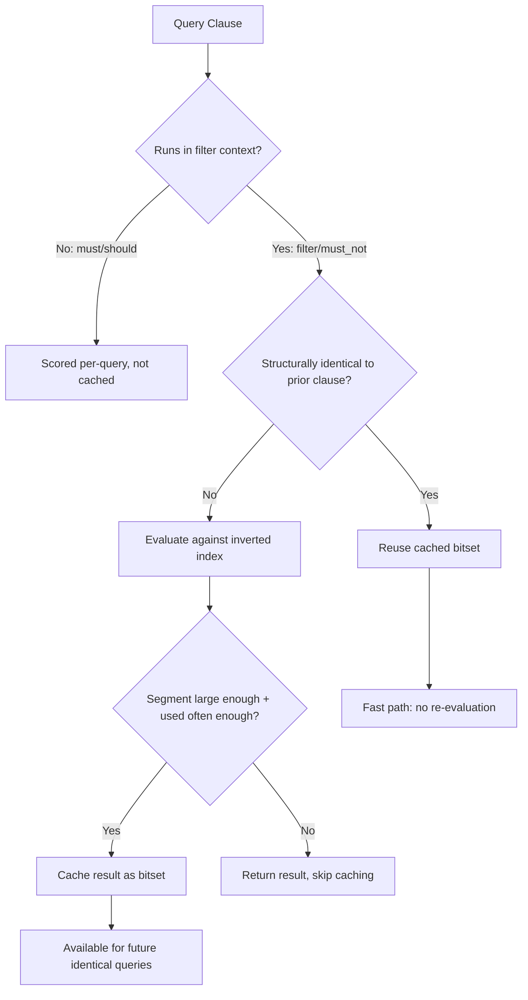

## Filter Caching Strategy

### Overview

Filter caching strategy concerns how to structure queries and index settings so that Elasticsearch's caching layers — primarily the **node query cache** — are used effectively for repeated filter-context clauses. A well-designed filter strategy reduces redundant computation across searches by reusing cached bitset representations of frequently-executed filters rather than re-evaluating them from the inverted index each time.

### How the Node Query Cache Works

#### Bitset Caching Mechanism

When a query clause runs in filter context, Elasticsearch can cache the result as a bitset — one bit per document in a segment, indicating whether that document matches the filter. On subsequent queries using an identical filter clause, the cached bitset is reused instead of re-executing the filter logic against the inverted index.

**Key Points**

- Caching operates at the segment level, not the shard or index level. Each segment maintains its own cached bitsets.
- The cache key is derived from the exact structure of the query clause (field, value, query type), so structurally identical filters are required for a cache hit — not merely semantically equivalent ones.
- Caching is applied automatically by Elasticsearch's query execution planner; it is not something explicitly toggled per query, though a cost-based heuristic determines whether a given filter is "used often enough" and whether the segment is large enough to justify caching it.

#### Segment Size and Caching Eligibility

Very small segments are not cached, because the overhead of maintaining a bitset for a small number of documents outweighs the benefit of avoiding re-evaluation. [Inference] This threshold is an internal implementation heuristic rather than a user-configurable setting, so it should be treated as an optimization detail rather than something to design around directly.

### Structuring Queries for Cache Reuse

#### Exact Clause Repetition

Because cache keys are based on exact clause structure, filters should be expressed consistently across queries to maximize hit rate.

```json
GET /orders/_search
{
  "query": {
    "bool": {
      "filter": [
        { "term": { "status": "shipped" } },
        { "range": { "order_date": { "gte": "2025-01-01", "lte": "2025-01-31" } } }
      ]
    }
  }
}
```

**Key Points**

- Running this exact `term` filter repeatedly across many different queries (e.g., varying only the `must` clause for full-text search) allows the `status: shipped` bitset to be reused each time.
- A `range` filter with a fixed, reusable boundary (e.g., "orders from this calendar month") caches well. A `range` filter with a constantly shifting boundary (e.g., "last 15 minutes" recalculated on every request) will rarely hit the cache, since each request produces a structurally different clause.

#### Rounding Time-Based Filters for Cacheability

A common technique for date range filters is rounding timestamps to coarser boundaries so that many requests within a time window share the identical cache key.

```json
GET /logs/_search
{
  "query": {
    "bool": {
      "filter": [
        { "range": { "@timestamp": { "gte": "now-1d/d", "lte": "now/d" } } }
      ]
    }
  }
}
```

**Key Points**

- The `/d` (day) rounding in `now-1d/d` causes the resolved timestamp to only change once per day rather than on every millisecond, dramatically increasing the chance of a cache hit across requests issued within the same day.
- This trades a small amount of precision (results are bounded to day granularity rather than the exact "now") for a large increase in cache reuse — an intentional and common tradeoff for dashboards and monitoring queries.
- Rounding granularity (`/d`, `/h`, `/m`) should be chosen based on how much imprecision is acceptable for the use case.

### Separating Filters from Scoring Logic

#### bool Query Structure

Placing cacheable, non-scoring conditions in `filter` (or `must_not`) rather than `must` both avoids unnecessary scoring computation and makes those clauses eligible for bitset caching. Clauses inside `must` or `should` are scored per-query and are not cached in the same way.

```json
GET /articles/_search
{
  "query": {
    "bool": {
      "must": [
        { "match": { "title": "elasticsearch performance" } }
      ],
      "filter": [
        { "term": { "language": "en" } },
        { "term": { "published": true } }
      ]
    }
  }
}
```

**Key Points**

- `language` and `published` are binary, non-relevance-affecting conditions — ideal filter cache candidates.
- The `match` clause on `title` legitimately affects ranking and should remain in `must`, where it is scored fresh per query (as expected, since scoring is inherently query-dependent).

#### constant_score for Filter-Only Queries

When a query has no scoring requirement at all, wrapping it in `constant_score` avoids Lucene's scoring machinery entirely while still allowing the inner filter to be cached.

```json
GET /products/_search
{
  "query": {
    "constant_score": {
      "filter": { "term": { "category": "electronics" } },
      "boost": 1.0
    }
  }
}
```

### Filter Ordering Within bool Queries

[Inference] While Elasticsearch's query planner performs its own internal optimization of clause evaluation order, structuring filters so that the most selective (fewest matching documents) conditions are logically identifiable can aid readability and, in some cases, execution efficiency — though the planner does not strictly require manual ordering to behave correctly, and relying on manual reordering as a primary optimization strategy is generally less impactful than ensuring high-selectivity fields are filterable at all (i.e., indexed with appropriate types).

### Monitoring Cache Effectiveness

#### Query Cache Statistics

Cache hit/miss ratios and memory usage can be inspected via the index stats API.



```
GET /orders/_stats/query_cache?human
```

This returns fields including `memory_size`, `total_count`, `hit_count`, `miss_count`, and `evictions` at the index and shard level.

**Key Points**

- A low hit ratio relative to miss count suggests filters are either too varied in structure to benefit from caching, or query volume on cacheable filters is genuinely low.
- High `evictions` may indicate the query cache size limit (`indices.queries.cache.size`, default 10% of heap) is too small relative to the working set of frequently-used filters, though increasing this setting trades cache capacity for available heap elsewhere.

#### Circuit Breakers and Cache Memory

The query cache consumes JVM heap. [Inference] On heap-constrained clusters, aggressively caching many distinct, rarely-reused filters can contribute to memory pressure rather than improving performance, since cache entries that are evicted before reuse provide no benefit while still having consumed allocation and GC overhead during their lifetime — this tradeoff depends on actual filter reuse patterns in a given workload.

### Filter Cache Decision Flow



### Illustrative SVG: Cache Hit vs Cache Miss Path

<svg xmlns="http://www.w3.org/2000/svg" viewBox="0 0 640 240">
<text x="320" y="24" font-size="16" font-weight="bold" text-anchor="middle" fill="#222">Filter Cache: Hit vs Miss Path (svg_diagram)</text>
<rect x="20" y="50" width="180" height="50" rx="6" fill="#eaf2fb" stroke="#2c6ea6" stroke-width="1.5" />
<text x="110" y="80" font-size="12" text-anchor="middle" fill="#333">Incoming Filter Clause</text>
<line x1="200" y1="75" x2="260" y2="75" stroke="#888" stroke-width="2" marker-end="url(#arrow2)" />
<polygon points="260,50 340,75 260,100 180,75" fill="#fff7e0" stroke="#c99a1e" stroke-width="1.5" />
<text x="260" y="70" font-size="10" text-anchor="middle" fill="#333">Same clause</text>
<text x="260" y="83" font-size="10" text-anchor="middle" fill="#333">seen before?</text>
<line x1="340" y1="65" x2="420" y2="35" stroke="#27ae60" stroke-width="2" marker-end="url(#arrow2)" />
<text x="380" y="30" font-size="11" fill="#27ae60">Yes</text>
<rect x="420" y="15" width="200" height="45" rx="6" fill="#eafaf1" stroke="#27ae60" stroke-width="1.5" />
<text x="520" y="42" font-size="12" text-anchor="middle" fill="#333">Bitset Lookup (fast)</text>
<line x1="340" y1="85" x2="420" y2="150" stroke="#c0392b" stroke-width="2" marker-end="url(#arrow2)" />
<text x="380" y="150" font-size="11" fill="#c0392b">No</text>
<rect x="420" y="130" width="200" height="45" rx="6" fill="#fdeeee" stroke="#c0392b" stroke-width="1.5" />
<text x="520" y="157" font-size="12" text-anchor="middle" fill="#333">Scan Inverted Index</text>
<line x1="520" y1="175" x2="520" y2="200" stroke="#888" stroke-width="2" marker-end="url(#arrow2)" />
<rect x="420" y="200" width="200" height="35" rx="6" fill="#f4f4f4" stroke="#888" stroke-width="1.5" />
<text x="520" y="222" font-size="11" text-anchor="middle" fill="#333">Possibly cached for next time</text>
</svg>

### Common Anti-Patterns

**Key Points**

- Using unrounded, constantly-shifting date math (e.g., raw `now` without rounding) in filters intended for repeated dashboard queries, preventing cache reuse.
- Placing binary/exact-match conditions in `must` instead of `filter`, incurring both unnecessary scoring cost and loss of caching eligibility.
- Assuming semantically equivalent but structurally different filters (e.g., different field order in a script, or different value formatting) will share a cache entry — they will not, since the cache key is structural.
- Over-relying on the query cache as a substitute for proper index design (e.g., using a cached filter to compensate for a field that should have been mapped as `keyword` with `doc_values` for direct efficient lookup).
- Expecting manual clause reordering within `bool.filter` to be the primary performance lever, when selectivity and cacheability of individual clauses generally matter more than their order.

### Next Steps

- Search performance optimization (broader context: shard fan-out, pagination, aggregation cost)
- Mapping design for performance (keyword vs text, doc_values, index-time tradeoffs)
- Time-series data patterns and rounding strategies for observability workloads
- Circuit breakers and heap memory management
- Shard request cache (distinct from node query cache; caches full `size:0` responses)
- Index-level slow logs for identifying uncached, high-frequency filter patterns