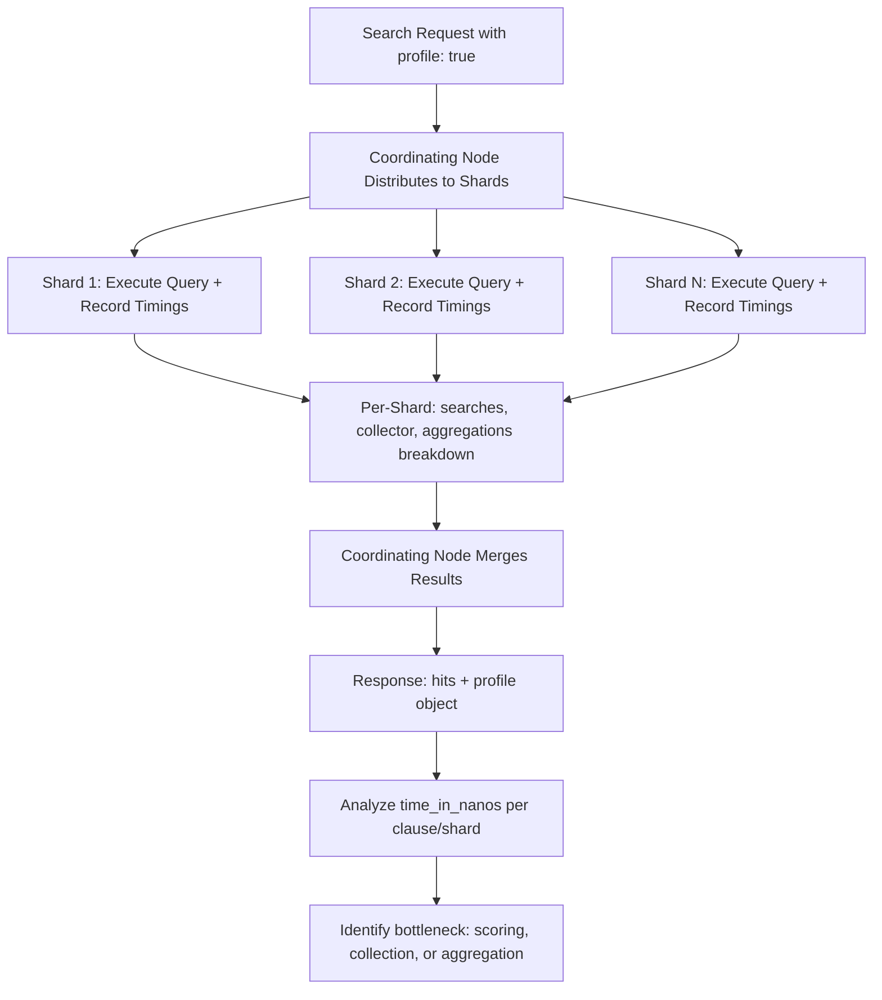

## Query Profiling with Profile API

### Overview

The Profile API provides a detailed, low-level breakdown of how a search or aggregation request executes internally — how much time each query component, collector, and aggregation spends, broken down per shard. It is a diagnostic tool for understanding *why* a query is slow, rather than a monitoring tool for continuous production use, since profiling itself introduces measurable overhead to the request.

### Enabling Profiling

#### Basic Usage

Profiling is enabled by adding `"profile": true` at the top level of a search request, alongside the normal `query` and/or `aggs` body.

```json
GET /products/_search
{
  "profile": true,
  "query": {
    "bool": {
      "must": [
        { "match": { "name": "laptop" } }
      ],
      "filter": [
        { "term": { "category": "electronics" } }
      ]
    }
  }
}
```

**Key Points**

- Profiling can be combined with any valid query, including aggregations.
- The response includes a normal `hits` section plus an additional top-level `profile` object.
- Profiling adds measurable overhead to the request itself, so timings reflect a profiled execution, not necessarily the exact timing of an unprofiled run [Inference] — the relative proportions between components are generally considered more informative than the absolute millisecond values for this reason.

### Structure of the Profile Response

#### Shards Array

The `profile` object contains a `shards` array, with one entry per shard involved in the search. Each shard entry includes its own `searches`, `collector`, and (if applicable) `aggregations` breakdowns.

```json
{
  "profile": {
    "shards": [
      {
        "id": "[node_id][index][0]",
        "searches": [ ... ],
        "collector": [ ... ],
        "aggregations": [ ... ]
      }
    ]
  }
}
```

**Key Points**

- Because each shard is profiled independently, a slow overall query can often be traced to one or a small number of disproportionately slow shards — useful for identifying shard-level imbalance (e.g., a hot shard with disproportionate document volume or fragmentation).

#### Query Breakdown

Within `searches`, each `query` entry corresponds to a clause in the original request (e.g., a `match`, `term`, or `bool` clause), shown as a tree matching the query's logical structure. Each node includes a `time_in_nanos` field and a `breakdown` object.

```json
{
  "query": [
    {
      "type": "BooleanQuery",
      "description": "name:laptop category:electronics",
      "time_in_nanos": 1250000,
      "breakdown": {
        "create_weight": 12000,
        "build_scorer": 340000,
        "next_doc": 210000,
        "score": 180000,
        "match": 90000,
        "advance": 150000
      },
      "children": [ ... ]
    }
  ]
}
```

**Key Points**

- `breakdown` fields correspond to internal Lucene operations: `build_scorer` (constructing the scoring mechanism), `next_doc`/`advance` (iterating matching documents), `score` (computing relevance scores), and others.
- The `children` array reflects nested clauses — for a `bool` query, its `must`/`filter`/`should` sub-clauses appear as children, each with their own breakdown.
- Comparing `time_in_nanos` across sibling children reveals which specific clause within a compound query is the primary cost driver.

#### Collector Breakdown

The `collector` section shows time spent in Lucene collectors — the components responsible for gathering matching documents into the result set (e.g., for top-N scoring, aggregation collection, or early termination logic).

```json
{
  "collector": [
    {
      "name": "SimpleTopScoreDocCollector",
      "reason": "search_top_hits",
      "time_in_nanos": 320000
    }
  ]
}
```

**Key Points**

- Multiple collectors can be chained (e.g., a `MultiCollector` wrapping both a top-hits collector and an aggregation collector), each contributing its own share of total time.
- High collector time relative to query time can indicate that result collection and sorting — rather than the query match logic itself — is the bottleneck.

#### Aggregation Breakdown

When the request includes aggregations, the `aggregations` array within each shard's profile shows per-aggregation timing, including a `breakdown` with fields like `initialize`, `collect`, `build_aggregation`, and `reduce`.

```json
{
  "aggregations": [
    {
      "type": "TermsAggregator",
      "description": "category",
      "time_in_nanos": 890000,
      "breakdown": {
        "initialize": 5000,
        "collect": 780000,
        "build_aggregation": 90000,
        "reduce": 15000
      }
    }
  ]
}
```

**Key Points**

- `collect` typically dominates for aggregations that must visit many documents (e.g., high-cardinality `terms` aggregations without effective filtering).
- `reduce` reflects the cost of merging per-shard results into the final aggregation output, which becomes more significant as shard count and bucket cardinality increase.
- Nested sub-aggregations appear similarly nested in the breakdown, allowing identification of which specific level of a multi-level aggregation is expensive.

### Interpreting Profile Output

#### Identifying the Bottleneck Phase

**Key Points**

- High time in `build_scorer` across many clauses can suggest an overly complex `bool` query with many clauses being scored, where restructuring some into `filter` context could reduce cost.
- High `collect` time in aggregations, especially on `terms` aggregations, often correlates with high field cardinality or insufficiently selective filtering upstream in the query.
- Disproportionate time on a specific shard (relative to sibling shards) suggests shard-level data skew rather than a query structure problem — worth investigating via `_cat/shards` for size/document count imbalance.
- The profile does not include network transport time between the coordinating node and shards, nor fetch-phase time for `_source` retrieval [Unverified] — behavior and exact coverage of what is and is not captured can vary by version, so cross-referencing against current documentation for the specific cluster version is advisable when precise phase attribution matters.

#### Comparing Rewritten Queries

A common workflow is running the Profile API against an original query, then against a restructured version (e.g., moving clauses from `must` to `filter`, or adding a more selective filter earlier), and comparing `time_in_nanos` totals to validate whether the rewrite actually improved performance rather than assuming it based on theory alone.

```json
GET /products/_search
{
  "profile": true,
  "query": {
    "bool": {
      "filter": [
        { "term": { "category": "electronics" } }
      ],
      "must": [
        { "match": { "name": "laptop" } }
      ]
    }
  }
}
```

**Key Points**

- Empirical before/after comparison via profiling is generally more reliable than assuming a theoretically "correct" optimization (e.g., filter vs must) will produce a measurable difference in every case, since actual impact depends on data distribution, cache state, and selectivity.
- Profile results can vary between runs due to caching effects (e.g., a filter cached from a prior run will show artificially low time on a repeat profile) — [Inference] running multiple profile iterations, or being mindful of cache warm-up state, produces more representative comparisons.

### Profile API Request/Response Flow



### Illustrative SVG: Profile Breakdown Hierarchy

<svg xmlns="http://www.w3.org/2000/svg" viewBox="0 0 640 280">
<text x="320" y="24" font-size="16" font-weight="bold" text-anchor="middle" fill="#222">Profile Response Structure (svg_diagram)</text>
<rect x="240" y="45" width="160" height="35" rx="6" fill="#eaf2fb" stroke="#2c6ea6" stroke-width="1.5" />
<text x="320" y="67" font-size="12" text-anchor="middle" fill="#333">profile.shards[]</text>
<line x1="320" y1="80" x2="150" y2="115" stroke="#888" stroke-width="1.5" />
<line x1="320" y1="80" x2="320" y2="115" stroke="#888" stroke-width="1.5" />
<line x1="320" y1="80" x2="490" y2="115" stroke="#888" stroke-width="1.5" />
<rect x="70" y="115" width="160" height="40" rx="6" fill="#fdeeee" stroke="#c0392b" stroke-width="1.5" />
<text x="150" y="133" font-size="11" text-anchor="middle" fill="#333">searches[]</text>
<text x="150" y="147" font-size="10" text-anchor="middle" fill="#555">query tree + breakdown</text>
<rect x="240" y="115" width="160" height="40" rx="6" fill="#fff7e0" stroke="#c99a1e" stroke-width="1.5" />
<text x="320" y="133" font-size="11" text-anchor="middle" fill="#333">collector[]</text>
<text x="320" y="147" font-size="10" text-anchor="middle" fill="#555">collection timing</text>
<rect x="410" y="115" width="160" height="40" rx="6" fill="#eafaf1" stroke="#27ae60" stroke-width="1.5" />
<text x="490" y="133" font-size="11" text-anchor="middle" fill="#333">aggregations[]</text>
<text x="490" y="147" font-size="10" text-anchor="middle" fill="#555">agg timing + breakdown</text>
<line x1="150" y1="155" x2="150" y2="185" stroke="#888" stroke-width="1.5" />
<rect x="70" y="185" width="160" height="55" rx="6" fill="#fbe9e9" stroke="#c0392b" stroke-width="1" />
<text x="150" y="203" font-size="10" text-anchor="middle" fill="#333">build_scorer</text>
<text x="150" y="217" font-size="10" text-anchor="middle" fill="#333">next_doc / advance</text>
<text x="150" y="231" font-size="10" text-anchor="middle" fill="#333">score / match</text>
<line x1="490" y1="155" x2="490" y2="185" stroke="#888" stroke-width="1.5" />
<rect x="410" y="185" width="160" height="55" rx="6" fill="#e8f7ee" stroke="#27ae60" stroke-width="1" />
<text x="490" y="203" font-size="10" text-anchor="middle" fill="#333">initialize / collect</text>
<text x="490" y="217" font-size="10" text-anchor="middle" fill="#333">build_aggregation</text>
<text x="490" y="231" font-size="10" text-anchor="middle" fill="#333">reduce</text>
</svg>

### Practical Workflow

**Key Points**

- Identify slow queries first via slow logs or application-level monitoring; profiling is not typically applied blindly to every request.
- Run the Profile API against the suspected slow query to obtain per-clause and per-shard timing.
- Locate the dominant contributor: a specific `bool` sub-clause, a specific aggregation's `collect` phase, or a specific shard.
- Formulate a hypothesis-driven change (e.g., move a clause to filter context, reduce aggregation `size`, add a more selective pre-filter).
- Re-run the Profile API on the revised query to empirically confirm the change reduced `time_in_nanos`, accounting for cache warm-up effects between runs.
- Cross-check findings against `_cat/shards` and index-level slow logs to distinguish query-structure issues from data distribution or shard sizing issues.

### Limitations

**Key Points**

- Profiling overhead means absolute timings should not be treated as exactly representative of unprofiled production latency; relative comparisons within the same profiled run, or between two profiled runs, are more meaningful.
- The Profile API does not profile fetch-phase `_source` retrieval or network/coordination overhead between nodes [Unverified] — for full end-to-end latency diagnosis, this should be supplemented with slow logs and, where available, external request tracing.
- Profile output can be verbose for complex queries with many nested clauses or aggregations, requiring careful reading to isolate the relevant contributor rather than treating raw output size as itself indicative of a problem.

### Related Topics

- Search performance optimization (broader query structure and caching strategies)
- Filter caching strategy (interpreting `build_scorer`/cache-related timing differences)
- Slow log configuration (identifying candidates for profiling)
- Aggregation performance deep dive (interpreting `collect`/`reduce` breakdown in depth)
- Shard sizing and allocation (interpreting per-shard timing skew)