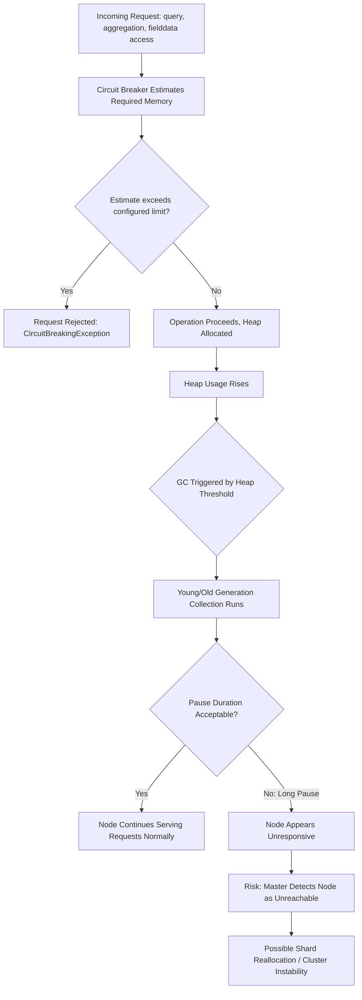

## JVM Heap and GC Tuning

### Overview

JVM heap and garbage collection (GC) tuning governs how Elasticsearch manages the memory used for in-heap data structures — query execution state, fielddata (when used), aggregation buffers, and internal caches — and how the JVM reclaims that memory. Because Elasticsearch runs on the JVM, heap sizing and GC behavior directly affect node stability, latency consistency, and susceptibility to out-of-memory conditions.

### Heap Sizing Fundamentals

#### The 50% Rule

A long-standing guideline is allocating no more than roughly 50% of a node's available RAM to the JVM heap, leaving the remainder for the operating system's file system cache, which Lucene relies on heavily for efficient access to on-disk structures like doc values and stored fields.

**Key Points**

- Lucene is designed to leverage the OS file cache for segment data; starving the OS cache by over-allocating heap can degrade performance even if heap itself is sized "correctly" for JVM purposes.
- This 50% figure is a starting heuristic, not a strict law — [Inference] the ideal split depends on workload characteristics (e.g., aggregation-heavy workloads may benefit from more heap, while search-heavy workloads relying on doc values may benefit more from a larger OS cache).

#### The Compressed Oops Boundary

The JVM uses "compressed ordinary object pointers" (compressed oops) to represent object references more compactly when heap size is below a certain threshold (historically around 32GB, though the exact cutoff is JVM-implementation-dependent). Exceeding this threshold causes the JVM to switch to uncompressed pointers, which can result in a node with, for example, 34GB of heap having less effective usable memory than a node with 30GB, due to the overhead of larger pointers.

**Key Points**

- [Inference] The practical guidance commonly derived from this is to avoid setting heap size in the range just above the compressed oops threshold, since it can yield worse effective memory utilization than a smaller heap setting — the precise threshold should be verified for the specific JVM version in use, as it is not guaranteed to be identical across all JVM distributions and versions.
- Elasticsearch's startup logs typically indicate whether compressed oops are in use, which can be checked to confirm a given heap setting falls on the favorable side of the boundary.

#### Setting Heap Size

Heap size is configured via the `-Xms` (initial heap size) and `-Xmx` (maximum heap size) JVM options, typically set identically to avoid heap resizing pauses during runtime.



```
-Xms16g
-Xmx16g
```

**Key Points**

- Setting `-Xms` equal to `-Xmx` avoids the JVM needing to dynamically resize the heap during operation, which is itself a potentially disruptive event.
- These settings are typically placed in a JVM options file (`jvm.options` or a `.options` file in `jvm.options.d/`) rather than passed as ad hoc command-line flags, for consistency across restarts.
- Heap size should never be set beyond the point where it starves the OS file cache, even if more RAM is technically available, per the 50% guideline above.

### Garbage Collection Overview

#### Why GC Matters for Elasticsearch

The JVM periodically reclaims heap memory occupied by objects no longer in use. Depending on the GC algorithm and heap state, this reclamation can pause application threads (a "stop-the-world" pause), during which the node cannot process requests. Long or frequent GC pauses manifest as latency spikes or, in severe cases, node unresponsiveness that can trigger cluster-level issues like master node timeouts.

**Key Points**

- GC pause duration and frequency are the primary metrics of concern, more so than total GC time in isolation, since a search-facing system is generally more sensitive to pause consistency than to aggregate throughput cost.
- Elasticsearch nodes experiencing prolonged GC pauses can be perceived by the cluster as unresponsive, potentially leading to node departure from the cluster and subsequent shard reallocation — a GC problem can cascade into a cluster stability problem.

#### Garbage Collector Options

[Unverified] The default garbage collector bundled with Elasticsearch's shipped JVM, and the available alternative collectors, have changed across Elasticsearch and JVM versions, so the specific default in a given deployment should be confirmed against that version's documentation rather than assumed. Historically, G1GC has been a common default/recommended collector for Elasticsearch, with alternatives such as CMS (deprecated in modern JVM versions) having been used in earlier configurations.

**Key Points**

- G1GC is designed to provide more predictable, shorter pause times compared to older collectors, generally by dividing the heap into regions and prioritizing collection of regions with the most reclaimable garbage.
- [Inference] Switching GC algorithms is a significant operational change that should be validated in a non-production environment first, since GC behavior interacts closely with workload-specific allocation patterns and default tuning parameters are generally already reasonable starting points for most Elasticsearch deployments.

### Sources of Heap Pressure

#### Fielddata (When Enabled)

As covered in doc values and fielddata topics, fielddata loaded for `text` field aggregation/sorting/scripting resides in heap. Large or high-cardinality fielddata loads are a well-known source of heap pressure and, historically, node instability prior to doc values becoming the default mechanism for most field types.

#### Aggregation Buffers

Large or deeply nested aggregations, especially high-cardinality `terms` aggregations or aggregations with large requested `size` values, require heap to hold intermediate bucket state during collection and reduction.

#### Query Cache and Request Cache

The node query cache and shard request cache (covered in filter caching strategy) both consume heap, bounded by configurable size limits (e.g., `indices.queries.cache.size`, defaulting to a percentage of heap).

#### Field Data and Request-Level Circuit Breakers

Elasticsearch's circuit breaker system estimates memory requirements for various operations (fielddata loading, request-level accumulation, aggregation state) and rejects operations that would exceed configured thresholds, acting as a safeguard rather than a performance feature.



```
GET _nodes/stats/breaker
```

**Key Points**

- Circuit breaker trips are a signal of a request pattern exceeding safe memory bounds, not something to be silently increased without investigating the underlying cause (e.g., an uncontrolled high-cardinality aggregation or fielddata usage).
- Reviewing `_nodes/stats/breaker` output for elevated `tripped` counts on specific breakers (`fielddata`, `request`, `parent`) helps identify which category of operation is driving heap pressure.

### Monitoring Heap and GC Behavior

#### Node Stats API



```
GET _nodes/stats/jvm
```

This returns heap usage percentages, GC collection counts, and cumulative GC time per collector, per node.

**Key Points**

- Sustained heap usage consistently above roughly 75–85% [Inference] is often treated as a warning sign of insufficient heap headroom for a given workload, though the exact threshold at which this becomes problematic depends on workload burstiness and GC configuration rather than being a fixed universal number.
- A "sawtooth" pattern of heap usage rising and then dropping sharply on GC is generally expected and healthy; a pattern of heap usage climbing without recovering after GC cycles suggests a memory leak or sustained over-allocation that GC cannot keep pace with.

#### GC Logs

Elasticsearch can be configured to emit detailed GC logs, which record individual GC event timing, type (young/old/mixed generation, depending on collector), and heap occupancy before/after each event — useful for deeper diagnosis beyond aggregate node stats.

**Key Points**

- GC logs are the authoritative source for understanding pause duration distribution over time, as opposed to node stats' cumulative/aggregate figures.
- [Inference] Correlating GC log timestamps with application-level slow log entries or observed latency spikes can help confirm (or rule out) GC as the root cause of a specific performance incident.

### Heap Pressure and Circuit Breaker Flow



### Illustrative SVG: Heap Allocation Split

<svg xmlns="http://www.w3.org/2000/svg" viewBox="0 0 640 240">
<text x="320" y="24" font-size="16" font-weight="bold" text-anchor="middle" fill="#222">Node RAM Allocation Guideline (svg_diagram)</text>
<rect x="60" y="60" width="520" height="80" rx="6" fill="#f4f4f4" stroke="#888" stroke-width="1.5" />
<rect x="60" y="60" width="260" height="80" fill="#eaf2fb" stroke="#2c6ea6" stroke-width="1.5" />
<text x="190" y="95" font-size="13" font-weight="bold" text-anchor="middle" fill="#2c6ea6">JVM Heap</text>
<text x="190" y="115" font-size="11" text-anchor="middle" fill="#333">~50% of RAM (guideline)</text>
<text x="190" y="130" font-size="10" text-anchor="middle" fill="#555">below compressed oops boundary</text>
<rect x="320" y="60" width="260" height="80" fill="#eafaf1" stroke="#27ae60" stroke-width="1.5" />
<text x="450" y="95" font-size="13" font-weight="bold" text-anchor="middle" fill="#27ae60">OS File Cache</text>
<text x="450" y="115" font-size="11" text-anchor="middle" fill="#333">Remaining RAM</text>
<text x="450" y="130" font-size="10" text-anchor="middle" fill="#555">serves doc values, segments</text>

<text x="320" y="175" font-size="11" text-anchor="middle" fill="#555">Starving either side degrades performance — heap for query</text>

<text x="320" y="192" font-size="11" text-anchor="middle" fill="#555">execution state, OS cache for efficient on-disk data access</text>

</svg>

### Practical Tuning Workflow

**Key Points**

- Start from the 50%-of-RAM heuristic and the compressed oops boundary as initial `-Xms`/`-Xmx` values, rather than an arbitrary or maximal setting.
- Monitor `_nodes/stats/jvm` over a representative production workload period to establish a baseline heap usage pattern.
- Investigate circuit breaker trip counts (`_nodes/stats/breaker`) as an early indicator of requests pushing heap limits, before those requests escalate to actual GC-driven instability.
- Correlate GC log pause events with observed latency spikes or node connectivity issues to confirm GC as a contributing factor rather than assuming it.
- Address root causes of heap pressure (uncontrolled aggregation cardinality, fielddata usage on text fields, oversized query cache relative to workload) before considering heap size increases or GC algorithm changes, since a larger heap alone does not resolve an underlying inefficient access pattern and can simply delay or lengthen eventual GC pauses.

### Common Anti-Patterns

**Key Points**

- Setting heap size above 50% of available RAM under the assumption that "more heap is always better," starving the OS file cache and degrading overall performance.
- Setting heap size just above the compressed oops threshold, unknowingly reducing effective usable memory compared to a smaller setting.
- Setting `-Xms` and `-Xmx` to different values, permitting runtime heap resizing pauses.
- Responding to circuit breaker trips by simply raising the breaker's limit without investigating the underlying request pattern causing the trips.
- Treating heap size increases as a first response to GC-related instability without first correlating GC logs against actual root causes such as fielddata misuse or unbounded aggregations.

### Related Topics

- Fielddata and doc values (primary source of avoidable heap pressure)
- Filter caching strategy (query cache heap consumption)
- Shard sizing guidelines (per-shard memory structures contributing to heap load)
- Cluster health monitoring and node stats APIs in depth
- Circuit breaker configuration (`indices.breaker.*` settings)
- Hardware sizing and capacity planning for Elasticsearch nodes