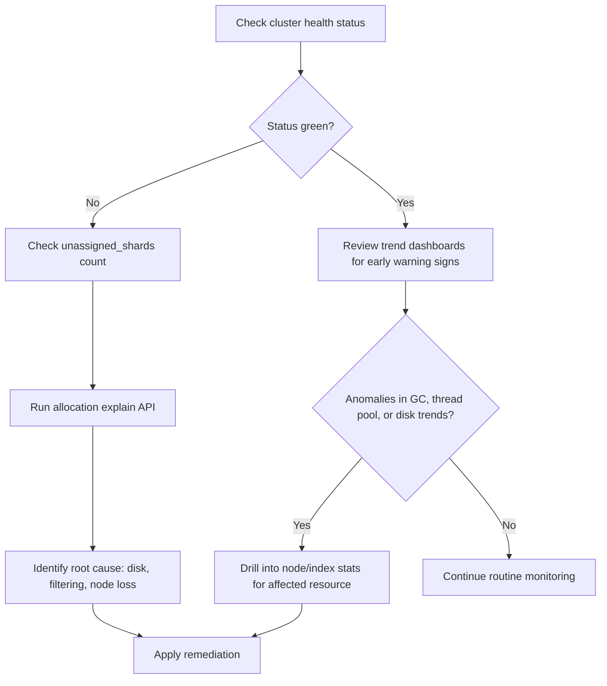

## Cluster Monitoring Overview

### Overview

Cluster monitoring is the practice of continuously observing Elasticsearch's internal state — node health, resource usage, shard allocation, indexing and search performance, and cluster-level status — to detect degradation before it becomes an outage and to diagnose problems once they occur. Elasticsearch exposes this data through built-in APIs, and separately through the Elastic Stack's own monitoring features, which persist and visualize that data over time rather than requiring point-in-time polling.

### Why Monitoring Matters

Many of the mechanisms covered elsewhere in performance tuning — circuit breakers, thread pools, disk and hardware behavior — expose their internal state specifically so that operators can watch for warning signs ahead of failure. A circuit breaker trip, a climbing thread pool rejection count, or a disk approaching capacity are all symptoms visible well before they manifest as a full outage, provided something is actually watching for them. Monitoring converts these built-in signals into an ongoing practice rather than something only consulted reactively during an incident.

### Cluster Health Status

The most fundamental monitoring signal is cluster health, exposed via:

```json
GET /_cluster/health
```

```json
{
  "cluster_name": "production-logs",
  "status": "yellow",
  "timed_out": false,
  "number_of_nodes": 6,
  "number_of_data_nodes": 4,
  "active_primary_shards": 120,
  "active_shards": 231,
  "relocating_shards": 0,
  "initializing_shards": 0,
  "unassigned_shards": 9,
  "active_shards_percent_as_number": 96.25
}
```

**Key Points**

- `status: green` — all primary and replica shards are allocated.
- `status: yellow` — all primary shards are allocated, but at least one replica shard is not; the cluster is functional but under-replicated and at reduced fault tolerance.
- `status: red` — at least one primary shard is unallocated, meaning some data is currently unavailable for reads and writes on the affected index or indices.
- `unassigned_shards` above zero warrants investigation regardless of overall status color, since it indicates shards not being served from anywhere in the cluster.

Cluster status color is a summary signal, not a diagnosis — it tells you *that* something needs attention, not *what* or *why*, which is where the more granular APIs below come in.

<svg xmlns="http://www.w3.org/2000/svg" viewBox="0 0 780 260" font-family="sans-serif">
<text x="390" y="30" text-anchor="middle" font-size="18" font-weight="bold">Cluster Health Status Meaning (svg_diagram)</text>
<rect x="30" y="60" width="220" height="150" rx="8" fill="#2f855a" />
<text x="140" y="90" text-anchor="middle" font-size="14" fill="white" font-weight="bold">GREEN</text>
<text x="140" y="115" text-anchor="middle" font-size="11" fill="white">All primary shards</text>
<text x="140" y="132" text-anchor="middle" font-size="11" fill="white">allocated</text>
<text x="140" y="155" text-anchor="middle" font-size="11" fill="white">All replica shards</text>
<text x="140" y="172" text-anchor="middle" font-size="11" fill="white">allocated</text>
<rect x="280" y="60" width="220" height="150" rx="8" fill="#b7791f" />
<text x="390" y="90" text-anchor="middle" font-size="14" fill="white" font-weight="bold">YELLOW</text>
<text x="390" y="115" text-anchor="middle" font-size="11" fill="white">All primary shards</text>
<text x="390" y="132" text-anchor="middle" font-size="11" fill="white">allocated</text>
<text x="390" y="155" text-anchor="middle" font-size="11" fill="white">Some replica shards</text>
<text x="390" y="172" text-anchor="middle" font-size="11" fill="white">missing</text>
<rect x="530" y="60" width="220" height="150" rx="8" fill="#c53030" />
<text x="640" y="90" text-anchor="middle" font-size="14" fill="white" font-weight="bold">RED</text>
<text x="640" y="115" text-anchor="middle" font-size="11" fill="white">At least one primary</text>
<text x="640" y="132" text-anchor="middle" font-size="11" fill="white">shard unallocated</text>
<text x="640" y="155" text-anchor="middle" font-size="11" fill="white">Data unavailable for</text>
<text x="640" y="172" text-anchor="middle" font-size="11" fill="white">affected indices</text>
</svg>

### Node-Level Statistics

The `_nodes/stats` API is the primary source for per-node resource and subsystem metrics, including the circuit breaker and thread pool statistics covered previously:

```json
GET /_nodes/stats/os,jvm,fs,indices
```

**Key Points**

- `os` — host-level CPU load and memory.
- `jvm` — heap usage, garbage collection counts and duration, pool-specific memory (young/old generation).
- `fs` — disk usage and available space per data path.
- `indices` — indexing rate, search rate, query latency, merge activity, cache sizes (query cache, request cache, fielddata cache), aggregated at the node level.

Garbage collection metrics deserve particular attention: frequent or long-duration old-generation GC pauses are a strong indicator of heap pressure, and often precede circuit breaker trips or degraded response times as symptoms of the same underlying cause.

### Index-Level Statistics

Where `_nodes/stats` aggregates by node, `_stats` aggregates by index, useful for identifying which specific index is driving load:

```json
GET /my-index/_stats
```

Relevant fields include indexing rate and latency, search rate and latency, segment count, merge time, and store size — each broken out per index, which is useful when a cluster is healthy overall but a specific index (often the most recently or heavily written one) is the source of a performance issue.

### Shard Allocation Explain

When shards are unassigned, the allocation explain API diagnoses why:

```json
GET /_cluster/allocation/explain
```

This returns a detailed, human-readable explanation of why a specific unassigned shard has not been allocated — common reasons include insufficient disk space on candidate nodes, allocation filtering rules excluding all eligible nodes, or a node holding an existing copy of the shard being unavailable.

### Pending Tasks and Cluster State

```json
GET /_cluster/pending_tasks
```

This surfaces cluster-level administrative tasks (mapping updates, index creation, shard allocation decisions) queued for processing by the master node. A consistently non-empty or growing pending task queue suggests the master node is struggling to keep up with the rate of cluster state changes, which is a distinct problem from data-node resource pressure.

### The `_cat` APIs

The `_cat` family of APIs provides compact, human-readable, tabular output well suited to command-line use and quick inspection, as a lighter-weight alternative to the more verbose JSON-heavy stats APIs:



```
GET /_cat/nodes?v&h=name,cpu,ram.percent,heap.percent,disk.used_percent
GET /_cat/indices?v&s=store.size:desc
GET /_cat/shards?v&h=index,shard,prirep,state,node
GET /_cat/thread_pool?v
```

**Key Points**

- `_cat/nodes` — quick per-node resource snapshot, useful for spotting an individual node under disproportionate load.
- `_cat/indices` — per-index size, document count, and health, useful for spotting unexpectedly large or unhealthy indices.
- `_cat/shards` — per-shard state and node placement, useful for spotting uneven shard distribution or specific problem shards.
- Appending `?v` includes column headers; `&h=` restricts output to specific columns, keeping output focused for scripting or quick checks.

### Elastic Stack Monitoring (Stack Monitoring / Metricbeat)

Beyond point-in-time API polling, the Elastic Stack provides dedicated monitoring features — historically via internal monitoring indices and Kibana's Stack Monitoring UI, and via Metricbeat's Elasticsearch module for shipping metrics to a separate monitoring cluster.

**Key Points**

- Persisting monitoring data over time (rather than only querying live stats) enables trend analysis — comparing current heap usage or query latency against historical baselines, rather than only assessing the current instant in isolation.
- [Unverified] The specific mechanism recommended for collecting monitoring data (internal collection vs. Metricbeat, and their respective configuration) has evolved across Elasticsearch versions, so current guidance should be verified against documentation for the specific version in use.
- Sending monitoring data to a separate, dedicated monitoring cluster (rather than self-monitoring within the production cluster) is a common practice, since it ensures monitoring visibility persists even if the production cluster itself becomes degraded or unreachable.

### Alerting Considerations

Monitoring data is most useful when paired with alerting thresholds rather than requiring continuous manual observation.

**Key Points**

- Common alerting candidates include: cluster status transitioning to yellow or red, disk usage crossing high-watermark thresholds, JVM heap sustained above a high percentage, climbing circuit breaker trip counts, and climbing thread pool rejection counts.
- [Inference] Alert thresholds that are too sensitive tend to produce alert fatigue and get ignored over time, while thresholds set too loosely fail to provide advance warning before user-facing impact occurs, so threshold tuning generally benefits from being informed by a cluster's own observed historical baseline rather than a generic default value applied uniformly.

### Disk Watermarks

Disk usage is a monitoring dimension worth calling out specifically because Elasticsearch has built-in automated responses tied to configurable watermark thresholds:

```yaml
cluster.routing.allocation.disk.watermark.low: "85%"
cluster.routing.allocation.disk.watermark.high: "90%"
cluster.routing.allocation.disk.watermark.flood_stage: "95%"
```

- **Low watermark** — Elasticsearch stops allocating new shards to a node past this threshold.
- **High watermark** — Elasticsearch actively attempts to relocate shards away from a node past this threshold.
- **Flood stage watermark** — Elasticsearch enforces a read-only index block on indices with shards on the affected node, to prevent the disk from filling completely.

Monitoring disk usage against these thresholds proactively is preferable to discovering them reactively, since crossing the flood stage watermark has an immediate, user-visible effect (blocked writes) rather than only a background allocation change.

### Common Monitoring Workflow



### Best Practices

- Treat cluster status color as a starting signal, not a complete diagnosis, and follow up with allocation explain, node stats, or index stats to identify root cause.
- Monitor trend data, not just current-instant snapshots, since gradually worsening conditions (climbing heap usage, growing segment counts, slowly filling disks) are easier to catch before impact when viewed as a trend.
- Configure alerting on leading indicators (rejection counts, circuit breaker trips, disk watermark proximity, GC pause frequency) rather than relying solely on cluster status transitioning to yellow or red, since those events often mean impact has already begun.
- Route monitoring data to a separate monitoring cluster in production environments, so visibility is preserved even during production cluster degradation.
- Use the `_cat` APIs for quick, scriptable checks, and the fuller `_stats`/`_nodes/stats` JSON APIs when detailed field-level data is needed for deeper investigation.
- Revisit alert thresholds periodically against the cluster's own historical baseline rather than treating initial threshold values as permanent.

### Related Topics

- Performance Tuning — Circuit Breakers
- Performance Tuning — Thread Pool Configuration
- Performance Tuning — Hardware and Disk Considerations
- Cluster Design — Shard Allocation and Rebalancing
- Cluster Design — Node Roles and Dedicated Node Types
- Data Management — Index Lifecycle Management (ILM)
- Observability — Alerting and Kibana Stack Monitoring