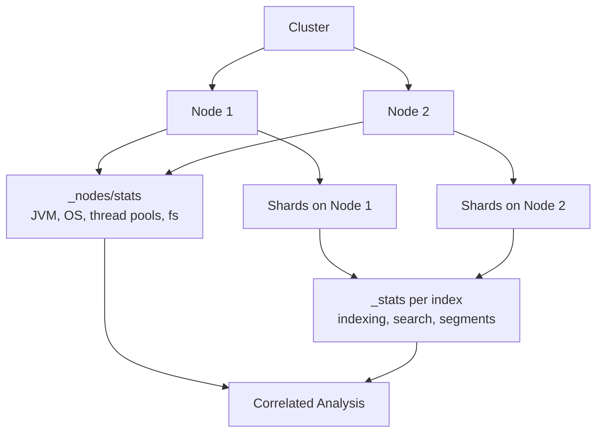

## Node and Index Metrics

### Overview

Elasticsearch exposes detailed operational metrics at two primary levels: the **node** level (JVM, OS, process, thread pools, filesystem) and the **index** level (indexing rate, search rate, segment counts, cache usage). These metrics are the foundation for cluster health monitoring, capacity planning, and performance troubleshooting.

### Node Stats API

The `_nodes/stats` API is the primary source of node-level metrics.



```
GET /_nodes/stats
```

Scope the request to specific nodes or metric groups to reduce payload size:



```
GET /_nodes/nodeId1,nodeId2/stats/jvm,os,fs
```

Common metric groups returned:

- **indices** — per-node aggregate of indexing, search, get, merge, and refresh statistics
- **os** — CPU load, memory, swap
- **process** — open file descriptors, CPU percent, virtual memory
- **jvm** — heap usage, garbage collection counts/time, memory pools
- **thread_pool** — active/queued/rejected tasks per pool (write, search, get, etc.)
- **fs** — disk space, I/O statistics
- **transport** and **http** — network-level request/response counts

### Key JVM Metrics

JVM health is one of the most common sources of instability, so these fields deserve close attention:



```
GET /_nodes/stats/jvm
```

- `jvm.mem.heap_used_percent` — sustained values above roughly 85% often precede GC pressure
- `jvm.gc.collectors.young.collection_count` / `collection_time_in_millis` — frequent young-gen collections are normal; a rising trend in collection time suggests memory pressure
- `jvm.gc.collectors.old.collection_count` — frequent old-gen collections are a stronger warning sign, since they are more expensive and can pause the node

[Inference] Because GC behavior depends heavily on workload shape, heap sizing, and JVM version/settings, absolute thresholds for "normal" GC frequency vary across deployments and are best established against a node's own historical baseline rather than a universal number.

### Thread Pool Metrics

Thread pools govern how Elasticsearch schedules concurrent work, and their queue/rejection counters are a direct signal of saturation:



```
GET /_nodes/stats/thread_pool
```

Relevant fields per pool (e.g., `write`, `search`, `get`, `refresh`, `flush`, `management`):

- `active` — threads currently executing tasks
- `queue` — tasks waiting for a free thread
- `rejected` — tasks that were dropped because the queue was full
- `completed` — cumulative completed task count

A nonzero and growing `rejected` count on the `write` or `search` pools indicates the node cannot keep pace with incoming request volume and is actively refusing work — this is a stronger signal of overload than queue depth alone.

### Index Stats API

The `_stats` API reports metrics scoped to one or more indices, aggregated across all shards (primary and replica, depending on the `level` parameter).



```
GET /my-index/_stats
```

To retrieve stats for all indices:



```
GET /_stats
```

Useful query parameters:

- `level=shards` — breaks statistics down per shard instead of aggregating at the index level
- `metric=indexing,search,segments` — restricts the response to specific metric groups

### Key Indexing Metrics



```
GET /my-index/_stats/indexing
```

- `indexing.index_total` — cumulative count of index operations
- `indexing.index_time_in_millis` — cumulative time spent indexing; dividing by `index_total` gives an approximate average latency per operation
- `indexing.index_current` — operations in flight at the moment of the request
- `indexing.throttle_time_in_millis` — time indexing was throttled, typically due to merge pressure

### Key Search Metrics



```
GET /my-index/_stats/search
```

- `search.query_total` and `search.query_time_in_millis` — cumulative query count and time, from which average query latency can be derived
- `search.fetch_total` and `search.fetch_time_in_millis` — the fetch phase, which retrieves and assembles the final documents after the query phase identifies matches
- `search.query_current` — queries in flight

**Key Points**

- Cumulative counters (`_total`, `_time_in_millis`) reset only when a node restarts, so meaningful analysis usually requires sampling the delta between two points in time rather than reading a single snapshot.
- Aggregated index-level stats can mask an imbalanced shard; `level=shards` reveals whether load is evenly distributed.

### Segment and Merge Metrics

Segments are the immutable Lucene-level building blocks of an index, and their count and size directly affect search performance and memory usage.



```
GET /my-index/_stats/segments
```

- `segments.count` — number of Lucene segments; a high count relative to index size generally means more overhead per query, since a search must touch every segment
- `segments.memory_in_bytes` — [Inference] on many recent Elasticsearch versions this reflects primarily the small amount of off-heap/near-heap structure overhead, as much of the historical in-heap segment metadata (e.g., terms dictionaries) has moved to off-heap or disk-backed structures in later Lucene versions; the exact composition depends on version, so this field should be interpreted alongside release notes for the deployed version rather than assumed constant across versions

Merge activity, which consolidates smaller segments into larger ones, is tracked under:



```
GET /my-index/_stats/merge
```

- `merges.total` — cumulative merge operations
- `merges.total_time_in_millis` — cumulative time spent merging, which competes with indexing and search for I/O and CPU

### Cache Metrics

Two caches are commonly monitored at the index level:



```
GET /my-index/_stats/query_cache,request_cache,fielddata
```

- `query_cache.memory_size_in_bytes` and `query_cache.evictions` — the shard-level query cache; a rising eviction count suggests the cache is undersized for the working set of filter queries
- `request_cache.hit_count` / `miss_count` — the shard request cache, which caches full aggregation/search responses for requests with `size=0`
- `fielddata.memory_size_in_bytes` and `fielddata.evictions` — fielddata is used mainly for sorting/aggregating on text fields without doc values; nonzero fielddata usage is often worth investigating, since doc-values-based approaches are generally preferred for these operations

### Cat APIs for Quick Inspection

The `_cat` family provides human-readable, tabular summaries useful for ad hoc checks without parsing JSON:



```
GET /_cat/nodes?v&h=name,heap.percent,ram.percent,cpu,load_1m
GET /_cat/indices?v&h=index,docs.count,store.size,pri,rep
GET /_cat/thread_pool/write,search?v&h=node_name,active,queue,rejected
GET /_cat/segments/my-index?v
```

The `h` parameter restricts output to chosen columns, and `v` adds a header row.

### Combining Node and Index Metrics

Because index-level stats are aggregated from the shards residing on each node, correlating both levels is necessary for root-cause analysis. A spike in `search.query_time_in_millis` at the index level combined with elevated `jvm.gc.collectors.old.collection_count` on the hosting nodes points toward memory pressure as a contributing factor, whereas the same query-time spike alongside high `thread_pool.search.queue` points toward request concurrency exceeding available search threads.

Below is a simplified view of how these metric sources relate:

===MERMAID_DIAGRAM===

flowchart TD

A[Cluster] --> B[Node 1]

A --> C[Node 2]

B --> D["_nodes/stats\n(JVM, OS, thread pools, fs)"]

C --> D

B --> E[Shards on Node 1]

C --> F[Shards on Node 2]

E --> G["_stats per index\n(indexing, search, segments)"]

F --> G

D --> H[Correlated Analysis]

G --> H



### Example: Sampling Deltas for Rate Metrics

Since most fields are cumulative counters, computing a rate requires two samples:



```
# Sample 1
GET /my-index/_stats/indexing
# → indexing.index_total = 150000, timestamp T1

# wait 60 seconds

# Sample 2
GET /my-index/_stats/indexing
# → indexing.index_total = 156000, timestamp T2
```

Approximate indexing rate:

$$\text{rate} = \frac{156000 - 150000}{T2 - T1} = \frac{6000}{60\text{s}} = 100\ \text{docs/sec}$$

[Behavior may vary depending on shard count, replica configuration, and whether the sampled node is a coordinating-only node relative to the data holding the index.]

### Retention and Long-Term Storage

Raw stats API responses are point-in-time and not retained by Elasticsearch itself. For historical trending, these metrics are typically shipped to a monitoring index (historically via Metricbeat or the legacy monitoring exporters) or an external time-series system, since the stats APIs alone provide no built-in history beyond node-restart-scoped cumulative counters.

**Next Steps**

- Cluster-level health and allocation metrics (`_cluster/health`, `_cluster/allocation/explain`)
- Configuring Metricbeat or self-monitoring for historical metric retention
- Alerting thresholds and Watcher/Kibana Alerting integration
- Hot/warm/cold tier metrics and ILM-driven index lifecycle monitoring
- Slow logs (search and indexing) for per-request-level diagnostics
- Circuit breaker statistics (`_nodes/stats/breaker`) for memory protection monitoring