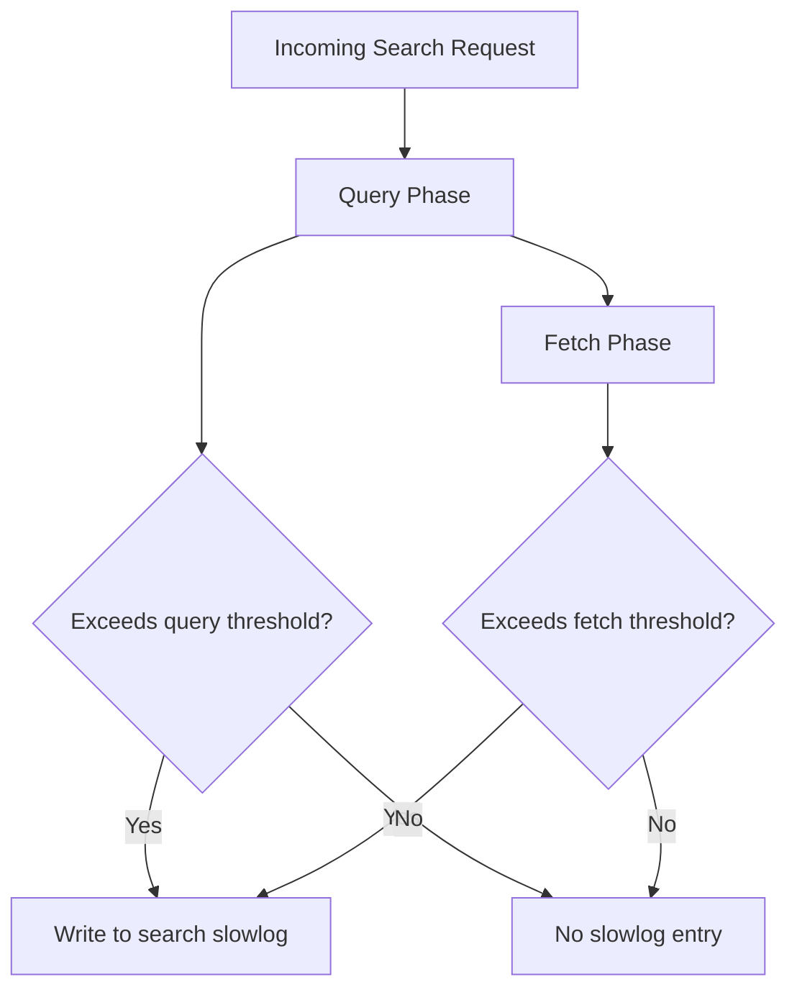

## Slow Log Configuration

### Overview

Slow logs record individual search and indexing operations that exceed configurable time thresholds, providing request-level detail that aggregate node/index stats cannot. Where `_nodes/stats` and `_stats` report cumulative counters and averages, slow logs capture the specific queries and index operations responsible for outlier latency, making them the primary tool for diagnosing *which* requests are slow rather than just *that* something is slow.

### Two Slow Log Types

Elasticsearch provides two independent slow log mechanisms, each covering a different phase of request handling:

- **Search slow log** — logs the query and fetch phases of search requests
- **Indexing slow log** — logs individual document index operations

Both are configured per index, either statically at index creation or dynamically via the update settings API, and both write to dedicated log files separate from the main Elasticsearch server log.

### Search Slow Log Settings

The search slow log has independent thresholds for the query phase and the fetch phase, each with four severity levels:



```
PUT /my-index/_settings
{
  "index.search.slowlog.threshold.query.warn": "10s",
  "index.search.slowlog.threshold.query.info": "5s",
  "index.search.slowlog.threshold.query.debug": "2s",
  "index.search.slowlog.threshold.query.trace": "500ms",
  "index.search.slowlog.threshold.fetch.warn": "1s",
  "index.search.slowlog.threshold.fetch.info": "800ms",
  "index.search.slowlog.threshold.fetch.debug": "500ms",
  "index.search.slowlog.threshold.fetch.trace": "200ms"
}
```

- The **query phase** covers the distributed search across shards to identify matching documents (scoring, filtering, aggregating).
- The **fetch phase** covers retrieving and assembling the actual `_source` documents for the matched hits.

[Inference] Fetch-phase thresholds are typically set lower than query-phase thresholds in practice, since fetch is normally a smaller and more predictable portion of total request time — a slow fetch phase often signals a distinct problem (e.g., large `_source` documents, `_source` disabled/enabled mismatches, or highlighting overhead) rather than the query complexity itself.

Only a single level needs to be crossed for a log entry to be written; setting a threshold to `-1` disables that specific level.

### Indexing Slow Log Settings

The indexing slow log uses a single threshold hierarchy (no separate query/fetch split, since indexing is a single-phase operation from the logging perspective):



```
PUT /my-index/_settings
{
  "index.indexing.slowlog.threshold.index.warn": "10s",
  "index.indexing.slowlog.threshold.index.info": "5s",
  "index.indexing.slowlog.threshold.index.debug": "2s",
  "index.indexing.slowlog.threshold.index.trace": "500ms"
}
```

Additional indexing slow log settings:

- `index.indexing.slowlog.source` — controls how many characters of the `_source` field are included in the log entry (default is commonly a truncated value; set to `false` to omit `_source` entirely, or `true` to log it in full)
- `index.indexing.slowlog.reformat` — controls whether the logged `_source` is written as a single line (`true`) or preserves original formatting (`false`)



```
PUT /my-index/_settings
{
  "index.indexing.slowlog.source": "1000"
}
```

### Threshold Levels Explained

**Key Points**

- `warn`, `info`, `debug`, and `trace` are severity levels, not cumulative buckets — a request exceeding the `trace` threshold does not automatically also log at `warn` unless it also exceeds the `warn` threshold.
- Each level maps to the standard logging severity of the same name, and the effective log level for the slow log logger determines which of the configured thresholds actually produce output.
- Setting a very low `trace` threshold without also raising the logger's effective level will not produce trace-level entries, since the logger itself must be configured to emit that severity.

### Log4j2 Logger Configuration

Slow log thresholds define *what* gets logged, but the logger's level (configured via `log4j2.properties` or the cluster logging settings) determines whether entries at a given severity are actually written. This can also be set dynamically via the cluster settings API:



```
PUT /_cluster/settings
{
  "transient": {
    "logger.index.search.slowlog": "trace",
    "logger.index.indexing.slowlog": "trace"
  }
}
```

[Behavior may vary depending on Elasticsearch version and whether transient cluster settings are supported in that version, since some versions have deprecated transient settings in favor of persistent-only configuration.]

### Log Output Location and Format

Slow logs are written to separate files from the main server log, typically named following a pattern such as:



```
<cluster_name>_index_search_slowlog.log
<cluster_name>_index_indexing_slowlog.log
```

A typical search slow log entry includes:

- Timestamp
- Index name and shard
- Took time (query or fetch)
- Query type/DSL representation
- Total hits
- Search type

**Example**



```
[2026-08-24T10:15:32,451][WARN][index.search.slowlog.query] [node-1] [my-index][3] took[12.3s], took_millis[12300], total_hits[45231], types[], stats[], search_type[QUERY_THEN_FETCH], total_shards[5], source[{"query":{"match":{"description":"laptop"}}}]
```

An indexing slow log entry follows a similar pattern but reports the document ID and routing information instead of query DSL:



```
[2026-08-24T10:16:01,102][WARN][index.indexing.slowlog.index] [node-1] [my-index][2] took[5.2s], took_millis[5200], type[_doc], id[abc123], routing[], source[{"field":"value"}]
```

### Setting Thresholds at Index Creation

Slow log thresholds can be defined in the index settings block during creation, so they apply from the first document indexed:



```
PUT /my-index
{
  "settings": {
    "index.search.slowlog.threshold.query.warn": "10s",
    "index.search.slowlog.threshold.fetch.warn": "1s",
    "index.indexing.slowlog.threshold.index.warn": "10s"
  }
}
```

### Applying Defaults via Index Templates

To avoid configuring slow log thresholds on every index individually, settings are commonly placed in an index template so they apply automatically to matching new indices:



```
PUT /_index_template/logs-template
{
  "index_patterns": ["logs-*"],
  "template": {
    "settings": {
      "index.search.slowlog.threshold.query.warn": "5s",
      "index.search.slowlog.threshold.fetch.warn": "1s",
      "index.indexing.slowlog.threshold.index.warn": "5s"
    }
  }
}
```

Templates apply only to indices created after the template exists; existing indices require an explicit settings update.

### Choosing Threshold Values

There is no universally correct threshold, since acceptable latency depends on the application's SLA and typical query complexity. A common practical approach:

1. Start with generous thresholds (e.g., `warn` at several seconds) to avoid flooding logs during initial rollout.
2. Observe the natural latency distribution for the index's actual query/indexing patterns using node and index stats.
3. Tighten thresholds incrementally toward the level at which a request is genuinely considered a problem for the application.

[Speculation] Overly aggressive low thresholds (e.g., `trace` in the tens of milliseconds on a high-QPS index) can generate substantial log volume and associated I/O overhead, since nearly every request may qualify — this cost should be weighed against the diagnostic value for that specific workload.

### Relationship to Node and Index Metrics

Slow logs complement the aggregate metrics from `_nodes/stats` and `_stats`: aggregate metrics reveal *that* average query time has risen or that thread pool queues are growing, while slow logs identify the specific queries responsible. A rising `search.query_time_in_millis` average combined with an increase in slow log entries citing a particular query shape (e.g., unbounded wildcard queries or deep pagination) points directly to a remediation target, whereas the aggregate metric alone only signals that a problem exists somewhere in the index's query mix.

===MERMAID_DIAGRAM===

flowchart TD

A[Incoming Search Request] --> B[Query Phase]

B --> C[Fetch Phase]

B --> D{Exceeds query threshold?}

C --> E{Exceeds fetch threshold?}

D -->|Yes| F[Write to search slowlog]

E -->|Yes| F

D -->|No| G[No slowlog entry]

E -->|No| G



### Common Pitfalls

- Setting thresholds without adjusting the corresponding logger level, resulting in no output despite configured thresholds
- Leaving `index.indexing.slowlog.source` at a large or unlimited value on high-volume indices, inflating log file size substantially
- Applying thresholds only to new indices via templates and forgetting to backfill settings onto existing indices
- Treating slow log presence alone as proof of a systemic problem, when a small number of entries may simply reflect legitimate occasional heavy queries (e.g., large date-range aggregations run intentionally)

**Next Steps**

- Circuit breaker statistics (`_nodes/stats/breaker`) for memory protection monitoring
- Hot/warm/cold tier metrics and ILM-driven index lifecycle monitoring
- Deprecation logging and its distinct configuration path
- Task management API (`_tasks`) for inspecting currently running long operations in real time
- Profiling API (`_search` with `"profile": true`) for deep per-query execution breakdown beyond what slow logs capture
- Alerting on slow log volume via Kibana Alerting or external log-based alerting