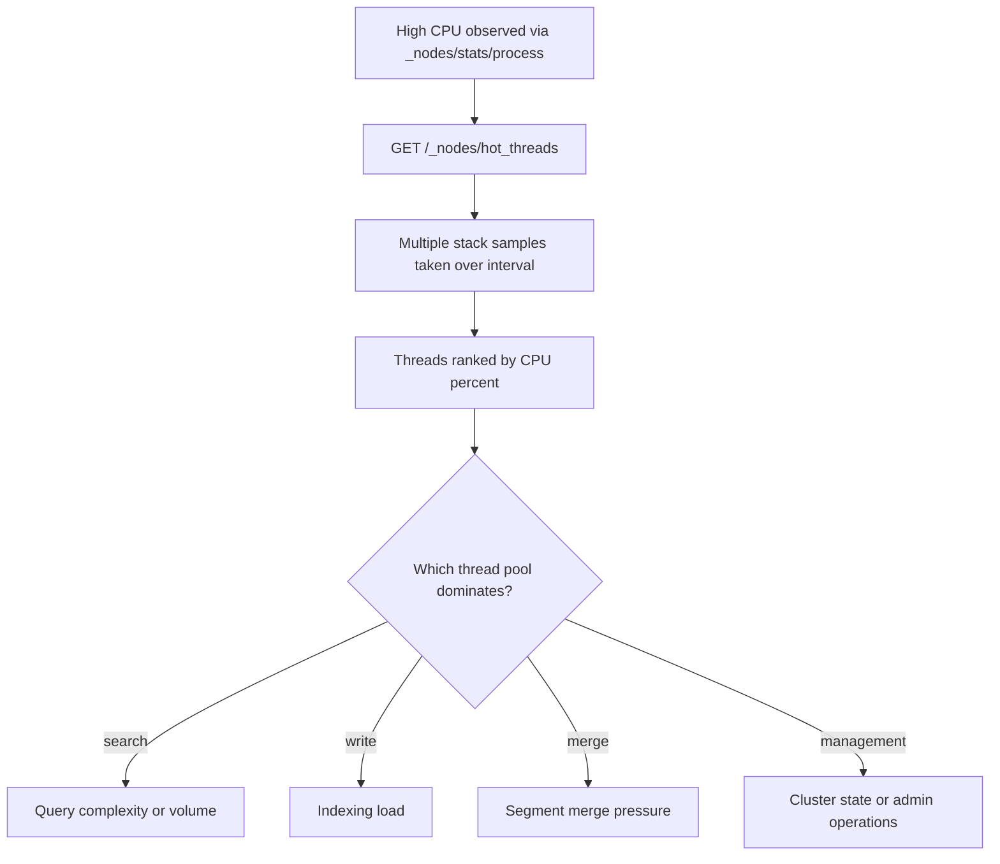

## Hot Threads API

### Overview

The hot threads API captures a snapshot of the busiest threads on one or more nodes, showing what each thread is actually executing at the moment of the request. Where the tasks API reveals *which operations* are running and thread pool stats reveal *how many* threads are active or queued, the hot threads API answers a different question: *what code path is consuming CPU right now*. This makes it the tool of choice when a node shows elevated CPU in `_nodes/stats/process` but the cause is not obvious from task or index metrics alone.

### Basic Usage



```
GET /_nodes/hot_threads
```

This samples all nodes in the cluster and returns a plain-text (not JSON) report of the busiest threads per node, ranked by CPU usage.

To target specific nodes:



```
GET /_nodes/nodeId1,nodeId2/hot_threads
```

### How Sampling Works

The API works by taking multiple stack trace samples of active threads over a short window and reporting which threads consumed the most CPU time during that window, along with a representative stack trace for each. This is fundamentally different from the tasks API, which reports task metadata rather than actual executing code, and from thread pool stats, which report counts rather than execution detail.

### Query Parameters

- `threads` — number of top threads to report per node (default is a small number; increasing it surfaces more threads but produces a longer report)
- `interval` — sampling interval between snapshots (default around 500ms)
- `snapshots` — number of samples to take (default around 10)
- `type` — the thread state to filter on: `cpu` (default), `wait`, or `block`
- `ignore_idle_threads` — whether to exclude threads considered idle (default `true`)



```
GET /_nodes/nodeId1/hot_threads?threads=5&interval=1s&snapshots=20&type=cpu
```

### Thread States: cpu, wait, block

**Key Points**

- `type=cpu` identifies threads actively consuming processor time — the default and most common choice for diagnosing high CPU load.
- `type=wait` identifies threads waiting on a monitor or condition, useful for spotting contention where threads are blocked waiting for a resource to become available.
- `type=block` identifies threads blocked attempting to acquire a lock currently held by another thread, useful for diagnosing lock contention specifically.

[Inference] Because `wait` and `block` states point toward concurrency and contention issues rather than raw computational load, they are generally more useful when a node appears sluggish or unresponsive without correspondingly high CPU usage, whereas `cpu` is more useful when CPU usage itself is the visible symptom.

### Example Output



```
::: {node-1}{abc123}
   Hot threads at 2026-08-24T11:02:15.221Z, interval=500ms, sampling_period=488ms:
   
   45.2% (226.1ms out of 500ms) cpu usage by thread 'elasticsearch[node-1][search][T#12]'
     10/10 snapshots sharing following 12 elements
       org.apache.lucene.search.Weight.scorer(Weight.java:37)
       org.apache.lucene.search.IndexSearcher.search(IndexSearcher.java:490)
       org.elasticsearch.search.query.QueryPhase.execute(QueryPhase.java:78)
       ...
```

Each entry shows:

- The percentage of the sampling window the thread was active
- The thread pool and thread number the thread belongs to (e.g., `[search][T#12]`, indicating this is search thread pool worker 12)
- A stack trace showing the exact method call chain, with the count of snapshots sharing that same trace out of the total taken — a high shared-snapshot count indicates the thread spent most of the sampling window in that same code path rather than moving between different operations

### Interpreting Thread Pool Names in Output

The thread name embedded in each hot threads entry (e.g., `[write]`, `[search]`, `[refresh]`, `[merge]`, `[management]`) directly corresponds to the thread pools visible in `_nodes/stats/thread_pool`. This allows a hot threads report to be cross-referenced against thread pool statistics: elevated `active` count on the `search` pool combined with hot threads output dominated by `[search]` thread entries confirms that search load is the source of CPU pressure, rather than merges, refreshes, or other background activity.

===MERMAID_DIAGRAM===

flowchart TD

A[High CPU observed via _nodes/stats/process] --> B[GET /_nodes/hot_threads]

B --> C[Multiple stack samples taken over interval]

C --> D[Threads ranked by CPU percent]

D --> E{Which thread pool dominates?}

E -->|search| F[Query complexity or volume]

E -->|write| G[Indexing load]

E -->|merge| H[Segment merge pressure]

E -->|management| I[Cluster state or admin operations]



### Common Diagnostic Patterns

- **Merge threads dominating** — repeated appearance of `[merge]` threads with high CPU share often points to heavy segment merge activity, which can be correlated against `merges.total_time_in_millis` from the index stats API.
- **Search threads stuck in the same stack trace across all snapshots** — a high shared-snapshot count on a `[search]` thread executing the same Lucene scoring code repeatedly suggests a genuinely expensive query (e.g., an unbounded wildcard, deep pagination, or a very large aggregation) rather than transient load.
- **GC-related threads** — CPU consumed by garbage collection activity is generally visible separately via JVM GC metrics (`_nodes/stats/jvm`) rather than as an application thread in hot threads output, since GC often runs on dedicated collector threads; correlating both sources helps distinguish GC-driven CPU usage from application-code CPU usage.

[Speculation] In practice, hot threads output is most actionable when captured at the moment a problem is actively occurring, since the snapshot only reflects the sampling window itself — a report taken after CPU has already returned to normal will not reproduce the condition being investigated.

### Repeated Sampling for Trend Confirmation

Because a single hot threads snapshot can reflect a transient spike, taking several snapshots a few seconds apart and comparing the dominant thread pool and stack trace across them helps distinguish a sustained bottleneck from momentary noise.



```
GET /_nodes/nodeId1/hot_threads?snapshots=10&interval=500ms
```

If the same stack trace and thread pool dominate across repeated calls, the load is more likely a persistent condition worth deeper investigation (e.g., query optimization, mapping changes, or capacity adjustment) rather than a brief burst.

### Common Pitfalls

- Interpreting a single snapshot as conclusive when CPU load is highly variable; repeated sampling gives a more reliable picture
- Overlooking that hot threads output is plain text, not JSON, which affects how it can be parsed or ingested by monitoring tooling compared to other stats APIs
- Using `type=cpu` exclusively when the actual symptom is unresponsiveness without high CPU, where `type=block` or `type=wait` would be more diagnostic
- Forgetting that `ignore_idle_threads=true` by default may hide threads that are technically active but classified as idle by the sampling logic, which can obscure certain contention patterns

**Next Steps**

- Circuit breaker statistics (`_nodes/stats/breaker`) for memory protection monitoring
- Profiling API (`_search` with `"profile": true`) for deep per-query execution breakdown
- JVM garbage collection tuning and heap sizing considerations
- Reindex API deep dive, including throttling and batch size tuning
- Cluster pending tasks API (`_cluster/pending_tasks`) for master-node-specific task queue visibility
- Deprecation logging and its distinct configuration path