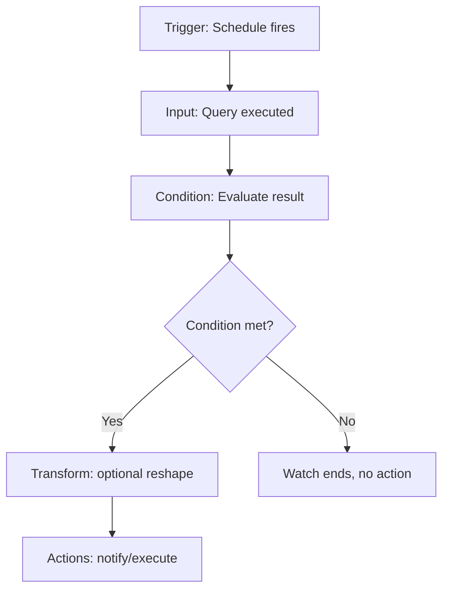

## Alerting with Watcher

### Overview

Watcher is Elasticsearch's built-in mechanism for defining conditional rules that periodically query data and trigger actions when specified conditions are met. Where Metricbeat and the stats APIs covered earlier make cluster and index metrics observable, Watcher closes the loop from observation to response: instead of a human periodically checking a dashboard, a watch runs on a schedule, evaluates a condition against the data, and automatically sends a notification or performs an action when that condition is satisfied.

### Anatomy of a Watch

Every watch is defined as a JSON document with five core components:

- **trigger** — when the watch runs (typically a schedule)
- **input** — what data the watch retrieves
- **condition** — the logic evaluated against that data to decide whether to act
- **actions** — what happens when the condition is met
- **transform** (optional) — reshapes input or action data before use

===MERMAID_DIAGRAM===

flowchart TD

A[Trigger: Schedule fires] --> B[Input: Query executed]

B --> C[Condition: Evaluate result]

C --> D{Condition met?}

D -->|Yes| E[Transform: optional reshape]

E --> F[Actions: notify/execute]

D -->|No| G[Watch ends, no action]



### Creating a Basic Watch

Watches are created via the `_watcher/watch` API:



```
PUT _watcher/watch/high_heap_usage
{
  "trigger": {
    "schedule": {
      "interval": "1m"
    }
  },
  "input": {
    "http": {
      "request": {
        "scheme": "https",
        "host": "localhost",
        "port": 9200,
        "path": "/_nodes/stats/jvm",
        "auth": {
          "basic": {
            "username": "watcher_user",
            "password": "${WATCHER_PASSWORD}"
          }
        }
      }
    }
  },
  "condition": {
    "script": {
      "source": "def nodes = ctx.payload.nodes; for (node in nodes.values()) { if (node.jvm.mem.heap_used_percent > 85) { return true; } } return false;"
    }
  },
  "actions": {
    "notify_slack": {
      "webhook": {
        "scheme": "https",
        "host": "hooks.slack.com",
        "port": 443,
        "method": "POST",
        "path": "/services/XXXX/YYYY/ZZZZ",
        "body": "{{ctx.payload}}"
      }
    }
  }
}
```

This watch directly queries the `_nodes/stats/jvm` endpoint discussed earlier and evaluates the same `heap_used_percent` field manually inspected in that section, but does so automatically every minute rather than on demand.

### Trigger Types

The most common trigger is a schedule, which supports several formats:

```json
"trigger": {
  "schedule": {
    "interval": "10m"
  }
}
```

```json
"trigger": {
  "schedule": {
    "cron": "0 0 8 * * ?"
  }
}
```

Cron expressions allow precise scheduling (e.g., daily at a specific time), while `interval` is simpler for fixed-frequency polling.

### Input Types

- **search** — the most common input, executing a query against one or more indices and making the response available to the condition
- **http** — makes an HTTP request, as shown above, useful for querying stats APIs directly or external endpoints
- **simple** — provides static data, primarily useful for testing
- **chain** — executes multiple inputs in sequence, with later inputs able to reference earlier results

A search input example, checking for a spike in slow log-adjacent indexing latency using the index stats fields covered earlier:

```json
"input": {
  "search": {
    "request": {
      "indices": ["my-index"],
      "body": {
        "query": {
          "range": {
            "@timestamp": {
              "gte": "now-5m"
            }
          }
        }
      }
    }
  }
}
```

### Condition Types

- **always** — the condition is always true, causing actions to fire on every trigger (used rarely, typically for heartbeat-style watches)
- **compare** — simple comparison against a single value in the payload
- **array_compare** — comparison against values within an array in the payload
- **script** — a Painless script for arbitrary logic, as used in the JVM heap example above

A `compare` condition example:

```json
"condition": {
  "compare": {
    "ctx.payload.hits.total": {
      "gt": 0
    }
  }
}
```

### Action Types

- **email** — sends an email notification, requiring an account configured in `xpack.notification.email`
- **webhook** — sends an HTTP request to an arbitrary endpoint, as used in the Slack example above
- **index** — writes a document to an Elasticsearch index, useful for recording alert history
- **logging** — writes to the Elasticsearch log
- **pagerduty** / **slack** — dedicated integrations for common alerting destinations

**Example**

An email action:

```json
"actions": {
  "send_email": {
    "email": {
      "to": "ops-team@example.com",
      "subject": "High heap usage detected: {{ctx.metadata.name}}",
      "body": "One or more nodes exceeded 85% heap usage at {{ctx.execution_time}}."
    }
  }
}
```

### Throttling

To prevent a persistent condition from generating repeated notifications on every trigger interval, actions support throttling:

```json
"actions": {
  "notify_slack": {
    "throttle_period": "30m",
    "webhook": { ... }
  }
}
```

With this configuration, once the action fires, it will not fire again for the same watch for 30 minutes even if the condition continues to be met on subsequent scheduled runs — relevant for a condition like sustained high heap usage, which may remain true across many consecutive trigger intervals.

### Watching Thread Pool Rejections

A watch combining a scripted condition against the thread pool metrics covered earlier:

```json
PUT _watcher/watch/write_pool_rejections
{
  "trigger": {
    "schedule": { "interval": "1m" }
  },
  "input": {
    "http": {
      "request": {
        "scheme": "https",
        "host": "localhost",
        "port": 9200,
        "path": "/_nodes/stats/thread_pool/write"
      }
    }
  },
  "condition": {
    "script": {
      "source": "def nodes = ctx.payload.nodes; for (node in nodes.values()) { if (node.thread_pool.write.rejected > 0) { return true; } } return false;"
    }
  },
  "actions": {
    "notify": {
      "webhook": { "scheme": "https", "host": "hooks.slack.com", "port": 443, "method": "POST", "path": "/services/XXXX", "body": "{{ctx.payload}}" }
    }
  }
}
```

This directly operationalizes the earlier observation that a nonzero and growing `rejected` count on the write pool signals overload, converting that manual diagnostic check into an automated alert.

### Managing Watches



```
GET _watcher/watch/high_heap_usage
```



```
DELETE _watcher/watch/high_heap_usage
```



```
PUT _watcher/watch/high_heap_usage/_deactivate
```



```
PUT _watcher/watch/high_heap_usage/_activate
```

Deactivating a watch pauses its execution without deleting its definition, useful during planned maintenance windows when a condition is expected to be legitimately triggered.

### Manually Executing a Watch

For testing without waiting for the schedule to trigger, a watch can be executed on demand:



```
POST _watcher/watch/high_heap_usage/_execute
```

This is useful for validating the condition logic and action configuration before relying on the schedule.

### Watch History

Watcher records execution history to a system-managed index, allowing past executions to be reviewed:



```
GET .watcher-history-*/_search
{
  "query": {
    "term": {
      "watch_id": "high_heap_usage"
    }
  }
}
```

Each history entry includes whether the condition was met, the input payload evaluated, and whether actions were executed or throttled — useful for confirming a watch is behaving as expected or diagnosing why an anticipated alert did not fire.

**Key Points**

- Watcher operates on a pull model: it queries data on a schedule rather than reacting to events as they happen, so detection latency is bounded by the trigger interval.
- Throttling prevents alert fatigue from a sustained condition but means a brief resolution-and-recurrence within the throttle window will not generate a second notification.
- Watch history provides an audit trail distinct from the slow log or hot threads output covered earlier — it records alerting behavior itself, not the underlying operational data being alerted on.

[Inference] Because each watch execution independently issues its own query or HTTP request against the cluster, a large number of frequently scheduled watches can itself contribute measurable load to the cluster being monitored, which is worth weighing against the desired alerting granularity.

### Common Pitfalls

- Setting trigger intervals shorter than meaningful for the metric being checked, adding unnecessary query load without improving actionable detection speed
- Omitting throttling on conditions expected to persist, leading to repeated redundant notifications
- Writing script conditions that reference payload fields inconsistent with the actual input response structure, causing silent failures or errors visible only in watch history
- Forgetting to deactivate relevant watches during planned maintenance, generating expected-but-unwanted alerts
- Relying solely on Watcher for critical alerting without validating watch history periodically to confirm alerts are actually firing as designed

**Next Steps**

- Circuit breaker statistics (`_nodes/stats/breaker`) for memory protection monitoring
- Kibana Alerting as a comparison/alternative to Watcher-based alerting
- Cluster pending tasks API (`_cluster/pending_tasks`) for master-node-specific task queue visibility
- ILM policy configuration for watch history index retention
- Email account configuration (`xpack.notification.email`) for production alert delivery
- Painless scripting fundamentals for more advanced watch conditions