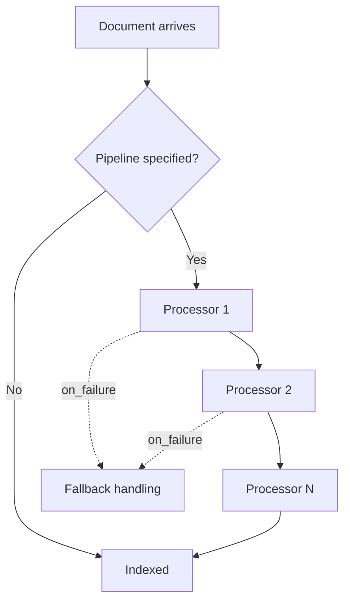

## Ingest Node Overview

### Overview

An ingest node is a node role that pre-processes documents through a defined pipeline before they are indexed, applying transformations such as field extraction, enrichment, or reformatting without requiring a separate processing layer like Logstash. This shifts focus from the monitoring and observability tools covered in previous topics to the data pipeline itself — ingest nodes sit upstream of indexing, shaping documents at write time, which in turn affects the indexing metrics, slow logs, and thread pool activity discussed earlier.

### Node Roles and the Ingest Role

Node roles are configured in `elasticsearch.yml`:

```yaml
node.roles: ["ingest"]
```

A node can combine the ingest role with others (data, master-eligible, etc.), or a cluster can designate dedicated ingest-only nodes for workloads with heavy pipeline processing, isolating that CPU cost from data or master nodes.

```yaml
node.roles: ["data", "ingest"]
```

[Inference] Dedicating separate ingest nodes is generally more beneficial on clusters with computationally expensive pipelines (e.g., heavy use of the `script` or `grok` processors) or high-volume ingestion, since combining the ingest role with data nodes means pipeline processing competes for the same CPU and thread pool resources as indexing and search.

### Pipelines and Processors

An ingest pipeline is a named sequence of processors, each performing one transformation step on a document as it passes through.



```
PUT _ingest/pipeline/my_pipeline
{
  "description": "Extracts fields and sets a timestamp",
  "processors": [
    {
      "set": {
        "field": "ingested_at",
        "value": "{{_ingest.timestamp}}"
      }
    },
    {
      "grok": {
        "field": "message",
        "patterns": ["%{IP:client_ip} %{WORD:method} %{URIPATHPARAM:request}"]
      }
    },
    {
      "remove": {
        "field": "message"
      }
    }
  ]
}
```

### Common Processor Types

- **set** — adds or overwrites a field with a specified value
- **remove** — deletes a field
- **rename** — renames a field
- **grok** — parses unstructured text into structured fields using pattern matching, commonly used for log lines
- **dissect** — a simpler, faster alternative to grok for text with a consistent delimiter-based structure
- **date** — parses a string field into a proper date type
- **convert** — changes a field's data type (e.g., string to integer)
- **script** — runs an arbitrary Painless script for custom logic
- **enrich** — looks up and appends additional data from a separate enrich index

### Using a Pipeline at Index Time

A pipeline is invoked by specifying it on the index or bulk request:



```
POST /my-index/_doc?pipeline=my_pipeline
{
  "message": "192.168.1.1 GET /api/status"
}
```

Alternatively, a **default pipeline** can be set on the index itself, applying automatically without needing to specify it per request:



```
PUT /my-index/_settings
{
  "index.default_pipeline": "my_pipeline"
}
```

### Testing Pipelines with Simulate

Before applying a pipeline to live traffic, the `_simulate` endpoint allows testing against sample documents without actually indexing anything:



```
POST _ingest/pipeline/my_pipeline/_simulate
{
  "docs": [
    {
      "_source": {
        "message": "192.168.1.1 GET /api/status"
      }
    }
  ]
}
```

The response shows the document as it would appear after each processor runs, including any errors encountered, making this the primary tool for iterating on pipeline logic safely.

### Error Handling in Pipelines

Individual processors can specify an `on_failure` block, allowing the pipeline to handle a processor-level error gracefully rather than failing the entire document:

```json
{
  "grok": {
    "field": "message",
    "patterns": ["%{IP:client_ip} %{WORD:method} %{URIPATHPARAM:request}"],
    "on_failure": [
      {
        "set": {
          "field": "grok_error",
          "value": "{{_ingest.on_failure_message}}"
        }
      }
    ]
  }
}
```

A pipeline-level `on_failure` can similarly be defined for the whole pipeline, providing a fallback path if any processor within it fails and no processor-specific handler catches it.

### Conditional Processors

Processors support an `if` condition, written as a Painless script, allowing a processor to run only when a specified condition is true:

```json
{
  "set": {
    "if": "ctx.status_code >= 500",
    "field": "alert_level",
    "value": "critical"
  }
}
```

### Monitoring Ingest Node Performance

Ingest pipeline statistics are exposed through the node stats API, extending the same `_nodes/stats` endpoint covered in the first topic of this series:



```
GET /_nodes/stats/ingest
```

This returns per-pipeline metrics including:

- `count` — number of documents processed by the pipeline
- `time_in_millis` — cumulative processing time
- `failed` — count of documents that failed processing

Per-processor breakdowns within a pipeline are also available, allowing identification of which specific processor is consuming the most time — directly analogous to how slow logs identify which specific query is responsible for elevated search latency.



```
GET /_nodes/stats/ingest?filter_path=nodes.*.ingest.pipelines
```

**Key Points**

- A slow or expensive pipeline processor adds latency to every indexing operation that passes through it, which surfaces as elevated `indexing.index_time_in_millis` in the index stats covered earlier, even though the underlying cause is pipeline processing rather than the indexing operation itself.
- The `ingest` thread pool (visible via `_nodes/stats/thread_pool`) handles pipeline execution specifically; saturation there is diagnosed the same way as the write or search pools discussed previously — via `queue` and `rejected` counts.
- Because pipelines run synchronously before indexing, a hanging or slow processor blocks the document from being indexed at all until the pipeline completes.

===MERMAID_DIAGRAM===

flowchart TD

A[Document arrives] --> B{Pipeline specified?}

B -->|No| F[Indexed directly]

B -->|Yes| C[Processor 1]

C --> D[Processor 2]

D --> E[Processor N]

E --> F[Indexed]

C -.on_failure.-> G[Fallback handling]

D -.on_failure.-> G



### Diagnosing Ingest-Related Slowdowns

Following the same layered diagnostic approach established across earlier topics: elevated indexing latency observed via `_stats/indexing` can be cross-referenced against `_nodes/stats/ingest` to check whether pipeline processing is a contributing factor, and hot threads output (from the earlier topic) captured during the slowdown would show `[ingest]` thread pool entries dominating if pipeline execution is the actual CPU cost, distinguishing that from Lucene-level indexing cost.

### Enrich Processor and Enrich Policies

The `enrich` processor is a notable special case, since it requires a separate enrich policy and enrich index to be created beforehand:



```
PUT /_enrich/policy/user_lookup
{
  "match": {
    "indices": "users",
    "match_field": "user_id",
    "enrich_fields": ["user_name", "user_tier"]
  }
}
```



```
POST /_enrich/policy/user_lookup/_execute
```

Once executed, the resulting enrich index can be referenced by an `enrich` processor within a pipeline to append matched fields from the lookup source to incoming documents.

### Common Pitfalls

- Placing computationally expensive pipelines (heavy grok patterns, scripts) on nodes that also serve as data nodes without capacity headroom, causing indexing throughput to degrade
- Failing to use `_simulate` before deploying a pipeline change, resulting in production ingestion errors that only surface via the `failed` counter or `on_failure` fallbacks
- Omitting `on_failure` handling entirely, causing documents to be rejected outright when a single processor encounters unexpected input
- Forgetting to re-execute an enrich policy after the source data changes, leaving the enrich index stale relative to the underlying lookup data
- Attributing elevated indexing latency solely to Lucene-level indexing cost without checking `_nodes/stats/ingest`, missing pipeline processing as the actual bottleneck

**Next Steps**

- Circuit breaker statistics (`_nodes/stats/breaker`) for memory protection monitoring
- Logstash as an alternative or complementary pre-indexing processing layer
- Reindex-with-pipeline patterns for applying a new pipeline to already-indexed data
- Painless scripting fundamentals for advanced `script` processor logic
- Cluster pending tasks API (`_cluster/pending_tasks`) for master-node-specific task queue visibility
- Index templates and default pipeline assignment at scale across multiple indices