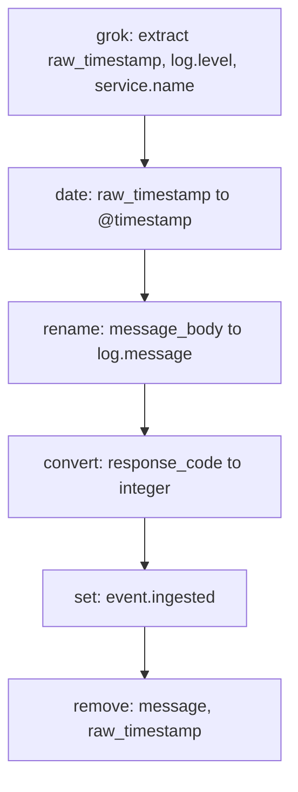

## Common Processors — set, rename, remove, grok, date, convert

### Overview

These six processors form the core toolkit for most ingest pipeline work: `set` and `remove` manage field presence and static values, `rename` restructures field names, `grok` and `date` parse unstructured or loosely structured text into typed fields, and `convert` enforces data types. Nearly every production pipeline uses some combination of these before reaching for more specialized processors.

### The `set` Processor

`set` assigns a value to a field, creating the field if it does not exist or overwriting it if it does.

```json
{
  "set": {
    "field": "status",
    "value": "processed"
  }
}
```

**Key Points**

- `value` can be a literal or a Mustache template referencing other fields, e.g. `"{{{user.name}}}"`
- `override: false` prevents overwriting a field that already has a non-null value — the field is only set if it is currently missing or null
- `ignore_empty_value: true` skips setting the field if the template resolves to an empty string, rather than writing an empty value
- Nested fields are addressed with dot notation, e.g. `"field": "metadata.received_at"`, and intermediate objects are created automatically if they do not exist
- `copy_from` can be used instead of `value` to copy another field's value verbatim, including its original type, without going through template string interpolation

```json
{
  "set": {
    "field": "original_status",
    "copy_from": "status"
  }
}
```

`copy_from` differs from templating with `value` in that it preserves the source field's type (integer stays integer, object stays object), whereas `{{{field}}}` templating always produces a string.

### The `remove` Processor

`remove` deletes one or more fields from the document.

```json
{
  "remove": {
    "field": ["raw_message", "temp_field"],
    "ignore_missing": true
  }
}
```

**Key Points**

- Accepts either a single field name or an array of field names
- `ignore_missing: true` prevents an exception if the field does not exist on a given document — without it, a missing field throws and triggers `on_failure` (or fails the request)
- Commonly used at the end of a pipeline to strip intermediate/raw fields once their data has been extracted into structured fields, keeping the final document clean

### The `rename` Processor

`rename` moves a field's value to a new field name, removing the old field name in the process.

```json
{
  "rename": {
    "field": "src_ip",
    "target_field": "source.ip"
  }
}
```

**Key Points**

- Fails if `target_field` already exists, unless `override: true` is set
- `ignore_missing: true` prevents failure when the source `field` does not exist
- Frequently used to align field names to a shared schema convention (for example, mapping arbitrary log field names onto Elastic Common Schema field names like `source.ip`, `user.name`, `http.response.status_code`)

### The `convert` Processor

`convert` casts a field's value to a specified type.

```json
{
  "convert": {
    "field": "response_code",
    "type": "integer"
  }
}
```

**Key Points**

- Supported `type` values: `integer`, `long`, `float`, `double`, `boolean`, `string`, `ip`, and `auto`
- `auto` attempts to infer and convert to the most appropriate type based on the string's content, falling back to leaving the value as a string if no numeric or boolean form matches
- Throws an exception if the value cannot be converted to the requested type (for example, converting `"not-a-number"` to `integer`), which is a common source of pipeline failures on inconsistent input — `ignore_failure: true` or a fallback via `on_failure` is often paired with `convert` on fields of uncertain quality
- `target_field` can be set to write the converted value to a different field, leaving the original untouched

```json
{
  "convert": {
    "field": "is_active",
    "type": "boolean",
    "ignore_missing": true
  }
}
```

[Unverified] The exact set of string literals accepted for `boolean` conversion (e.g. whether values like `"yes"`/`"no"` are accepted alongside `"true"`/`"false"`) is version-dependent and worth confirming against the target cluster's documentation before relying on it for non-standard boolean representations.

### The `date` Processor

`date` parses a string field into a standardized date/time value, typically writing to `@timestamp`.

```json
{
  "date": {
    "field": "log_timestamp",
    "target_field": "@timestamp",
    "formats": ["ISO8601", "yyyy-MM-dd HH:mm:ss"],
    "timezone": "UTC"
  }
}
```

**Key Points**

- `formats` accepts an array and the processor tries each pattern in order until one matches, allowing a single processor to handle multiple possible input formats
- Format strings follow either the Java `DateTimeFormatter` pattern syntax or one of the built-in named formats such as `ISO8601`, `UNIX` (seconds since epoch), or `UNIX_MS` (milliseconds since epoch)
- `timezone` and `locale` can be set statically or as Mustache templates (e.g. `"{{{event.timezone}}}"`) when the source timezone varies per document
- If none of the provided formats match, the processor throws — multiple candidate formats should be listed for input with known variability, or `on_failure` should route the failure
- The default `target_field` is `@timestamp`, which aligns with Elastic Common Schema and most prebuilt dashboards' expectations

### The `grok` Processor

`grok` matches a text field against one or more named patterns and extracts capture groups into new fields. It is built on top of regular expressions but uses a library of reusable named patterns (many borrowed from Logstash's grok pattern set) to keep pattern definitions readable.

```json
{
  "grok": {
    "field": "message",
    "patterns": [
      "%{TIMESTAMP_ISO8601:log_timestamp} %{LOGLEVEL:log_level} \\[%{DATA:thread}\\] %{GREEDYDATA:log_message}"
    ]
  }
}
```

**Key Points**

- Pattern syntax is `%{PATTERN_NAME:field_name}`, where `PATTERN_NAME` references a built-in or custom named regex and `field_name` is the destination field for the captured text
- `patterns` accepts an array; grok tries each in order and uses the first one that matches, which allows one processor to handle multiple possible log line formats
- Built-in patterns include `TIMESTAMP_ISO8601`, `LOGLEVEL`, `IP`, `NUMBER`, `WORD`, `DATA` (non-greedy match), and `GREEDYDATA` (greedy match to end of line), among many others
- Custom patterns can be defined inline via `pattern_definitions`, or registered cluster-wide by placing a custom patterns file on ingest nodes [Unverified — the exact mechanism and file location for cluster-wide custom pattern registration can vary by deployment type (self-managed vs. Elastic Cloud) and version, so this should be confirmed against current documentation for the target environment]
- `trace_match: true` adds a `_ingest._grok_match_index` field indicating which pattern in the array matched, useful for debugging pipelines with multiple candidate patterns
- If no pattern in the list matches, the processor throws by default; `on_failure` or a fallback pattern like `%{GREEDYDATA:unparsed}` is commonly used to avoid rejecting documents that do not match the expected format
- Grok is regex-based and therefore comparatively expensive on high-volume, complex patterns; `dissect` is a lighter-weight alternative when the log format has fixed delimiters and no need for regex flexibility

### Combining These Processors — Realistic Log-Parsing Pipeline

**Example**

```json
PUT _ingest/pipeline/app-log-pipeline
{
  "description": "Parses application log lines into ECS-aligned fields",
  "processors": [
    {
      "grok": {
        "field": "message",
        "patterns": [
          "%{TIMESTAMP_ISO8601:raw_timestamp} %{LOGLEVEL:log.level} \\[%{DATA:service.name}\\] %{GREEDYDATA:message_body}"
        ]
      }
    },
    {
      "date": {
        "field": "raw_timestamp",
        "target_field": "@timestamp",
        "formats": ["ISO8601"]
      }
    },
    {
      "rename": {
        "field": "message_body",
        "target_field": "log.message"
      }
    },
    {
      "convert": {
        "field": "response_code",
        "type": "integer",
        "ignore_missing": true
      }
    },
    {
      "set": {
        "field": "event.ingested",
        "value": "{{{_ingest.timestamp}}}"
      }
    },
    {
      "remove": {
        "field": ["message", "raw_timestamp"],
        "ignore_missing": true
      }
    }
  ],
  "on_failure": [
    {
      "set": {
        "field": "error.message",
        "value": "{{{_ingest.on_failure_message}}}"
      }
    },
    {
      "set": {
        "field": "error.processor",
        "value": "{{{_ingest.on_failure_processor_type}}}"
      }
    }
  ]
}
```

**Output**

Given an input document `{ "message": "2026-08-24T09:30:00Z INFO [auth-service] User login succeeded", "response_code": "200" }`, the processed result:

```json
{
  "@timestamp": "2026-08-24T09:30:00.000Z",
  "log": {
    "level": "INFO",
    "message": "User login succeeded"
  },
  "service": {
    "name": "auth-service"
  },
  "response_code": 200,
  "event": {
    "ingested": "2026-08-24T09:30:00.512Z"
  }
}
```

### Processor Ordering Considerations



**Key Points**

- `grok` typically runs first, since it produces the fields that later processors (`date`, `convert`, `rename`) depend on
- `remove` for raw/intermediate fields runs last, after every processor that still needs to read those fields has already run
- Ordering mistakes — such as `remove`-ing a field before `convert` or `date` has consumed it — are a common source of pipeline bugs, and are best caught via `_simulate?verbose`, which shows the exact document state after each processor

### Conclusion

`set`, `remove`, `rename`, `convert`, `date`, and `grok` cover the large majority of field-level transformation needs in ingest pipelines: establishing or clearing values, restructuring field names to match a target schema, enforcing types, normalizing timestamps, and extracting structure from free text. Because several of these processors depend on fields produced by earlier ones (most notably `grok` feeding into `date` and `convert`), processor order within the pipeline array is as important as the individual processor configurations themselves, and is best validated with the `_simulate` API before deployment.

### Next Steps

- `dissect` processor as a non-regex alternative to `grok` for fixed-delimiter formats
- `json` and `kv` processors for parsing embedded JSON or key-value pair strings
- `split` and `foreach` for handling array-valued or repeated fields
- Custom grok pattern definitions and reusable pattern libraries
- `on_failure` design patterns for production-grade error handling
- Elastic Common Schema (ECS) field naming conventions for pipeline output alignment