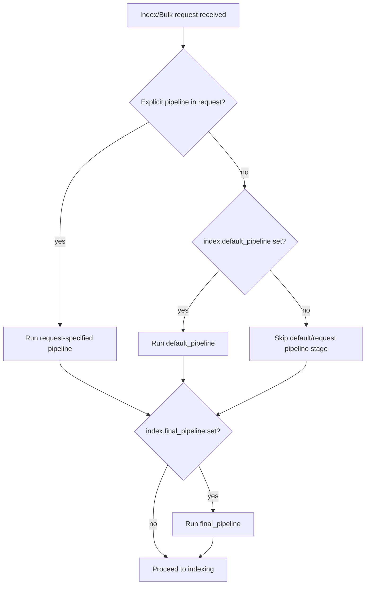

## Pipeline on Index and Bulk Requests

### Overview

Ingest pipelines only run when a document write is explicitly (or implicitly, via a default pipeline) associated with a pipeline. This applies identically across the single-document index API and the bulk API, though the bulk API offers additional per-operation flexibility since a single bulk request can route different documents through different pipelines. Understanding exactly when and how a pipeline attaches to a write request is necessary for predictable ingestion behavior, particularly when combining request-level, index-level, and final pipelines.

### Specifying a Pipeline on a Single Index Request

The `pipeline` query parameter attaches a pipeline to a single-document write.

```json
PUT my-index/_doc/1?pipeline=my-pipeline
{
  "message": "2026-08-24T09:30:00Z ERROR Connection timeout"
}
```

This also works with the `POST my-index/_doc` form (auto-generated ID):

```json
POST my-index/_doc?pipeline=my-pipeline
{
  "message": "2026-08-24T09:30:00Z ERROR Connection timeout"
}
```

**Key Points**

- The `pipeline` parameter is a query-string parameter, not part of the request body
- If the named pipeline does not exist, the request fails with an error rather than being silently ignored
- The pipeline runs before the document is handed off for indexing; if a processor throws and there is no matching `on_failure` handling, the entire index request fails and no document is written

### Specifying a Pipeline on Bulk Requests

The bulk API supports two ways of associating a pipeline: a request-level default via the `pipeline` query parameter, and a per-action override within the action metadata line of the NDJSON payload.

**Request-level pipeline (applies to all actions in the bulk body):**

```json
POST _bulk?pipeline=my-pipeline
{ "index": { "_index": "my-index" } }
{ "message": "2026-08-24T09:30:00Z ERROR Connection timeout" }
{ "index": { "_index": "my-index" } }
{ "message": "2026-08-24T09:30:05Z INFO Health check OK" }
```

**Per-action pipeline (overrides the request-level default for that specific action):**

```json
POST _bulk
{ "index": { "_index": "my-index", "pipeline": "error-pipeline" } }
{ "message": "2026-08-24T09:30:00Z ERROR Connection timeout" }
{ "index": { "_index": "my-index", "pipeline": "info-pipeline" } }
{ "message": "2026-08-24T09:30:05Z INFO Health check OK" }
{ "index": { "_index": "my-index" } }
{ "message": "2026-08-24T09:30:10Z DEBUG Cache refreshed" }
```

**Key Points**

- A `pipeline` field inside an action's metadata line takes precedence over a request-level `?pipeline=` parameter for that specific action
- Actions without an explicit `pipeline` in their metadata fall back to the request-level `?pipeline=` parameter if one is set, and then to the index's `default_pipeline` setting if neither is set
- This allows a single bulk request to mix documents destined for different pipelines, which is common when bulk-loading heterogeneous log sources in one batch
- `delete` actions within a bulk request are unaffected by `pipeline`, since pipelines only process documents being indexed, not removed

### Precedence: Request Pipeline vs. Default Pipeline vs. Final Pipeline

Multiple pipeline sources can apply to the same write, and Elasticsearch resolves them in a defined order.



**Key Points**

- An explicit `pipeline` parameter (request-level or per-action) always takes precedence over `index.default_pipeline` — the default is only used when no pipeline is explicitly named
- `index.final_pipeline` runs unconditionally after whichever pipeline was selected (explicit or default), and cannot be skipped by specifying a different request-level pipeline
- If a request explicitly sets `pipeline=_none`, this suppresses the `default_pipeline` for that request while `final_pipeline` still applies — a mechanism for opting out of default processing on specific writes
- This layered resolution allows an index to guarantee certain fields (like `event.ingested`) are always set via `final_pipeline`, regardless of what pipeline (if any) individual writers specify

### Setting a Default Pipeline on an Index

```json
PUT my-index/_settings
{
  "index.default_pipeline": "my-pipeline"
}
```

Once set, every write to `my-index` runs through `my-pipeline` automatically unless the request explicitly overrides it with a different `pipeline` parameter or `pipeline=_none`.

**Example — opting out of the default pipeline for a specific write**

```json
PUT my-index/_doc/1?pipeline=_none
{
  "message": "raw, unprocessed document"
}
```

### Setting a Final Pipeline on an Index

```json
PUT my-index/_settings
{
  "index.final_pipeline": "always-timestamp-pipeline"
}
```

`final_pipeline` is commonly used to enforce invariants that must hold for every document regardless of which (if any) other pipeline processed it — for example, always stamping `event.ingested`, always validating a required field exists, or always applying a `reroute` decision as the last step before indexing.

### Pipelines with `_bulk` and Data Streams

When writing to a data stream via `_bulk`, the action type must be `create` (not `index`), but pipeline resolution behaves the same way — request-level, per-action, `default_pipeline`, and `final_pipeline` all apply identically.

```json
POST _bulk
{ "create": { "_index": "logs-app-default" } }
{ "@timestamp": "2026-08-24T09:30:00Z", "message": "ERROR Connection timeout" }
```

**Key Points**

- Data streams commonly rely on `index.default_pipeline` or `final_pipeline` configured on the backing index template, rather than requiring every write call to specify `?pipeline=` explicitly
- The `reroute` processor is frequently placed in a data stream's default or final pipeline to redirect documents into per-service or per-dataset backing streams based on field values, without the client needing to know the target stream name in advance

### Simulating Bulk-Style Pipeline Behavior

While `_simulate` operates on a single named or inline pipeline against a list of documents, testing how a bulk request with mixed per-action pipelines will behave requires simulating each distinct pipeline separately against its corresponding subset of sample documents, since `_simulate` does not parse a full bulk NDJSON payload with per-action pipeline overrides.

```json
POST _ingest/pipeline/error-pipeline/_simulate
{
  "docs": [
    { "_source": { "message": "2026-08-24T09:30:00Z ERROR Connection timeout" } }
  ]
}
```

```json
POST _ingest/pipeline/info-pipeline/_simulate
{
  "docs": [
    { "_source": { "message": "2026-08-24T09:30:05Z INFO Health check OK" } }
  ]
}
```

### Failure Behavior in Bulk Requests

**Key Points**

- Pipeline processor failures are evaluated per action within a bulk request — one document failing pipeline processing (without a matching `on_failure` handler) does not abort the entire bulk request; the bulk response reports an error for that specific item while other items in the same bulk body are still processed and indexed
- This item-level isolation makes bulk ingestion resilient to individual malformed documents, but it also means a bulk response must be inspected for per-item `"error"` entries rather than assuming success from an overall HTTP 200 status — a bulk request can return 200 while containing individual item failures
- `on_failure` at the pipeline level is the mechanism for converting a would-be item failure into a successfully indexed document carrying error metadata instead, which is often preferable to letting the item fail outright in high-volume bulk loads

**Example — inspecting a bulk response for per-item failures**

```json
{
  "took": 12,
  "errors": true,
  "items": [
    {
      "index": {
        "_index": "my-index",
        "_id": "1",
        "status": 201
      }
    },
    {
      "index": {
        "_index": "my-index",
        "_id": "2",
        "status": 400,
        "error": {
          "type": "illegal_argument_exception",
          "reason": "unable to convert [not-a-number] to type [integer]"
        }
      }
    }
  ]
}
```

The top-level `"errors": true` flag signals that at least one item in the bulk request failed, and each item's own `"status"` and optional `"error"` object must be checked to identify which ones.

### Conclusion

Pipeline association on index and bulk requests follows a consistent resolution order: an explicit per-action or request-level `pipeline` parameter takes precedence over `index.default_pipeline`, and `index.final_pipeline` always runs last regardless of which earlier pipeline (if any) was used. The bulk API's per-action `pipeline` override enables routing heterogeneous documents through different pipelines within a single request, which is common in real-world log and event ingestion. Because pipeline failures are evaluated per item in bulk requests, response bodies must be inspected for item-level errors rather than relying solely on the overall HTTP status, and `on_failure` handling is the primary mechanism for converting processing failures into successfully indexed, error-annotated documents instead of outright rejections.

### Next Steps

- `reroute` processor and its role in data stream default/final pipelines
- Bulk API error handling and retry strategies for `errors: true` responses
- Index templates and configuring `default_pipeline`/`final_pipeline` at the template level for data streams
- `on_failure` design patterns for production pipelines
- Reindexing with a destination pipeline via `_reindex`
- Ingest node scaling and `_nodes/stats/ingest` monitoring under bulk load