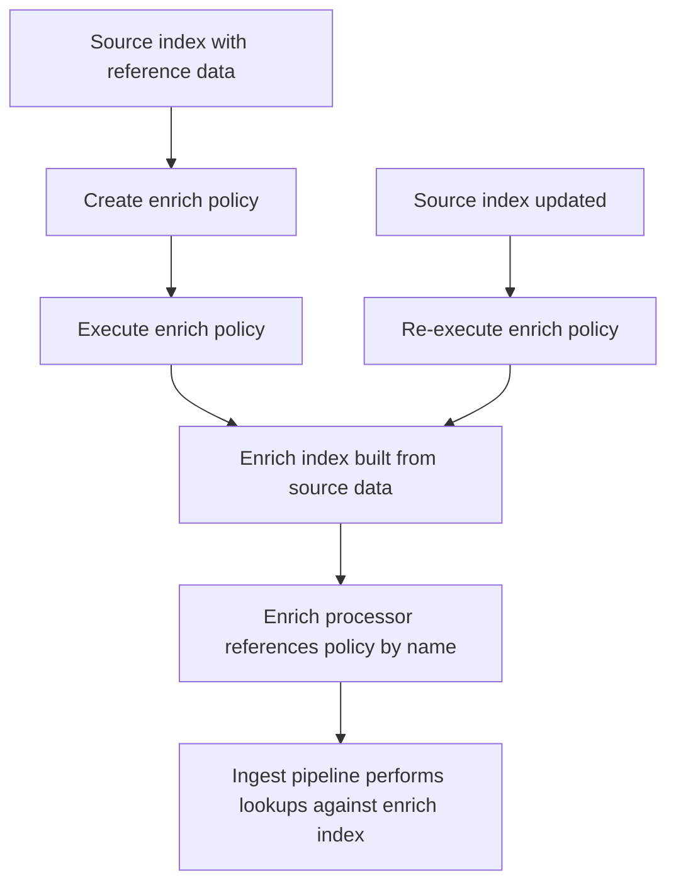

## Enrich Processor and Enrich Policies

### Overview

The enrich processor adds data to incoming documents by looking up matching values from a separate, pre-indexed source dataset — commonly used for augmenting documents with reference data such as mapping an IP address to geolocation/ASN details, a product SKU to catalog metadata, or a user ID to profile attributes. Unlike a simple `set` with a static value, enrichment performs a lookup against real, potentially large reference data maintained independently of the ingest pipeline itself. This is implemented through two cooperating components: an **enrich policy**, which defines what data to index and how it should be matched, and the **enrich processor**, which performs the lookup during ingestion using the policy's precomputed index.

### Why Enrichment Differs from Other Processors

**Key Points**

- Most processors (`set`, `rename`, `convert`, `grok`) operate purely on data already present within the document being processed
- The enrich processor instead performs a lookup against an external, pre-built index — the enrich index — created from a separate source index via an enrich policy
- This lookup happens at ingest time on ingest nodes, using data cached locally from the enrich index, rather than requiring a live cross-index query at write time
- Because the reference data is precomputed into a specialized enrich index ahead of time, lookups are fast, but this also means the reference data is only as current as the last time the enrich policy was executed — it does not automatically stay in sync with ongoing updates to the source index

### The Enrich Policy Lifecycle



**Key Points**

- An enrich policy does not perform lookups directly — it is a definition that, when executed, builds a dedicated, optimized enrich index from the source index
- The enrich processor references the *policy* by name, but internally reads from the enrich index that the policy execution produced
- Updates to the source index are not reflected in enrichment lookups until the policy is explicitly re-executed, which rebuilds the enrich index from the source index's current state

### Enrich Policy Types

Elasticsearch supports three enrich policy types, differing in how the match field is compared:

| Policy Type | Match Behavior |
| --- | --- |
| `match` | Exact term match between the incoming field value and the policy's match field |
| `geo_match` | Geospatial match — the incoming geo point falls within a geo_shape in the source data |
| `range` | The incoming value falls within a numeric or date range defined in the source data |

### Creating an Enrich Policy

**Example — `match` policy for looking up user metadata by user ID**

First, a source index must exist containing the reference data:

```json
PUT users-reference
{
  "mappings": {
    "properties": {
      "user_id": { "type": "keyword" },
      "department": { "type": "keyword" },
      "region": { "type": "keyword" },
      "manager": { "type": "keyword" }
    }
  }
}
```

Then the policy is defined, specifying the source index, the field to match on, and the fields to bring into the enriched document:

```json
PUT _enrich/policy/user-lookup-policy
{
  "match": {
    "indices": "users-reference",
    "match_field": "user_id",
    "enrich_fields": ["department", "region", "manager"]
  }
}
```

**Key Points**

- `match_field` is the field in the *source* index that incoming documents will be matched against
- `enrich_fields` lists which fields from matching source documents get copied into the enriched document — fields not listed are not available to the enrich processor even if present in the source index
- `indices` can reference multiple source indices (as an array) if reference data is split across them, as long as they share a consistent `match_field`

### Executing the Policy

Defining a policy does not build the enrich index — it must be executed explicitly:

```json
POST _enrich/policy/user-lookup-policy/_execute
```

**Key Points**

- Execution reads the current state of the source index and builds a new, internally managed enrich index — this is a synchronous operation by default and can take time proportional to the source index's size
- The resulting enrich index is named automatically (following an internal `.enrich-*` naming convention) and is managed by Elasticsearch; it is not intended to be queried or modified directly
- Re-executing the policy after the source index changes replaces the enrich index with a rebuilt version reflecting the new data — there is no incremental update mechanism, so the entire source index is reprocessed on each execution [Unverified — whether Elasticsearch performs any internal optimization to avoid a full rebuild on unchanged data may vary by version, and should be confirmed against current documentation if execution cost on very large source indices becomes a concern]

### The Enrich Processor

Once the policy has been executed at least once, the enrich processor can be used in any ingest pipeline:

```json
{
  "enrich": {
    "policy_name": "user-lookup-policy",
    "field": "user_id",
    "target_field": "user_info",
    "max_matches": 1
  }
}
```

**Key Points**

- `field` is the field on the *incoming* document whose value is used to perform the lookup against the enrich index
- `target_field` is where the matched enrich data is written — since `enrich_fields` can include multiple fields, `target_field` typically receives an object (or array of objects, if `max_matches` > 1) containing those fields
- `max_matches` controls how many matching source documents are returned; the default is `1`, which returns a single object; setting it higher returns an array of matching objects, useful when the match field is not guaranteed unique in the source data
- If no match is found, `target_field` is not set on the document (the enrich processor does not throw for a non-match) — a subsequent `if` condition checking for `target_field`'s absence can be used to detect and act on non-matches

### Full Pipeline Example

**Example — enriching log events with department metadata**

```json
PUT _ingest/pipeline/enrich-user-events
{
  "description": "Adds department and region metadata based on user_id",
  "processors": [
    {
      "enrich": {
        "policy_name": "user-lookup-policy",
        "field": "user_id",
        "target_field": "user_info",
        "max_matches": 1
      }
    },
    {
      "set": {
        "if": "ctx.user_info == null",
        "field": "enrichment_status",
        "value": "no_match"
      }
    }
  ]
}
```

**Output**

Given input `{ "user_id": "u-4471", "action": "login" }`, assuming `u-4471` exists in `users-reference`:

```json
{
  "user_id": "u-4471",
  "action": "login",
  "user_info": {
    "department": "Finance",
    "region": "APAC",
    "manager": "j.santos"
  }
}
```

### `geo_match` Enrich Policies

**Example — mapping coordinates to a named territory**

```json
PUT _enrich/policy/territory-lookup
{
  "geo_match": {
    "indices": "territory-boundaries",
    "match_field": "boundary",
    "enrich_fields": ["territory_name", "sales_region"]
  }
}
```

```json
{
  "enrich": {
    "policy_name": "territory-lookup",
    "field": "location",
    "target_field": "territory"
  }
}
```

**Key Points**

- The source index's `match_field` must be mapped as `geo_shape`, containing polygon boundaries to match against
- The incoming document's `field` must contain a `geo_point`, and the enrich processor determines which (if any) polygon in the source data contains that point
- Commonly used for territory assignment, delivery zone lookup, or store-locator style enrichment based on geographic containment rather than exact value matching

### `range` Enrich Policies

**Example — mapping an IP address to an ASN block, or a numeric value to a tier**

```json
PUT _enrich/policy/ip-range-lookup
{
  "range": {
    "indices": "ip-ranges-reference",
    "match_field": "network_range",
    "enrich_fields": ["asn", "isp_name"]
  }
}
```

**Key Points**

- The source index's `match_field` must be mapped as a `range` type (`ip_range`, `integer_range`, `date_range`, etc.)
- The enrich processor matches the incoming field's scalar value against these ranges and returns the enrich fields from whichever range contains it
- Commonly used for IP-to-ASN or IP-to-geolocation-block mapping, and for bucketing numeric values (such as age or score) into predefined named tiers maintained in reference data rather than hardcoded in pipeline logic

### Managing Enrich Policies

```json
GET _enrich/policy/user-lookup-policy
```

```json
GET _enrich/policy
```

```json
DELETE _enrich/policy/user-lookup-policy
```

**Key Points**

- A policy cannot be deleted while it is still referenced by an existing pipeline's enrich processor — the referencing pipeline must be updated or removed first
- Updating a policy's definition (match field, enrich fields, source indices) requires deleting and recreating it, since enrich policies are immutable once created; only re-*executing* an existing policy (rebuilding its enrich index from current source data) is supported without deletion

### Testing Enrichment with `_simulate`

```json
POST _ingest/pipeline/enrich-user-events/_simulate
{
  "docs": [
    { "_source": { "user_id": "u-4471", "action": "login" } },
    { "_source": { "user_id": "u-9999-unknown", "action": "login" } }
  ]
}
```

This exercises both the matched and unmatched cases in one call, confirming that `user_info` is populated for the known `user_id` and that `enrichment_status: "no_match"` is set (via the `if` guard) for the unknown one, without the pipeline throwing in either case.

### Enrich Policy Refresh Strategy


**Key Points**

- There is no built-in automatic scheduling for policy execution — re-execution must be triggered externally (a scheduled task, a script, or a manual call) whenever the source reference data changes meaningfully
- [Inference] For reference data that changes frequently (hourly or more often), the operational cost of repeated full policy executions should be weighed against how time-sensitive the enrichment accuracy needs to be — reference data that changes rarely (org charts, static geographic boundaries) is a better fit for this model than rapidly changing data
- Because the enrich index swap happens atomically after a successful policy execution, in-flight ingestion using the enrich processor is not disrupted during a policy re-execution — it continues using the prior enrich index until the new one is ready

### Conclusion

The enrich processor and enrich policy together provide a mechanism for joining external reference data into documents at ingest time, supporting exact-match, geospatial-containment, and range-containment lookup semantics through the `match`, `geo_match`, and `range` policy types respectively. Because enrichment relies on a precomputed enrich index rather than a live join, policy execution is a distinct, explicit step that must be repeated whenever the underlying source reference data changes — there is no automatic synchronization. This trade-off — fast, cached lookups at the cost of eventual rather than real-time consistency with the source data — is central to designing an effective enrichment strategy, particularly around how frequently a given policy needs to be re-executed relative to how often its source data actually changes.

### Next Steps

- `geoip` processor as a specialized, built-in alternative to custom IP-based `range` enrichment
- Scheduling automated enrich policy re-execution (external orchestration approaches)
- Enrich index sizing and its relationship to source index size and `max_matches`
- Combining `enrich` with `foreach` for enriching array-valued fields
- Monitoring enrich processor performance and cache behavior via `_nodes/stats/ingest`
- Designing fallback logic for unmatched enrichment lookups in production pipelines