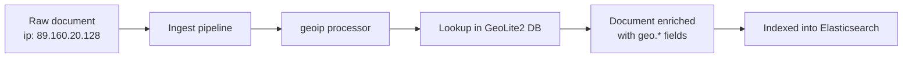

## GeoIP Processor

The `geoip` processor enriches documents by looking up an IP address against a local copy of the MaxMind GeoLite2 (or a commercial MaxMind) database and adding geographic and network data — country, city, location coordinates, ASN, and similar fields — to the ingested document. It runs entirely inside the ingest node; no external network call is made per-document, since the database is downloaded and stored locally.

### How It Fits Into an Ingest Pipeline

A `geoip` processor is one step in an ingest pipeline. The pipeline is attached to an index (via an index template's `index.default_pipeline` or `index.final_pipeline` setting, or specified per-request), and every document passing through that pipeline is checked against the processor's configuration.



### Basic Syntax

```json
PUT _ingest/pipeline/geoip_pipeline
{
  "description": "Add geographic info from client IP",
  "processors": [
    {
      "geoip": {
        "field": "client.ip",
        "target_field": "client.geo"
      }
    }
  ]
}
```

- `field` — the field in the document containing the IP address to look up. Required.
- `target_field` — where the resulting geo object is written. Defaults to `geoip` if not specified.

### Testing the Pipeline

The `_simulate` endpoint lets you verify processor behavior without indexing real documents.

```json
POST _ingest/pipeline/geoip_pipeline/_simulate
{
  "docs": [
    {
      "_source": {
        "client": {
          "ip": "89.160.20.128"
        }
      }
    }
  ]
}
```

**Output**

```json
{
  "docs": [
    {
      "doc": {
        "_source": {
          "client": {
            "ip": "89.160.20.128",
            "geo": {
              "continent_name": "Europe",
              "country_iso_code": "SE",
              "country_name": "Sweden",
              "city_name": "Linköping",
              "region_iso_code": "SE-E",
              "region_name": "Östergötland County",
              "location": { "lat": 58.4167, "lon": 15.6167 }
            }
          }
        },
        "_ingest": {
          "timestamp": "2026-08-24T10:15:32.101Z"
        }
      }
    }
  ]
}
```

Exact field names and values depend on the database edition in use and the IP's entry in it. [Unverified] — city-level fields will not be present for IPs that only resolve to country-level accuracy in the database.

### Default Databases

Elasticsearch ships with default GeoLite2 databases bundled into the `geoip` module:

- **GeoLite2-City.mmdb** — country, region, city, location, timezone.
- **GeoLite2-Country.mmdb** — country-level only.
- **GeoLite2-ASN.mmdb** — autonomous system number and organization.

The processor auto-selects `GeoLite2-City.mmdb` unless `database_file` specifies otherwise.

```json
{
  "geoip": {
    "field": "source.ip",
    "database_file": "GeoLite2-ASN.mmdb"
  }
}
```

### Field Selection with `properties`

By default the processor writes a broad set of fields. Use `properties` to restrict output to only what's needed, which keeps documents smaller and avoids populating fields you don't intend to query on.

```json
{
  "geoip": {
    "field": "client.ip",
    "target_field": "client.geo",
    "properties": [
      "country_name",
      "city_name",
      "location"
    ]
  }
}
```

Common values for `properties` (availability depends on the database and whether the IP resolves to that level of detail):

| Property | Description |
| --- | --- |
| `continent_name` | Continent name |
| `country_iso_code` | Two-letter ISO country code |
| `country_name` | Full country name |
| `region_iso_code` | ISO region/subdivision code |
| `region_name` | Region or state name |
| `city_name` | City name |
| `location` | `lat`/`lon` object |
| `timezone` | IANA timezone string |
| `asn` | Autonomous system number (ASN database only) |
| `organization_name` | Org tied to the ASN (ASN database only) |

### Handling Private / Non-Routable IPs

Private, loopback, and other non-public IP ranges (e.g. `10.0.0.0/8`, `192.168.0.0/16`, `127.0.0.1`) don't resolve to any geographic entry. By default the processor silently skips enrichment for these — no error is thrown, and no `geo` field is added. Combine with `on_failure` or a preceding conditional if you need explicit handling:

```json
{
  "geoip": {
    "field": "client.ip",
    "target_field": "client.geo",
    "ignore_missing": true
  }
}
```

- `ignore_missing` — if `true`, the processor does not fail (and does nothing) when `field` doesn't exist on the document. Default is `false`.

### Conditional Execution

It's common to run `geoip` only for public IPs, or to branch by field, using `if`:

```json
{
  "geoip": {
    "field": "client.ip",
    "target_field": "client.geo",
    "if": "ctx.client?.ip != null && !ctx.client.ip.startsWith('10.') && !ctx.client.ip.startsWith('192.168.')"
  }
}
```

This is a coarse manual check; for robust private-range exclusion, dedicated CIDR-matching logic (e.g. a `script` processor with proper subnet checks) is more reliable than string prefix matching. [Inference] — string-prefix matching alone will miss ranges like `172.16.0.0/12` unless explicitly added.

### First-Match vs. Multiple IP Fields

A single pipeline can chain multiple `geoip` processors for different fields (e.g. both `source.ip` and `destination.ip` in network flow logs):

```json
PUT _ingest/pipeline/network_geoip
{
  "processors": [
    {
      "geoip": {
        "field": "source.ip",
        "target_field": "source.geo"
      }
    },
    {
      "geoip": {
        "field": "destination.ip",
        "target_field": "destination.geo"
      }
    }
  ]
}
```

### Combining with Other Processors

`geoip` is frequently chained with `user_agent` (device/browser parsing) and `grok` or `dissect` (extracting the IP from raw log lines first).

```json
PUT _ingest/pipeline/web_log_enrich
{
  "processors": [
    {
      "grok": {
        "field": "message",
        "patterns": ["%{IP:client.ip} %{WORD:http.method} %{URIPATHPARAM:url.path}"]
      }
    },
    {
      "geoip": {
        "field": "client.ip",
        "target_field": "client.geo"
      }
    },
    {
      "user_agent": {
        "field": "user_agent_raw",
        "target_field": "user_agent"
      }
    }
  ]
}
```

### Mapping Considerations

The `location` sub-field should be mapped as `geo_point` to enable geo-distance queries, geo-bounding-box filters, and map visualizations in Kibana. If the destination index doesn't have an explicit mapping, dynamic mapping may not always infer `geo_point` correctly from a `lat`/`lon` object, so an explicit index template mapping is the safer approach:

```json
PUT _index_template/web_logs_template
{
  "index_patterns": ["web-logs-*"],
  "template": {
    "mappings": {
      "properties": {
        "client": {
          "properties": {
            "geo": {
              "properties": {
                "location": { "type": "geo_point" }
              }
            }
          }
        }
      }
    }
  }
}
```

### Using a Custom or Commercial Database

Organizations needing higher accuracy (e.g. MaxMind GeoIP2 commercial editions) can configure Elasticsearch to use a custom `.mmdb` file via the `ingest-geoip` module's database management, either by placing files in the configured geoip database directory or using the geoip database management APIs to register a custom database provider. [Unverified] — exact configuration steps and supported providers vary by version; consult the version-specific documentation before relying on this for a production deployment.

### Performance Notes

- Lookups are performed in-memory against the loaded `.mmdb` file, so per-document overhead is low relative to processors that make network calls.
- Database files are periodically updated (GeoLite2 databases are refreshed on a regular MaxMind release cycle); Elasticsearch's geoip database management can auto-download updates when internet access from the cluster is permitted, or updates can be delivered via an offline mechanism in restricted environments.
- Behavior around auto-updates, offline mode, and licensing requirements is version- and configuration-dependent. [Unverified]

### Diagram: GeoIP Field Enrichment (svg_diagram)

<svg xmlns="http://www.w3.org/2000/svg" viewBox="0 0 720 260">
<text x="360" y="24" text-anchor="middle" font-family="sans-serif" font-size="16" font-weight="bold" fill="#1a1a1a">GeoIP Field Enrichment (svg_diagram)</text>
<rect x="20" y="60" width="200" height="90" rx="8" fill="#e8f0fe" stroke="#4285f4" stroke-width="1.5" />
<text x="120" y="90" text-anchor="middle" font-family="sans-serif" font-size="13" fill="#1a1a1a">client.ip</text>
<text x="120" y="112" text-anchor="middle" font-family="monospace" font-size="12" fill="#333">89.160.20.128</text>
<line x1="220" y1="105" x2="290" y2="105" stroke="#666" stroke-width="1.5" marker-end="url(#arrow)" />
<rect x="290" y="60" width="160" height="90" rx="8" fill="#fef7e0" stroke="#f9a825" stroke-width="1.5" />
<text x="370" y="90" text-anchor="middle" font-family="sans-serif" font-size="13" fill="#1a1a1a">geoip</text>
<text x="370" y="108" text-anchor="middle" font-family="sans-serif" font-size="11" fill="#333">processor</text>
<text x="370" y="126" text-anchor="middle" font-family="monospace" font-size="10" fill="#555">GeoLite2-City.mmdb</text>
<line x1="450" y1="105" x2="520" y2="105" stroke="#666" stroke-width="1.5" marker-end="url(#arrow)" />
<rect x="520" y="45" width="180" height="130" rx="8" fill="#e6f4ea" stroke="#34a853" stroke-width="1.5" />
<text x="610" y="68" text-anchor="middle" font-family="sans-serif" font-size="13" font-weight="bold" fill="#1a1a1a">client.geo</text>
<text x="610" y="88" text-anchor="middle" font-family="monospace" font-size="10" fill="#333">country_name: Sweden</text>
<text x="610" y="105" text-anchor="middle" font-family="monospace" font-size="10" fill="#333">city_name: Linköping</text>
<text x="610" y="122" text-anchor="middle" font-family="monospace" font-size="10" fill="#333">location: {lat, lon}</text>
<text x="610" y="139" text-anchor="middle" font-family="monospace" font-size="10" fill="#333">continent_name: Europe</text>
<text x="610" y="156" text-anchor="middle" font-family="monospace" font-size="10" fill="#333">timezone: Europe/...</text>
</svg>

### Common Pitfalls

- **Wrong field type in mapping** — leaving `location` as `object` instead of `geo_point` silently breaks geo queries even though ingestion succeeds without error.
- **Applying `geoip` to internal/private IPs** — wastes processing and produces no useful fields; guard with `if` conditions in mixed internal/external traffic.
- **Assuming city-level accuracy always exists** — GeoLite2 free databases are less precise than commercial MaxMind editions, and many IPs (especially mobile carriers, VPNs, or cloud provider ranges) only resolve to country or region level. [Inference]
- **Forgetting `ignore_missing`** — pipelines processing heterogeneous documents (some with the IP field, some without) will throw ingest failures without it, unless failures are otherwise handled via `on_failure`.

**Related Topics**

- Ingest Pipelines — User Agent processor
- Ingest Pipelines — Grok processor
- Ingest Pipelines — Dissect processor
- Ingest Pipelines — `on_failure` and error handling
- Mapping — `geo_point` and `geo_shape` field types
- Geo queries — `geo_distance`, `geo_bounding_box`, `geo_polygon`
- GeoIP database management APIs and custom database providers
- Ingest Node architecture and pipeline simulation (`_simulate`)