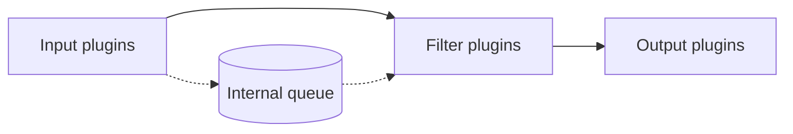
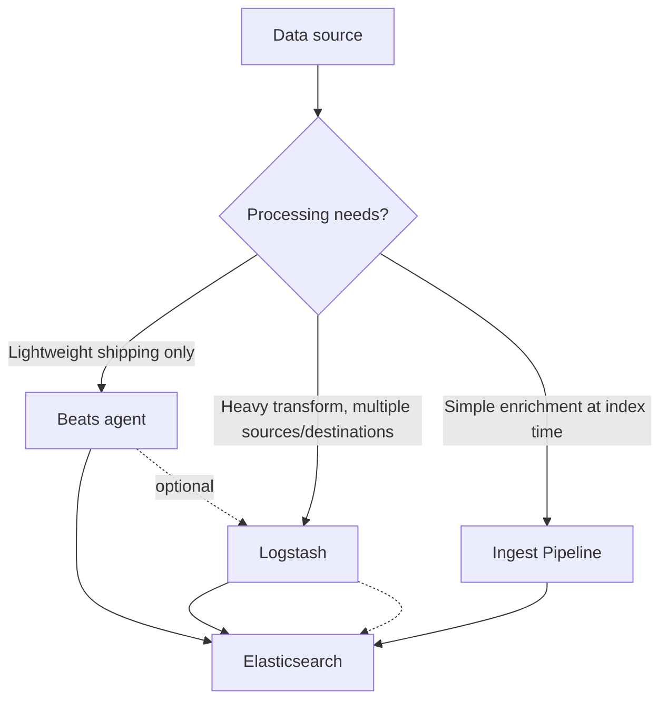

## Logstash Architecture and Pipeline

Logstash is a server-side data processing pipeline that ingests data from multiple sources simultaneously, transforms it, and ships it to one or more destinations — most commonly Elasticsearch. It sits alongside Beats and ingest pipelines as one of the primary ingestion mechanisms in the Elastic Stack, distinguished by its heavier processing capability and broader plugin ecosystem.

### Core Pipeline Stages

Every Logstash pipeline consists of three stages, each backed by a pluggable architecture:



- **Input** — reads data from a source (files, Beats, Kafka, JDBC, syslog, HTTP, etc.).
- **Filter** — parses, transforms, and enriches events (optional stage; a pipeline can run input → output with no filters).
- **Output** — sends processed events to a destination (Elasticsearch, Kafka, file, another Logstash instance, etc.).

### The Event Object

Internally, Logstash represents each unit of data as an **event** — a structured object (conceptually similar to a JSON document) that flows through the pipeline. Filters read and mutate fields on this event; by the time it reaches the output stage, its shape typically resembles the final document that will be indexed.

### Configuration File Structure

A Logstash pipeline is defined in a `.conf` file with three top-level blocks matching the pipeline stages:



```
input {
  beats {
    port => 5044
  }
}

filter {
  grok {
    match => { "message" => "%{COMBINEDAPACHELOG}" }
  }
  date {
    match => [ "timestamp", "dd/MMM/yyyy:HH:mm:ss Z" ]
  }
}

output {
  elasticsearch {
    hosts => ["https://localhost:9200"]
    index => "weblogs-%{+YYYY.MM.dd}"
  }
}
```

Multiple plugin blocks of the same type can appear within a single stage; they execute in the order written for filters, while inputs and outputs generally run concurrently against the same event stream.

### Common Input Plugins

| Plugin | Purpose |
| --- | --- |
| `beats` | Receives events from Filebeat, Metricbeat, and other Beats |
| `file` | Tails log files from local disk |
| `kafka` | Consumes messages from a Kafka topic |
| `jdbc` (via plugin) | Polls a relational database on a schedule |
| `http` | Accepts events pushed over HTTP |
| `syslog` | Listens for syslog messages over TCP/UDP |
| `tcp` / `udp` | Raw socket listeners |

### Common Filter Plugins

| Plugin | Purpose |
| --- | --- |
| `grok` | Pattern-matches unstructured text into structured fields |
| `dissect` | Splits structured text by delimiter (faster than grok for fixed-format lines) |
| `mutate` | Renames, converts type, removes, or reformats fields |
| `date` | Parses a timestamp field into the event's `@timestamp` |
| `geoip` | Adds geographic data from an IP field (Logstash has its own geoip filter, distinct from the Elasticsearch ingest processor of the same name) |
| `json` | Parses a JSON string field into structured event fields |
| `ruby` | Runs arbitrary Ruby code for custom transformation logic |
| `useragent` | Parses user agent strings into structured device/browser fields |

### Common Output Plugins

| Plugin | Purpose |
| --- | --- |
| `elasticsearch` | Indexes events into an Elasticsearch cluster |
| `kafka` | Publishes events to a Kafka topic |
| `file` | Writes events to a local file |
| `stdout` | Prints events to console (commonly used with `codec => rubydebug` for debugging) |

### Example: Parsing Apache Logs



```
input {
  file {
    path => "/var/log/apache2/access.log"
    start_position => "beginning"
  }
}

filter {
  grok {
    match => { "message" => "%{COMBINEDAPACHELOG}" }
  }
  date {
    match => [ "timestamp", "dd/MMM/yyyy:HH:mm:ss Z" ]
    target => "@timestamp"
  }
  geoip {
    source => "clientip"
  }
}

output {
  elasticsearch {
    hosts => ["https://localhost:9200"]
    index => "apache-logs-%{+YYYY.MM.dd}"
    user => "logstash_writer"
    password => "${LOGSTASH_ES_PASSWORD}"
  }
  stdout {
    codec => rubydebug
  }
}
```

Referencing credentials via `${LOGSTASH_ES_PASSWORD}` pulls from environment variables or the Logstash keystore rather than hardcoding secrets in the config file.

### The Logstash Keystore

The `logstash-keystore` tool stores sensitive values (passwords, API keys) encrypted on disk, separate from plaintext configuration:



```
bin/logstash-keystore create
bin/logstash-keystore add LOGSTASH_ES_PASSWORD
```

Values are then referenced in `.conf` files using `${KEY_NAME}` syntax, as shown above.

### Multiple Pipelines

A single Logstash instance can run several independent pipelines simultaneously, each with its own input/filter/output configuration, declared in `pipelines.yml`:

```yaml
- pipeline.id: apache_logs
  path.config: "/etc/logstash/conf.d/apache.conf"
- pipeline.id: syslog_ingest
  path.config: "/etc/logstash/conf.d/syslog.conf"
```

This is the standard approach for isolating unrelated data flows (different sources, different processing needs, different destinations) rather than combining everything into one monolithic pipeline with heavy conditional branching.

### Conditionals and Field References

Filters and outputs commonly use conditionals to branch behavior per event type:



```
filter {
  if [type] == "apache" {
    grok {
      match => { "message" => "%{COMBINEDAPACHELOG}" }
    }
  } else if [type] == "syslog" {
    grok {
      match => { "message" => "%{SYSLOGLINE}" }
    }
  }
}
```

Field references use bracket syntax (`[field_name]`, or `[nested][field]` for nested access), and string interpolation uses `%{field_name}` inside quoted strings (as seen in the `index =>` value above).

### Persistent Queue

By default, Logstash uses an in-memory queue between the input and filter/output stages, which risks event loss on a crash or restart. Enabling the **persistent queue** (`queue.type: persisted` in `logstash.yml`) writes the queue to disk, providing at-least-once delivery guarantees across restarts at the cost of additional disk I/O overhead. [Unverified] — exact durability guarantees and performance trade-offs are version-dependent; consult the current documentation for production sizing.

### Dead Letter Queue

Events that fail during the output stage (e.g. Elasticsearch mapping conflicts, rejected documents) can be routed to a **dead letter queue (DLQ)** rather than being dropped silently, when `dead_letter_queue.enable: true` is set. A separate pipeline or the `dead_letter_queue` input plugin can later reprocess these events.

### Logstash vs. Beats vs. Ingest Pipelines



- **Beats** — lightweight, low-resource shippers for specific data types (Filebeat for logs, Metricbeat for metrics); minimal transformation capability.
- **Logstash** — heavier resource footprint, but supports complex parsing, conditional routing, multiple simultaneous inputs/outputs, and plugins beyond what ingest pipelines offer (e.g. JDBC polling, Kafka consumption).
- **Ingest Pipelines** — run inside Elasticsearch itself; lighter-weight for simple per-document transforms but lack Logstash's broader plugin ecosystem and standalone process isolation.

A common architecture chains them: Beats ships raw data to Logstash for heavy transformation, which then outputs to Elasticsearch, optionally through an ingest pipeline for final lightweight enrichment.

### Performance and Scaling Notes

- Pipeline throughput is governed by `pipeline.workers` (parallel filter/output threads, defaults typically tied to available CPU cores) and `pipeline.batch.size` (events processed per worker batch).
- `grok` filters are comparatively CPU-expensive versus `dissect` for fixed-format text, since grok relies on regex pattern matching; using `dissect` where the log format is fixed and predictable typically improves throughput. [Inference]
- Multiple Logstash instances can run behind a message broker (e.g. Kafka) for horizontal scaling and resilience against downstream Elasticsearch backpressure.
- Exact tuning defaults and recommended values vary by Logstash version and workload; benchmark under representative load rather than assuming defaults are optimal for a given deployment. [Unverified]

### Diagram: End-to-End Logstash Data Flow (svg_diagram)

<svg xmlns="http://www.w3.org/2000/svg" viewBox="0 0 780 260">
<text x="390" y="24" text-anchor="middle" font-family="sans-serif" font-size="16" font-weight="bold" fill="#1a1a1a">End-to-End Logstash Data Flow (svg_diagram)</text>
<rect x="20" y="70" width="140" height="70" rx="8" fill="#e8f0fe" stroke="#4285f4" stroke-width="1.5" />
<text x="90" y="100" text-anchor="middle" font-family="sans-serif" font-size="12" fill="#1a1a1a">Filebeat</text>
<text x="90" y="118" text-anchor="middle" font-family="sans-serif" font-size="10" fill="#555">(input source)</text>
<line x1="160" y1="105" x2="220" y2="105" stroke="#666" stroke-width="1.5" marker-end="url(#arrow3)" />
<rect x="220" y="50" width="150" height="110" rx="8" fill="#fef7e0" stroke="#f9a825" stroke-width="1.5" />
<text x="295" y="75" text-anchor="middle" font-family="sans-serif" font-size="12" font-weight="bold" fill="#1a1a1a">Logstash</text>
<text x="295" y="95" text-anchor="middle" font-family="sans-serif" font-size="10" fill="#333">input: beats</text>
<text x="295" y="112" text-anchor="middle" font-family="sans-serif" font-size="10" fill="#333">filter: grok, date</text>
<text x="295" y="129" text-anchor="middle" font-family="sans-serif" font-size="10" fill="#333">output: elasticsearch</text>
<line x1="370" y1="105" x2="430" y2="105" stroke="#666" stroke-width="1.5" marker-end="url(#arrow3)" />
<rect x="430" y="70" width="150" height="70" rx="8" fill="#e6f4ea" stroke="#34a853" stroke-width="1.5" />
<text x="505" y="100" text-anchor="middle" font-family="sans-serif" font-size="12" fill="#1a1a1a">Ingest Pipeline</text>
<text x="505" y="118" text-anchor="middle" font-family="sans-serif" font-size="10" fill="#555">(optional final step)</text>
<line x1="580" y1="105" x2="640" y2="105" stroke="#666" stroke-width="1.5" marker-end="url(#arrow3)" />
<rect x="640" y="70" width="120" height="70" rx="8" fill="#fce8e6" stroke="#ea4335" stroke-width="1.5" />
<text x="700" y="105" text-anchor="middle" font-family="sans-serif" font-size="12" fill="#1a1a1a">Elasticsearch</text>
<text x="700" y="122" text-anchor="middle" font-family="sans-serif" font-size="10" fill="#555">index</text>
</svg>

### Common Pitfalls

- **Overloading a single pipeline with conditionals** — mixing many unrelated event types with `if`/`else` branches in one pipeline is harder to maintain than splitting into multiple named pipelines via `pipelines.yml`.
- **Skipping the persistent queue in production** — the default in-memory queue means a Logstash crash can lose in-flight events; this is easy to overlook until an actual outage occurs. [Inference]
- **Using `grok` where `dissect` would suffice** — unnecessary regex overhead on fixed-format logs measurably increases CPU usage under load. [Inference]
- **Hardcoding credentials in `.conf` files** — plaintext passwords in configuration files committed to version control are a common security oversight; the keystore exists specifically to avoid this.
- **Not enabling the dead letter queue** — output failures (e.g. mapping conflicts) are silently dropped by default, making data loss hard to diagnose after the fact.

**Related Topics**

- Logstash — Grok patterns and custom pattern definitions
- Logstash — Persistent queues and dead letter queue configuration
- Logstash — Multiple pipelines and pipeline-to-pipeline communication
- Beats — Filebeat and Metricbeat architecture
- Ingest Pipelines — Processor chaining and `_simulate`
- Elasticsearch output plugin — bulk indexing, retries, and backpressure handling
- Logstash — Keystore and secrets management