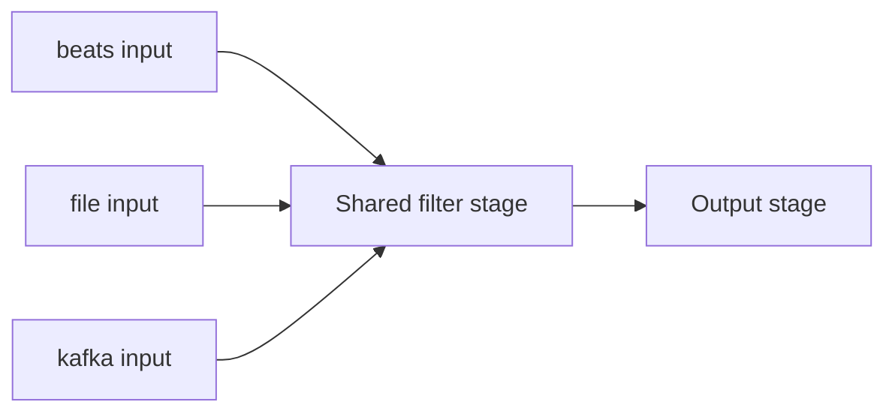

## Logstash Input Plugins

Input plugins are the entry point of a Logstash pipeline — they define where events originate. A pipeline can declare multiple input blocks simultaneously, each producing events that flow into the same shared filter and output stages unless explicitly tagged and branched with conditionals.

### Role in the Pipeline



Every input plugin adds metadata to the resulting event — commonly a `type` field, source-specific fields (like `host`, `path`, or `topic`), and internal `@metadata` fields used for routing without being indexed.

### `beats`

Receives events forwarded from Filebeat, Metricbeat, Winlogbeat, or other Beats agents over the Lumberjack protocol.



```
input {
  beats {
    port => 5044
    ssl_enabled => true
    ssl_certificate => "/etc/logstash/certs/logstash.crt"
    ssl_key => "/etc/logstash/certs/logstash.key"
  }
}
```

- `port` — TCP port to listen on. Required.
- `ssl_enabled` — enables TLS for the Beats connection; strongly recommended in production since Beats often carries sensitive log content across the network.
- `client_inactivity_timeout` — closes idle connections after a configurable period.

### `file`

Tails local files, tracking read position via a sincedb file so restarts resume rather than re-reading from the start.



```
input {
  file {
    path => "/var/log/nginx/access.log"
    start_position => "beginning"
    sincedb_path => "/var/lib/logstash/sincedb_nginx"
  }
}
```

- `path` — glob pattern(s) for files to watch. Required.
- `start_position` — `beginning` or `end`; only applies the first time a file is discovered (subsequent runs resume from the sincedb position regardless).
- `sincedb_path` — where read-position tracking is persisted; setting `/dev/null` disables persistence (every restart re-reads from `start_position`), useful for testing.

### `kafka`

Consumes messages from one or more Kafka topics as a consumer group member, enabling horizontally scaled ingestion across multiple Logstash instances.



```
input {
  kafka {
    bootstrap_servers => "kafka-broker1:9092,kafka-broker2:9092"
    topics => ["application-logs"]
    group_id => "logstash_consumers"
    codec => "json"
  }
}
```

- `bootstrap_servers` — comma-separated broker addresses. Required.
- `topics` — list of topic names to subscribe to.
- `group_id` — consumer group; multiple Logstash instances sharing a `group_id` split partition consumption for parallelism.
- `codec` — decodes message content (e.g. `json` parses each message body as JSON directly into the event).

### `jdbc` (plugin)

Polls a relational database on a schedule and emits each result row as an event — commonly used for periodically ingesting database tables into Elasticsearch.



```
input {
  jdbc {
    jdbc_driver_library => "/usr/share/logstash/drivers/postgresql-42.6.0.jar"
    jdbc_driver_class => "org.postgresql.Driver"
    jdbc_connection_string => "jdbc:postgresql://dbhost:5432/appdb"
    jdbc_user => "logstash_reader"
    jdbc_password => "${JDBC_PASSWORD}"
    statement => "SELECT * FROM orders WHERE updated_at > :sql_last_value"
    use_column_value => true
    tracking_column => "updated_at"
    schedule => "*/5 * * * *"
  }
}
```

- `statement` — the SQL query to execute each run.
- `schedule` — cron-style schedule for polling frequency.
- `tracking_column` / `use_column_value` — enables incremental polling by tracking the last seen value of a column (e.g. a timestamp or auto-increment ID), avoiding full-table re-reads.
- Requires a compatible JDBC driver `.jar` placed on the Logstash classpath. [Unverified] — exact driver compatibility and packaging steps vary by database vendor and Logstash version.

### `http`

Accepts events pushed over HTTP as a simple ingestion endpoint — useful for webhook-style integrations or lightweight application push logging.



```
input {
  http {
    port => 8080
    ssl_enabled => true
  }
}
```

Each HTTP request body becomes an event; content type determines whether it's parsed as JSON, plain text, or another codec.

### `syslog`

Listens for syslog-formatted messages over TCP or UDP, parsing standard syslog fields (priority, facility, timestamp, host) automatically.



```
input {
  syslog {
    port => 514
    type => "syslog"
  }
}
```

UDP syslog risks message loss under load since UDP has no delivery guarantee; TCP is generally preferred where the sending device supports it. [Inference]

### `tcp` / `udp`

Raw socket listeners for custom or non-standard protocols not covered by a dedicated plugin.



```
input {
  tcp {
    port => 9000
    codec => json_lines
  }
}
```

- `codec` — determines how raw socket data is framed into discrete events (e.g. `json_lines` treats each newline-delimited line as a separate JSON event).

### `stdin`

Reads events from standard input — used almost exclusively for local testing and pipeline development, not production.



```
input {
  stdin {}
}
```

### Adding Metadata via `type` and `tags`

Both are common conventions (not unique syntax) for later filtering and routing:



```
input {
  file {
    path => "/var/log/app/*.log"
    type => "application_log"
    tags => ["app", "production"]
  }
}
```

`type` and `tags` set here become ordinary event fields, checkable later in `filter` and `output` blocks via `if [type] == "application_log"`.

### Combining Multiple Inputs in One Pipeline



```
input {
  beats {
    port => 5044
    type => "beats_input"
  }
  kafka {
    bootstrap_servers => "kafka1:9092"
    topics => ["metrics"]
    type => "kafka_input"
  }
}

filter {
  if [type] == "kafka_input" {
    json {
      source => "message"
    }
  }
}
```

Events from all declared inputs merge into a single stream feeding the filter stage; the `type` field (or custom tagging) is what allows filters and outputs to treat them differently downstream.

### `codec` Parameter Across Inputs

Most input plugins accept a `codec` parameter controlling how raw input data is decoded into event fields before the filter stage runs:

| Codec | Behavior |
| --- | --- |
| `plain` | Treats input as raw text (default for most inputs) |
| `json` | Parses the entire input as a single JSON object |
| `json_lines` | Parses each newline-delimited line as a separate JSON object |
| `multiline` | Merges multiple lines into a single event (e.g. stack traces) based on a pattern |
| `rubydebug` | Human-readable structured output (typically paired with `stdout` output, not inputs) |

Using `codec => json` at the input stage, when the source reliably emits well-formed JSON, is generally more efficient than parsing raw text with a `json` filter afterward, since decoding happens once at read time. [Inference]

### Performance and Reliability Notes

- `file` input reliability depends on sincedb persistence; deleting or losing the sincedb file causes re-processing of already-ingested files, a common cause of duplicate documents downstream.
- `kafka` input scaling is bounded by topic partition count — a consumer group can have at most as many active consumers as partitions, so parallelism beyond that requires increasing partitions upstream. [Inference]
- `jdbc` polling frequency (`schedule`) should be balanced against database load; overly frequent polling of large tables can create unnecessary read pressure on the source database.
- UDP-based inputs (`syslog` over UDP, raw `udp`) trade delivery guarantees for lower overhead; TCP alternatives are generally preferred when the data is not tolerant of loss. [Inference]

### Diagram: Multiple Inputs Feeding One Pipeline (svg_diagram)

<svg xmlns="http://www.w3.org/2000/svg" viewBox="0 0 720 240">
<text x="360" y="24" text-anchor="middle" font-family="sans-serif" font-size="16" font-weight="bold" fill="#1a1a1a">Multiple Inputs Feeding One Pipeline (svg_diagram)</text>
<rect x="20" y="45" width="140" height="50" rx="8" fill="#e8f0fe" stroke="#4285f4" stroke-width="1.5" />
<text x="90" y="75" text-anchor="middle" font-family="sans-serif" font-size="12" fill="#1a1a1a">beats input</text>
<rect x="20" y="105" width="140" height="50" rx="8" fill="#e8f0fe" stroke="#4285f4" stroke-width="1.5" />
<text x="90" y="135" text-anchor="middle" font-family="sans-serif" font-size="12" fill="#1a1a1a">kafka input</text>
<rect x="20" y="165" width="140" height="50" rx="8" fill="#e8f0fe" stroke="#4285f4" stroke-width="1.5" />
<text x="90" y="195" text-anchor="middle" font-family="sans-serif" font-size="12" fill="#1a1a1a">file input</text>
<line x1="160" y1="70" x2="260" y2="120" stroke="#666" stroke-width="1.5" />
<line x1="160" y1="130" x2="260" y2="120" stroke="#666" stroke-width="1.5" />
<line x1="160" y1="190" x2="260" y2="120" stroke="#666" stroke-width="1.5" />
<rect x="260" y="90" width="180" height="60" rx="8" fill="#fef7e0" stroke="#f9a825" stroke-width="1.5" />
<text x="350" y="115" text-anchor="middle" font-family="sans-serif" font-size="12" font-weight="bold" fill="#1a1a1a">Shared filter</text>
<text x="350" y="133" text-anchor="middle" font-family="sans-serif" font-size="11" fill="#333">stage (if/else by type)</text>
<line x1="440" y1="120" x2="500" y2="120" stroke="#666" stroke-width="1.5" marker-end="url(#arrow4)" />
<rect x="500" y="90" width="180" height="60" rx="8" fill="#e6f4ea" stroke="#34a853" stroke-width="1.5" />
<text x="590" y="125" text-anchor="middle" font-family="sans-serif" font-size="12" fill="#1a1a1a">Output stage</text>
</svg>

### Common Pitfalls

- **Losing the sincedb file** — a common cause of full duplicate re-ingestion after moving or rebuilding a Logstash host; back it up or store it on persistent storage.
- **Choosing UDP syslog without considering loss tolerance** — under high message volume or network congestion, UDP silently drops messages with no retry. [Inference]
- **Over-polling with `jdbc`** — an aggressive `schedule` against a large, frequently updated table can create sustained load on the source database, especially without an efficient `tracking_column` index.
- **Forgetting `codec` alignment** — mismatched codec choice (e.g. `plain` on a JSON-emitting source) pushes unnecessary parsing work into the filter stage or produces malformed fields.
- **Kafka consumer parallelism ceiling** — adding more Logstash instances to a consumer group beyond the topic's partition count does not increase throughput, since excess consumers sit idle. [Inference]

**Related Topics**

- Logstash — Filter plugins (grok, dissect, mutate, date)
- Logstash — Output plugins and the Elasticsearch output
- Logstash — Codec reference (json, json_lines, multiline, plain)
- Logstash — Multiple pipelines and pipeline-to-pipeline communication
- Kafka — Consumer groups and partition-based scaling
- Logstash — Persistent queue and dead letter queue